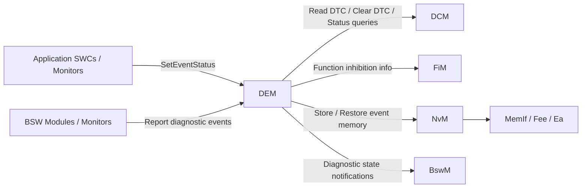
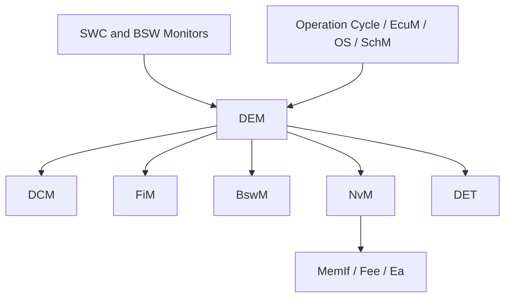

# DEM - Diagnostic Event Manager

> Tài liệu này là phần diễn giải kỹ thuật ở mức rất chi tiết dựa trên các khái niệm và cách tổ chức của AUTOSAR Classic Platform. Nội dung được viết lại theo hướng giải thích, không phải bản sao chuẩn tắc của tài liệu AUTOSAR.

## 1. Tổng quan module

**DEM (Diagnostic Event Manager)** là module trung tâm của lớp chẩn đoán trong AUTOSAR Classic, chịu trách nhiệm quản lý toàn bộ vòng đời của các lỗi chẩn đoán từ thời điểm lỗi được phát hiện bởi monitor cho đến khi lỗi được chuẩn hóa thành DTC, được lưu vào bộ nhớ sự kiện, được xuất ra ngoài qua DCM và cuối cùng được xóa hoặc aging khỏi hệ thống.

Nếu xem ngăn xếp chẩn đoán AUTOSAR như một chuỗi xử lý dữ liệu, thì:

1. Các **monitor** trong SWC hoặc BSW phát hiện bất thường.
2. Các monitor này báo cáo kết quả đánh giá sang DEM dưới dạng **event status**.
3. DEM biến thông tin mức monitor thành **trạng thái chẩn đoán có ý nghĩa hệ thống**.
4. DEM quyết định có cần cập nhật **DTC status bits**, lưu **freeze frame**, **extended data**, điều khiển **indicator**, hoặc ghi xuống **non-volatile memory** hay không.
5. Các module khác như **DCM**, **FiM**, **BswM**, **NvM** sử dụng hoặc phối hợp với thông tin do DEM quản lý.

Nói ngắn gọn: **DEM không trực tiếp phát hiện lỗi vật lý**, mà DEM là bộ máy hợp nhất, chuẩn hóa, lưu trữ và cung cấp trạng thái chẩn đoán cho toàn ECU.

## 2. Vị trí của DEM trong AUTOSAR Diagnostic Stack

Trong AUTOSAR Classic, DEM nằm ở **BSW Service Layer**, thường được đặt cùng nhóm chức năng với DCM và FiM trong miền chẩn đoán.

Về mặt vai trò kiến trúc:

| Thành phần | Vai trò chính |
|---|---|
| SWC / BSW Monitors | Phát hiện điều kiện lỗi hoặc phục hồi |
| DEM | Hợp nhất và quản lý trạng thái sự kiện chẩn đoán |
| DCM | Cung cấp dịch vụ UDS/KWP/OBD cho tester và đọc dữ liệu từ DEM |
| FiM | Quyết định có cho phép một chức năng hoạt động hay phải inhibit dựa trên thông tin từ DEM |
| NvM | Lưu dữ liệu chẩn đoán cần tồn tại qua chu kỳ tắt/mở nguồn |
| BswM | Có thể phản ứng với trạng thái chẩn đoán để thay đổi mode hoặc hành vi hệ thống |

## 3. Mục tiêu chức năng của DEM

DEM được thiết kế để giải quyết các bài toán cốt lõi sau:

1. **Chuẩn hóa việc báo lỗi** từ nhiều nguồn khác nhau trong ECU.
2. **Tách monitor khỏi logic chẩn đoán chuẩn hóa**, giúp monitor chỉ cần kết luận passed/failed thay vì tự quản lý DTC memory.
3. **Áp dụng debouncing** để tránh ghi nhận lỗi giả hoặc nhiễu ngắn hạn.
4. **Ánh xạ event sang DTC** và cập nhật đầy đủ trạng thái DTC theo chuẩn UDS/OBD nếu cấu hình.
5. **Lưu trữ event memory** bao gồm snapshot/freeze frame và extended data.
6. **Quản lý vòng đời lỗi**, gồm detect, pending, confirmed, healed, aged, cleared.
7. **Cung cấp dữ liệu chẩn đoán cho DCM/tester** khi có yêu cầu đọc/xóa lỗi.
8. **Cung cấp trạng thái lỗi cho các module điều phối khác** như FiM hoặc BswM.

## 4. Các khái niệm cốt lõi trong DEM

### 4.1 Event

Trong DEM, đơn vị nhỏ nhất được quản lý là **event**.

Một event đại diện cho một kết quả đánh giá chẩn đoán của một monitor cụ thể, ví dụ:

1. Điện áp cảm biến vượt ngưỡng cao.
2. Mất tín hiệu từ cảm biến tốc độ bánh xe.
3. CAN message timeout.
4. Giá trị ADC ngoài khoảng hợp lệ.

Một số điểm quan trọng:

1. Event là khái niệm gần với **nguồn phát hiện lỗi**.
2. Event không nhất thiết tương đương một DTC theo kiểu 1:1.
3. Tùy cấu hình, nhiều event có thể cùng ánh xạ về một DTC hoặc một event có thể không cần xuất hiện như một DTC độc lập.

### 4.2 Monitor

**Monitor** là logic đánh giá điều kiện lỗi. Monitor có thể nằm ở:

1. Application SWC.
2. Basic Software module.
3. Complex Device Driver.

DEM không quyết định bản thân điều kiện vật lý là lỗi hay không. Monitor làm việc đó. DEM chỉ xử lý kết quả monitor gửi lên.

### 4.3 Event Status

Monitor báo cho DEM trạng thái event thông qua các trạng thái điển hình sau:

| Trạng thái | Ý nghĩa |
|---|---|
| `FAILED` | Monitor xác nhận điều kiện lỗi đang tồn tại |
| `PASSED` | Monitor xác nhận điều kiện lỗi không còn tồn tại |
| `PREFAILED` | Điều kiện nghi ngờ lỗi, đang trong quá trình debounce tăng mức tin cậy |
| `PREPASSED` | Điều kiện nghi ngờ đã phục hồi, đang debounce giảm mức lỗi |

Ý nghĩa thực tế:

1. `FAILED` và `PASSED` là các kết luận mạnh.
2. `PREFAILED` và `PREPASSED` thường dùng khi DEM thực hiện debouncing theo counter/time.
3. Không phải mọi cấu hình đều dùng cả bốn trạng thái; điều này phụ thuộc kiểu debounce và monitor design.

### 4.4 Debouncing

Debouncing là cơ chế chống ghi nhận lỗi sai do nhiễu, transients hoặc điều kiện dao động quanh ngưỡng.

Các kiểu debounce điển hình:

1. **Counter-based debouncing**
	DEM tăng hoặc giảm bộ đếm theo kết quả monitor. Khi bộ đếm vượt ngưỡng fail thì event mới được coi là failed; khi giảm xuống ngưỡng pass thì event mới được coi là passed.
2. **Time-based debouncing**
	Điều kiện lỗi phải duy trì đủ một khoảng thời gian trước khi được kết luận failed hoặc passed.
3. **Monitor-internal debouncing**
	Bản thân monitor tự debounce và chỉ gửi kết luận cuối cùng lên DEM.

Debouncing rất quan trọng vì nó ảnh hưởng trực tiếp đến:

1. Tốc độ xuất hiện DTC.
2. Tần suất lưu bộ nhớ chẩn đoán.
3. Độ ổn định của warning indicator.
4. Tỷ lệ false positive trong quá trình chẩn đoán xe.

### 4.5 Fault Detection Counter (FDC)

FDC là một biểu diễn định lượng mức độ tiến gần đến trạng thái fault confirmed trong quá trình debounce. Nó giúp các module khác hoặc tester hiểu event đang tiến triển đến mức nào.

Về mặt thực tế:

1. FDC càng cao thì event càng gần trạng thái fail đủ điều kiện.
2. FDC giảm khi điều kiện lỗi biến mất hoặc hệ thống đang hồi phục.
3. FDC không phải lúc nào cũng được dùng trực tiếp bởi ứng dụng, nhưng là thông tin rất hữu ích khi phân tích lỗi khó tái hiện.

### 4.6 DTC

**DTC (Diagnostic Trouble Code)** là mã lỗi chuẩn hóa mà tester nhìn thấy.

DEM chịu trách nhiệm liên kết giữa event nội bộ và biểu diễn DTC bên ngoài. Điều này có nghĩa:

1. Monitor không cần tự biết UDS encoding của mã lỗi.
2. DEM đảm nhiệm logic trạng thái của DTC.
3. DCM khi xử lý các dịch vụ như đọc lỗi sẽ truy vấn thông tin từ DEM thay vì nói chuyện trực tiếp với monitor.

### 4.7 DTC Status Bits

Một DTC trong ngữ cảnh UDS thường đi kèm 8 bit trạng thái. Đây là phần rất quan trọng của Functional Description vì DEM chính là nơi duy trì các bit này.

| Bit | Tên bit | Ý nghĩa chức năng |
|---|---|---|
| 0 | `testFailed` | Lỗi đang được đánh giá là failed ở thời điểm hiện tại |
| 1 | `testFailedThisOperationCycle` | Trong operation cycle hiện tại đã từng failed |
| 2 | `pendingDTC` | Lỗi đã xuất hiện nhưng chưa chắc đã đủ điều kiện confirmed lâu dài |
| 3 | `confirmedDTC` | Lỗi đã đủ tiêu chí xác nhận theo cấu hình |
| 4 | `testNotCompletedSinceLastClear` | Chưa hoàn tất monitor kể từ lần clear gần nhất |
| 5 | `testFailedSinceLastClear` | Đã từng failed kể từ lần clear gần nhất |
| 6 | `testNotCompletedThisOperationCycle` | Trong operation cycle hiện tại monitor chưa hoàn tất |
| 7 | `warningIndicatorRequested` | DEM đang yêu cầu bật indicator liên quan |

Điểm mấu chốt:

1. Không phải bit nào cũng được set/xóa đồng thời.
2. Việc thay đổi từng bit phụ thuộc vào event status, operation cycle, clear operation, aging, confirm criteria và một số quy tắc OBD nếu bật.
3. Đây là phần khiến DEM trở thành module có logic trạng thái phức tạp nhất trong stack chẩn đoán.

### 4.8 Event Memory Entry

Khi lỗi đạt điều kiện cần lưu, DEM tạo hoặc cập nhật một **event memory entry**. Một entry điển hình có thể chứa:

1. Event ID hoặc DTC liên quan.
2. Trạng thái DTC tại thời điểm lưu.
3. Occurrence counter.
4. Aging counter hoặc healing-related data.
5. Freeze frame / snapshot data.
6. Extended data record.
7. Thông tin priority hoặc displacement metadata.

### 4.9 Freeze Frame / Snapshot Data

Freeze frame là ảnh chụp nhanh trạng thái hệ thống tại thời điểm lỗi được chốt lưu, ví dụ:

1. Tốc độ xe.
2. Điện áp nguồn.
3. Nhiệt độ nước làm mát.
4. Giá trị cảm biến liên quan.

Mục đích của freeze frame là giúp kỹ sư hoặc tester hiểu **lỗi xảy ra trong điều kiện vận hành nào**.

### 4.10 Extended Data

Extended data là dữ liệu bổ sung phục vụ phân tích sâu hơn, ví dụ:

1. Bộ đếm số lần lỗi xuất hiện.
2. Giá trị FDC gần nhất.
3. Số chu kỳ warm-up từ lần lỗi cuối.
4. Thông tin internal class/state do cấu hình yêu cầu.

### 4.11 Operation Cycle, Aging Cycle, Warm-up Cycle

DEM không chỉ quan tâm lỗi đang có hay không, mà còn quan tâm lỗi trong bối cảnh chu kỳ vận hành.

1. **Operation cycle** thường tương ứng với một chu kỳ lái xe, một chu kỳ ignition, hoặc một pha vận hành được cấu hình.
2. **Aging cycle** dùng để đánh giá khi nào một lỗi confirmed nhưng không còn tái xuất hiện có thể được aging.
3. **Warm-up cycle** đặc biệt quan trọng với OBD nếu ECU dùng các yêu cầu khí thải/OBD.

Các cycle này ảnh hưởng trực tiếp đến pending/confirmed/aging behavior.

### 4.12 Indicator

DEM có thể quản lý yêu cầu bật/tắt indicator như MIL hoặc warning lamp logic ở mức chẩn đoán. DEM thường không trực tiếp điều khiển chân phần cứng, mà duy trì yêu cầu logic và cung cấp thông tin cho module điều phối hoặc tầng khác.

### 4.13 Enable Condition và Storage Condition

Hai khái niệm này rất dễ bị nhầm:

1. **Enable Condition**: điều kiện cho phép monitor/event được đánh giá theo logic chẩn đoán.
2. **Storage Condition**: điều kiện cho phép thông tin event được lưu vào event memory.

Ví dụ thực tế:

1. Có thể chỉ cho phép monitor hoạt động khi engine đã running ổn định.
2. Có thể cho phép monitor chạy, nhưng không lưu DTC trong một mode sản xuất, service mode hoặc điều kiện nguồn chưa ổn định.

## 5. Functional Description của DEM

Phần này mô tả chi tiết DEM hoạt động như thế nào theo từng nhóm chức năng chính.

### 5.1 Khởi tạo và phục hồi trạng thái

Khi ECU khởi động, DEM đi qua các bước logic sau:

1. Khởi tạo các cấu trúc dữ liệu RAM.
2. Nạp cấu hình event, DTC, memory classes, data classes, operation cycles.
3. Phục hồi dữ liệu persistent từ NvM nếu được cấu hình lưu non-volatile.
4. Đồng bộ lại trạng thái nội bộ của event memory và các bộ đếm.
5. Thiết lập trạng thái khởi đầu cho các bit chẩn đoán phụ thuộc operation cycle.

Ý nghĩa chức năng:

1. DEM phải phân biệt dữ liệu chỉ có hiệu lực trong một operation cycle với dữ liệu cần giữ sau reset nguồn.
2. DEM phải đảm bảo không làm mất các DTC confirmed cần tồn tại lâu dài.
3. Nếu khôi phục từ NvM thất bại, DEM phải có chiến lược fallback theo cấu hình hoặc vendor implementation.

### 5.2 Tiếp nhận báo cáo lỗi từ monitor

Đây là cửa vào chính của DEM.

Nguồn báo cáo có thể là:

1. SWC thông qua RTE client/server hoặc interface được cấu hình.
2. BSW module thông qua API DEM tương ứng.
3. Một số monitor vendor-specific có thể gửi thêm thông tin hỗ trợ.

Khi nhận một báo cáo event status, DEM thực hiện logic ở mức tổng quát như sau:

1. Kiểm tra EventId hợp lệ và event availability.
2. Kiểm tra enable conditions.
3. Kiểm tra DTC setting có đang bị disable hay không.
4. Áp dụng debounce nếu event dùng DEM-managed debounce.
5. Tính toán trạng thái event mới.
6. Cập nhật DTC status bits liên quan.
7. Quyết định có cần tạo/cập nhật event memory entry hay không.
8. Kích hoạt notification cho module phụ thuộc nếu cần.
9. Đánh dấu dirty state để chuẩn bị ghi NvM nếu có dữ liệu cần persist.

### 5.3 Debouncing và qualification của event

Đây là phần quyết định một lỗi có được coi là thực sự xảy ra hay chỉ là nhiễu ngắn hạn.

Luồng điển hình với counter-based debounce:

1. Monitor gửi `PREFAILED` khi thấy dấu hiệu lỗi.
2. DEM tăng debounce counter.
3. Nếu counter chưa tới ngưỡng, event vẫn chưa thành failed chính thức.
4. Khi counter vượt threshold fail, DEM chuyển event sang failed.
5. Nếu monitor gửi `PREPASSED`, DEM giảm counter.
6. Khi xuống dưới threshold pass, event chuyển sang passed.

Giá trị kiến trúc của cơ chế này:

1. Giảm false DTC.
2. Giảm ghi flash không cần thiết.
3. Tránh indicator chớp tắt liên tục.
4. Cho phép tune độ nhạy chẩn đoán theo từng event class.

### 5.4 Cập nhật trạng thái event và DTC

Sau khi event được qualify, DEM cập nhật các lớp trạng thái sau:

1. **Event internal status**: passed, failed, prefailed, prepassed, disabled, unavailable.
2. **DTC status byte**: 8 bit chuẩn hóa cho tester.
3. **Occurrence-related counters**: số lần lỗi xuất hiện, lần gần nhất, số cycle liên quan.
4. **Confirmation state**: lỗi mới chỉ pending hay đã confirmed.

Ví dụ diễn biến chức năng khi event chuyển sang failed:

1. Set `testFailed`.
2. Set `testFailedThisOperationCycle`.
3. Set `pendingDTC` nếu thỏa logic pending.
4. Set `testFailedSinceLastClear`.
5. Xóa các cờ "not completed" tương ứng nếu monitor đã hoàn tất.
6. Nếu đủ tiêu chí xác nhận, set `confirmedDTC`.
7. Nếu event được ánh xạ indicator, set `warningIndicatorRequested` theo rule class.

Ví dụ diễn biến khi event chuyển lại passed:

1. Clear `testFailed`.
2. Không nhất thiết xóa ngay `pendingDTC` hoặc `confirmedDTC`.
3. `confirmedDTC` thường chỉ bị xóa bởi clear operation hoặc aging hoàn tất tùy rule.
4. Indicator có thể tắt ngay hoặc chỉ tắt sau logic healing riêng.

Đây là điểm quan trọng: **DEM quản lý vòng đời chẩn đoán chứ không chỉ phản chiếu trạng thái instant của monitor**.

### 5.5 Confirmation logic

Không phải mọi lỗi failed một lần là trở thành confirmed DTC ngay lập tức.

DEM có thể dùng các tiêu chí như:

1. Số lần fail trong các operation cycle liên tiếp.
2. Số lần detect tích lũy.
3. Quy tắc OBD-specific hoặc emission-related.

Khi tiêu chí xác nhận đạt được:

1. DTC được đánh dấu `confirmedDTC`.
2. Entry trong event memory có thể được nâng mức ưu tiên hoặc lưu bền vững hơn.
3. Dữ liệu freeze frame/extended data quan trọng có thể được chốt lưu.

### 5.6 Quản lý event memory

Event memory là trái tim persistence của DEM. Đây là nơi chứa các fault records có giá trị chẩn đoán lâu dài.

Các chức năng cốt lõi:

1. **Allocate entry** khi một event lần đầu đạt tiêu chí lưu.
2. **Update entry** khi event tái diễn hoặc thay đổi trạng thái quan trọng.
3. **Displace entry** nếu bộ nhớ đầy và cần chọn entry bị thay thế theo priority/displacement strategy.
4. **Delete/clear entry** khi tester yêu cầu clear hoặc khi aging hoàn tất và policy cho phép.

Khi bộ nhớ đầy, DEM thường phải quyết định:

1. Giữ lại lỗi có priority cao hơn.
2. Giữ lỗi confirmed thay vì pending.
3. Giữ lỗi mới nhất hoặc lỗi quan trọng hơn về an toàn/emission.

Đây là một trong những chỗ ảnh hưởng mạnh đến khả năng chẩn đoán sau bán hàng.

### 5.7 Snapshot, Freeze Frame và Extended Data capture

Khi một event chuyển trạng thái theo trigger rule cấu hình, DEM có thể chụp dữ liệu đi kèm.

Các trigger thường gặp:

1. Khi event lần đầu failed.
2. Khi event được confirmed.
3. Khi event memory entry được tạo.
4. Khi occurrence counter tăng.

DEM không nhất thiết tự biết cách lấy mọi dữ liệu. Thay vào đó:

1. Dữ liệu có thể được định nghĩa qua data element class.
2. Một số data element được lấy từ callback, port, sensor abstraction hoặc API tương ứng.
3. DEM chỉ điều phối thời điểm và record structure.

### 5.8 Cung cấp dữ liệu chẩn đoán cho DCM

Khi tester gửi yêu cầu chẩn đoán, DCM đóng vai trò protocol server. Tuy nhiên dữ liệu nền thường nằm trong DEM.

Các yêu cầu điển hình mà DCM cần DEM hỗ trợ:

1. Đọc danh sách DTC.
2. Đọc status byte của DTC.
3. Đọc snapshot/freeze frame.
4. Đọc extended data.
5. Đọc số lượng DTC thỏa điều kiện lọc.
6. Clear DTC theo group hoặc cụ thể.

Ví dụ với UDS:

1. `0x19 ReadDTCInformation` phụ thuộc mạnh vào dữ liệu từ DEM.
2. `0x14 ClearDiagnosticInformation` thường yêu cầu DCM phối hợp với DEM để xóa record tương ứng.
3. Tùy stack và cấu hình, một số hành vi liên quan `ControlDTCSetting` cũng ảnh hưởng tới DEM.

### 5.9 Clear DTC và reset logic

Khi có yêu cầu clear DTC, DEM không chỉ xóa một mã lỗi hiển thị. DEM còn phải xử lý toàn bộ dấu vết liên quan.

Một thao tác clear điển hình có thể bao gồm:

1. Xóa event memory entry tương ứng.
2. Reset status bits phù hợp.
3. Reset counters, confirmation state, aging-related data.
4. Xóa freeze frame và extended data liên quan.
5. Đồng bộ thay đổi xuống NvM.

Một số nuance quan trọng:

1. Không phải mọi bit đều được xóa giống nhau trong mọi release/vendor.
2. Clear theo group DTC khác với clear một DTC cụ thể.
3. Có thể có các DTC không được phép clear trong một số mode bảo vệ hoặc manufacturing constraints.

### 5.10 Aging và healing

Khi lỗi không còn tái xuất hiện trong các cycle tiếp theo, DEM có thể thực hiện **aging**.

Aging thường có ý nghĩa:

1. Lỗi từng confirmed nhưng nay không còn xuất hiện.
2. Sau đủ số cycle không tái phát, DTC có thể mất trạng thái confirmed hoặc bị xóa khỏi bộ nhớ theo policy.

Healing thường liên quan đến việc indicator hoặc trạng thái phục hồi được xử lý mềm hơn so với clear thô.

Sự khác nhau giữa các khái niệm:

1. **Passed**: monitor hiện tại không thấy lỗi.
2. **Healed**: lỗi đã qua logic phục hồi nào đó.
3. **Aged**: lỗi đã qua đủ số cycle sạch để được coi là lỗi cũ có thể loại bỏ/hạ cấp.
4. **Cleared**: bị xóa chủ động bởi tester hoặc hệ thống.

### 5.11 Indicator management

Nếu event hoặc DTC được cấu hình liên kết với indicator, DEM có thể duy trì trạng thái yêu cầu bật đèn cảnh báo.

Logic indicator thường phụ thuộc:

1. Event class hoặc DTC class.
2. Confirmation state.
3. OBD/emission rules nếu áp dụng.
4. Healing rules để tắt indicator.

DEM thường chỉ duy trì **logic request**, còn phần hiện thực hiển thị vật lý có thể đi qua BswM, application layer, IoHwAb hoặc cơ chế vendor-specific.

### 5.12 Enable/disable chẩn đoán trong runtime

DEM hỗ trợ một số cơ chế kiểm soát việc chẩn đoán có đang nên hoạt động hay không, ví dụ:

1. Enable conditions theo mode hệ thống.
2. Storage conditions theo pha nguồn hoặc service mode.
3. DTC setting enable/disable trong những ngữ cảnh chẩn đoán đặc biệt.
4. Availability/suppression cho một số event/DTC.

Điều này rất quan trọng vì không phải thời điểm nào ECU cũng nên ghi lỗi. Ví dụ:

1. Trong giai đoạn khởi động nguồn chưa ổn định, lỗi nguồn có thể không nên lưu ngay.
2. Trong flashing/programming session, một số DTC có thể tạm thời không được cập nhật.

### 5.13 Tính bền vững dữ liệu với NvM

Một lỗi chẩn đoán có giá trị hậu kiểm thường phải tồn tại qua reset nguồn. Vì vậy DEM phối hợp với NvM để lưu:

1. Event memory records.
2. DTC status liên quan nếu policy yêu cầu.
3. Counters và metadata cho aging/confirmation.

Về chức năng hệ thống:

1. DEM đánh dấu dữ liệu changed/dirty khi có cập nhật quan trọng.
2. Việc ghi NvM có thể được trì hoãn, gom nhóm hoặc kích hoạt theo chiến lược tối ưu tuổi thọ flash.
3. DEM phải cân bằng giữa độ bền dữ liệu và chi phí ghi nhớ.

### 5.14 Notification và callback ra ngoài

Khi trạng thái event thay đổi, DEM có thể phát ra notification cho các module khác hoặc callback nội bộ cấu hình sẵn.

Mục đích của notification:

1. Cập nhật logic inhibit của FiM.
2. Kích hoạt BswM phản ứng với fault state.
3. Báo cho application hoặc service tool hook nếu có yêu cầu dự án.

### 5.15 Đồng bộ, exclusive area và main processing

Trong ECU thực tế, nhiều monitor và dịch vụ chẩn đoán có thể truy cập DEM từ các context khác nhau. Vì vậy DEM phải xử lý:

1. Đồng bộ truy cập dữ liệu dùng chung.
2. Bảo vệ section quan trọng bằng SchM/exclusive area.
3. Các xử lý deferred trong main function nếu kiến trúc yêu cầu.

Điều này tránh các lỗi như:

1. Đọc DTC khi record đang bị cập nhật.
2. Mất đồng nhất giữa RAM state và NvM request queue.
3. Race condition giữa clear DTC và monitor report.

## 6. Luồng hoạt động điển hình của DEM

### 6.1 Luồng khi một lỗi mới xuất hiện

1. Monitor phát hiện điều kiện bất thường.
2. Monitor gửi `PREFAILED` hoặc `FAILED` cho DEM.
3. DEM kiểm tra enable conditions và event availability.
4. DEM áp dụng debouncing.
5. Khi đủ điều kiện fail, DEM set các status bits liên quan.
6. DEM tạo hoặc cập nhật event memory entry.
7. DEM chụp freeze frame / extended data theo trigger.
8. DEM cập nhật indicator request nếu rule yêu cầu.
9. DEM phát notification cho FiM/BswM/DCM-facing logic.
10. DEM lập kế hoạch ghi dữ liệu xuống NvM.

### 6.2 Luồng khi lỗi biến mất

1. Monitor gửi `PREPASSED` hoặc `PASSED`.
2. DEM debounce theo hướng phục hồi.
3. Khi đủ điều kiện pass, `testFailed` được xóa.
4. Một số trạng thái lịch sử vẫn được giữ lại, ví dụ `confirmedDTC` có thể chưa mất.
5. Aging/healing logic bắt đầu đếm cycle sạch.
6. Indicator có thể tắt ngay hoặc sau tiêu chí healing.

### 6.3 Luồng khi tester đọc DTC

1. Tester gửi request qua bus chẩn đoán.
2. DCM giải mã service và sub-function.
3. DCM gọi DEM để lấy danh sách DTC và trạng thái tương ứng.
4. DEM lọc dữ liệu theo request mask/group/origin.
5. DEM trả dữ liệu về DCM.
6. DCM xây response frame gửi ra ngoài.

### 6.4 Luồng khi tester clear DTC

1. Tester gửi yêu cầu clear.
2. DCM xác thực service/session/security nếu cần.
3. DCM yêu cầu DEM xóa DTC hoặc một nhóm DTC.
4. DEM reset event memory và status data theo phạm vi yêu cầu.
5. DEM đồng bộ thay đổi với NvM.
6. Các module như FiM hoặc BswM nhận trạng thái mới gián tiếp qua cập nhật DEM.

## 7. Module Dependencies của DEM

Phần này mô tả chi tiết các dependency của DEM trong một hệ thống AUTOSAR Classic điển hình.

### 7.1 Phân loại dependency

Có thể chia dependency của DEM thành 3 nhóm:

1. **Direct functional dependencies**: module mà DEM bắt buộc hoặc gần như bắt buộc phải tương tác để hoàn thành vai trò cốt lõi.
2. **Optional/feature-driven dependencies**: chỉ cần khi bật các tính năng tương ứng.
3. **Indirect platform dependencies**: không phải giao diện nghiệp vụ trực tiếp, nhưng cần cho vận hành đúng và an toàn.

### 7.2 Ma trận dependency chi tiết

| Module | Mức độ phụ thuộc | Hướng tương tác | DEM dùng để làm gì | Ý nghĩa thực tế |
|---|---|---|---|---|
| RTE / SWC diagnostic ports | Rất cao | SWC -> DEM | Nhận báo cáo event từ application monitors | Nếu không có đầu vào này, DEM không có dữ liệu lỗi từ ứng dụng |
| BSW monitors | Rất cao | BSW -> DEM | Nhận lỗi từ các module nền tảng như communication, memory, network stack | Giúp gom lỗi hệ thống cơ sở hạ tầng vào cùng cơ chế chẩn đoán |
| DCM | Rất cao | DEM <-> DCM | Cung cấp DTC, status, snapshot, clear services cho tester | Đây là dependency cốt lõi để xuất dữ liệu chẩn đoán ra ngoài xe |
| FiM | Cao | DEM -> FiM hoặc FiM truy vấn DEM | Cung cấp trạng thái lỗi để inhibit chức năng | Cho phép hệ thống ngăn hành vi nguy hiểm hoặc không hợp lệ khi lỗi tồn tại |
| NvM | Cao | DEM <-> NvM | Lưu và phục hồi event memory, counters, metadata | Giúp DTC tồn tại qua reset nguồn |
| SchM / OS synchronization | Cao | Hạ tầng nền | Bảo vệ vùng dữ liệu dùng chung và đồng bộ xử lý | Cần để tránh race condition trong môi trường đa ngữ cảnh |
| DET | Trung bình | DEM -> DET | Báo lỗi phát triển nếu API dùng sai hoặc cấu hình sai | Hữu ích ở giai đoạn phát triển và integration |
| BswM | Trung bình đến cao | DEM -> BswM | Báo trạng thái fault/indicator/mode-related info | Dùng khi dự án muốn system mode phản ứng theo trạng thái chẩn đoán |
| MemIf / Fee / Ea | Gián tiếp nhưng quan trọng | DEM -> NvM -> Mem stack | Hạ tầng lưu trữ vật lý của dữ liệu persistent | DEM không dùng trực tiếp trong mọi thiết kế, nhưng thực tế phụ thuộc chuỗi này để lưu bền vững |
| EcuM / power lifecycle | Gián tiếp | Hệ thống -> DEM | Ảnh hưởng thời điểm init/shutdown/operation cycle | Cần để DEM biết khi nào bắt đầu hoặc kết thúc các chu kỳ liên quan |
| Indicator handling layer | Tùy cấu hình | DEM -> tầng điều phối khác | Hiện thực hóa yêu cầu bật/tắt đèn cảnh báo | DEM giữ logic request, module khác có thể lái phần cứng |
| OBD-specific integration | Tùy tính năng | DEM <-> DCM / cycle managers | Thực hiện pending/confirmed/healing theo OBD | Chỉ cần với ECU có yêu cầu OBD/WWH-OBD |

### 7.3 Dependency với SWC và RTE

Đây là dependency ở đầu vào nghiệp vụ của DEM.

SWC monitor thường:

1. Kiểm tra điều kiện cảm biến, actuator, plausibility.
2. Đánh giá passed/failed.
3. Gọi API hoặc service tương ứng để báo event cho DEM.

DEM phụ thuộc vào chất lượng monitor ở các khía cạnh sau:

1. Nếu monitor quá nhạy, DEM sẽ nhận quá nhiều false fault.
2. Nếu monitor debounce nội bộ không nhất quán với cấu hình DEM, trạng thái fault có thể khó phân tích.
3. Nếu mapping event không hợp lý, DTC hiển thị cho tester sẽ thiếu ý nghĩa.

### 7.4 Dependency với DCM

Đây là dependency quan trọng nhất ở đầu ra chẩn đoán chuẩn hóa.

DCM phụ thuộc vào DEM để:

1. Lấy danh sách DTC hiện hành.
2. Lấy status byte theo mask.
3. Lấy snapshot record và extended data record.
4. Xóa DTC theo lệnh tester.

DEM phụ thuộc vào DCM ở chỗ:

1. DCM là gateway giao thức để tester tương tác với dữ liệu của DEM.
2. Nếu không có DCM, DEM vẫn có thể quản lý lỗi nội bộ nhưng không cung cấp dịch vụ UDS chuẩn ra bên ngoài.

### 7.5 Dependency với FiM

FiM (Function Inhibition Manager) dùng thông tin chẩn đoán để quyết định có cho phép một chức năng chạy hay không.

Ví dụ:

1. Nếu cảm biến tốc độ bánh xe lỗi, chức năng cruise control có thể bị inhibit.
2. Nếu điện áp nguồn không ổn định, một số test hoặc actuator action có thể bị khóa.

Trong quan hệ này:

1. DEM là nguồn sự thật về trạng thái lỗi.
2. FiM là nơi diễn giải trạng thái lỗi thành quyết định cho phép/không cho phép chức năng.

### 7.6 Dependency với NvM

NvM cung cấp persistence, còn DEM cung cấp nội dung cần lưu.

DEM cần NvM vì:

1. DTC hậu kiểm phải sống qua key-off/key-on.
2. Freeze frame có giá trị khi xe đã rời khỏi điều kiện lỗi ban đầu.
3. Aging/confirmation cần lịch sử chứ không chỉ trạng thái RAM tức thời.

Nếu không có NvM hoặc cấu hình persistence bị giới hạn:

1. Một số lỗi chỉ tồn tại trong runtime.
2. Khả năng chẩn đoán sau reset giảm mạnh.
3. Dữ liệu service workshop có thể không đầy đủ.

### 7.7 Dependency với BswM

BswM có thể dùng thông tin từ DEM để đổi mode hệ thống. Ví dụ:

1. Chuyển sang degraded mode khi có fault nghiêm trọng.
2. Tạm ngưng một số communication service.
3. Điều phối logic warning state ở cấp hệ thống.

Dependency này không phải lúc nào cũng bắt buộc, nhưng rất phổ biến ở các hệ thống có mode management phức tạp.

### 7.8 Dependency với DET

DET không tham gia nghiệp vụ chẩn đoán xe, nhưng rất hữu ích trong integration/development.

DEM có thể dùng DET để báo:

1. API gọi sai context.
2. EventId không hợp lệ.
3. Truy cập trước khi init.
4. Tham số không hợp lệ.

Điều này giúp phát hiện lỗi tích hợp sớm trước khi bước vào xác nhận chức năng chẩn đoán thực tế.

### 7.9 Dependency với SchM và OS

DEM thường chạy trong môi trường có nhiều context:

1. Task cyclic.
2. Callback từ communication stack.
3. DCM diagnostic service context.
4. Shutdown/storage phases.

Vì vậy DEM phụ thuộc mạnh vào cơ chế synchronization để:

1. Bảo vệ event memory.
2. Đồng bộ queue ghi NvM.
3. Ngăn xung đột giữa clear DTC và update event.

### 7.10 Dependency gián tiếp với memory stack

DEM thường không ghi flash trực tiếp. Chuỗi phụ thuộc thường là:

`DEM -> NvM -> MemIf -> Fee/Ea -> Flash/EEPROM driver`

Tác động của chuỗi này:

1. Tốc độ persistence phụ thuộc scheduling của NvM.
2. Mất dữ liệu có thể xảy ra nếu nguồn tắt trước khi commit hoàn tất.
3. Chính sách wear leveling ở Fee/Ea ảnh hưởng tuổi thọ lưu trữ dữ liệu chẩn đoán.

### 7.11 Dependency với operation cycle management

DEM cần biết ranh giới cycle để cập nhật chính xác các bit như:

1. `testFailedThisOperationCycle`
2. `testNotCompletedThisOperationCycle`
3. Các điều kiện pending/aging/confirm theo cycle

Nguồn cycle này có thể đến từ logic hệ thống hoặc service interface được cấu hình. Đây là dependency rất quan trọng nhưng thường bị đánh giá thấp khi tích hợp DEM.

## 8. Sơ đồ phụ thuộc chức năng

Diễn giải sơ đồ:

1. **Monitor side** là nguồn phát sinh sự kiện.
2. **Consumer side** gồm DCM, FiM, BswM là nơi tiêu thụ thông tin chẩn đoán.
3. **Persistence side** là NvM và memory stack.
4. **Platform side** gồm SchM/OS/EcuM cung cấp nền vận hành và cycle semantics.

## 9. Các điểm cấu hình quan trọng ảnh hưởng trực tiếp đến hành vi DEM

| Nhóm cấu hình | Ảnh hưởng chức năng |
|---|---|
| Event configuration | Quyết định event nào tồn tại, thuộc class nào, có DTC hay không |
| DTC mapping | Quyết định tester thấy mã lỗi nào và cách gom nhóm lỗi |
| Debounce class | Quyết định độ nhạy phát hiện lỗi |
| Event memory class | Quyết định lỗi lưu ở memory nào, ưu tiên ra sao |
| Freeze frame class | Quyết định dữ liệu nào được chụp khi lỗi xảy ra |
| Extended data class | Quyết định dữ liệu hậu kiểm được lưu thêm |
| Indicator attributes | Quyết định khi nào yêu cầu bật/tắt warning lamp |
| Operation/aging cycle | Quyết định pending, confirm, aging và healing |
| NvM linkage | Quyết định dữ liệu nào sống qua reset |
| Enable/storage conditions | Quyết định lúc nào được đánh giá và lúc nào được lưu |

Một sai lệch nhỏ trong cấu hình có thể dẫn đến khác biệt lớn trong hành vi chẩn đoán. Ví dụ:

1. Ngưỡng debounce quá thấp làm DTC xuất hiện liên tục.
2. Không cấu hình NvM đúng làm mất DTC sau reset.
3. Mapping event-DTC không rõ ràng làm workshop khó chẩn đoán.
4. Operation cycle sai làm pending/confirmed không đúng chuẩn mong muốn.

## 10. DEM làm gì và không làm gì

### 10.1 DEM làm gì

1. Quản lý lifecycle của event và DTC.
2. Lưu trữ dữ liệu chẩn đoán.
3. Cung cấp dữ liệu cho tester qua DCM.
4. Hỗ trợ inhibition và mode reaction thông qua module khác.
5. Quản lý trạng thái warning indicator ở mức logic.

### 10.2 DEM không làm gì

1. Không tự đo cảm biến hoặc tự phát hiện lỗi vật lý.
2. Không tự truyền frame UDS ra bus, việc đó là của DCM và communication stack.
3. Không trực tiếp điều khiển hardware lamp trong mọi kiến trúc.
4. Không thay monitor quyết định bản chất vật lý của fault.
5. Không thay thế cho chính sách safety ở application level, dù nó là nguồn thông tin đầu vào quan trọng cho safety reactions.

## 11. Góc nhìn tích hợp hệ thống

Khi tích hợp DEM vào ECU thực tế, có một số nguyên tắc quan trọng:

1. **Thiết kế monitor tốt trước rồi mới tune DEM**. DEM không thể sửa một monitor kém chất lượng.
2. **Tách rõ event semantics và DTC semantics**. Event là nguồn kỹ thuật; DTC là ngôn ngữ chẩn đoán cho tester.
3. **Định nghĩa operation cycle chính xác**. Rất nhiều lỗi hành vi chẩn đoán xuất phát từ cycle model sai.
4. **Quy hoạch event memory theo priority**. Nếu mọi lỗi đều có cùng mức ưu tiên, bộ nhớ sẽ nhanh chóng kém giá trị.
5. **Kiểm soát tần suất ghi NvM**. Nếu không, hệ thống dễ đánh đổi tuổi thọ flash lấy dữ liệu chẩn đoán không thật sự cần thiết.
6. **Rà soát quan hệ với FiM/BswM ngay từ sớm**. Trạng thái fault không chỉ để hiển thị, mà còn có thể làm thay đổi hành vi ECU.

## 12. Kết luận

DEM là module trung tâm biến các kết quả chẩn đoán rời rạc từ monitor thành một **hệ thống quản trị lỗi chuẩn hóa, có trạng thái, có lịch sử và có khả năng giao tiếp với tester**. Giá trị lớn nhất của DEM không nằm ở việc "nhận lỗi" mà nằm ở việc:

1. Chuẩn hóa lỗi thành event và DTC có ý nghĩa hệ thống.
2. Quản lý vòng đời của lỗi qua debounce, confirmation, aging và clear.
3. Lưu lại bằng chứng chẩn đoán dưới dạng event memory, freeze frame và extended data.
4. Cấp dữ liệu cho DCM, FiM, BswM và các cơ chế điều phối khác.
5. Tạo nên cầu nối giữa monitor runtime bên trong ECU và hoạt động service diagnostics bên ngoài xe.

Nếu DCM là cánh cửa giao tiếp với tester, thì **DEM chính là kho logic và trạng thái chẩn đoán phía sau cánh cửa đó**.
