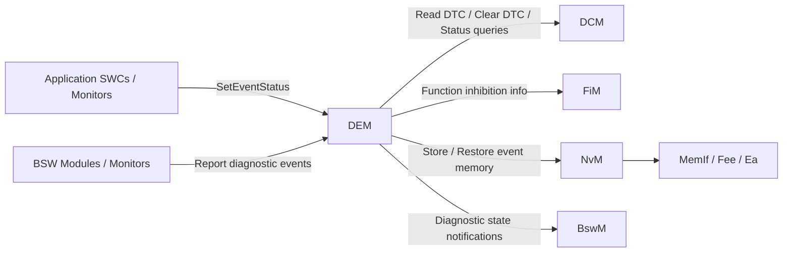
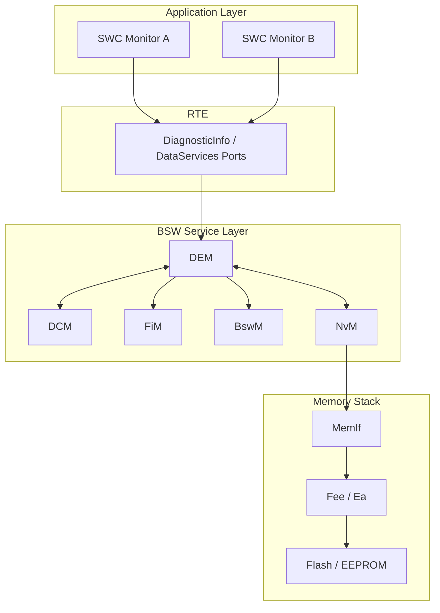
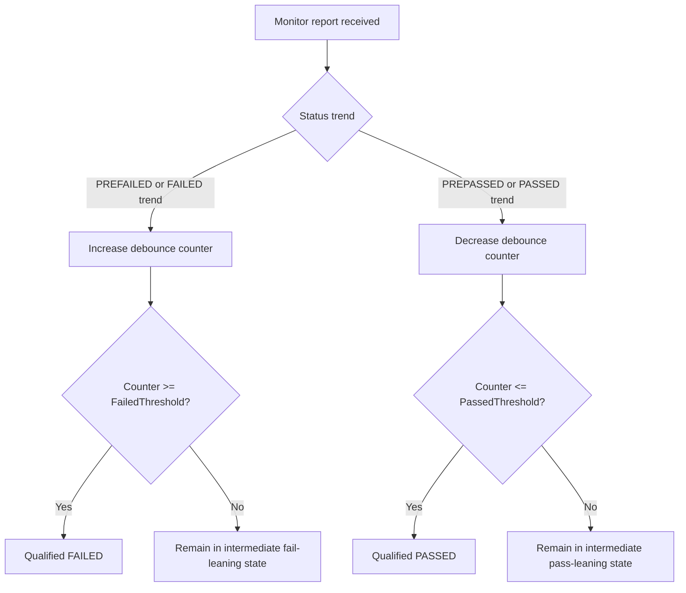
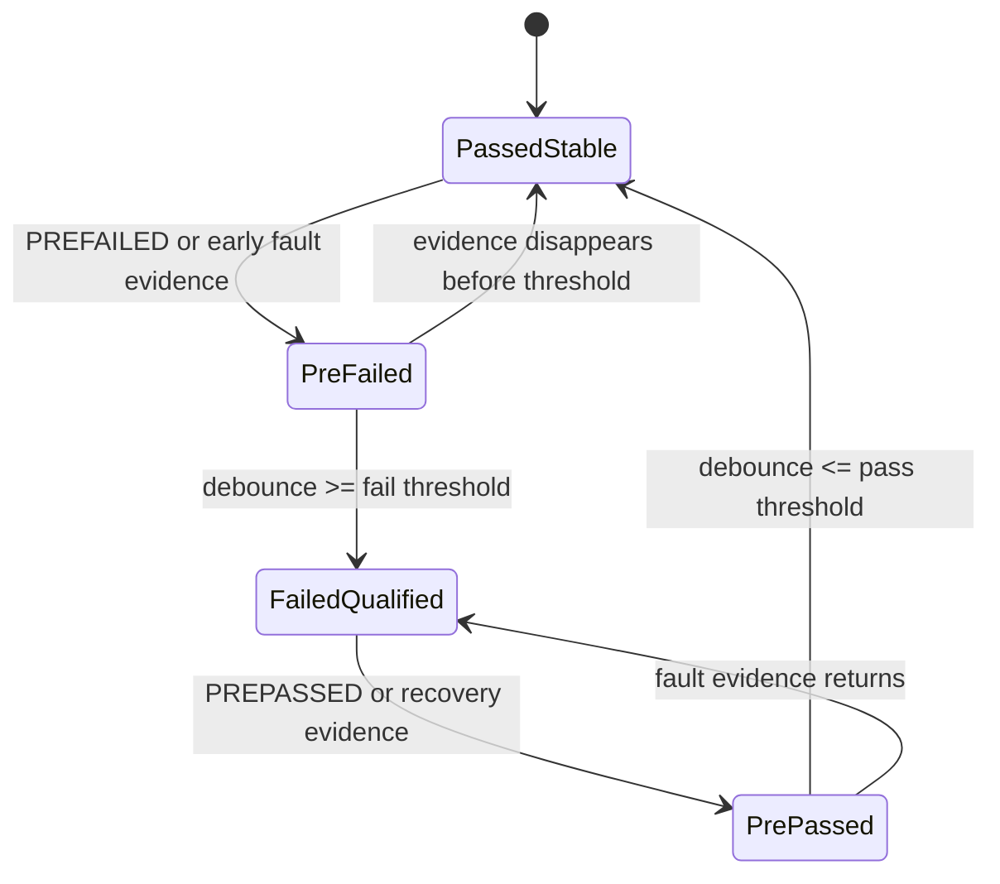
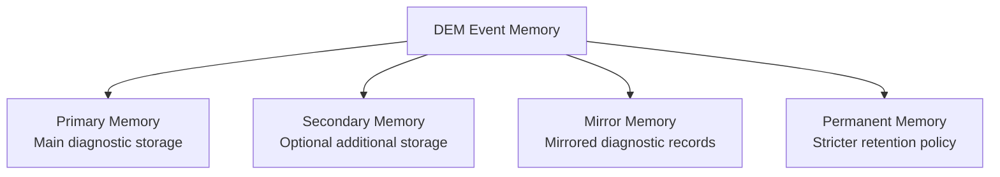
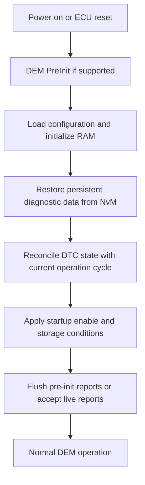

l
5. Các module khác như **DCM**, **FiM**, **BswM**, **NvM** sử dụng hoặc phối hợp với thông tin do DEM quản lý.

Nói ngắn gọn: **DEM không trực tiếp phát hiện lỗi vật lý**, mà DEM là bộ máy hợp nhất, chuẩn hóa, lưu trữ và cung cấp trạng thái chẩn đoán cho toàn ECU.

## 2. Vị trí của DEM trong AUTOSAR Diagnostic Stack

Trong AUTOSAR Classic, DEM nằm ở **BSW Service Layer**, thường được đặt cùng nhóm chức năng với DCM và FiM trong miền chẩn đoán.

Sơ đồ dưới đây mở rộng thêm góc nhìn tầng lớp phần mềm và đường đi dữ liệu chính của DEM:

Về mặt vai trò kiến trúc:

| Thành phần | Vai trò chính |
|---|---|
| SWC / BSW Monitors | Phát hiện điều kiện lỗi hoặc phục hồi |
| DEM | Hợp nhất và quản lý trạng thái sự kiện chẩn đoán |
| DCM | Cung cấp dịch vụ UDS/KWP/OBD cho tester và đọc dữ liệu từ DEM |
| FiM | Quyết định có cho phép một chức năng hoạt động hay phải inhibit dựa trên thông tin từ DEM |
| NvM | Lưu dữ liệu chẩn đoán cần tồn tại qua chu kỳ tắt/mở nguồn |
| BswM | Có thể phản ứng với trạng thái chẩn đoán để thay đổi mode hoặc hành vi hệ thống |

## 3. Mục tiêu chức năng của DEM

DEM được thiết kế để giải quyết các bài toán cốt lõi sau:

1. **Chuẩn hóa việc báo lỗi** từ nhiều nguồn khác nhau trong ECU.
2. **Tách monitor khỏi logic chẩn đoán chuẩn hóa**, giúp monitor chỉ cần kết luận passed/failed thay vì tự quản lý DTC memory.
3. **Áp dụng debouncing** để tránh ghi nhận lỗi giả hoặc nhiễu ngắn hạn.
4. **Ánh xạ event sang DTC** và cập nhật đầy đủ trạng thái DTC theo chuẩn UDS/OBD nếu cấu hình.
5. **Lưu trữ event memory** bao gồm snapshot/freeze frame và extended data.
6. **Quản lý vòng đời lỗi**, gồm detect, pending, confirmed, healed, aged, cleared.
7. **Cung cấp dữ liệu chẩn đoán cho DCM/tester** khi có yêu cầu đọc/xóa lỗi.
8. **Cung cấp trạng thái lỗi cho các module điều phối khác** như FiM hoặc BswM.

## 4. Các khái niệm cốt lõi trong DEM

### 4.1 Event

Trong DEM, đơn vị nhỏ nhất được quản lý là **event**.

Một event đại diện cho một kết quả đánh giá chẩn đoán của một monitor cụ thể, ví dụ:

1. Điện áp cảm biến vượt ngưỡng cao.
2. Mất tín hiệu từ cảm biến tốc độ bánh xe.
3. CAN message timeout.
4. Giá trị ADC ngoài khoảng hợp lệ.

Một số điểm quan trọng:

1. Event là khái niệm gần với **nguồn phát hiện lỗi**.
2. Event không nhất thiết tương đương một DTC theo kiểu 1:1.
3. Tùy cấu hình, nhiều event có thể cùng ánh xạ về một DTC hoặc một event có thể không cần xuất hiện như một DTC độc lập.

### 4.2 Monitor

**Monitor** là logic đánh giá điều kiện lỗi. Monitor có thể nằm ở:

1. Application SWC.
2. Basic Software module.
3. Complex Device Driver.

DEM không quyết định bản thân điều kiện vật lý là lỗi hay không. Monitor làm việc đó. DEM chỉ xử lý kết quả monitor gửi lên.

### 4.3 Event Status

Monitor báo cho DEM trạng thái event thông qua các trạng thái điển hình sau:

| Trạng thái | Ý nghĩa |
|---|---|
| `FAILED` | Monitor xác nhận điều kiện lỗi đang tồn tại |
| `PASSED` | Monitor xác nhận điều kiện lỗi không còn tồn tại |
| `PREFAILED` | Điều kiện nghi ngờ lỗi, đang trong quá trình debounce tăng mức tin cậy |
| `PREPASSED` | Điều kiện nghi ngờ đã phục hồi, đang debounce giảm mức lỗi |

Ý nghĩa thực tế:

1. `FAILED` và `PASSED` là các kết luận mạnh.
2. `PREFAILED` và `PREPASSED` thường dùng khi DEM thực hiện debouncing theo counter/time.
3. Không phải mọi cấu hình đều dùng cả bốn trạng thái; điều này phụ thuộc kiểu debounce và monitor design.

### 4.4 Debouncing

Debouncing là cơ chế chống ghi nhận lỗi sai do nhiễu, transients hoặc điều kiện dao động quanh ngưỡng.

Về bản chất, debouncing là **lớp qualification** nằm giữa kết luận tức thời của monitor và quyết định chẩn đoán chính thức của DEM. Điều này có nghĩa:

1. Monitor có thể phát hiện một dấu hiệu bất thường ở thời điểm rất ngắn.
2. Nhưng DEM chưa vội coi đó là một fault thực sự có giá trị chẩn đoán.
3. DEM chỉ chuyển event sang trạng thái failed hoặc passed chính thức khi bằng chứng đã đủ mạnh theo rule cấu hình.

Nói cách khác, debouncing giúp tách biệt giữa:

1. **raw fault evidence** từ monitor.
2. **qualified diagnostic state** mà DTC status byte, event memory và tester sẽ nhìn thấy.

Nếu không có debouncing, ECU rất dễ gặp các vấn đề sau:

1. Fault chập chờn vài mili-giây đã lập tức thành DTC.
2. Freeze frame bị chụp sai ngữ cảnh vì lỗi chưa thực sự ổn định.
3. Warning indicator bật/tắt liên tục gây khó hiểu cho người sử dụng.
4. Flash/NvM bị ghi quá thường xuyên vì các lỗi giả hoặc lỗi biên.

Các kiểu debounce điển hình:

1. **Counter-based debouncing**
	DEM tăng hoặc giảm bộ đếm theo kết quả monitor. Khi bộ đếm vượt ngưỡng fail thì event mới được coi là failed; khi giảm xuống ngưỡng pass thì event mới được coi là passed.
2. **Time-based debouncing**
	Điều kiện lỗi phải duy trì đủ một khoảng thời gian trước khi được kết luận failed hoặc passed.
3. **Monitor-internal debouncing**
	Bản thân monitor tự debounce và chỉ gửi kết luận cuối cùng lên DEM.

Debouncing rất quan trọng vì nó ảnh hưởng trực tiếp đến:

1. Tốc độ xuất hiện DTC.
2. Tần suất lưu bộ nhớ chẩn đoán.
3. Độ ổn định của warning indicator.
4. Tỷ lệ false positive trong quá trình chẩn đoán xe.

Để hiểu đúng debouncing trong DEM, nên nhìn nó qua 4 lớp hành vi sau:

1. **Input behavior**
	DEM nhận `PREFAILED`, `PREPASSED`, `FAILED`, `PASSED` hoặc một số biến thể do monitor/backend cung cấp.
2. **Internal qualification**
	DEM tăng, giảm hoặc giữ một trạng thái trung gian như counter, timer hoặc FDC.
3. **Threshold crossing**
	Chỉ khi vượt ngưỡng thì event mới đổi sang failed/passed đủ điều kiện.
4. **Diagnostic side effects**
	Sau khi qualified, DEM mới cập nhật DTC status bits, chụp snapshot, lưu event memory hoặc yêu cầu indicator.

#### Counter-based debouncing chi tiết hơn

Đây là kiểu debounce phổ biến nhất trong DEM vì dễ cấu hình, trực quan và phù hợp với nhiều monitor dạng định kỳ.

Thông thường counter-based debounce có các thành phần logic sau:

1. **FailedThreshold**: ngưỡng để kết luận qualified failed.
2. **PassedThreshold**: ngưỡng để kết luận qualified passed.
3. **IncrementStepSize**: bước tăng counter khi monitor tiếp tục báo xu hướng fail.
4. **DecrementStepSize**: bước giảm counter khi monitor báo xu hướng phục hồi.
5. **JumpUp / JumpDown**: cơ chế nhảy nhanh tới một giá trị định sẵn để rút ngắn thời gian qualification khi có một số điều kiện đặc biệt.
6. **Saturation / clamp**: giới hạn counter không vượt biên cấu hình.

Ý nghĩa thực tế của 2 ngưỡng `FailedThreshold` và `PassedThreshold` là tạo ra **hysteresis**. Nhờ đó event không nhảy qua lại liên tục giữa passed và failed khi tín hiệu ở vùng biên.

Ví dụ một luồng counter-based điển hình:

1. Event đang stable ở passed.
2. Monitor bắt đầu gửi `PREFAILED` liên tiếp.
3. Counter tăng dần từng bước.
4. Khi counter chạm `FailedThreshold`, DEM mới coi event là failed chính thức.
5. Sau đó nếu monitor gửi `PREPASSED`, counter giảm dần.
6. Chỉ khi counter xuống `PassedThreshold`, DEM mới coi event đã phục hồi về passed.

Một số nuance quan trọng của counter-based debounce:

1. Không phải cứ monitor báo `PREFAILED` một lần là event sẽ failed.
2. Không phải cứ monitor báo `PREPASSED` một lần là event sẽ healed.
3. Cùng một event nhưng nếu `IncrementStepSize` lớn hơn `DecrementStepSize` thì hệ thống sẽ nhạy với fail hơn so với phục hồi.
4. Nếu cấu hình `JumpUp` hoặc `JumpDown`, event có thể tiến rất nhanh tới vùng qualification thay vì đi tuyến tính.

#### Time-based debouncing chi tiết hơn

Time-based debounce hữu ích khi fault chỉ nên được công nhận nếu tồn tại liên tục trong một khoảng thời gian tối thiểu.

Ví dụ điển hình:

1. Điện áp nguồn tụt trong vài mili-giây chưa chắc là fault thực.
2. Mất truyền thông ngắn ngay khi mạng mới wake-up có thể chưa nên thành DTC.
3. Cảm biến ở giai đoạn khởi động cần một khoảng settle time trước khi được đánh giá nghiêm ngặt.

Trong time-based debounce, DEM hoặc monitor sẽ giữ một timer logic:

1. Nếu điều kiện lỗi kéo dài đủ lâu thì event mới failed.
2. Nếu điều kiện phục hồi kéo dài đủ lâu thì event mới passed.
3. Nếu điều kiện đổi chiều trước khi đủ thời gian, timer có thể reset hoặc đổi hướng theo policy.

Ưu điểm của kiểu này là dễ bám sát các yêu cầu dạng “fault must persist for X ms”. Nhược điểm là nó phụ thuộc mạnh vào scheduling và tick timing của hệ thống.

#### Monitor-internal debouncing

Với monitor-internal debouncing, phần debounce không nằm trong DEM mà nằm ngay trong logic monitor. Khi đó DEM nhận các kết luận đã “lọc nhiễu” sẵn.

Ưu điểm:

1. Monitor có thể dùng nhiều ngữ cảnh vật lý đặc thù mà DEM không biết.
2. Dễ tối ưu cho các tín hiệu phức tạp hoặc thuật toán chẩn đoán chuyên biệt.

Nhược điểm:

1. Tính nhất quán giữa các monitor giảm nếu mỗi monitor debounce theo kiểu riêng.
2. Việc tuning ở mức hệ thống khó hơn vì logic phân tán.
3. DEM mất bớt khả năng quan sát trạng thái trung gian.

#### Quan hệ giữa Debouncing, FDC và DTC lifecycle

Debouncing không tồn tại độc lập. Nó chi phối trực tiếp các phần sau:

1. **FDC** thường là biểu diễn định lượng của mức qualification hiện tại.
2. **DTC status bits** chỉ đổi mạnh sau khi event được qualified.
3. **Event memory entry** thường chỉ được allocate hoặc update sau khi fault đạt trigger rule.
4. **Freeze frame** chỉ có ý nghĩa nếu chụp ở thời điểm event đủ điều kiện lưu.
5. **Indicator request** cũng nên bám vào qualified state chứ không phải raw monitor pulse.

Một cách hiểu thực dụng là:

1. Debounce quyết định **khi nào event được tin**.
2. Confirmation logic quyết định **khi nào event được xác nhận lâu dài**.
3. Aging/healing logic quyết định **khi nào event được quên đi hoặc hạ mức**.

#### Debouncing tại thời điểm khởi động ECU

Debouncing đặc biệt nhạy cảm trong giai đoạn startup vì lúc đó rất nhiều tín hiệu chưa ổn định:

1. Nguồn có thể chưa settle.
2. Bus communication có thể chưa fully available.
3. Sensor chưa warm-up hoặc chưa hợp lệ.
4. Operation cycle vừa mới mở nên nhiều bit lịch sử đang được reset hoặc khôi phục.

Vì vậy trong hệ thống thực tế thường cần kết hợp debouncing với:

1. **Enable conditions** để chưa cho monitor có hiệu lực quá sớm.
2. **Storage conditions** để không lưu fault trong giai đoạn startup nhạy cảm.
3. **Pre-init buffering** cho một số BSW errors thật sự quan trọng.
4. **Counter/timer reset policy** rõ ràng khi ECU vừa khởi động hoặc sau clear/reset.

#### Tuning guidelines thực tế cho debouncing

Khi tune debounce cho DEM, cần tránh hai cực đoan:

1. **Quá nhạy**: fault xuất hiện nhanh nhưng tạo nhiều false positive.
2. **Quá lì**: fault thật tồn tại nhưng hệ thống phản ứng quá chậm.

Một số tiêu chí tune tốt:

1. Fault an toàn hoặc fault có thể gây hư hại nên có qualification nhanh hơn.
2. Fault từ sensor nhiễu hoặc communication startup nên có hysteresis lớn hơn.
3. Các fault cần hiển thị cho người lái nên tránh cấu hình làm indicator chớp tắt.
4. Fault có tác động tới NvM nên phải cân bằng giữa độ nhạy và tuổi thọ bộ nhớ.

Sơ đồ trạng thái khái quát của quá trình debounce:

### 4.5 Fault Detection Counter (FDC)

FDC là một biểu diễn định lượng mức độ tiến gần đến trạng thái fault confirmed trong quá trình debounce. Nó giúp các module khác hoặc tester hiểu event đang tiến triển đến mức nào.

Về mặt thực tế:

1. FDC càng cao thì event càng gần trạng thái fail đủ điều kiện.
2. FDC giảm khi điều kiện lỗi biến mất hoặc hệ thống đang hồi phục.
3. FDC không phải lúc nào cũng được dùng trực tiếp bởi ứng dụng, nhưng là thông tin rất hữu ích khi phân tích lỗi khó tái hiện.

### 4.6 DTC

**DTC (Diagnostic Trouble Code)** là mã lỗi chuẩn hóa mà tester nhìn thấy.

DEM chịu trách nhiệm liên kết giữa event nội bộ và biểu diễn DTC bên ngoài. Điều này có nghĩa:

1. Monitor không cần tự biết UDS encoding của mã lỗi.
2. DEM đảm nhiệm logic trạng thái của DTC.
3. DCM khi xử lý các dịch vụ như đọc lỗi sẽ truy vấn thông tin từ DEM thay vì nói chuyện trực tiếp với monitor.

### 4.7 DTC Status Bits

Một DTC trong ngữ cảnh UDS thường đi kèm 8 bit trạng thái. Đây là phần rất quan trọng của Functional Description vì DEM chính là nơi duy trì các bit này.

| Bit | Tên bit | Ý nghĩa chức năng |
|---|---|---|
| 0 | `testFailed` | Lỗi đang được đánh giá là failed ở thời điểm hiện tại |
| 1 | `testFailedThisOperationCycle` | Trong operation cycle hiện tại đã từng failed |
| 2 | `pendingDTC` | Lỗi đã xuất hiện nhưng chưa chắc đã đủ điều kiện confirmed lâu dài |
| 3 | `confirmedDTC` | Lỗi đã đủ tiêu chí xác nhận theo cấu hình |
| 4 | `testNotCompletedSinceLastClear` | Chưa hoàn tất monitor kể từ lần clear gần nhất |
| 5 | `testFailedSinceLastClear` | Đã từng failed kể từ lần clear gần nhất |
| 6 | `testNotCompletedThisOperationCycle` | Trong operation cycle hiện tại monitor chưa hoàn tất |
| 7 | `warningIndicatorRequested` | DEM đang yêu cầu bật indicator liên quan |

Điểm mấu chốt:

1. Không phải bit nào cũng được set/xóa đồng thời.
2. Việc thay đổi từng bit phụ thuộc vào event status, operation cycle, clear operation, aging, confirm criteria và một số quy tắc OBD nếu bật.
3. Đây là phần khiến DEM trở thành module có logic trạng thái phức tạp nhất trong stack chẩn đoán.

Sơ đồ dưới đây mô tả diễn tiến trạng thái DTC ở mức high-level, đủ để liên hệ giữa `testFailed`, `pendingDTC`, `confirmedDTC` và aging/clear logic:

```mermaid
flowchart LR
	A[After Clear<br/>History reset] --> B[Monitor executes<br/>not completed bits change]
	B -->|First qualified fail| C[testFailed<br/>pendingDTC]
	C -->|Repeated fail / confirm criteria met| D[confirmedDTC]
	D -->|Indicator rule applies| E[warningIndicatorRequested]
	E -->|Clean cycles accumulate| F[Aging or healing candidate]
	F -->|Aging threshold or ClearDTC| G[Record removed or status reset]
```

### 4.8 Event Memory Entry

Khi lỗi đạt điều kiện cần lưu, DEM tạo hoặc cập nhật một **event memory entry**. Một entry điển hình có thể chứa:

1. Event ID hoặc DTC liên quan.
2. Trạng thái DTC tại thời điểm lưu.
3. Occurrence counter.
4. Aging counter hoặc healing-related data.
5. Freeze frame / snapshot data.
6. Extended data record.
7. Thông tin priority hoặc displacement metadata.

Trong nhiều DEM implementation, event memory không chỉ có một vùng nhớ duy nhất mà có thể được tách thành nhiều vùng logic tùy cấu hình dự án:

1. **Primary memory**: vùng lưu fault chính cho phần lớn DTC thường dùng.
2. **Secondary memory**: vùng phụ hoặc overflow cho các nhóm event nhất định.
3. **Mirror memory**: vùng mirror phục vụ các nhu cầu chẩn đoán hoặc OBD-specific tùy hệ thống.
4. **Permanent memory**: vùng có policy giữ dữ liệu chặt hơn, không bị xử lý giống primary memory thông thường.

### 4.9 Freeze Frame / Snapshot Data

Freeze frame là ảnh chụp nhanh trạng thái hệ thống tại thời điểm lỗi được chốt lưu, ví dụ:

1. Tốc độ xe.
2. Điện áp nguồn.
3. Nhiệt độ nước làm mát.
4. Giá trị cảm biến liên quan.

Mục đích của freeze frame là giúp kỹ sư hoặc tester hiểu **lỗi xảy ra trong điều kiện vận hành nào**.

### 4.10 Extended Data

Extended data là dữ liệu bổ sung phục vụ phân tích sâu hơn, ví dụ:

1. Bộ đếm số lần lỗi xuất hiện.
2. Giá trị FDC gần nhất.
3. Số chu kỳ warm-up từ lần lỗi cuối.
4. Thông tin internal class/state do cấu hình yêu cầu.

### 4.11 Operation Cycle, Aging Cycle, Warm-up Cycle

DEM không chỉ quan tâm lỗi đang có hay không, mà còn quan tâm lỗi trong bối cảnh chu kỳ vận hành.

1. **Operation cycle** thường tương ứng với một chu kỳ lái xe, một chu kỳ ignition, hoặc một pha vận hành được cấu hình.
2. **Aging cycle** dùng để đánh giá khi nào một lỗi confirmed nhưng không còn tái xuất hiện có thể được aging.
3. **Warm-up cycle** đặc biệt quan trọng với OBD nếu ECU dùng các yêu cầu khí thải/OBD.

Các cycle này ảnh hưởng trực tiếp đến pending/confirmed/aging behavior.

### 4.12 Indicator

DEM có thể quản lý yêu cầu bật/tắt indicator như MIL hoặc warning lamp logic ở mức chẩn đoán. DEM thường không trực tiếp điều khiển chân phần cứng, mà duy trì yêu cầu logic và cung cấp thông tin cho module điều phối hoặc tầng khác.

### 4.13 Enable Condition và Storage Condition

Hai khái niệm này rất dễ bị nhầm:

1. **Enable Condition**: điều kiện cho phép monitor/event được đánh giá theo logic chẩn đoán.
2. **Storage Condition**: điều kiện cho phép thông tin event được lưu vào event memory.

Ví dụ thực tế:

1. Có thể chỉ cho phép monitor hoạt động khi engine đã running ổn định.
2. Có thể cho phép monitor chạy, nhưng không lưu DTC trong một mode sản xuất, service mode hoặc điều kiện nguồn chưa ổn định.

### 4.14 Startup Behaviour

Startup behaviour của DEM là tập hợp các hành vi mà module phải thực hiện trong giai đoạn ECU vừa bật nguồn cho đến khi chuyển sang trạng thái chẩn đoán bình thường.

Đây là một chủ đề quan trọng vì giai đoạn startup thường là nơi dễ phát sinh:

1. False fault do nguồn, bus hoặc sensor chưa ổn định.
2. Mất đồng bộ giữa RAM state và dữ liệu chẩn đoán khôi phục từ NvM.
3. Event đến quá sớm từ BSW trước khi DEM full init xong.
4. Các bit theo operation cycle bị set/xóa sai thời điểm.

Một startup behaviour điển hình của DEM có thể được chia thành các pha sau:

1. **Pre-initialization**
	DEM vào trạng thái tối thiểu để có thể nhận hoặc buffer một số lỗi BSW sớm nếu implementation hỗ trợ.
2. **Configuration binding**
	DEM nạp bảng cấu hình event, DTC, memory class, debounce class, data class và cycle definition.
3. **RAM initialization**
	Các biến runtime, counters, queue và internal state machine được đặt về trạng thái khởi đầu.
4. **NvM restore**
	DEM khôi phục event memory, DTC history, counters và metadata persistent.
5. **State reconciliation**
	DEM đồng bộ lại các trạng thái vừa khôi phục với trạng thái operation cycle mới mở.
6. **Transition to normal monitoring**
	Sau khi conditions cần thiết đã sẵn sàng, DEM mới xử lý event như chế độ vận hành bình thường.

Một số rule thực dụng trong startup behaviour:

1. **Không phải mọi event report đến sớm đều nên bị bỏ qua**. Một số BSW faults trong giai đoạn khởi động vẫn có giá trị chẩn đoán thật.
2. **Không phải mọi event report đến sớm đều nên được lưu ngay**. Nhiều fault ở startup chỉ là transient.
3. **Cycle-dependent bits** cần được reset theo đúng semantics của operation cycle mới, nhưng dữ liệu persistent như confirmed history vẫn phải được giữ nếu policy yêu cầu.
4. **Enable condition** thường là công cụ chính để trì hoãn đánh giá các monitor chưa hợp lệ trong giai đoạn đầu.

Startup behaviour tốt sẽ giúp DEM tránh hai lỗi hệ thống phổ biến:

1. Ghi nhận quá nhiều DTC giả ngay sau key-on.
2. Làm mất các DTC có giá trị hậu kiểm sau reset nguồn.

---

> **Tiếp theo:** [DEM - Functional Description](/dem-functional/)  Functional Description, luồng hoạt động, dependencies và cấu hình chi tiết.