# DCM - Diagnostic Communication Manager

> Tài liệu này là phần diễn giải kỹ thuật rất chi tiết về **DCM (Diagnostic Communication Manager)** trong AUTOSAR Classic Platform. Nội dung tổng hợp từ cách tổ chức chuẩn AUTOSAR, các nguồn public về UDS/DCM và được viết lại theo hướng giải thích thực dụng. Bản này dùng **Mermaid tự vẽ** để minh họa thay cho hình ảnh lấy từ web nhằm giữ tài liệu đồng nhất, dễ chỉnh sửa và không phụ thuộc vào ảnh ngoài.

## 1. Tổng quan module

**DCM (Diagnostic Communication Manager)** là module của AUTOSAR Classic chịu trách nhiệm quản lý toàn bộ giao tiếp chẩn đoán giữa **diagnostic tester** bên ngoài và ECU bên trong xe. Nếu DEM là nơi quản lý trạng thái lỗi và dữ liệu chẩn đoán, thì DCM là **cánh cửa giao tiếp chuẩn hóa** để tester gửi yêu cầu UDS/KWP/OBD và nhận phản hồi tương ứng.

Ở góc nhìn hệ thống, DCM giải quyết các nhiệm vụ cốt lõi sau:

1. Nhận request chẩn đoán từ communication stack.
2. Kiểm tra session, security level, addressing mode, timing và điều kiện thực thi.
3. Phân loại service và chuyển tới đúng logic xử lý.
4. Đọc hoặc ghi dữ liệu từ DEM, application, BSW hoặc memory/backend tương ứng.
5. Tạo positive response hoặc negative response chuẩn UDS.
6. Quản lý các timing như `P2`, `P2*`, `S3Server`, `ResponsePending`.
7. Điều phối các dịch vụ chẩn đoán như:
   `DiagnosticSessionControl`, `SecurityAccess`, `ReadDataByIdentifier`, `RoutineControl`, `ReadDTCInformation`, `ClearDiagnosticInformation`, `TesterPresent`, `ECUReset`, `CommunicationControl`, `ControlDTCSetting` và các dịch vụ lập trình nếu dự án hỗ trợ.

Nói ngắn gọn: **DCM không phải nơi chứa bản thân dữ liệu lỗi hay dữ liệu ứng dụng**, mà là **bộ điều phối giao thức và quyền truy cập** để tester tương tác với các dữ liệu/chức năng đó một cách chuẩn hóa.

## 2. Vị trí của DCM trong AUTOSAR Diagnostic Stack

Trong AUTOSAR Classic, DCM nằm ở **BSW Service Layer**. Nó đứng giữa external diagnostic communication và các provider nội bộ như DEM, application callouts, routines, memory service, mode management và các backend vendor-specific.

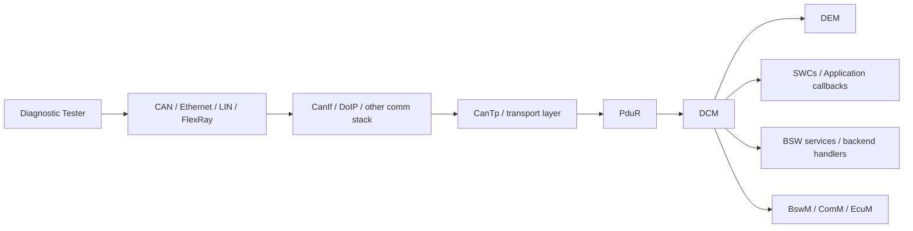

Sơ đồ dưới đây mở rộng hơn theo góc nhìn lớp phần mềm AUTOSAR:

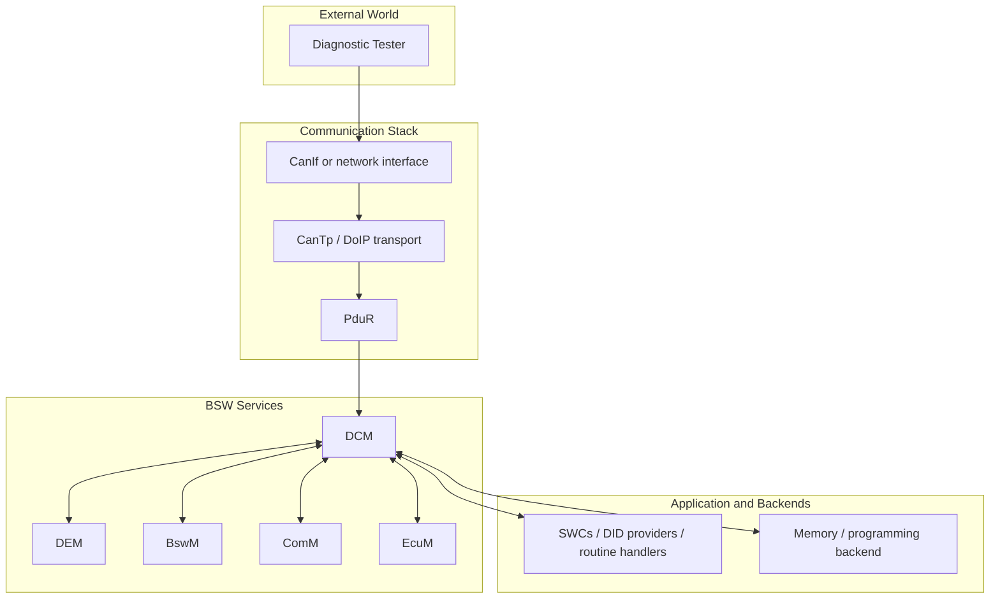

Về mặt vai trò kiến trúc:

| Thành phần | Vai trò chính |
|---|---|
| Tester | Khởi tạo request chẩn đoán |
| Comm stack | Mang request/response qua bus và transport layer |
| DCM | Server UDS/KWP/OBD của ECU |
| DEM | Cung cấp DTC, snapshot, extended data, clear DTC |
| SWC / BSW callouts | Cung cấp DID, routine, data backend |
| BswM / ComM / EcuM | Điều phối mode, communication, reset và session-related policies |

## 3. Mục tiêu chức năng của DCM

DCM được thiết kế để đảm bảo ECU có thể cung cấp dịch vụ chẩn đoán theo chuẩn mà vẫn giữ được kiểm soát về an toàn, bảo mật và trạng thái hệ thống.

Các mục tiêu chức năng điển hình:

1. **Chuẩn hóa external diagnostic interface** của ECU.
2. **Tách protocol handling khỏi business logic** của application và DEM.
3. **Kiểm soát truy cập** thông qua session và security level.
4. **Cung cấp routing service-to-backend** tới DEM, DID providers, routines, reset handlers, flash backends.
5. **Quản lý response** chuẩn UDS, bao gồm positive response, negative response và `0x78 ResponsePending`.
6. **Quản lý transport constraints** như phân mảnh nhiều frame, buffer, paging và timeout.
7. **Bảo vệ ECU** khỏi request sai, request trái session, trái security hoặc điều kiện chưa đúng.

## 4. Các khái niệm cốt lõi trong DCM

### 4.1 – 4.4 Nền tảng giao thức UDS (tham chiếu)

> Các khái niệm nền tảng sau thuộc về **giao thức UDS** chứ không riêng DCM. Xem chi tiết tại [UDS Overview](/uds-overview/):
> - **Mô hình client-server** – tester là client, ECU/DCM là server, hoạt động request-driven.
> - **SID / RSID** – mỗi dịch vụ có Service Identifier; positive response = SID + 0x40; negative response = `0x7F + SID + NRC`.
> - **Cấu trúc diagnostic message** – SID → sub-function → parameters. DCM xử lý payload đã được transport layer tái lắp ghép.
> - **Addressing mode** – physical (1 ECU) và functional (broadcast logic). Ảnh hưởng đến service permission và response suppression.

Phần dưới đây tập trung vào các khái niệm **đặc thù triển khai DCM** trong AUTOSAR.

### 4.5 Kiến trúc nội bộ DCM: DSL, DSD, DSP

Đây là phần quan trọng nhất để hiểu Functional Description của DCM.

DCM thường được chia thành 3 khối logic nội bộ:

1. **DSL (Diagnostic Session Layer)**
   Quản lý protocol/session, connection, timing, buffer, addressing, response pending, tester present, S3 timeout.
2. **DSD (Diagnostic Service Dispatcher)**
   Phân loại service và quyết định request sẽ đi tới handler nào.
3. **DSP (Diagnostic Service Processing)**
   Thực thi logic dịch vụ cụ thể như đọc DID, chạy routine, reset ECU, gọi DEM đọc DTC.

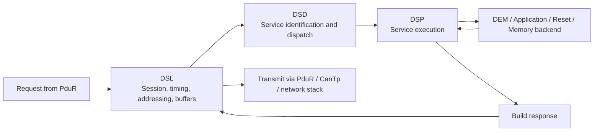

### 4.6 Diagnostic Session

DCM luôn ở **đúng một session tại một thời điểm**.

Các session phổ biến:

1. **Default session**
   Session mặc định sau khi ECU khởi động.
2. **Extended diagnostic session**
   Cho phép thêm dịch vụ phục vụ chẩn đoán nâng cao.
3. **Programming session**
   Dùng cho flashing, download/upload hoặc dịch vụ bảo trì sâu hơn.

Session quyết định:

1. Service nào được phép.
2. DID nào đọc/ghi được.
3. Routine nào được gọi.
4. Security level nào cần có.
5. Timing nào áp dụng.

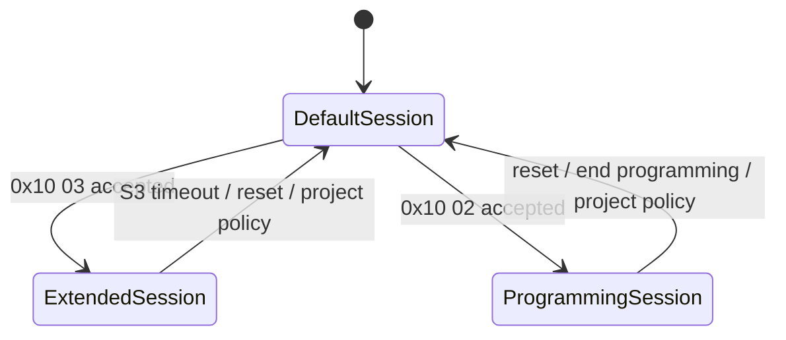

### 4.7 Security Access

Nhiều dịch vụ UDS không được phép chạy chỉ với session chuyển đổi. Chúng còn cần **security level** tương ứng.

Luồng phổ biến:

1. Tester gửi yêu cầu seed.
2. DCM trả seed.
3. Tester tính key.
4. Tester gửi key.
5. DCM xác minh key qua backend security logic.
6. Nếu đúng, DCM mở security level tương ứng.

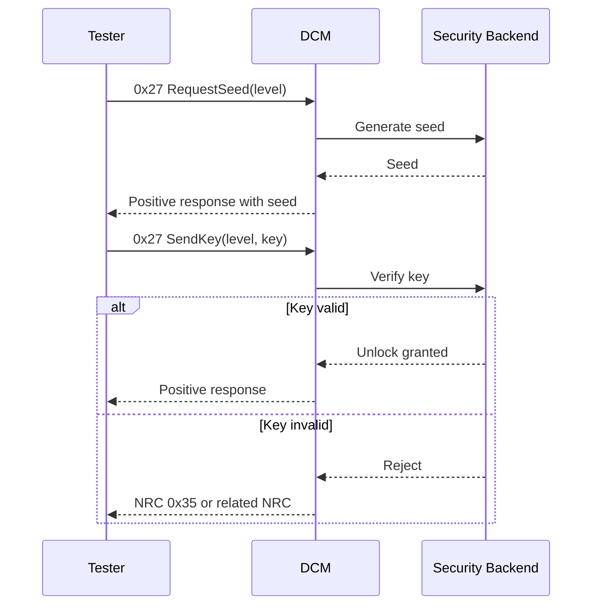

### 4.8 DID (Data Identifier)

**DID** là định danh dữ liệu mà tester có thể đọc hoặc ghi qua DCM, thường dùng trong:

1. `0x22 ReadDataByIdentifier`
2. `0x2E WriteDataByIdentifier`
3. `0x2F InputOutputControlByIdentifier`

Một DID có thể đại diện cho:

1. VIN.
2. Part number.
3. Software version.
4. Calibration ID.
5. Sensor value cụ thể.
6. Dữ liệu vendor-specific.

DCM chịu trách nhiệm:

1. Kiểm tra DID có tồn tại không.
2. Kiểm tra session/security có đủ không.
3. Gọi callback hoặc backend provider để đọc/ghi dữ liệu.
4. Đóng gói response đúng format.

### 4.9 RID (Routine Identifier)

**RID** dùng trong `0x31 RoutineControl` để khởi động, dừng hoặc lấy kết quả của một routine.

Routine điển hình:

1. Erase memory.
2. Check programming preconditions.
3. Self-test.
4. Calibrate actuator.
5. Reset learned values.

DCM không nhất thiết chứa logic nghiệp vụ của routine; DCM chỉ:

1. Xác thực request.
2. Gọi routine backend.
3. Theo dõi trạng thái nếu asynchronous.
4. Trả result hoặc `ResponsePending` nếu cần.

### 4.10 DTC services và quan hệ với DEM

Những service liên quan DTC như:

1. `0x19 ReadDTCInformation`
2. `0x14 ClearDiagnosticInformation`
3. `0x85 ControlDTCSetting`

thường không được DCM tự xử lý dữ liệu nền. DCM đóng vai trò:

1. Parse request.
2. Kiểm tra session/security.
3. Chuyển yêu cầu sang DEM hoặc cơ chế điều phối liên quan.
4. Đóng gói response cho tester.

Tức là DCM là **protocol facade**, còn DEM là **diagnostic state/data owner**.

### 4.11 – 4.14 Giao thức UDS: NRC, Timing, TesterPresent, Multi-frame (tham chiếu)

> Các khái niệm sau thuộc về **giao thức UDS / ISO-TP** và được trình bày chi tiết tại [UDS Overview](/uds-overview/) và [CanTp](/cantp/):
> - **Negative Response Code (NRC)** – bảng NRC chuẩn (`0x11` serviceNotSupported, `0x33` securityAccessDenied, `0x78` ResponsePending, v.v.). DCM phải chọn NRC đúng ngữ nghĩa, không chỉ syntax.
> - **Timing P2, P2\*, S3Server** – P2 là deadline phản hồi, P2\* cho xử lý kéo dài, S3 là session timeout. ResponsePending `0x78` dùng khi backend cần thêm thời gian.
> - **TesterPresent (`0x3E`)** – giữ session active, tránh ECU tự rơi về default session.
> - **Single-frame / multi-frame** – ảnh hưởng buffer sizing, paging strategy và timing của DCM. Transport layer (CanTp / ISO-TP) xử lý segmentation; DCM xử lý payload đã tái lắp ghép.

## 5. Functional Description của DCM

Phần này mô tả chi tiết DCM hoạt động như thế nào từ lúc nhận một request tới khi trả response.

### 5.1 Khởi tạo DCM và đăng ký protocol

Khi ECU khởi động, DCM thực hiện các công việc khởi tạo cốt lõi sau:

1. Khởi tạo buffer RX/TX.
2. Nạp cấu hình protocol, session table, security table, service table, DID table, RID table.
3. Thiết lập default session.
4. Reset security level về trạng thái locked.
5. Khởi tạo timer nội bộ như P2/S3.
6. Đưa state machine của connection về idle.

Ý nghĩa thực tế:

1. ECU phải luôn có một trạng thái chẩn đoán mặc định rõ ràng.
2. Sau reset, các quyền đặc biệt phải bị khóa lại trừ khi có policy khác.
3. DCM phải sẵn sàng nhận request ngay khi communication stack mở đường.

### 5.2 Tiếp nhận request từ communication stack

Đường đi điển hình của một request là:

1. Tester gửi request trên bus.
2. Interface/transport stack nhận frame.
3. Transport layer tái lắp ghép nếu là multi-frame.
4. PduR chuyển payload hoàn chỉnh cho DCM.
5. DCM bắt đầu parse request.

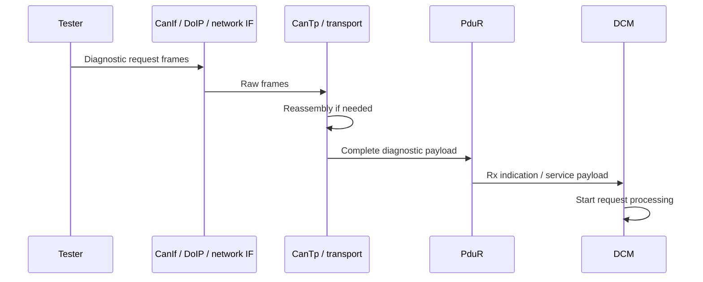

### 5.3 DSL quản lý connection, buffer và timing

DSL là lớp đầu tiên trong DCM nhìn request theo góc độ protocol runtime.

DSL thường xử lý:

1. Connection/channel đang active là gì.
2. Addressing mode là physical hay functional.
3. Buffer có đủ chỗ cho request/response không.
4. Session hiện tại là gì.
5. Security level hiện tại là gì.
6. Timer P2/P2*/S3 có cần cập nhật không.
7. Request này có hợp lệ để chuyển xuống service dispatch không.

Nếu có vấn đề từ sớm, DSL có thể chặn request trước khi vào DSP logic sâu hơn.

### 5.4 Kiểm tra session, security và điều kiện truy cập

Trước khi service thực sự chạy, DCM phải xác định request có được phép hay không.

Những thứ thường được kiểm tra:

1. Service có được hỗ trợ không.
2. Sub-function có hợp lệ không.
3. Message length có đúng format không.
4. Service này có được phép trong session hiện tại không.
5. Security level hiện tại đã đủ chưa.
6. Addressing mode hiện tại có cho phép service này không.
7. Có điều kiện runtime nào ngăn service không, ví dụ tốc độ xe, mode nguồn, communication state, programming precondition.

Nếu request vi phạm, DCM chọn NRC tương ứng, ví dụ:

1. `0x7F serviceNotSupportedInActiveSession`
2. `0x33 securityAccessDenied`
3. `0x22 conditionsNotCorrect`
4. `0x13 incorrectMessageLengthOrInvalidFormat`

### 5.5 DSD phân loại service và chuyển dispatcher

Sau khi request vượt qua lớp kiểm tra cơ bản, DSD thực hiện công việc routing:

1. Đọc SID.
2. Xác định service handler tương ứng.
3. Xác định service đó thuộc nhóm nào.
4. Chuyển sang DSP handler thích hợp.

Ví dụ:

1. `0x22` -> DID service handler.
2. `0x31` -> RoutineControl handler.
3. `0x19` -> DTC/DEM-related handler.
4. `0x10` -> Session handler.

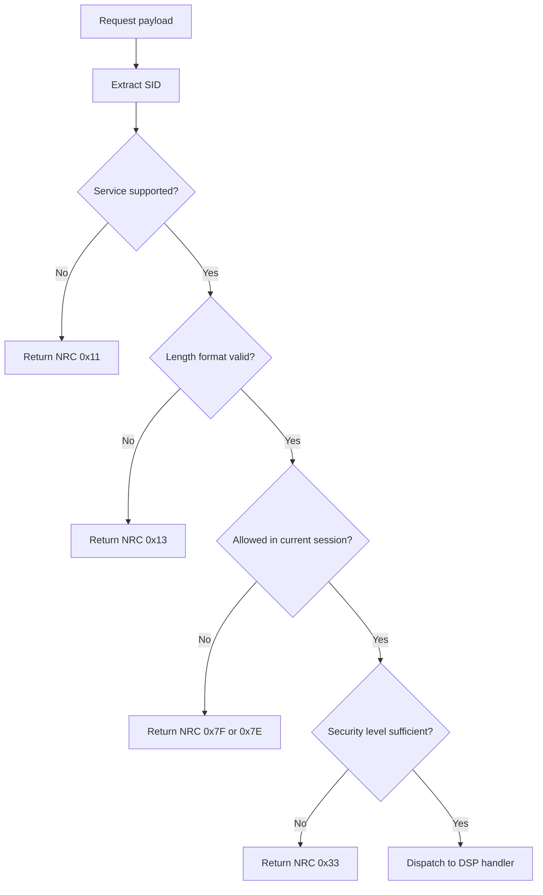

### 5.6 DSP thực thi logic dịch vụ cụ thể

DSP là nơi DCM xử lý semantics của từng service cụ thể. Đây là nơi chứa hoặc điều phối:

1. Session Control logic.
2. Security Access logic.
3. DID read/write logic.
4. RoutineControl logic.
5. DEM-related DTC services.
6. Reset, communication control, tester present, DTC setting.
7. Programming data transfer services nếu có.

DSP có thể:

1. Tự xử lý hoàn toàn một service.
2. Gọi callback/application function.
3. Gọi sang DEM.
4. Gọi backend security/programming/reset service.
5. Trả về trạng thái synchronous hoặc asynchronous.

### 5.7 DiagnosticSessionControl (`0x10`)

Khi tester yêu cầu đổi session, DCM phải:

1. Kiểm tra session target có được hỗ trợ không.
2. Kiểm tra transition có được phép không.
3. Cập nhật session hiện hành nếu được chấp thuận.
4. Reset hoặc điều chỉnh timer liên quan.
5. Có thể reset security level theo policy.
6. Trả positive response cùng timing parameters nếu required.

Ví dụ luồng chức năng:

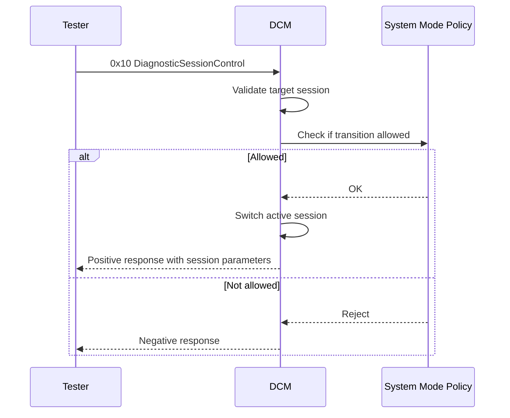

### 5.8 SecurityAccess (`0x27`)

DCM thường không tự chứa thuật toán bí mật, nhưng nó điều phối đầy đủ quy trình unlock.

Các bước logic điển hình:

1. Kiểm tra sub-function request seed hay send key.
2. Kiểm tra sequence có đúng không.
3. Lấy seed từ backend.
4. Gửi seed cho tester.
5. Nhận key từ tester.
6. Gọi backend kiểm tra key.
7. Nếu đúng, set security level mới.
8. Nếu sai, tăng attempt counter và áp dụng delay/lockout nếu cần.

Điểm quan trọng:

1. DCM phải quản lý `requestSequenceError` nếu tester gửi key sai trình tự.
2. DCM phải hỗ trợ `requiredTimeDelayNotExpired` nếu policy có delay giữa các attempt.
3. DCM phải reset unlock state khi session/reset đổi theo policy dự án.

### 5.9 ReadDataByIdentifier (`0x22`) và WriteDataByIdentifier (`0x2E`)

Đây là một trong những chức năng được dùng nhiều nhất của DCM.

Luồng high-level của `0x22`:

1. Parse một hoặc nhiều DID từ request.
2. Kiểm tra từng DID có hợp lệ và được phép trong session/security hiện tại không.
3. Gọi data provider tương ứng để lấy giá trị.
4. Ghép response theo format `0x62 + DID + data`.

Luồng high-level của `0x2E`:

1. Parse DID và payload ghi.
2. Kiểm tra quyền truy cập.
3. Kiểm tra độ dài và định dạng dữ liệu.
4. Gọi backend để ghi hoặc áp dụng giá trị.
5. Trả positive response nếu thành công.

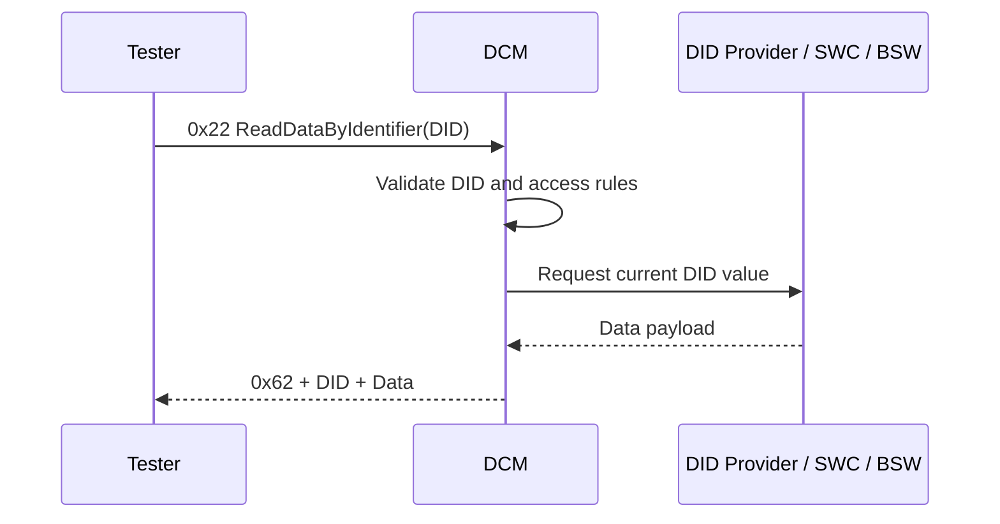

Khi đọc nhiều DID trong một request, DCM phải:

1. Giữ đúng thứ tự response.
2. Kiểm tra buffer đủ lớn.
3. Xử lý trường hợp một DID không hợp lệ theo policy cấu hình/service behavior.

### 5.10 RoutineControl (`0x31`)

RoutineControl cho phép tester kích hoạt logic phức tạp hơn đọc/ghi dữ liệu thô.

Các sub-function phổ biến:

1. StartRoutine.
2. StopRoutine.
3. RequestRoutineResults.

DCM trong case này làm nhiệm vụ:

1. Parse RID và sub-function.
2. Kiểm tra session/security.
3. Gọi routine backend.
4. Nếu routine chạy lâu, trả `0x78 ResponsePending`.
5. Khi xong, trả positive response với routine status hoặc result data.

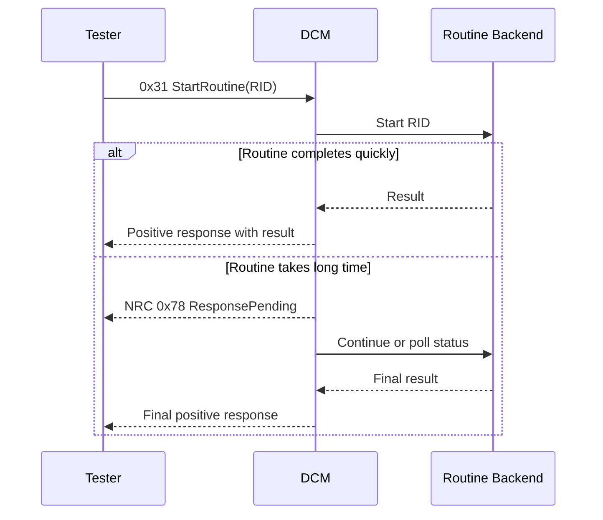

### 5.11 ECUReset, CommunicationControl, TesterPresent và ControlDTCSetting

Nhóm service này cho thấy DCM không chỉ đọc dữ liệu, mà còn điều phối hành vi runtime của ECU.

1. **ECUReset (`0x11`)**
   DCM xác thực request rồi gọi backend reset/EcuM tương ứng.
2. **CommunicationControl (`0x28`)**
   DCM có thể yêu cầu thay đổi trạng thái communication TX/RX theo quy tắc cho phép.
3. **TesterPresent (`0x3E`)**
   DCM reset S3 timeout hoặc duy trì session hiện tại.
4. **ControlDTCSetting (`0x85`)**
   DCM điều phối việc bật/tắt cập nhật DTC theo policy và phối hợp với DEM.

Điểm mấu chốt là mỗi service kiểu này thường tác động trực tiếp tới state của ECU, nên kiểm tra session, security và conditions thường chặt hơn đọc dữ liệu thông thường.

### 5.12 ReadDTCInformation (`0x19`) và ClearDiagnosticInformation (`0x14`) qua DEM

Đây là vùng DCM liên kết chặt nhất với DEM.

Với `0x19`, DCM thường:

1. Parse report type hoặc sub-function.
2. Parse status mask, group, record number hoặc filter parameters.
3. Gọi DEM lấy DTC list, status, freeze frame hoặc extended data.
4. Chuyển kết quả thành response UDS đúng format.

Với `0x14`, DCM thường:

1. Parse DTC group hoặc clear target.
2. Kiểm tra session/security.
3. Gọi DEM clear dữ liệu chẩn đoán tương ứng.
4. Trả positive/negative response theo kết quả.

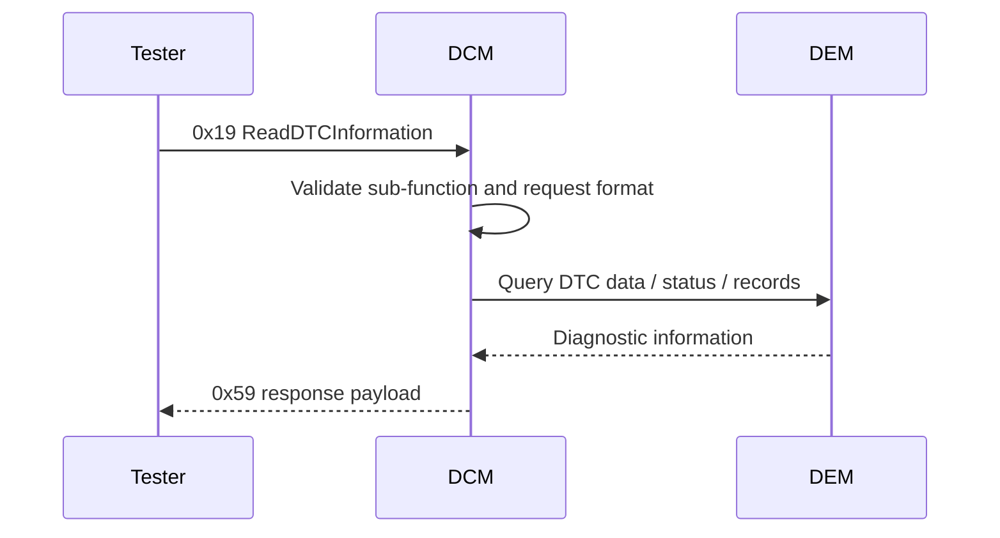

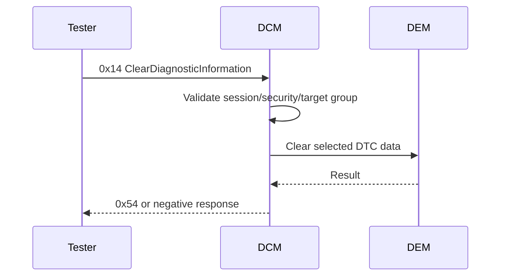

### 5.13 Xây positive response và negative response

Sau khi service được xử lý, DCM phải đóng gói response chuẩn xác.

Positive response thường gồm:

1. RSID.
2. Các field phản hồi bắt buộc theo service.
3. Payload data nếu có.

Negative response gồm:

1. `0x7F`
2. SID gốc
3. NRC

Sơ đồ logic phản hồi:

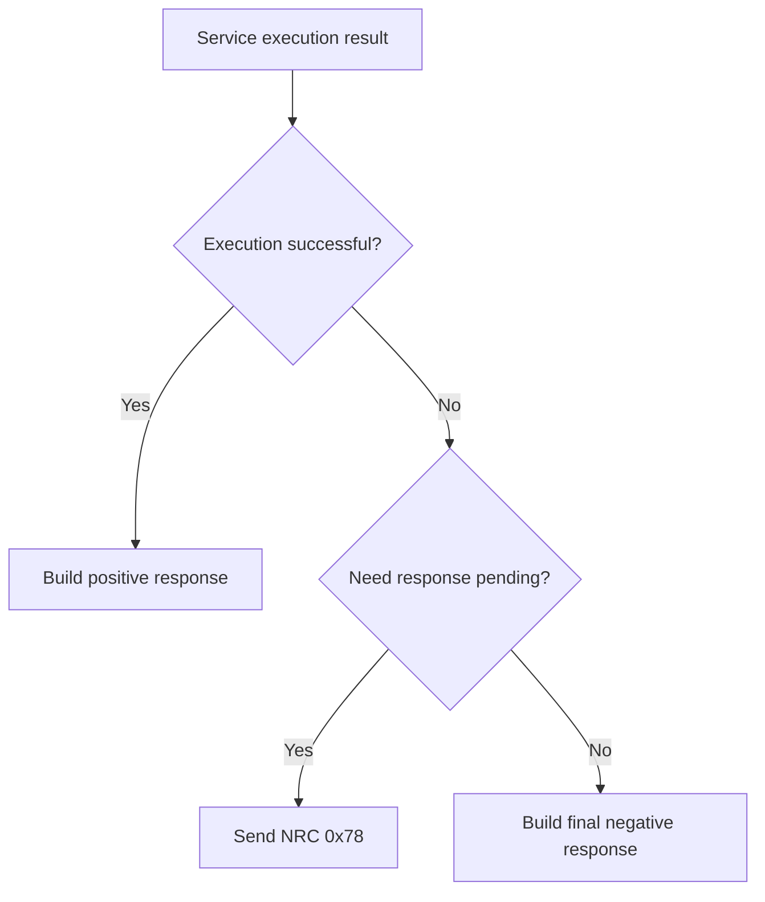

Điều quan trọng là DCM phải chọn đúng lớp lỗi:

1. Lỗi syntax request.
2. Lỗi session/security.
3. Lỗi runtime condition.
4. Lỗi backend execution.
5. Lỗi timeout hoặc sequence.

### 5.14 Xử lý asynchronous jobs và `0x78 ResponsePending`

Nhiều service không thể hoàn thành ngay trong một lần gọi, ví dụ:

1. Routine chạy lâu.
2. Backend erase/program memory.
3. Một DID hoặc service chờ callback hoàn tất.
4. DTC clear mất thời gian ở một số stack/project.

Trong các trường hợp này, DCM có thể:

1. Trả `0x78 requestCorrectlyReceived-ResponsePending`.
2. Tiếp tục polling hoặc chờ backend báo hoàn thành.
3. Sau đó gửi final response.

DCM phải quản lý rất cẩn thận:

1. Bao nhiêu lần được phép gửi `0x78`.
2. Timing giữa các lần pending.
3. Khi nào phải abort và chuyển sang lỗi cuối cùng.

### 5.15 Multi-frame response, buffer và paging

Một số response rất lớn, ví dụ:

1. VIN.
2. Large DID data.
3. DTC list dài.
4. Flash/programming blocks.

Điều này làm DCM phụ thuộc mạnh vào:

1. Buffer configuration.
2. Transport protocol behavior.
3. Paged buffer hoặc chunked transfer strategy.

DCM phải biết:

1. Khi nào dữ liệu đã sẵn sàng đầy đủ để transmit.
2. Khi nào có thể cấp từng chunk cho transport layer.
3. Làm sao không phá timing của protocol.

### 5.16 Dịch vụ programming và download/upload

Nếu dự án hỗ trợ flashing hoặc programming qua DCM, một số service liên quan gồm:

1. `0x34 RequestDownload`
2. `0x35 RequestUpload`
3. `0x36 TransferData`
4. `0x37 RequestTransferExit`

DCM trong bối cảnh này thường:

1. Quản lý sequencing của phiên truyền dữ liệu.
2. Kiểm tra state machine của programming session.
3. Gọi backend flash/bootloader/programming environment.
4. Quản lý block sequence counter, buffer và response.

Tuy nhiên, phần thực sự ghi flash thường nằm ở backend khác, không nằm trong DCM core.

### 5.17 Main function, synchronization và concurrency

Trong ECU thực tế, DCM có thể bị tác động bởi nhiều context khác nhau:

1. Receive indications từ communication stack.
2. Main function cyclic của DCM.
3. Callback từ backend service.
4. Mode changes từ hệ thống.

Vì vậy DCM phải xử lý:

1. Bảo vệ buffer dùng chung.
2. Quản lý state machine connection an toàn.
3. Đồng bộ access tới session/security state.
4. Tránh race condition giữa timeout, response pending và backend completion.

## 6. Luồng hoạt động điển hình của DCM

### 6.1 Luồng chuyển session

1. Tester gửi `0x10`.
2. DCM parse target session.
3. DCM kiểm tra service support và transition policy.
4. Nếu hợp lệ, DCM chuyển active session.
5. DCM reset hoặc cập nhật timer liên quan.
6. DCM trả positive response với session timing parameters nếu applicable.

### 6.2 Luồng mở khóa security

1. Tester gửi `0x27` request seed.
2. DCM lấy seed từ backend.
3. Tester gửi key.
4. DCM kiểm tra sequence.
5. DCM xác minh key qua security backend.
6. Nếu đúng, unlock security level.
7. Nếu sai, tăng bộ đếm lỗi và có thể khóa tạm thời.

### 6.3 Luồng đọc DID đơn giản

1. Tester gửi `0x22 DID`.
2. DCM kiểm tra DID có được hỗ trợ không.
3. DCM kiểm tra session/security.
4. DCM gọi data provider tương ứng.
5. DCM đóng gói `0x62 + DID + data`.
6. Transport stack gửi response về tester.

### 6.4 Luồng đọc DID lớn nhiều frame

1. Tester gửi request DID.
2. DCM lấy dữ liệu từ provider.
3. Response lớn hơn khả năng single frame.
4. DCM chuyển payload sang transport layer.
5. Transport layer gửi first frame.
6. Tester gửi flow control.
7. Transport layer gửi consecutive frames cho đến khi xong.

### 6.5 Luồng RoutineControl

1. Tester gửi `0x31` với sub-function và RID.
2. DCM xác thực session/security.
3. DCM gọi routine backend.
4. Nếu routine nhanh, trả positive response ngay.
5. Nếu routine lâu, trả `0x78` rồi tiếp tục đợi kết quả.
6. Khi backend hoàn tất, DCM trả response cuối.

### 6.6 Luồng đọc và xóa DTC qua DEM

1. Tester gửi `0x19` hoặc `0x14`.
2. DCM parse request parameters.
3. DCM kiểm tra quyền truy cập.
4. DCM gọi DEM.
5. DEM trả DTC data hoặc clear result.
6. DCM đóng gói response chuẩn UDS gửi lại tester.

## 7. Module Dependencies của DCM

Phần này mô tả chi tiết các dependency của DCM trong một hệ thống AUTOSAR Classic điển hình.

### 7.1 Phân loại dependency

Có thể chia dependency của DCM thành 3 nhóm:

1. **Transport and communication dependencies**.
2. **Diagnostic data and service backend dependencies**.
3. **Platform and control dependencies**.

### 7.2 Ma trận dependency chi tiết

| Module | Mức độ phụ thuộc | Hướng tương tác | DCM dùng để làm gì | Ý nghĩa thực tế |
|---|---|---|---|---|
| PduR | Rất cao | PduR <-> DCM | Chuyển payload request/response giữa DCM và transport layer | Không có PduR, DCM không nhận/gửi được diagnostic PDUs trong kiến trúc AUTOSAR điển hình |
| CanTp / DoIP / transport protocol | Rất cao | Indirect via PduR | Tái lắp ghép, phân mảnh, flow control cho request/response | DCM phụ thuộc mạnh vào transport behavior cho multi-frame services |
| CanIf / network interface | Cao | Indirect | Mang request/response trên bus vật lý | Là nền tảng giao tiếp chẩn đoán thực tế |
| DEM | Rất cao | DCM <-> DEM | Read/Clear DTC, freeze frame, extended data, DTC setting | Đây là dependency cốt lõi cho các service 0x14, 0x19, 0x85 |
| SWC / application DID providers | Rất cao | DCM <-> SWC | Đọc/ghi DID, chạy routine, cung cấp backend data | Phần lớn dịch vụ 0x22, 0x2E, 0x31 cần dependency này |
| BSW backends | Cao | DCM <-> backend | Reset ECU, communication control, programming backend, IO control | DCM là protocol layer, backend mới là nơi thực thi hành động thật |
| BswM | Trung bình đến cao | DCM <-> BswM | Báo hoặc nhận mode constraints theo session/diagnostic activity | Hữu ích với ECU có mode management chặt |
| ComM | Trung bình đến cao | DCM <-> ComM | Điều phối trạng thái communication trong diagnostic mode | Quan trọng với network wakeup / full communication use cases |
| EcuM | Trung bình | DCM <-> EcuM | Hỗ trợ reset hoặc state transition liên quan nguồn/ECU lifecycle | Cần khi dịch vụ reset hoặc mode chuyển trạng thái hệ thống |
| NvM / memory services | Tùy tính năng | DCM <-> backend gián tiếp | Dùng khi DID/routine/programming cần persistence | Không phải mọi service DCM đều phụ thuộc trực tiếp |
| Csm / security backend | Tùy tính năng nhưng quan trọng | DCM <-> security backend | Sinh seed, kiểm key, xác thực quyền truy cập | Cần cho SecurityAccess hoặc authentication-type extensions |
| DET | Trung bình | DCM -> DET | Báo lỗi phát triển, sai context, sai tham số | Hữu ích trong integration và debug |
| SchM / OS | Cao | Hạ tầng nền | Đồng bộ buffer, timer, state machine | Cần để DCM hoạt động an toàn trong môi trường đa context |

### 7.3 Dependency với PduR và transport stack

Đây là dependency nền tảng nhất của DCM.

DCM cần transport path để:

1. Nhận request đã tái lắp ghép hoàn chỉnh.
2. Gửi response cho tester.
3. Hỗ trợ multi-frame payload.
4. Đảm bảo timing và segmentation tuân thủ protocol lower layer.

Nếu transport stack cấu hình sai:

1. Request không tới được DCM.
2. Response lớn bị lỗi phân mảnh.
3. Timing chẩn đoán bị phá vỡ.
4. Tester thấy ECU như không hỗ trợ dịch vụ dù logic DCM đúng.

### 7.4 Dependency với DEM

Quan hệ DCM <-> DEM là quan hệ trung tâm của diagnostic stack.

DCM dùng DEM để:

1. Đọc DTC status.
2. Đọc freeze frame.
3. Đọc extended data.
4. Xóa DTC.
5. Điều phối control DTC setting theo policy.

Nếu DEM là nơi nắm diagnostic truth, thì DCM là nơi biểu diễn truth đó thành ngôn ngữ UDS cho tester.

### 7.5 Dependency với SWC, RTE và callback providers

Rất nhiều DID và routine không đến từ DEM mà đến từ application-level logic.

Các dependency điển hình:

1. Callback đọc DID.
2. Callback ghi DID.
3. Callback routine start/stop/result.
4. IO control handlers.
5. Programming precondition checks.

DCM phụ thuộc mạnh vào backend này ở chất lượng integration:

1. Nếu callback chậm, DCM phải xử lý pending đúng.
2. Nếu callback trả độ dài sai, response sẽ lỗi.
3. Nếu callback không tôn trọng session/security policy, DCM có thể lộ chức năng không mong muốn.

### 7.6 Dependency với BswM, ComM và EcuM

Nhóm dependency này liên quan đến hành vi hệ thống chứ không chỉ dữ liệu chẩn đoán.

Ví dụ:

1. Chuyển extended session có thể kéo theo mode system khác.
2. CommunicationControl có thể tác động tới trạng thái truyền thông.
3. ECUReset có thể yêu cầu EcuM/backend reset service.
4. Programming session có thể yêu cầu full communication và các precondition đặc biệt.

### 7.7 Dependency với security backend

DCM hiếm khi tự chứa logic mật mã hoặc thuật toán key. Thông thường nó phụ thuộc vào backend để:

1. Sinh seed.
2. Kiểm key.
3. Quản lý delay timer, attempt counter, lock policy.
4. Có thể tích hợp authentication hiện đại hơn nếu project yêu cầu.

Đây là dependency rất quan trọng về mặt an toàn và an ninh hệ thống.

### 7.8 Dependency với NvM và memory/programming backends

Không phải lúc nào DCM cũng tương tác trực tiếp với NvM, nhưng trong nhiều dự án DCM sẽ gián tiếp phụ thuộc khi:

1. DID cần dữ liệu persistent.
2. Routine có tác động tới non-volatile settings.
3. Programming services ghi flash/EEPROM.
4. Security attempt counter hoặc các policy cần lưu bền vững.

### 7.9 Dependency với DET, SchM và OS

Về mặt platform runtime, DCM phụ thuộc vào:

1. **DET** để báo lỗi phát triển.
2. **SchM** để bảo vệ vùng dữ liệu dùng chung.
3. **OS** để scheduling main function, callbacks, timeout handling.

Nếu phần đồng bộ kém, DCM dễ gặp:

1. Race condition giữa timeout và backend completion.
2. Gửi response không đúng state machine.
3. Hỏng connection state khi có request liên tiếp.

## 8. Sơ đồ phụ thuộc chức năng

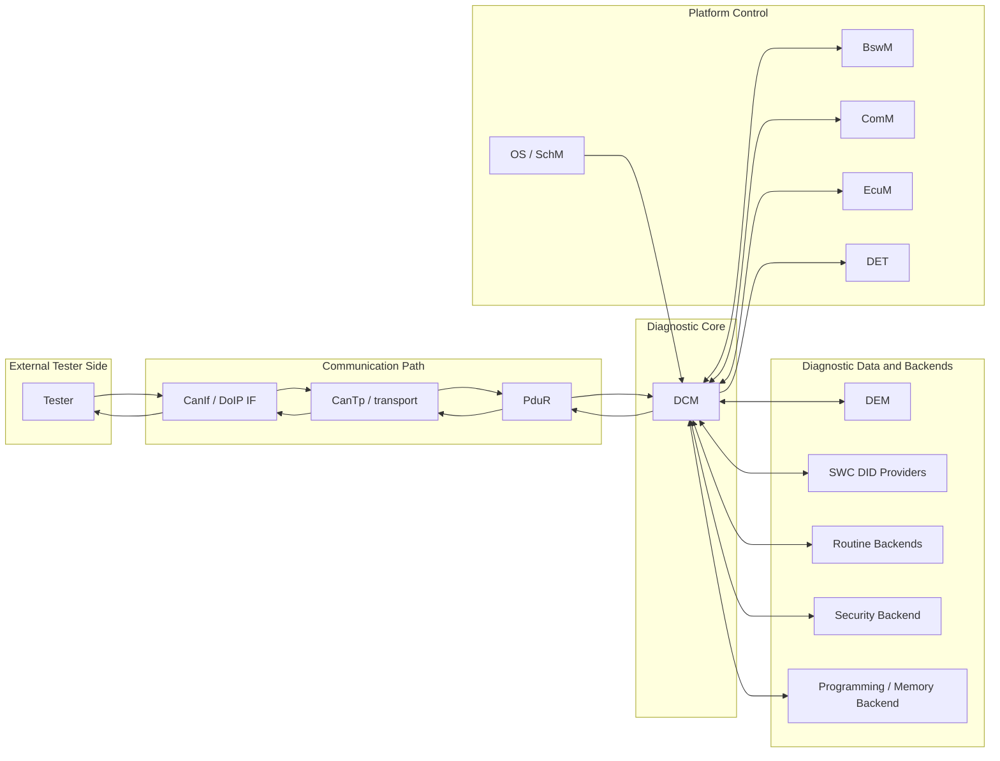

Diễn giải sơ đồ:

1. **Communication path** đưa payload tới và đi khỏi DCM.
2. **DCM core** là nơi điều phối protocol và service execution.
3. **Data/backends** cung cấp nội dung hoặc hành động thực thi.
4. **Platform control** cung cấp mode management, reset, synchronization và development diagnostics.

## 9. Các điểm cấu hình quan trọng ảnh hưởng trực tiếp đến hành vi DCM

| Nhóm cấu hình | Ảnh hưởng chức năng |
|---|---|
| Protocol rows / connection config | Quyết định DCM hỗ trợ protocol nào, channel nào, addressing nào |
| Rx/Tx PDU mapping | Quyết định request/response đi qua stack như thế nào |
| Buffer sizes | Quyết định khả năng xử lý request/response lớn |
| Session table | Quyết định các session được hỗ trợ và timing liên quan |
| Security levels | Quyết định dịch vụ nào cần unlock và cách unlock |
| Service table | Quyết định service nào được support |
| DID configuration | Quyết định dữ liệu nào đọc/ghi được, trong session nào, độ dài bao nhiêu |
| RID configuration | Quyết định routine nào tồn tại và rule truy cập của routine |
| DEM integration config | Quyết định hành vi các service DTC-related |
| Timing parameters | Ảnh hưởng trực tiếp tới P2, P2*, S3, response pending behavior |
| Functional/physical addressing rules | Quyết định service nào được dùng theo từng kiểu addressing |
| Programming service config | Quyết định hỗ trợ download/upload/transfer như thế nào |

Một số hậu quả cấu hình sai rất điển hình:

1. Buffer nhỏ quá làm response lớn bị lỗi.
2. Session/security mapping sai làm service mở quá rộng hoặc bị khóa nhầm.
3. DID length/config sai làm tester đọc dữ liệu rác hoặc response malformed.
4. Timing P2/P2* sai làm tester timeout dù backend vẫn chạy đúng.
5. DEM integration sai làm `0x19` và `0x14` trả dữ liệu không đúng.

## 10. DCM làm gì và không làm gì

### 10.1 DCM làm gì

1. Cung cấp server UDS/KWP/OBD cho ECU.
2. Quản lý session, security, timing, addressing và response format.
3. Route request tới DEM, DID providers, routine backends và các service handlers.
4. Đóng gói positive/negative response đúng chuẩn.
5. Điều phối `ResponsePending` cho các dịch vụ chậm.

### 10.2 DCM không làm gì

1. Không tự lưu trữ trạng thái DTC thay cho DEM.
2. Không tự định nghĩa toàn bộ dữ liệu DID nếu application không cung cấp backend.
3. Không thay thế transport protocol trong việc phân mảnh/gom frame ở lower layer.
4. Không tự triển khai mọi nghiệp vụ routine, reset hay programming backend.
5. Không thay thế cơ chế bảo mật backend; nó chỉ điều phối quy trình truy cập.

## 11. Góc nhìn tích hợp hệ thống

Khi tích hợp DCM vào ECU thực tế, có một số nguyên tắc quan trọng:

1. **Thiết kế service matrix rõ ràng theo session và security**. Đây là nền tảng của toàn bộ hành vi chẩn đoán.
2. **Xem DID và RID như hợp đồng giao tiếp**. DCM chỉ ổn khi backend application/backend cũng ổn định về format và timing.
3. **Rà timing sớm với tester thật**. Nhiều lỗi DCM chỉ lộ ra khi test cùng transport stack và tool thật.
4. **Tách protocol errors khỏi backend errors**. Nếu không, việc chọn NRC sẽ lẫn lộn và rất khó debug.
5. **Làm rõ ranh giới DCM với DEM**. DCM nên là protocol facade, không nên trở thành nơi tự giữ logic DTC nội bộ.
6. **Xử lý asynchronous carefully**. Các service chậm là nơi dễ phát sinh timeout và state corruption nhất.
7. **Kiểm soát buffer cho large payload**. VIN, snapshot, DTC list hay programming data đều có thể phá vỡ cấu hình yếu.

## 12. Kết luận

DCM là module trung tâm biến ECU thành một **diagnostic server chuẩn hóa** có thể giao tiếp với tester bên ngoài theo UDS/KWP/OBD. Giá trị lớn nhất của DCM không nằm ở việc “có nhiều service” mà nằm ở việc nó:

1. Chuẩn hóa request/response theo protocol chẩn đoán.
2. Kiểm soát truy cập qua session và security.
3. Điều phối dữ liệu và hành động từ DEM, application và backend services.
4. Quản lý timing, response pending và multi-frame transport ở góc nhìn ứng dụng chẩn đoán.
5. Tạo ra ranh giới sạch giữa **external diagnostic communication** và **internal ECU logic**.

Nếu DEM là kho trạng thái lỗi của ECU, thì **DCM là bộ mặt giao tiếp của ECU với diagnostic tester**.

## 13. Ghi chú cập nhật và nguồn tham khảo công khai

Phiên bản này được biên soạn theo hướng vendor-neutral, dựa trên cách tổ chức quen thuộc của AUTOSAR Classic và các nguồn public phổ biến về DCM/UDS:

1. DeepWiki `openAUTOSAR/classic-platform` phần `Diagnostic Services` để bám vị trí kiến trúc và quan hệ DCM/DEM.
2. Các tài liệu public về UDS service overview để đối chiếu SID, RSID, NRC, session, security và response structure.
3. Các bài giải thích thực hành về UDS on CAN và ISO-TP để đối chiếu single-frame, multi-frame và response behavior.
4. Các bài public về DCM module để giữ đúng tinh thần `DSL / DSD / DSP`, dù tên hàm hoặc chi tiết cấu hình có thể khác giữa các vendor stack.

Vì mỗi implementation AUTOSAR cụ thể có thể khác nhau về API nội bộ, callback naming, paging strategy, programming backend và policy session/security, tài liệu này nên được hiểu là **mô tả chức năng ở mức kiến trúc và tích hợp**, không phải dump từ một vendor implementation cụ thể.
