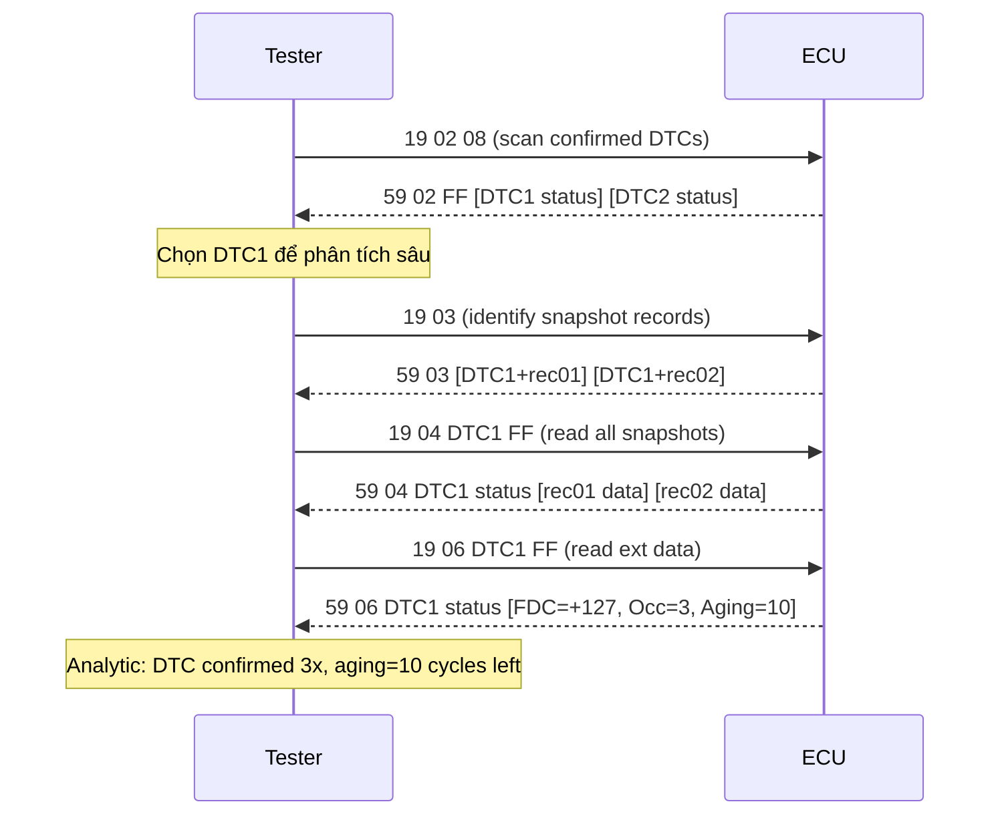

# UDS - SID 0x19: ReadDTCInformation

> Tài liệu mô tả chi tiết **SID 0x19 ReadDTCInformation** theo **ISO 14229-1:2020**, bao gồm các sub-function **0x02, 0x03, 0x04, 0x06, 0x1A, 0x42, 0x55, 0x56**. Mỗi sub-function trình bày: định nghĩa, format request/response, điều kiện Positive/Negative Response, trường hợp đặc biệt và ví dụ cụ thể.

## 1. Tổng quan SID 0x19

**ReadDTCInformation (0x19)** cho phép client đọc thông tin DTC (Diagnostic Trouble Code) từ server (ECU). Đây là service chẩn đoán quan trọng nhất - cung cấp toàn bộ thông tin về lỗi đã xảy ra, trạng thái, dữ liệu tại thời điểm lỗi (snapshot), extended data, và OBD information.

| Thuộc tính | Giá trị |
|---|---|
| Service ID (SID) | 0x19 |
| Response SID (RSID) | 0x59 |
| Negative Response SID | 0x7F |
| Sub-function | Có (1 byte, không có suppressPosRsp bit) |
| Supported sessions | Default + Extended (tùy sub-function) |
| Security access | Không (thường) |

### 1.1 Cấu trúc request tổng quát

```
| 0x19 | sub-function (1 byte) | Parameters... |
```

**Lưu ý quan trọng**: Sub-function của 0x19 là 1 byte **không** có suppressPosRspMsgIndicationBit (khác với 0x10 DiagnosticSessionControl hay 0x11 ECUReset).

### 1.2 DTC Status Byte

Nhiều sub-function của 0x19 trả về **StatusOfDTC** - 1 byte bitmask mô tả trạng thái hiện tại của DTC.

| Bit | Mask | Tên viết tắt | Ý nghĩa |
|---|---|---|---|
| 0 | 0x01 | TF | testFailed – Monitor hiện tại báo lỗi |
| 1 | 0x02 | TFTMC | testFailedThisMonitoringCycle – Lỗi trong chu kỳ giám sát hiện tại |
| 2 | 0x04 | PDTC | pendingDTC – Lỗi 1 chu kỳ, đang chờ xác nhận |
| 3 | 0x08 | CDTC | confirmedDTC – Đã xác nhận, lưu vào primary memory |
| 4 | 0x10 | TNCLC | testNotCompletedSinceLastClear – Chưa chạy test kể từ ClearDTC cuối |
| 5 | 0x20 | TFSLC | testFailedSinceLastClear – Đã từng lỗi kể từ ClearDTC cuối |
| 6 | 0x40 | TNCTMC | testNotCompletedThisMonitoringCycle – Chưa hoàn tất test trong chu kỳ này |
| 7 | 0x80 | WIR | warningIndicatorRequested – Đèn MIL/cảnh báo đang bật |

**DTCStatusAvailabilityMask**: server trả về trong response để báo bit nào được hỗ trợ. Ví dụ `0x3F` = server không hỗ trợ bit 6, 7.

**Ví dụ đọc status**: `0x2D` = `0b00101101` = TF(bit0) + PDTC(bit2) + CDTC(bit3) + TFSLC(bit5).

### 1.3 NRC phổ biến của SID 0x19

| NRC Hex | Tên | Điều kiện xảy ra |
|---|---|---|
| 0x12 | subFunctionNotSupported | Sub-function ECU không hỗ trợ |
| 0x13 | incorrectMessageLengthOrInvalidFormat | Sai số byte trong request |
| 0x22 | conditionsNotCorrect | Sai session, hoặc điều kiện runtime không thỏa |
| 0x31 | requestOutOfRange | Tham số ngoài phạm vi (DTC không tồn tại, mask = 0x00) |
| 0x33 | securityAccessDenied | Chưa mở security level (nếu ECU có cấu hình bảo vệ) |

---

## 2. Sub-function 0x02 - reportDTCByStatusMask

### 2.1 Định nghĩa

Lọc và trả về danh sách tất cả DTC có status byte thỏa điều kiện:

```
(StatusOfDTC AND DTCStatusMask) != 0x00
```

Đây là sub-function được dùng phổ biến nhất - tester gửi để **quét lỗi** toàn bộ ECU.

### 2.2 Format Request

| Byte | Field | Giá trị | Mô tả |
|---|---|---|---|
| 1 | SID | `0x19` | ReadDTCInformation |
| 2 | Sub-function | `0x02` | reportDTCByStatusMask |
| 3 | DTCStatusMask | `0x01`–`0xFF` | Bitmask lọc theo DTC status |

Độ dài: **3 byte** (fixed).

### 2.3 Format Positive Response (RSID 0x59)

| Byte | Field | Mô tả |
|---|---|---|
| 1 | RSID | `0x59` |
| 2 | Sub-function | `0x02` |
| 3 | DTCStatusAvailabilityMask | Bits status server hỗ trợ |
| 4–6 | DTC #1 | 3-byte DTC (High, Mid, Low) |
| 7 | StatusOfDTC #1 | Trạng thái DTC #1 |
| ... | | Lặp cho mỗi DTC khớp |

Nếu không DTC nào khớp → response chỉ có **3 byte**: `59 02 [AvailMask]`.

### 2.4 Điều kiện Positive Response

1. Sub-function 0x02 được ECU hỗ trợ.
2. Session hợp lệ (thường default hoặc extended).
3. `DTCStatusMask != 0x00`.
4. `DTCStatusMask AND DTCStatusAvailabilityMask != 0x00` - mask phải chứa ít nhất 1 bit server hỗ trợ.
5. Message length chính xác 3 byte.

### 2.5 Điều kiện Negative Response

| Điều kiện | NRC |
|---|---|
| Sub-function 0x02 không hỗ trợ | `0x12` |
| Request != 3 byte | `0x13` |
| `DTCStatusMask = 0x00` | `0x31` |
| `DTCStatusMask AND DTCStatusAvailabilityMask = 0x00` | `0x31` |
| Sai session | `0x22` |

### 2.6 Trường hợp đặc biệt

1. **Mask = 0xFF**: Lấy mọi DTC không phân biệt trạng thái - bao gồm cả DTC chưa xảy ra nếu status != 0x00.
2. **List rỗng**: Positive response `59 02 FF` - **không phải NRC** - khi không có DTC khớp.
3. **Functional addressing (0x7DF)**: Nhiều ECU có thể respond. ECU không có DTC khớp thường không respond nếu message đang dùng functional addressing.
4. **DTCStatusAvailabilityMask < 0xFF**: Server báo mask nhỏ hơn → các bit cao không có ý nghĩa trong filter.

### 2.7 Ví dụ

**Positive - Có 2 DTC confirmed:**

```
REQUEST:
  19 02 08
  ^^          SID: 0x19
     ^^       Sub-function: 0x02
        ^^    DTCStatusMask: 0x08 (bit 3 = confirmedDTC)

POSITIVE RESPONSE:
  59 02 FF  01 23 45 2C  06 78 9A 09
  ^^          RSID: 0x59
     ^^       Sub-function: 0x02
        ^^    DTCStatusAvailabilityMask: 0xFF (tất cả bits hỗ trợ)
           ^^^^^^^^  DTC #1: 0x012345
                  ^^         StatusOfDTC: 0x2C = 0b00101100 (PDTC+CDTC+TFSLC)
                     ^^^^^^^^ DTC #2: 0x06789A
                           ^^          StatusOfDTC: 0x09 = 0b00001001 (TF+CDTC)
```

**Negative - DTCStatusMask = 0x00:**

```
REQUEST:  19 02 00
RESPONSE: 7F 19 31
          ^^       NRS: Negative Response SID
             ^^    SID: 0x19
                ^^ NRC: 0x31 requestOutOfRange
```

---

## 3. Sub-function 0x03 - reportDTCSnapshotIdentification

### 3.1 Định nghĩa

Trả về danh sách tất cả cặp **(DTC, SnapshotRecordNumber)** đang được lưu trữ trong memory. Dùng làm **bước đầu** khi đọc snapshot: biết DTC nào có snapshot và ở record number nào - trước khi gọi 0x04 để đọc nội dung.

### 3.2 Format Request

| Byte | Field | Giá trị |
|---|---|---|
| 1 | SID | `0x19` |
| 2 | Sub-function | `0x03` |

Độ dài: **2 byte** (không có parameter).

### 3.3 Format Positive Response

| Byte | Field | Mô tả |
|---|---|---|
| 1 | RSID | `0x59` |
| 2 | Sub-function | `0x03` |
| 3–5 | DTC #1 | 3-byte DTC |
| 6 | DTCSnapshotRecordNumber #1 | Record number đang lưu |
| ... | | Lặp cho mỗi (DTC, RecordNumber) snapshot |

Nếu không có snapshot nào → response chỉ **2 byte**: `59 03`.

### 3.4 Điều kiện Positive/Negative

**Positive**: sub-function hỗ trợ, session hợp lệ, request = 2 byte.

| Điều kiện | NRC |
|---|---|
| Sub-function 0x03 không hỗ trợ | `0x12` |
| Request != 2 byte | `0x13` |
| Sai session | `0x22` |

### 3.5 Trường hợp đặc biệt

1. **Một DTC nhiều record**: DTC 0x012345 có record 0x01 và 0x02 → xuất hiện **2 lần** trong response: `(0x012345, 0x01)` rồi `(0x012345, 0x02)`.
2. **Response rỗng** (`59 03`) khi memory không có snapshot - là positive response, không phải lỗi.
3. **Sub 0x03 trả về record numbers** - không trả về nội dung snapshot. Sau đó dùng 0x04 để đọc nội dung.

### 3.6 Ví dụ

**Positive - 2 DTC, một DTC 2 records:**

```
REQUEST:
  19 03

POSITIVE RESPONSE:
  59 03  01 23 45 01  06 78 9A 01  06 78 9A 02
  ^^     ^^^^^^^^ ^^  ^^^^^^^^ ^^  ^^^^^^^^ ^^
  RSID   DTC#1    Rec DTC#2    Rec DTC#2    Rec
  Sub    0x012345 01  0x06789A 01  0x06789A 02

  → DTC 0x012345: 1 snapshot (record 0x01)
  → DTC 0x06789A: 2 snapshots (records 0x01 và 0x02)
```

---

## 4. Sub-function 0x04 - reportDTCSnapshotRecordByDTCNumber

### 4.1 Định nghĩa

Đọc dữ liệu **snapshot (freeze frame)** của một DTC cụ thể - các thông số hệ thống được ghi lại tại thời điểm phát hiện lỗi.

ISO 14229-1:2020 định nghĩa 2 loại snapshot record:

| Loại | Tên đầy đủ | Mô tả |
|---|---|---|
| **SSR** | Standard Snapshot Record | Chụp 1 lần tại thời điểm lỗi xác nhận |
| **TSSR** | Time Series Snapshot Record | Chụp liên tục; lưu dữ liệu trước và sau lỗi |

### 4.2 Phân loại SnapshotRecordNumber

Theo ISO 14229-1:2020, range của DTCSnapshotRecordNumber:

| Range | Loại | Mô tả |
|---|---|---|
| `0x00` | Reserved | Không dùng làm record identifier |
| `0x01`–`0x0F` | SSR | Up to 15 standard snapshot records per DTC |
| `0x10`–`0x1F` | OEM-defined SSR extension | Mở rộng SSR do OEM định nghĩa |
| `0x20`–`0x2F` | TSSR pre-trigger | Time series records **trước** thời điểm lỗi (past) |
| `0x30`–`0x3F` | TSSR post-trigger | Time series records **sau** thời điểm lỗi (future) |
| `0x40`–`0xFE` | OEM-defined | Dành cho OEM |
| `0xFF` | All Records | Lấy tất cả records đang lưu |

**SSR chi tiết**: Record 0x01 = snapshot lần lỗi đầu tiên (khi DTC confirmed). Nếu DTC xảy ra lần 2, record 0x01 có thể bị overwrite hoặc record 0x02 được tạo mới - tùy cấu hình AUTOSAR Dem.

**TSSR chi tiết**: Dữ liệu được ghi liên tục vào circular buffer. Khi DTC trigger:
- Records `0x20`–`0x2F`: Snapshot **trước** thời điểm trigger (pre-trigger / past). Thứ tự 0x20 = xa nhất, 0x2F = gần nhất trước lỗi.
- Records `0x30`–`0x3F`: Snapshot **sau** thời điểm trigger (post-trigger / future). 0x30 = ngay sau lỗi, 0x3F = xa nhất sau lỗi.
- Số lượng pre/post records được cấu hình qua AUTOSAR Dem (`DemTimeSeriesSnapshotPastSamples`, `DemTimeSeriesSnapshotFutureSamples`).

```mermaid
gantt
    title TSSR Timeline
    dateFormat  X
    axisFormat  t=%s
    section Pre-trigger (past)
    0x20 (oldest past)  :done, 0, 1
    0x21                :done, 1, 2
    0x2F (newest past)  :done, 9, 10
    section Trigger
    FAULT DETECTED      :crit, 10, 11
    section Post-trigger (future)
    0x30 (first future) :active, 11, 12
    0x3F (last future)  :active, 19, 20
```



### 4.3 Format Request

| Byte | Field | Giá trị | Mô tả |
|---|---|---|---|
| 1 | SID | `0x19` | |
| 2 | Sub-function | `0x04` | |
| 3 | DTCHighByte | `0x00`–`0xFF` | Byte cao DTC |
| 4 | DTCMiddleByte | `0x00`–`0xFF` | Byte giữa |
| 5 | DTCLowByte | `0x00`–`0xFF` | Byte thấp |
| 6 | DTCSnapshotRecordNumber | `0x01`–`0xFF` | Record cần đọc; `0xFF` = tất cả |

Độ dài: **6 byte** (fixed).

### 4.4 Format Positive Response

| Nhóm | Byte | Field | Mô tả |
|---|---|---|---|
| Header | 1 | RSID | `0x59` |
| | 2 | Sub-function | `0x04` |
| | 3–5 | DTC | DTC yêu cầu (echo) |
| | 6 | StatusOfDTC | Trạng thái DTC **hiện tại** |
| Per Record | 7 | SnapshotRecordNumber | Record number |
| | 8 | NumberOfIdentifiers | Số DID trong record này |
| Per DID | 9–10 | DataIdentifier | DID 2 byte |
| | 11–N | Data | Dữ liệu DID (độ dài theo cấu hình) |
| | ... | | Lặp cho mỗi DID |
| | ... | | Lặp cho mỗi record (khi RecordNumber=0xFF) |

### 4.5 Điều kiện Positive Response

1. Message length chính xác 6 byte.
2. Sub-function 0x04 hỗ trợ.
3. DTC **tồn tại** trong DTC list của server (được cấu hình).
4. RecordNumber nằm trong range hỗ trợ (hoặc 0xFF).
5. Nếu DTC tồn tại nhưng **chưa có snapshot**: positive response với DTC + status, không có record bytes.

### 4.6 Điều kiện Negative Response

| Điều kiện | NRC |
|---|---|
| Sub-function 0x04 không hỗ trợ | `0x12` |
| Request != 6 byte | `0x13` |
| DTC không nằm trong DTC list của server | `0x31` |
| RecordNumber không thuộc range được hỗ trợ | `0x31` |

**Không phải NRC**: DTC tồn tại nhưng chưa có snapshot → positive response với header, không có record data.

### 4.7 Trường hợp đặc biệt

1. **RecordNumber = 0xFF**: Trả về tất cả records đang được lưu - SSR, TSSR pre-trigger, TSSR post-trigger đều nằm trong response.
2. **DTC tồn tại nhưng không có snapshot**: Response dừng ở byte Status (`59 04 [DTC 3B] [Status]`) - không có byte tiếp theo.
3. **DTC không tồn tại**: NRC 0x31 - server không biết DTC này.
4. **TSSR phân tích root cause**: Đọc 0x20–0x2F cho thấy diễn biến hệ thống ngay trước lỗi; 0x30–0x3F cho thấy hậu quả sau lỗi. Kết hợp giúp xác định nguyên nhân gốc rễ.

### 4.8 Ví dụ

**Positive - SSR record 0x01 với 2 DID:**

```
REQUEST:
  19 04  0A 1B 16  FF
  ^^     ^^^^^^^^  ^^
  0x19   DTC:      RecordNumber: 0xFF (all)
  0x04   0x0A1B16

POSITIVE RESPONSE:
  59 04  0A 1B 16  2C  01  02  F1 90  [17 bytes VIN]  F1 95  01
  ^^     ^^^^^^^^  ^^  ^^  ^^  ^^^^^  ...............  ^^^^^  ^^
  RSID   DTC       St  Rec #ID DID1   Data (17B)       DID2   Data
  Sub    0A1B16    0x2C 01  2  0xF190                  0xF195

  StatusOfDTC 0x2C = 0b00101100 (PDTC+CDTC+TFSLC)
  Record 0x01, NumberOfIdentifiers=2:
    DID 0xF190 (VIN): 17 bytes
    DID 0xF195 (Software version): 1 byte = 0x01
```

**Positive - DTC tồn tại nhưng chưa có snapshot:**

```
REQUEST:  19 04  0A 1B 16  01
RESPONSE: 59 04  0A 1B 16  00
          Chỉ header: status=0x00 (chưa lỗi), không có record bytes
```

**Negative - DTC không tồn tại trong server:**

```
REQUEST:  19 04  FF FF FF  01
RESPONSE: 7F 19 31   (DTC 0xFFFFFF không trong config)
```

---

## 5. Sub-function 0x06 - reportDTCExtDataRecordByDTCNumber

### 5.1 Định nghĩa

Đọc **Extended Data Record** của một DTC cụ thể. Extended Data khác với snapshot:

| | Snapshot (0x04) | Extended Data (0x06) |
|---|---|---|
| Khi nào ghi | Tại thời điểm lỗi xảy ra | Liên tục (cập nhật real-time) |
| Nội dung | Thông số môi trường | Counter, aging, FDC |
| Ví dụ | RPM, tốc độ xe lúc lỗi | Số lần lỗi, aging counter |

**Dữ liệu điển hình trong Extended Data**:
- **FDC** (Fault Detection Counter): -128 → +127 (signed). +127 = DTC confirmed, -128 = qualified passed.
- **Occurrence counter**: Số lần DTC confirmed.
- **Aging counter**: Đếm ngược - DTC tự xóa khi đếm về 0 sau N chu kỳ không lỗi.
- **Priority counter**, **Event cycle counter**...

### 5.2 DTCExtDataRecordNumber đặc biệt

| Value | Ý nghĩa |
|---|---|
| `0x01`–`0xEF` | Standard extended data records |
| `0xF0`–`0xFD` | OEM-specific |
| `0xFE` | Chỉ đọc **OBD Mirror Memory** extended data records |
| `0xFF` | Đọc **tất cả** extended data records đang lưu |

### 5.3 Format Request

| Byte | Field | Giá trị | Mô tả |
|---|---|---|---|
| 1 | SID | `0x19` | |
| 2 | Sub-function | `0x06` | |
| 3 | DTCHighByte | `0x00`–`0xFF` | |
| 4 | DTCMiddleByte | `0x00`–`0xFF` | |
| 5 | DTCLowByte | `0x00`–`0xFF` | |
| 6 | DTCExtDataRecordNumber | `0x01`–`0xFF` | Record cần đọc |

Độ dài: **6 byte** (fixed).

### 5.4 Format Positive Response

| Nhóm | Byte | Field | Mô tả |
|---|---|---|---|
| Header | 1 | RSID | `0x59` |
| | 2 | Sub-function | `0x06` |
| | 3–5 | DTC | DTC yêu cầu |
| | 6 | StatusOfDTC | Trạng thái DTC hiện tại |
| Per Record | 7 | ExtDataRecordNumber | Record number |
| | 8–N | ExtData | Dữ liệu (độ dài theo cấu hình DTC) |
| | ... | | Lặp nếu RecordNumber = 0xFF |

**Không có length prefix** trước ExtData - độ dài mỗi record được định nghĩa theo cấu hình DTC description. Client cần biết trước format.

### 5.5 Điều kiện Positive Response

1. Sub-function 0x06 hỗ trợ.
2. DTC **tồn tại** trong DTC list.
3. RecordNumber hợp lệ và được hỗ trợ cho DTC đó.
4. Message length = 6 byte.

### 5.6 Điều kiện Negative Response

| Điều kiện | NRC |
|---|---|
| Sub-function 0x06 không hỗ trợ | `0x12` |
| Request != 6 byte | `0x13` |
| DTC không tồn tại | `0x31` |
| RecordNumber không hỗ trợ cho DTC đó | `0x31` |
| RecordNumber = `0xFE` nhưng không support OBD | `0x31` |

### 5.7 Trường hợp đặc biệt

1. **RecordNumber = 0xFF**: Tất cả records của DTC - hữu ích khi chưa biết record nào tồn tại.
2. **RecordNumber = 0xFE**: Chỉ OBD Mirror Memory records. NRC 0x31 nếu server không support OBD.
3. **FDC interpretation**: FDC là signed byte. FDC = `0x7F` (+127) = confirmed. FDC = `0x80` (-128) = fully passed. FDC tăng/giảm mỗi chu kỳ giám sát.
4. **Ext data sau ClearDTC**: Occurrence counter reset về 0. Aging counter reset. FDC reset về initial value (thường 0 hoặc negative). DTC status reset.

### 5.8 Ví dụ

**Positive - Record 0x01 với FDC và occurrence counter:**

```
REQUEST:
  19 06  0A 1B 16  01
                   ^^ ExtDataRecordNumber: 0x01

POSITIVE RESPONSE:
  59 06  0A 1B 16  0D  01  7F  03
  ^^     ^^^^^^^^  ^^  ^^  ^^  ^^
  RSID   DTC       St  Rec FDC Occ
  Sub    0x0A1B16  0x0D 01 +127 3

  StatusOfDTC 0x0D = 0b00001101 (TF+PDTC+CDTC)
  Record 0x01 data:
    Byte 1 (FDC): 0x7F = +127  → DTC đã confirmed
    Byte 2 (Occurrence): 0x03  → Đã lỗi 3 lần
```

**Positive - RecordNumber 0xFF (tất cả records):**

```
REQUEST:  19 06  0A 1B 16  FF

RESPONSE: 59 06  0A 1B 16  0D  01  7F 03  02  0A 00
                             ^^  ^^^^^^^^  ^^ ^^^^^
                             St  Rec01:    Rec02:
                                 FDC=+127  AgingCtr=0x0A=10 (10 chu kỳ còn lại)
                                 Occ=3     reserved=0x00
```

**Negative - RecordNumber 0xFE nhưng không có OBD:**

```
REQUEST:  19 06  0A 1B 16  FE
RESPONSE: 7F 19 31
```

---

## 6. Sub-function 0x1A - reportSupportedDTCExtDataRecord

### 6.1 Định nghĩa

**(Mới trong ISO 14229-1:2020)** Trả về danh sách tất cả DTC **có định nghĩa** (được cấu hình để hỗ trợ) một Extended Data Record Number cụ thể, kèm trạng thái hiện tại.

> **Phân biệt 0x1A vs 0x06**:
> - `0x06` đọc **nội dung** extended data của 1 DTC đã biết.
> - `0x1A` **tìm kiếm** xem DTC nào có record number đó - bước discovery trước khi đọc.

### 6.2 Format Request

| Byte | Field | Giá trị | Mô tả |
|---|---|---|---|
| 1 | SID | `0x19` | |
| 2 | Sub-function | `0x1A` | |
| 3 | DTCExtDataRecordNumber | `0x01`–`0xFE` | Record number cần tìm |

Độ dài: **3 byte**. RecordNumber `0x00` và `0xFF` không hợp lệ → NRC 0x31.

### 6.3 Format Positive Response

| Byte | Field | Mô tả |
|---|---|---|
| 1 | RSID | `0x59` |
| 2 | Sub-function | `0x1A` |
| 3 | DTCExtDataRecordNumber | Echo record number |
| 4 | DTCStatusAvailabilityMask | Bits status server hỗ trợ |
| 5–7 | DTC #1 | 3-byte DTC |
| 8 | StatusOfDTC #1 | Trạng thái hiện tại |
| ... | | Lặp |

### 6.4 Điều kiện Positive/Negative Response

**Positive**: sub-function hỗ trợ (ISO 14229-1:2020), request = 3 byte, RecordNumber ∈ [0x01, 0xFE].

| Điều kiện | NRC |
|---|---|
| 0x1A không hỗ trợ (chuẩn cũ) | `0x12` |
| Request != 3 byte | `0x13` |
| RecordNumber = `0x00` hoặc `0xFF` | `0x31` |
| RecordNumber không được định nghĩa trong server | `0x31` |

### 6.5 Trường hợp đặc biệt

1. **Response liệt kê tất cả DTC có cấu hình** record đó - không phụ thuộc status hiện tại (DTC chưa xảy ra cũng xuất hiện nếu có cấu hình record đó).
2. **Status trong response**: Dùng để biết DTC nào đang active/confirmed sau khi đã có danh sách.
3. **Response rỗng**: `59 1A [recordNum] [availMask]` - không có DTC nào có record đó → positive response, không phải NRC.

### 6.6 Ví dụ

**Positive - Record 0x93 được định nghĩa cho 2 DTC:**

```
REQUEST:
  19 1A 93
       ^^ DTCExtDataRecordNumber: 0x93

POSITIVE RESPONSE:
  59 1A  93  FF  0A 1B 16  0D  0C 2D 10  00
  ^^     ^^  ^^  ^^^^^^^^  ^^  ^^^^^^^^  ^^
  RSID   Rec AvM DTC#1     St1 DTC#2     St2
  Sub    0x93 FF 0x0A1B16  0D  0x0C2D10  00

  DTC 0x0A1B16: status=0x0D (TF+PDTC+CDTC) - đang lỗi
  DTC 0x0C2D10: status=0x00                 - chưa từng xảy ra
```

**Negative - RecordNumber 0xFF (không hợp lệ với 0x1A):**

```
REQUEST:  19 1A FF
RESPONSE: 7F 19 31
```

---

## 7. Sub-function 0x42 - reportWWHOBDDTCByMaskRecord

### 7.1 Định nghĩa

Sub-function dành cho **WWH-OBD (World-Wide Harmonized On-Board Diagnostics)** theo ISO 27145. Lọc DTC theo **DTCStatusMask VÀ DTCSeverityMask** - phân loại theo mức độ nghiêm trọng emission fault.

### 7.2 DTCSeverityMask - Phân loại lỗi theo WWH-OBD

| Bit | Mask | Loại | Hành động yêu cầu |
|---|---|---|---|
| 7 | `0x80` | Type A - checkImmediately | Dừng xe ngay, lỗi nghiêm trọng |
| 6 | `0x40` | Type B - checkAtNextHalt | Kiểm tra lần dừng xe tiếp theo |
| 5 | `0x20` | Type C - maintenanceOnly | Chỉ cần bảo trì định kỳ |
| 0–4 | | Reserved | Không sử dụng |

**DTCSeverityAvailabilityMask**: server báo type nào được hỗ trợ. Ví dụ `0xE0` = server hỗ trợ cả 3 type.

### 7.3 Format Request

| Byte | Field | Giá trị | Mô tả |
|---|---|---|---|
| 1 | SID | `0x19` | |
| 2 | Sub-function | `0x42` | |
| 3 | DTCStatusMask | `0x01`–`0xFF` | Filter theo DTC status |
| 4 | DTCSeverityMask | `0x20`/`0x40`/`0x80`/combined | Filter theo severity |

Độ dài: **4 byte**.

Filter áp dụng đồng thời:
```
(StatusOfDTC AND DTCStatusMask) != 0x00
AND
(SeverityOfDTC AND DTCSeverityMask) != 0x00
```

### 7.4 Format Positive Response

| Byte | Field | Mô tả |
|---|---|---|
| 1 | RSID | `0x59` |
| 2 | Sub-function | `0x42` |
| 3 | DTCStatusAvailabilityMask | Bits status hỗ trợ |
| 4 | DTCSeverityAvailabilityMask | Bits severity hỗ trợ |
| 5–7 | DTC #n | 3-byte DTC |
| 8 | DTCSeverityMask #n | Severity của DTC này |
| 9 | DTCFunctionalUnit #n | Functional category (OBD system group) |
| 10 | StatusOfDTC #n | Status hiện tại |
| ... | | Lặp |

### 7.5 Điều kiện Positive/Negative Response

**Positive**: Server hỗ trợ WWH-OBD, cả hai mask != 0x00 và overlap với availability mask.

| Điều kiện | NRC |
|---|---|
| Server không hỗ trợ WWH-OBD | `0x12` |
| Request != 4 byte | `0x13` |
| DTCStatusMask hoặc SeverityMask = 0x00 | `0x31` |
| Mask không overlap với availability mask | `0x31` |

### 7.6 Ví dụ

**Positive - DTC Type A (nguy hiểm nhất) đang confirmed:**

```
REQUEST:
  19 42  08  80
  ^^     ^^  ^^
  0x19   St  Sv
  0x42   0x08 0x80
         CDTC TypeA

POSITIVE RESPONSE:
  59 42  FF  E0  0A 1B 16  80  05  08
  ^^     ^^  ^^  ^^^^^^^^  ^^  ^^  ^^
  RSID   StA SvA DTC       Sv  FU  St
  Sub    FF  E0  0x0A1B16  80  05  08

  DTCStatusAvailabilityMask:   0xFF (all bits)
  DTCSeverityAvailabilityMask: 0xE0 (Type A+B+C supported)
  DTC 0x0A1B16:
    Severity: 0x80 (Type A)
    FunctionalUnit: 0x05 (e.g. Engine)
    Status: 0x08 (confirmedDTC)
```

---

## 8. Sub-function 0x55 - reportWWHOBDDTCWithPermanentStatus

### 8.1 Định nghĩa

Trả về danh sách **Permanent DTC** theo WWH-OBD. Đây là loại DTC đặc biệt:

1. Chỉ áp dụng cho emission-related OBD faults.
2. **Không xóa được bằng `0x14 ClearDiagnosticInformation`** thông thường.
3. Chỉ tự xóa sau khi hệ thống xác nhận fault đã sửa (OBD readiness cycle hoàn thành, MIL tắt).
4. Tồn tại sau battery disconnect.
5. Mục đích: bảo đảm lỗi phát thải không bị che giấu bằng ngắt ắc quy.

### 8.2 Format Request

| Byte | Field | Giá trị |
|---|---|---|
| 1 | SID | `0x19` |
| 2 | Sub-function | `0x55` |

Độ dài: **2 byte** (không có parameter).

### 8.3 Format Positive Response

| Byte | Field | Mô tả |
|---|---|---|
| 1 | RSID | `0x59` |
| 2 | Sub-function | `0x55` |
| 3 | DTCStatusAvailabilityMask | Bits hỗ trợ |
| 4–6 | DTC #n | 3-byte DTC |
| 7 | DTCSeverityMask #n | Severity |
| 8 | DTCFunctionalUnit #n | Functional unit |
| 9 | StatusOfDTC #n | Status |
| ... | | Lặp |

### 8.4 Điều kiện Positive/Negative

**Positive**: WWH-OBD + permanent DTC hỗ trợ, request = 2 byte.

| Điều kiện | NRC |
|---|---|
| 0x55 không hỗ trợ | `0x12` |
| Request != 2 byte | `0x13` |

### 8.5 Trường hợp đặc biệt

1. **Permanent DTC không xóa thủ công**: Gửi `14 FF FF FF` - permanent DTC vẫn còn trong response 0x55.
2. **Response rỗng** (`59 55 [avail]`): Không có permanent DTC - là positive response.
3. **Phân biệt confirmed vs permanent**: Confirmed DTC (xóa được) hiện trong 0x02. Permanent DTC hiện trong 0x55. Một DTC có thể xuất hiện ở cả hai nếu còn confirmed.

### 8.6 Ví dụ

**Positive - 1 Permanent DTC Type A:**

```
REQUEST:  19 55

RESPONSE: 59 55  FF  0A 1B 16  80  05  09
          ^^     ^^  ^^^^^^^^  ^^  ^^  ^^
          RSID   AvM DTC       Sv  FU  St
          Sub    FF  0x0A1B16  80  05  09
                               TypeA   TF+CDTC(0x01+0x08=0x09)
```

**NRC - Server không support Permanent DTC:**

```
REQUEST:  19 55
RESPONSE: 7F 19 12   (subFunctionNotSupported)
```

---

## 9. Sub-function 0x56 - reportDTCInformationByDTCReadinessGroupIdentifier

### 9.1 Định nghĩa

Trả về thông tin DTC thuộc một **OBD Readiness Group** cụ thể. Readiness Groups là các nhóm hệ thống giám sát phát thải theo OBD - mỗi group gồm các monitor liên quan đến cùng một hệ thống.

Mục đích: client (I/M testing tool) cần biết DTC nào thuộc readiness group cụ thể để đánh giá pass/fail emission test.

### 9.2 DTCReadinessGroupIdentifier

Các giá trị được định nghĩa theo ISO 27145 và OBD regulations. Ví dụ phổ biến:

| Value | Readiness Group |
|---|---|
| `0x00` | Reserved |
| `0x01` | Continuous Monitors (Misfire, Fuel System, Components) |
| `0x02` | Catalyst Monitor |
| `0x03` | Oxygen Sensor Monitor |
| `0x04` | Exhaust Gas Sensor Monitor |
| `0xFF` | Reserved (không dùng) |

*Giá trị cụ thể phụ thuộc vào vehicle type và OBD standard áp dụng.*

### 9.3 Format Request

| Byte | Field | Giá trị | Mô tả |
|---|---|---|---|
| 1 | SID | `0x19` | |
| 2 | Sub-function | `0x56` | |
| 3 | DTCReadinessGroupIdentifier | `0x01`–`0xFE` | Group ID cần query |

Độ dài: **3 byte**.

### 9.4 Format Positive Response

| Byte | Field | Mô tả |
|---|---|---|
| 1 | RSID | `0x59` |
| 2 | Sub-function | `0x56` |
| 3 | DTCReadinessGroupIdentifier | Echo request |
| 4 | DTCStatusAvailabilityMask | Bits hỗ trợ |
| 5–7 | DTC #n | 3-byte DTC |
| 8 | DTCSeverityMask #n | Severity |
| 9 | DTCFunctionalUnit #n | Functional unit |
| 10 | StatusOfDTC #n | Status |
| ... | | Lặp |

### 9.5 Điều kiện Positive/Negative

**Positive**: sub-function hỗ trợ, GroupIdentifier ∈ [0x01, 0xFE], request = 3 byte.

| Điều kiện | NRC |
|---|---|
| 0x56 không hỗ trợ | `0x12` |
| Request != 3 byte | `0x13` |
| GroupIdentifier = `0x00` hoặc `0xFF` | `0x31` |
| GroupIdentifier không tồn tại trong server | `0x31` |

### 9.6 Ví dụ

**Positive - DTC thuộc catalyst monitor group:**

```
REQUEST:
  19 56 02
        ^^ ReadinessGroupIdentifier: 0x02 (catalyst)

POSITIVE RESPONSE:
  59 56  02  FF  0A 1B 16  40  02  08   0C 2D 10  20  02  00
  ^^     ^^  ^^  ^^^^^^^^  ^^  ^^  ^^   ^^^^^^^^  ^^  ^^  ^^
  RSID   GID AvM DTC#1     Sv  FU  St   DTC#2     Sv  FU  St
  Sub    02  FF  0x0A1B16  40  02  08   0x0C2D10  20  02  00
                           TB  Cat CDTC           TC  Cat none
```

---

## 10. Tóm tắt so sánh

| Sub-fn | Tên | Request params | Response chính | Scope |
|---|---|---|---|---|
| `0x02` | reportDTCByStatusMask | StatusMask (1B) | List (DTC+Status) | Standard |
| `0x03` | reportDTCSnapshotIdentification | - | List (DTC+RecordNr) | Standard |
| `0x04` | reportDTCSnapshotRecordByDTCNumber | DTC+RecordNr (4B) | Snapshot data | Standard |
| `0x06` | reportDTCExtDataRecordByDTCNumber | DTC+RecordNr (4B) | Extended data | Standard |
| `0x1A` | reportSupportedDTCExtDataRecord | RecordNr (1B) | List DTC có record đó | **ISO 2020** |
| `0x42` | reportWWHOBDDTCByMaskRecord | StatusMask+SevMask (2B) | WWH-OBD DTC list | WWH-OBD |
| `0x55` | reportWWHOBDDTCWithPermanentStatus | - | Permanent DTC | WWH-OBD |
| `0x56` | reportDTCInformationByDTCReadinessGroupIdentifier | GroupID (1B) | DTC theo OBD group | WWH-OBD |

## 11. Workflow điển hình



## 12. Ghi chú và nguồn tham khảo

1. ISO 14229-1:2020 - Unified Diagnostic Services (UDS) specification.
2. ISO 27145 - WWH-OBD (World-Wide Harmonized OBD).
3. AUTOSAR Dem SWS - DTC status bits, snapshot/extended data configuration.
4. Vector CANalyzer / CANoe UDS DTC documentation.

Nội dung được viết dựa theo chuẩn ISO 14229-1:2020, phục vụ mục đích học tập và tham chiếu kỹ thuật.