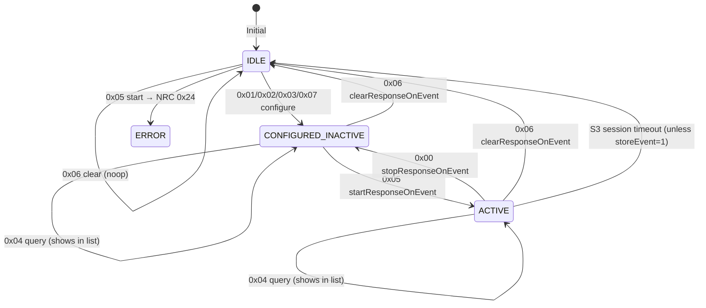
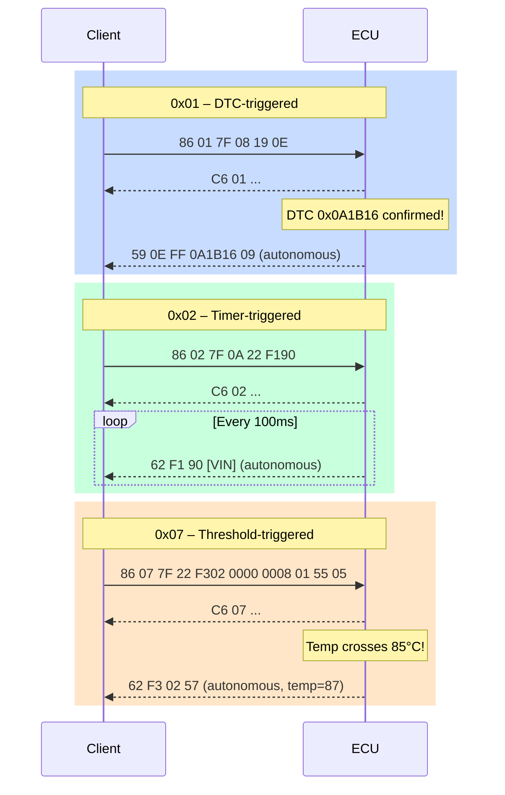

# UDS - SID 0x86: ResponseOnEvent (Part 2)

> Tài liệu này là phần tiếp theo của [SID 0x86 – Part 1](/uds-sid-0x86-p1/). SID `0x86`, RSID `0xC6`, sub-function byte encoding (storeEvent bit 6, suppressPosRsp bit 7), `eventWindowTime`, autonomous response, và NRC phổ biến đã giải thích ở Part 1. Part 2 bao gồm các sub-function còn lại: **`0x01` onDTCStatusChange**, **`0x02` onTimerInterrupt**, **`0x04` reportActivatedEvents**, **`0x07` onComparisonOfValues** (ISO 14229-1:2020).

## Nhắc nhanh — Ký hiệu dùng xuyên suốt

| Ký hiệu | Giá trị |
|---|---|
| SID / RSID | `0x86` / `0xC6` |
| Sub-fn byte structure | `[suppressPosRsp=bit7][storeEvent=bit6][value=bits5-0]` |
| `eventWindowTime 0x7F` | Infinite — phổ biến nhất |
| Autonomous response | Server gửi không cần request khi event fires |
| NRC `0x24` | requestSequenceError — gọi start chưa configure event |

---

## 2. Sub-function 0x01 — onDTCStatusChange

### 2.1 Định nghĩa

**onDTCStatusChange** yêu cầu server **tự động gửi response** mỗi khi **trạng thái của bất kỳ DTC nào thay đổi** theo bitmask chỉ định. Server theo dõi liên tục: khi `(oldDTCStatus XOR newDTCStatus) AND DTCStatusMask ≠ 0x00` → event fires.

Ứng dụng phổ biến:
1. **Real-time DTC monitoring**: Nhận ngay khi DTC mới confirmed — không cần poll `0x19 0x02` định kỳ.
2. **Root cause tracing**: Track thứ tự DTC xuất hiện theo thời gian thực.
3. **Test automation**: Trigger action trong test script khi DTC thay đổi.

### 2.2 Format Request

| Byte | Field | Giá trị | Mô tả |
|---|---|---|---|
| 1 | SID | `0x86` | |
| 2 | Sub-function | `0x01` | onDTCStatusChange |
| 3 | eventWindowTime | `0x01`–`0x7F` | Thời gian hiệu lực |
| 4 | DTCStatusMask | `0x01`–`0xFF` | Bits DTC status cần theo dõi |
| 5 | serviceToRespondTo | Ví dụ `0x19` | Service dùng để gửi autonomous response |
| 6 | subFnOfServiceToRespondTo | Nếu service có sub-fn | Sub-function của service đó |
| 7–N | additionalParams | Tùy theo service | Params bổ sung nếu service cần |

Độ dài: **variable** — phụ thuộc `serviceToRespondTo`.

**Ví dụ kết hợp phổ biến**:

| serviceToRespondTo | subFn | Autonomous response trả về |
|---|---|---|
| `0x19` + `0x02` + `[mask]` | `0x02` | Full DTC list khớp mask |
| `0x19` + `0x0E` | `0x0E` | Most recent confirmed DTC |
| `0x19` + `0x0D` | `0x0D` | Most recent test-failed DTC |

### 2.3 Format Positive Response

| Byte | Field | Mô tả |
|---|---|---|
| 1 | RSID | `0xC6` |
| 2 | Sub-function | `0x01` |
| 3 | eventWindowTime | Echo |
| 4 | numberOfActivatedEvents | Tổng event active |
| 5 | retryEventMaxAllowed | Số lần retry nếu TX lỗi |
| 6 | DTCStatusMask | Echo |
| 7 | serviceToRespondTo | Echo |
| 8–N | Echo của params | |

### 2.4 Format Autonomous Response

Khi bất kỳ DTC nào thay đổi trạng thái theo `DTCStatusMask`, server gửi response của `serviceToRespondTo`.

**Ví dụ** — serviceToRespondTo = `0x19` sub `0x0E`:

```
Autonomous response:
  59 0E  FF  0A 1B 16  09
  ^^     ^^  ^^^^^^^^  ^^
  RSID   AvM DTC       Status
  0x59   FF  DTC vừa   mới confirmed
             thay đổi
```

**Ví dụ** — serviceToRespondTo = `0x19` sub `0x02` với mask `0x08`:

```
Autonomous response:
  59 02  FF  0A 1B 16  09   06 78 9A  08  ...
         AvM DTC list mới   confirmed
```

### 2.5 Điều kiện Positive Response

1. Sub-function `0x01` hỗ trợ.
2. Extended Diagnostic Session.
3. `DTCStatusMask ≠ 0x00`.
4. `serviceToRespondTo` và sub-function của nó hợp lệ.
5. Chưa đạt giới hạn số event tối đa.

### 2.6 Điều kiện Negative Response

| Điều kiện | NRC |
|---|---|
| `0x01` không hỗ trợ | `0x12` |
| Sai length | `0x13` |
| Không phải Extended session | `0x22` |
| `DTCStatusMask = 0x00` | `0x31` |
| `serviceToRespondTo` không hợp lệ / không hỗ trợ | `0x22` |
| Max events đã đạt | `0x22` |

### 2.7 Trường hợp đặc biệt

1. **DTCStatusMask = 0xFF**: Mọi thay đổi bit status đều fire event → bus load rất cao nếu nhiều DTC đang fluctuate. Chỉ dùng trong môi trường test.
2. **Event fires khi DTC cleared**: Nếu `ClearDTC (0x14)` được gửi → tất cả DTC status về `0x00` → nếu mask match → event fires với list rỗng.
3. **storeEvent = 1 (sub-fn byte = 0x41)**: Sau power cycle, event config được restore. Client cần gửi `startResponseOnEvent (0x05)` để re-activate.
4. **Filtering**: `DTCStatusMask` là filter cả hai chiều — confirmed → unconfirmed cũng fires nếu bit 3 trong mask.

### 2.8 Ví dụ

**Positive — Monitor khi bất kỳ DTC nào confirmed:**

```
REQUEST:
  86 01 7F 08 19 0E
  ^^       SID: 0x86
     ^^    Sub-fn: 0x01 (storeEvent=0)
        ^^ eventWindowTime: 0x7F (infinite)
           ^^ DTCStatusMask: 0x08 (confirmed bit)
              ^^ serviceToRespondTo: 0x19
                 ^^ subFn: 0x0E (reportMostRecentConfirmedDTC)

POSITIVE RESPONSE:
  C6 01  7F  01  03  08  19  0E
  ^^     ^^  ^^  ^^  ^^  ^^  ^^
  RSID   eWT #Ev Rty StM SvRsp SubFn
  Sub    7F  1   3   08  0x19  0E
```

**Autonomous response khi DTC 0x0A1B16 mới confirmed:**

```
  59 0E  FF  0A 1B 16  09
             ^^^^^^^^  ^^
             DTC       Status: 0x09 = TF+CDTC
             (tức thì không cần request từ client)
```

**Request với storeEvent = 1:**

```
  86 41 7F 08 19 0E
     ^^
     0x41 = 0b01000001:
     bit6=1 (storeEvent), bits5-0=0x01
```

**Negative — DTCStatusMask = 0x00:**

```
REQUEST:  86 01 7F 00 19 0E
RESPONSE: 7F 86 31   (requestOutOfRange)
```

---

## 3. Sub-function 0x02 — onTimerInterrupt

### 3.1 Định nghĩa

**onTimerInterrupt** yêu cầu server **tự động gửi response định kỳ** theo một khoảng thời gian cố định — không chờ event xảy ra. Đây là cơ chế **polling thụ động**: thay vì client poll, server tự báo cáo theo lịch.

Ứng dụng:
1. **Periodic data logging**: Ghi lại giá trị DID theo thời gian để phân tích trend.
2. **Heartbeat monitoring**: Theo dõi xem ECU còn alive không.
3. **Continuous DTC scan**: Cập nhật DTC list định kỳ mà không tốn bus width cho poll request.

### 3.2 timerRate — Thời gian chu kỳ

Tham số `timerRate` là 1 byte, encoding phụ thuộc implementation (OEM-specific hoặc ECU-specific):

| timerRate encoding | Ví dụ phổ biến | Chu kỳ |
|---|---|---|
| `0x01` | 1 × 10ms = 10ms | Rất nhanh (test only) |
| `0x0A` | 10 × 10ms = 100ms | |
| `0x64` | 100 × 10ms = 1000ms | 1 giây |
| OEM-defined table | Lookup bảng trong ECU | Tùy |

Server báo các giá trị `timerRate` nó hỗ trợ trong positive response (`timerRateHighByte`, `timerRateLowByte`).

### 3.3 Format Request

| Byte | Field | Giá trị | Mô tả |
|---|---|---|---|
| 1 | SID | `0x86` | |
| 2 | Sub-function | `0x02` | onTimerInterrupt |
| 3 | eventWindowTime | `0x01`–`0x7F` | |
| 4 | timerRate | `0x01`–`0xFF` | Chu kỳ (OEM-defined encoding) |
| 5 | serviceToRespondTo | Ví dụ `0x22` | |
| 6–N | params | | Params cho serviceToRespondTo |

Độ dài: **variable**.

**Ví dụ kết hợp phổ biến**:

| serviceToRespondTo + params | Autonomous response |
|---|---|
| `0x22 F1 90` | `62 F1 90 [VIN data]` mỗi timerRate |
| `0x19 0x02 0x08` | `59 02 [DTC list]` mỗi timerRate |
| `0x22 2F 01` | `62 2F 01 [sensor data]` mỗi timerRate |

### 3.4 Format Positive Response

| Byte | Field | Mô tả |
|---|---|---|
| 1 | RSID | `0xC6` |
| 2 | Sub-function | `0x02` |
| 3 | eventWindowTime | Echo |
| 4 | numberOfActivatedEvents | |
| 5 | retryEventMaxAllowed | |
| 6 | timerRate | Echo |
| 7 | serviceToRespondTo | Echo |
| 8–N | Echo params | |

### 3.5 Format Autonomous Response

Mỗi khi timer đến: server gửi response của `serviceToRespondTo`.

**Ví dụ** — serviceToRespondTo = `0x22 F1 90`:

```
Mỗi chu kỳ (ví dụ mỗi 100ms):
  62 F1 90  [VIN 17 bytes]
  ^^  ^^^^^
  RSID DID
```

### 3.6 Điều kiện Positive Response

1. Sub-function `0x02` hỗ trợ.
2. Extended Diagnostic Session.
3. `timerRate` nằm trong danh sách server hỗ trợ.
4. `serviceToRespondTo` hợp lệ.

### 3.7 Điều kiện Negative Response

| Điều kiện | NRC |
|---|---|
| `0x02` không hỗ trợ | `0x12` |
| Sai length | `0x13` |
| Không phải Extended session | `0x22` |
| `timerRate` không được hỗ trợ bởi ECU | `0x31` |
| `serviceToRespondTo` không hợp lệ | `0x22` |

### 3.8 Trường hợp đặc biệt

1. **timerRate quá nhỏ**: Server có thể từ chối (NRC `0x31`) nếu chu kỳ yêu cầu nhỏ hơn minimum supported. Bus load quá cao khi timer ngắn.
2. **eventWindowTime expired**: ECU tự dừng timer. Behavior: timer chỉ tính thời gian hiệu lực của event window — nếu `eventWindowTime = 0x02` (2 giây), server tự stop sau 2 giây.
3. **Combo với onDTCStatusChange**: Không thể configure cả 0x01 và 0x02 cho cùng channel nếu ECU chỉ hỗ trợ 1 ROE event.
4. **Drift và jitter**: Autonomous response bị delay bởi bus load, ECU processing, CanTp segmentation → không đảm bảo real-time. Không dùng cho safety-critical timing.

### 3.9 Ví dụ

**Positive — Cứ 100ms độc DID 0xF190 (VIN):**

```
REQUEST:
  86 02 7F 0A 22 F1 90
  ^^       SID: 0x86
     ^^    Sub-fn: 0x02 (storeEvent=0)
        ^^ eventWindowTime: 0x7F
           ^^ timerRate: 0x0A (10 × 10ms = 100ms, OEM-specific)
              ^^ serviceToRespondTo: 0x22 (ReadDataByIdentifier)
                 ^^^^^ DID: 0xF190

POSITIVE RESPONSE:
  C6 02  7F  01  03  0A  22  F1 90
  ^^     ^^  ^^  ^^  ^^  ^^  ^^^^^
  RSID   eWT #Ev Rty Rate STRT DID
  Sub    7F  1   3   0A   0x22 echo
```

**Autonomous response mỗi 100ms:**

```
t=0ms:   62 F1 90 [17 bytes VIN]
t=100ms: 62 F1 90 [17 bytes VIN]
t=200ms: 62 F1 90 [17 bytes VIN]
...
```

**Negative — timerRate quá nhỏ:**

```
REQUEST:  86 02 7F 01 22 F1 90    (10ms interval)
RESPONSE: 7F 86 31   (timerRate 0x01 không được hỗ trợ)
```

---

## 4. Sub-function 0x04 — reportActivatedEvents

### 4.1 Định nghĩa

**reportActivatedEvents** là sub-function **query** — trả về danh sách tất cả event đang được **configure hoặc active** trên server tại thời điểm request. Không configure event mới, chỉ đọc state.

Ứng dụng:
1. **Audit**: Kiểm tra xem server đang có những event nào configured.
2. **Debug**: Phát hiện event cũ còn sót từ session trước (nếu storeEvent=1).
3. **Tool initialization**: Tool cần biết state trước khi configure thêm event.

### 4.2 Format Request

| Byte | Field | Giá trị | Mô tả |
|---|---|---|---|
| 1 | SID | `0x86` | |
| 2 | Sub-function | `0x04` | reportActivatedEvents |
| 3 | eventWindowTime | `0x01`–`0x7F` | |

Độ dài: **3 byte** (fixed).

### 4.3 Format Positive Response

| Byte | Field | Mô tả |
|---|---|---|
| 1 | RSID | `0xC6` |
| 2 | Sub-function | `0x04` |
| 3 | eventWindowTime | Echo |
| 4 | numberOfActivatedEvents | Số event hiện đang configured |
| 5–N | eventDefinition[0] | Echo toàn bộ nội dung configure request của event 0 |
| ... | eventDefinition[n] | Echo của event n |

**eventDefinition** = toàn bộ bytes từ sub-function byte đến hết params của configure request ban đầu (0x01, 0x02, 0x03, hoặc 0x07).

### 4.4 Điều kiện Positive Response

1. Sub-function `0x04` hỗ trợ.
2. Session hợp lệ.
3. Message length = 3 byte.
4. Positive response kể cả khi `numberOfActivatedEvents = 0x00` (không có event nào).

### 4.5 Điều kiện Negative Response

| Điều kiện | NRC |
|---|---|
| `0x04` không hỗ trợ | `0x12` |
| Length ≠ 3 | `0x13` |
| Sai session | `0x22` |

### 4.6 Trường hợp đặc biệt

1. **numberOfActivatedEvents = 0**: Response `C6 04 [eWT] 00` — không có event configured. Positive response.
2. **eventDefinition echo**: Response chứa bản copy của configure request. Client có thể parse để biết chính xác từng event được cấu hình như thế nào.
3. **Stored events (storeEvent=1)**: Nếu event được stored và đang inactive (after power cycle, before startResponseOnEvent), event vẫn xuất hiện trong response `0x04` — cho biết server biết về nó.
4. **Multiple events**: Mỗi event definition được nối tiếp nhau trong response. Client cần parse từng block dựa trên sub-function của mỗi event để biết độ dài block đó.

### 4.7 Ví dụ

**Positive — 1 event active (onChangeOfDID 0x2001):**

```
REQUEST:
  86 04 7F

POSITIVE RESPONSE:
  C6 04  7F  01  03 7F 22 20 01
  ^^     ^^  ^^  ^^ ^^^^^^^^^^^^^^^^
  RSID   eWT #Ev eventDefinition[0]:
  Sub    7F  1       sub=0x03 eWT=7F STRT=0x22 DID=0x2001
                     (echo của configure request ban đầu)
```

**Positive — 2 events active:**

```
REQUEST:  86 04 7F

POSITIVE RESPONSE:
  C6 04  7F  02
              |── Event 0: 03 7F 08 19 0E
              |   sub=0x03 (onChangeOfDID) eWT=7F STRT=0x19 subFn=0x0E
              |
              └── Event 1: 02 7F 0A 22 F1 90
                  sub=0x02 (onTimerInterrupt) eWT=7F timerRate=0A STRT=0x22 DID=F190
```

**Positive — Không có event:**

```
REQUEST:  86 04 7F
RESPONSE: C6 04 7F 00    (numberOfActivatedEvents = 0)
```

---

## 5. Sub-function 0x07 — onComparisonOfValues

### 5.1 Định nghĩa

**(Mới trong ISO 14229-1:2020)** **onComparisonOfValues** là sub-function mạnh nhất của ROE: event fires khi **giá trị của một field trong DID thỏa một điều kiện so sánh** (>, <, ==, !=, >=, <=). Server liên tục đọc DID và evaluate điều kiện.

> So sánh với `0x03` (onChangeOfDataIdentifier):
> - `0x03`: Event fires khi **bất kỳ thay đổi nào** trong DID.
> - `0x07`: Event fires chỉ khi **giá trị vượt ngưỡng cụ thể** — precision control hoàn toàn.

Ứng dụng:
1. **Threshold monitoring**: Nhận alert khi nhiệt độ ECU > 90°C.
2. **Condition-based logging**: Ghi lại khi RPM > 5000.
3. **Safety monitoring**: Detect khi voltage < 9V.
4. **Counter trigger**: Báo khi error counter vượt ngưỡng.

### 5.2 Comparison Parameters

| Field | Mô tả |
|---|---|
| `dataIdentifier` (2B) | DID chứa dữ liệu cần so sánh |
| `dataOffset` (2B) | **Bit offset** bắt đầu của value trong DID data |
| `monitoredValueLength` (2B) | **Bit length** của giá trị cần so sánh |
| `dataComparisonType` (1B) | Phép so sánh (xem bảng bên dưới) |
| `referenceValue` (variable) | Ngưỡng so sánh; length = ⌈monitoredValueLength/8⌉ |
| `hysteresis` (variable) | Vùng đệm cho `>` và `<`; cùng length với referenceValue |

**dataComparisonType values:**

| Value | Phép so sánh | Event fires khi |
|---|---|---|
| `0x01` | Greater Than | `value > referenceValue` (và value > referenceValue + hysteresis) |
| `0x02` | Less Than | `value < referenceValue` (và value < referenceValue - hysteresis) |
| `0x03` | Equal | `value == referenceValue` |
| `0x04` | Not Equal | `value != referenceValue` |
| `0x05` | Greater Than or Equal | `value >= referenceValue` |
| `0x06` | Less Than or Equal | `value <= referenceValue` |

**Hysteresis**: Chỉ dùng với `0x01` (Greater Than) và `0x02` (Less Than) để tránh rapid oscillation:
- Với `>`: Event fires khi value vượt qua `referenceValue` từ dưới lên. Để re-arm, value phải giảm về `referenceValue - hysteresis`.
- Với `<`: Event fires khi value xuống dưới `referenceValue`. Để re-arm, value phải tăng lên `referenceValue + hysteresis`.

```
  Hysteresis diagram (comparisonType = 0x01 Greater Than):

  Value
  ^
  |                  ┌──────────
  | Ref+Hyst ─ ─ ─ ─|─ ─ ─ ─ ─ ─ ─ (re-arm: value drops below this)
  |                /
  | Ref ─ ─ ─ ─ ─/─ ─ ─ ─ ─ ─ ─ ─ ─ (fire: value crosses this going up)
  |              /
  |─────────────/────────────────> Time
                ^
                Event fires here
```

### 5.3 Format Request

| Byte | Field | Giá trị | Mô tả |
|---|---|---|---|
| 1 | SID | `0x86` | |
| 2 | Sub-function | `0x07` | onComparisonOfValues |
| 3 | eventWindowTime | `0x01`–`0x7F` | |
| 4 | serviceToRespondTo | Ví dụ `0x22` | |
| 5–6 | dataIdentifier | 2-byte DID | DID chứa value cần monitor |
| 7–8 | dataOffset | 2-byte big-endian | Bit offset trong DID data |
| 9–10 | monitoredValueLength | 2-byte big-endian | Bit length của value |
| 11 | dataComparisonType | `0x01`–`0x06` | Phép so sánh |
| 12–(11+N) | referenceValue | N byte = ⌈bitLen/8⌉ | Ngưỡng |
| … | hysteresis | N byte | Vùng đệm (chỉ cho `0x01`, `0x02`) |

Nếu `serviceToRespondTo` có sub-function và params riêng, chúng được thêm vào **sau** comparison parameters.

Độ dài: **variable**.

### 5.4 Format Positive Response

| Byte | Field | Mô tả |
|---|---|---|
| 1 | RSID | `0xC6` |
| 2 | Sub-function | `0x07` |
| 3 | eventWindowTime | Echo |
| 4 | numberOfActivatedEvents | |
| 5 | retryEventMaxAllowed | |
| 6 | serviceToRespondTo | Echo |
| 7–N | Echo của comparison params | |

### 5.5 Format Autonomous Response

Khi comparison condition trở thành TRUE:

Server gửi response của `serviceToRespondTo`. Ví dụ với `0x22 [DID]`:

```
62 [DID Hi] [DID Lo] [data bytes của DID đó]
```

### 5.6 Điều kiện Positive Response

1. Sub-function `0x07` hỗ trợ (ISO 14229-1:2020 — ECU cũ có thể không support).
2. Extended Diagnostic Session.
3. `dataIdentifier` tồn tại và readable.
4. `dataOffset + monitoredValueLength` ≤ total bit length của DID data.
5. `dataComparisonType` ∈ [`0x01`, `0x06`].
6. `referenceValue` length = ⌈`monitoredValueLength`/8⌉.

### 5.7 Điều kiện Negative Response

| Điều kiện | NRC |
|---|---|
| `0x07` không hỗ trợ (ECU cũ / non-2020) | `0x12` |
| Sai length | `0x13` |
| Không phải Extended session | `0x22` |
| `dataIdentifier` không tồn tại | `0x31` |
| `dataOffset` + `monitoredValueLength` vượt quá DID data size | `0x31` |
| `dataComparisonType` = `0x00` hoặc > `0x06` | `0x31` |
| Max events đạt giới hạn | `0x22` |

### 5.8 Trường hợp đặc biệt

1. **Initial check**: Sau khi configure `0x07`, nếu điều kiện đã TRUE ngay từ đầu → server fire autonomous response **ngay lập tức**.
2. **One-shot vs continuous**: Sau khi fire, event **re-arm** sau khi condition trở về FALSE (+ hysteresis). Nếu condition vẫn TRUE → không fire lại cho đến khi re-armed.
3. **dataOffset = 0x0000 và monitoredValueLength = toàn bộ DID**: Bằng cách so sánh toàn bộ DID value — giống như `0x03` onChangeOfDataIdentifier nhưng có ngưỡng.
4. **Floating point**: ISO 14229-1:2020 không define encoding số thực — monitoredValue được so sánh bit-by-bit. Nếu DID trả floating point, cần biết encoding (IEEE 754) và dùng `dataOffset`/`monitoredValueLength` đúng field.
5. **Hysteresis cho `==` và `!=`**: Không có ý nghĩa — nếu truyền hysteresis với type `0x03`/`0x04`, server ignore hoặc báo `0x31`.

### 5.9 Ví dụ

**Context**: DID `0xF302` chứa ECU temperature, 1 byte unsigned, at offset 0 (bit 0), length 8 bits. Muốn alert khi temperature > 85 (0x55) với hysteresis 5 (0x05).

**Positive — Temperature > 85°C, autonomous response là DID data:**

```
REQUEST:
  86 07 7F 22 F3 02  00 00  00 08  01  55  05
  ^^       SID: 0x86
     ^^    Sub-fn: 0x07 (storeEvent=0)
        ^^ eventWindowTime: 0x7F
           ^^ serviceToRespondTo: 0x22 (RDBI)
              ^^^^^ dataIdentifier: 0xF302
                    ^^^^^ dataOffset: 0x0000 (bit 0)
                          ^^^^^ monitoredValueLength: 0x0008 (8 bits)
                                ^^ comparisonType: 0x01 (Greater Than)
                                   ^^ referenceValue: 0x55 = 85
                                      ^^ hysteresis: 0x05

POSITIVE RESPONSE:
  C6 07  7F  01  03  22  F3 02  00 00  00 08  01  55  05
  ^^     ^^  ^^  ^^  ^^  ...  (echo toàn bộ params)
  RSID   eWT #Ev Rty STRT
```

**Autonomous response khi temperature đọc được = 87°C (0x57 > 0x55):**

```
  62 F3 02  57
  ^^  ^^^^^  ^^
  RSID DID   Temperature = 87°C
```

**Re-arm**: Temperature phải giảm về ≤ 80 (85 - 5 hysteresis = 80) trước khi event có thể fire lần nữa.

---

**Ví dụ 2 — Voltage < 9V (DID 0x2201, 2 bytes, uint16, unit 0.1V):**

```
9V = 90 = 0x005A (trong unit 0.1V)
Hysteresis: 5 = 0x0005 (0.5V)
dataOffset: 0 (bit 0), monitoredValueLength: 16 bits

REQUEST:
  86 07 7F 22 22 01  00 00  00 10  02  00 5A  00 05
                                   ^^  ^^^^^  ^^^^^
                                   LT  ref=9V hyst=0.5V
```

**Negative — DID không tồn tại:**

```
REQUEST:  86 07 7F 22 FF FF 00 00 00 08 03 55 00
RESPONSE: 7F 86 31   (DID 0xFFFF không tồn tại)
```

---

## 6. Tóm tắt toàn bộ SID 0x86

### 6.1 Bảng đầy đủ sub-function

| Sub-fn | Tên | Params chính | Điều kiện tiên quyết |
|---|---|---|---|
| `0x00`★ | stopResponseOnEvent | eventWindowTime | — |
| `0x01` | onDTCStatusChange | eWT + DTCStatusMask + STRT + params | Extended session |
| `0x02` | onTimerInterrupt | eWT + timerRate + STRT + params | Extended session |
| `0x03`★ | onChangeOfDataIdentifier | eWT + STRT + DID | Extended session |
| `0x04` | reportActivatedEvents | eventWindowTime | — |
| `0x05`★ | startResponseOnEvent | eventWindowTime | Event đã configured |
| `0x06`★ | clearResponseOnEvent | eventWindowTime | — |
| `0x07` | onComparisonOfValues (ISO 2020) | eWT + STRT + DID + offset + len + compType + ref + hyst | Extended session |

★ = Được trình bày chi tiết trong [Part 1](/uds-sid-0x86-p1/)

### 6.2 So sánh event types

| | Event trigger | Bus load | Precision | Complexity |
|---|---|---|---|---|
| `0x01` onDTCStatusChange | DTC status changed | Low | Bit-level | Medium |
| `0x02` onTimerInterrupt | Timer periodic | High (continuous) | Time-based | Low |
| `0x03` onChangeOfDataIdentifier | DID value changed | Low–Medium | Any change | Low |
| `0x07` onComparisonOfValues | Threshold crossed | Low | Exact threshold | High |

### 6.3 State machine đầy đủ (all sub-functions)



### 6.4 Workflow so sánh 3 event types phổ biến


