# DEM – Diagnostic Trouble Code (DTC) Definition

> Tài liệu này mô tả chi tiết phần **7.4 – Diagnostic Trouble Code Definition** trong đặc tả AUTOSAR DEM, bao gồm định nghĩa, các định dạng chuẩn công nghiệp, phân nhóm, mức độ nghiêm trọng, ý nghĩa kỹ thuật và cơ chế kiểm soát hiển thị DTC. Mỗi khái niệm được giải thích kèm ví dụ liên tưởng thực tế và minh họa bằng sơ đồ Mermaid hoặc code.

---

## 7.4 Diagnostic Trouble Code (DTC) Definition

**DTC (Diagnostic Trouble Code)** là mã số chuẩn hóa được DEM gán cho một lỗi chẩn đoán muốn truyền ra ngoài cho tester. DTC là **ngôn ngữ chung** giữa ECU và công cụ chẩn đoán, giúp kỹ sư workshop hoặc tester tool biết chính xác loại lỗi nào đang tồn tại trong hệ thống.

**Liên tưởng**:

> Nếu event là bản ghi lỗi nội bộ của ECU (ví dụ: "cảm biến nhiệt độ nước làm mát vượt ngưỡng tại timestamp 0x3A40"), thì DTC là mã hiển thị chuẩn hóa mà kỹ sư garage nhìn thấy trên màn hình diagnostic tool (ví dụ: `P0115 – Engine Coolant Temperature Sensor A Circuit`).

Một event trong DEM **không nhất thiết phải có DTC**. Tuy nhiên khi một event được ánh xạ tới DTC, DEM có trách nhiệm quản lý toàn bộ vòng đời của DTC đó theo các tham số cấu hình.

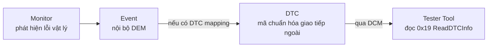

---

## 7.4.1 DTC Kind

AUTOSAR DEM phân biệt hai loại DTC chính:

| Loại DTC | Mô tả | Ví dụ |
|---|---|---|
| **Contract-based DTC** (hay còn gọi là emission-related) | DTC liên quan đến lỗi ảnh hưởng emission hoặc OBD, bị kiểm soát chặt theo chuẩn. | Cảm biến O2, EGR, EVAP |
| **Non-emission DTC** | DTC cho bất kỳ lỗi chức năng nào không phải emission-related. | Lỗi CAN timeout, actuator fault, power supply |

Trong AUTOSAR, DTC kind ảnh hưởng đến:

1. Cách DTC xuất hiện trong response của service `0x19`.
2. Chính sách aging và clearing.
3. Quy tắc set `confirmedDTC` và `pendingDTC`.

Liên tưởng thực tế:

> DTC kind giống như phân loại hồ sơ y tế: một số bệnh phải khai báo theo quy định nhà nước (emission-related), còn một số chỉ cần ghi chú nội bộ phòng khám (non-emission). Quy trình xử lý hai loại này khác nhau.

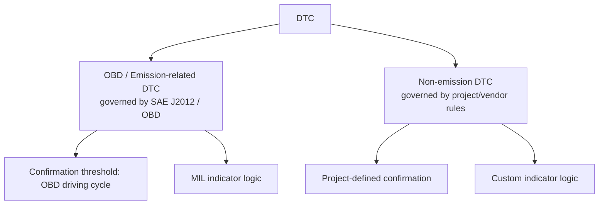

---

## 7.4.2 DTC Format

DTC format xác định cách mã DTC được biểu diễn dưới dạng số byte và cấu trúc bit. Có **5 định dạng** chính được hỗ trợ trong AUTOSAR DEM, mỗi định dạng tuân theo một tiêu chuẩn cụ thể.

### Tổng quan 5 định dạng

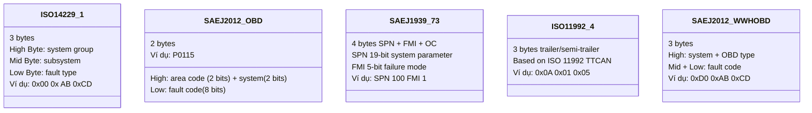

---

### Định dạng 1: ISO-14229-1 (UDS Standard DTC)

**Kích thước**: 3 byte (24 bit)

**Cấu trúc**:

```
Byte 1 (High)   Byte 2 (Mid)   Byte 3 (Low)
[  Group/Area  ][  Subsystem  ][  Fault code  ]
```

**Ý nghĩa từng byte**:

| Byte | Tên | Ý nghĩa |
|---|---|---|
| Byte 1 | High Byte | Xác định hệ thống nguồn gốc lỗi |
| Byte 2 | Mid Byte | Xác định subsystem hoặc component |
| Byte 3 | Low Byte | Mã lỗi cụ thể (failure type) |

**Ví dụ thực tế**:

```
DTC: 0xD00100

Byte 1: 0xD0 → Powertrain / emission-related area
Byte 2: 0x01 → Engine temperature subsystem
Byte 3: 0x00 → General fault

→ Tương đương nghĩa: Lỗi hệ thống nhiệt độ động cơ (generalized)
```

**Code minh họa cách DEM trả DTC theo định dạng này qua DCM**:

```c
/* DEM trả DTC 3 byte khi DCM gọi ReadDTCInformation (0x19 sub 0x02) */
Dem_ReturnGetNextFilteredDTCType result;
uint32 dtcValue;
Dem_UdsStatusByteType statusByte;

result = Dem_DcmGetNextFilteredDTC(&dtcValue, &statusByte);
if (result == DEM_FILTERED_OK) {
    /* dtcValue chứa 3-byte DTC theo ISO-14229 format */
    /* Ví dụ: dtcValue = 0x00D00100 */
    uint8 high = (dtcValue >> 16) & 0xFF; /* 0xD0 */
    uint8 mid  = (dtcValue >>  8) & 0xFF; /* 0x01 */
    uint8 low  =  dtcValue        & 0xFF; /* 0x00 */
}
```

---

### Định dạng 2: SAE J2012 OBD DTC (2-byte DTC)

**Kích thước**: 2 byte → thường hiển thị dạng chữ-số như `P0115`

**Cấu trúc**:

```
Byte 1                              Byte 2
[ b7 b6 | b5 b4 | b3 b2 b1 b0 ]   [ 8 bit fault code ]
  Area    System   Sub-area
```

**Prefix letter mapping**:

| Bit 7-6 | Prefix | Hệ thống |
|---|---|---|
| 00 | P | Powertrain |
| 01 | C | Chassis |
| 10 | B | Body |
| 11 | U | Network / Communication |

**Ví dụ chi tiết**:

```
DTC: P0115 → Engine Coolant Temperature Sensor A

Encode nhị phân:
Byte 1: 0x01
  b7-b6 = 00 → P (Powertrain)
  b5-b4 = 01 → 1 (Engine combustion/fuel/air)
  b3-b0 = 0001 → sub-code 1

Byte 2: 0x15 = 21 decimal
  → Fault code 15

Full code: P + 0 + 1 + 15 = P0115
```

```
DTC: C0035 → Wheel Speed Sensor Front Left

Byte 1: 0x40
  b7-b6 = 01 → C (Chassis)
  b5-b4 = 00 → 0
  b3-b0 = 0000 → 0

Byte 2: 0x35
  → fault code 35

Full code: C + 0 + 0 + 35 = C0035
```

```
DTC: B0001 → Restraint System

Byte 1: 0x80
  b7-b6 = 10 → B (Body)
  ...

Byte 2: 0x01
Full code: B0001
```

```
DTC: U0100 → Lost Communication with ECM/PCM

Byte 1: 0xC0
  b7-b6 = 11 → U (Network)
  ...

Byte 2: 0x00
Full code: U0100
```

---

### Định dạng 3: SAE J1939-73 (Heavy-Duty Vehicle DTC)

**Kích thước**: logical gồm SPN (19 bit) + FMI (5 bit) + Occurrence Count (7 bit)

> SAE J1939 dùng cho xe tải nặng, xe bus, máy nông nghiệp. DTC không đơn thuần là "mã lỗi" mà là tổ hợp **Suspect Parameter Number + Failure Mode Identifier**.

**Cấu trúc**:

```
[ SPN 19 bits ][ FMI 5 bits ][ OC 7 bits ][ CM 1 bit ]
SPN: Suspect Parameter Number - định danh thông số hệ thống
FMI: Failure Mode Identifier  - loại hỏng hóc
OC:  Occurrence Counter        - số lần xuất hiện
CM:  Conversion Method bit
```

**FMI có ý nghĩa cố định theo chuẩn**:

| FMI | Ý nghĩa |
|---|---|
| 0 | Data valid but above normal operational range (high) |
| 1 | Data valid but below normal operational range (low) |
| 2 | Data erratic, intermittent, or incorrect |
| 3 | Voltage above normal / shorted high |
| 4 | Voltage below normal / shorted low |
| 5 | Current below normal / open circuit |
| 6 | Current above normal / grounded circuit |
| 7 | Mechanical system not responding or out of adjustment |
| 8 | Abnormal frequency or pulse width |
| 12 | Bad intelligent device or component |
| 19 | Received network data in error |

**Ví dụ**:

```
J1939 DTC: SPN 100, FMI 1

SPN 100 = Engine Oil Pressure
FMI 1   = Below normal range

→ Nghĩa: Áp suất dầu động cơ thấp hơn ngưỡng cho phép

Encoding (4 bytes):
Byte 0-1 + bit: SPN = 100 = 0x000064
  Byte 3: bit7 = CM, bit 6..0 = OC (ví dụ OC=3, CM=0)
  Byte 2: SPN[7..0] = 0x64
  Byte 1: SPN[15..8] = 0x00
  Byte 0: SPN[18..16]=000, FMI[4..0] = 00001 → 0x01
```

```c
/* J1939 DTC structure */
typedef struct {
    uint32_t spn : 19;  /* Suspect Parameter Number */
    uint8_t  fmi : 5;   /* Failure Mode Identifier  */
    uint8_t  oc  : 7;   /* Occurrence Counter       */
    uint8_t  cm  : 1;   /* Conversion Method        */
} J1939_DTC_t;

J1939_DTC_t dtc = {
    .spn = 100,   /* Oil Pressure sensor */
    .fmi = 1,     /* Below normal        */
    .oc  = 3,     /* Occurred 3 times    */
    .cm  = 0
};
```

---

### Định dạng 4: ISO 11992-4 (Trailer / Semi-trailer DTC)

**Kích thước**: 3 byte

> ISO 11992 định nghĩa giao tiếp giữa xe kéo và rơ-moóc/bán rơ-moóc. DTC theo định dạng này được thiết kế cho hệ thống phanh (EBS), đèn, khí nén, và các hệ thống trailer đặc thù.

**Cấu trúc**:

```
Byte 1: System identification (ví dụ: braking system, lighting)
Byte 2: Component / function code
Byte 3: Failure mode
```

**Ví dụ**:

```
DTC: 0x0A 0x01 0x05

Byte 1: 0x0A → EBS (Electronic Braking System) trailer
Byte 2: 0x01 → Wheel speed sensor front axle
Byte 3: 0x05 → Signal implausible / erratic

→ Nghĩa: Tín hiệu cảm biến tốc độ bánh trước rơ-moóc không hợp lệ

DTC khác:
0x04 0x03 0x01 → Trailer lighting, left rear lamp, open circuit
0x08 0x02 0x03 → Air suspension, rear bellows, pressure low
```

> Đặc điểm nổi bật: DTC ISO 11992-4 rất domain-specific, chỉ xuất hiện trong hệ thống xe tải liên kết trailer. Không phổ biến trong ECU xe con.

---

### Định dạng 5: SAE J2012 WWH-OBD DTC (3-byte DTC)

**Kích thước**: 3 byte

> WWH-OBD (World Wide Harmonized OBD) là chuẩn OBD nâng cao cho xe thương mại và xe tải nặng toàn cầu (EC Regulation). Đây là format mở rộng của OBD 2-byte DTC, bổ sung thêm byte thứ 3 cho độ chi tiết cao hơn và tích hợp severity level.

**Cấu trúc**:

```
Byte 1 (High)   Byte 2 (Mid)   Byte 3 (Low / Extension)
[  System/OBD  ][  Main code  ][  Sub-code / extension  ]
```

**So sánh 2-byte OBD vs 3-byte WWH-OBD**:

```
2-byte OBD:   P0115          → Engine Coolant Temp Sensor A
3-byte WWH:   0x00 0x01 0x15 → Cùng lỗi nhưng với byte thứ 3
                                chứa thêm context như:
                                - circuit type (voltage/current)
                                - severity hint
                                - OBD monitor type
```

**Ví dụ chi tiết**:

```
DTC 3-byte WWH: 0xD0 0x01 0x15

Byte 1: 0xD0
  → High nibble 0xD: Powertrain emission-related (WWH-OBD domain)
  → Low nibble  0x0: sub-area 0

Byte 2: 0x01
  → Main system: engine/emission subsystem 1

Byte 3: 0x15
  → Fault detail: 0x15 = sensor A circuit

→ Nghĩa: Engine emission sensor circuit fault với đầy đủ sub-classification
```

```
DTC 3-byte WWH: 0xC1 0x03 0x08

Byte 1: 0xC1 → WWH-OBD chassis domain
Byte 2: 0x03 → Brake control subsystem
Byte 3: 0x08 → Abnormal frequency/signal

→ Nghĩa: Tín hiệu bất thường từ subsystem phanh (ABS/EBS)
```

### Bảng tổng hợp 5 định dạng

| Format | Size | Chuẩn | Dùng cho | Ví dụ |
|---|---|---|---|---|
| ISO-14229-1 | 3 bytes | UDS | Mọi loại ECU, UDS diagnostics | `0xD00100` |
| SAE J2012 OBD | 2 bytes | OBD-II | Xe con, emission control | `P0115` |
| SAE J1939-73 | SPN+FMI | J1939 | Xe tải nặng, nông nghiệp | `SPN100 FMI1` |
| ISO 11992-4 | 3 bytes | ISO 11992 | Trailer, rơ-moóc | `0x0A 0x01 0x05` |
| SAE J2012 WWH-OBD | 3 bytes | WWH-OBD | Xe thương mại EU/global | `0xD0 0x01 0x15` |

---

## 7.4.3 DTC Groups

DTC group là cơ chế phân nhóm logic cho phép tester gửi một lệnh ảnh hưởng đến nhiều DTC cùng lúc mà không cần liệt kê từng mã.

**Ứng dụng điển hình**:

1. `0x14 ClearDiagnosticInformation` với group `0xFFFFFF` → xóa tất cả DTC.
2. `0x19 ReadDTCByStatusMask` với group `0x000000` → đọc tất cả.
3. Xóa chỉ DTC thuộc Powertrain: dùng group `0x000000` kết hợp mask lọc.

**Các group định nghĩa sẵn theo ISO-14229**:

| Group Value | Tên nhóm | Mô tả |
|---|---|---|
| `0xFFFFFF` | All DTCs | Tất cả DTC không phân biệt |
| `0x000000` | Emission-related | DTC liên quan emission |
| `0xFFFF33` | Powertrain | DTC thuộc hệ thống truyền động |
| `0xFFFF00` | Chassis | DTC thuộc khung gầm |
| `0xFF0000` | Body | DTC thuộc thân xe |
| `0xFFFF55` | Network | DTC liên quan communication |

Ngoài các nhóm chuẩn, AUTOSAR DEM hỗ trợ **vendor-defined groups** cho phép dự án tự định nghĩa phân nhóm:

```xml
<!-- Ví dụ cấu hình DEM group trong ARXML -->
<DEM-GROUP>
  <SHORT-NAME>DemDTCGroup_Powertrain</SHORT-NAME>
  <DTC-GROUP-VALUE>0xFFFF33</DTC-GROUP-VALUE>
</DEM-GROUP>
```

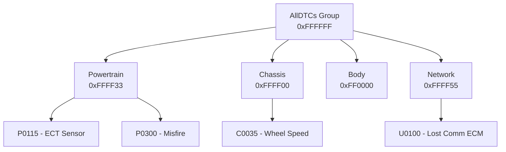

**Luồng khi tester clear theo group**:

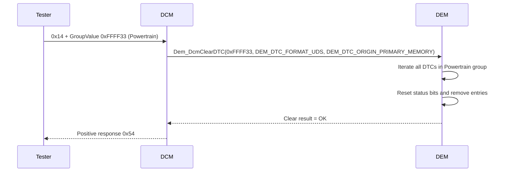

---

## 7.4.4 DTC Severity

DTC severity là thuộc tính mô tả **mức độ nghiêm trọng** của lỗi, ảnh hưởng đến quyết định dừng xe, kiểm tra ngay hay chỉ cần lưu ý.

**Các mức severity theo ISO-14229**:

| Bit mask | Tên | Ý nghĩa |
|---|---|---|
| `0x20` | `maintenanceOnly` | Lỗi chỉ cần kiểm tra bảo dưỡng định kỳ |
| `0x40` | `checkAtNextHalt` | Kiểm tra tại điểm dừng tiếp theo |
| `0x60` | `checkImmediately` | Dừng xe kiểm tra ngay lập tức |

> Severity `0x00` nghĩa là không có thông tin severity. Severity chỉ mang giá trị khi DTC đã có cờ `confirmedDTC`.

**Liên tưởng thực tế**:

> Như đèn cảnh báo trên bảng điều khiển ô tô:
> - `maintenanceOnly` = đèn "service" vàng mờ → kiểm tra khi đến garage định kỳ
> - `checkAtNextHalt` = đèn cam → ghé cây xăng hoặc bãi đỗ gần nhất
> - `checkImmediately` = đèn đỏ đèn chớp = dừng xe ngay, có thể nguy hiểm

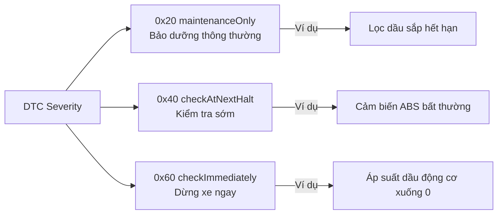

**Cấu hình severity trong DEM**:

```xml
<DEM-DTC-ATTRIBUTES>
  <DTC-SEVERITY>DEM_SEVERITY_CHECK_IMMEDIATELY</DTC-SEVERITY>
</DEM-DTC-ATTRIBUTES>
```

**Service 0x19 sub 0x08** cho phép tester lọc DTC theo severity mask:

```
Request:  19 08 60     → lấy DTC có severity = checkImmediately
Response: 59 08 60 [DTC1 status] [DTC2 status] ...
```

---

## 7.4.5 Functional Unit

Functional unit là thuộc tính phân nhóm DTC theo **đơn vị chức năng hệ thống** – ví dụ theo cụm linh kiện, node mạng, hay hệ thống con vật lý trong xe.

**Mục đích sử dụng**:

1. Cho phép tester lọc DTC theo tính năng hoặc khu vực vật lý.
2. Hỗ trợ chẩn đoán hướng hệ thống thay vì hướng từng mã lỗi riêng lẻ.
3. Cho phép phân loại phụ ngoài hệ thống group chuẩn.

**Ví dụ phân nhóm theo functional unit**:

| Functional Unit | DTC thuộc về | Mô tả |
|---|---|---|
| 0x01 | P0115, P0116, P0117 | Engine temperature management |
| 0x02 | C0035, C0036, C0040 | Wheel speed sensing cluster |
| 0x03 | U0100, U0101 | CAN bus loss group |

**Liên tưởng**:

> Functional unit giống như phân khu nhà máy: mặc dù tất cả đều thuộc "[Powertrain]", nhưng kỹ sư muốn xem riêng "khu vực cảm biến nhiệt độ" hay "khu vực đánh lửa" là những functional unit khác nhau.

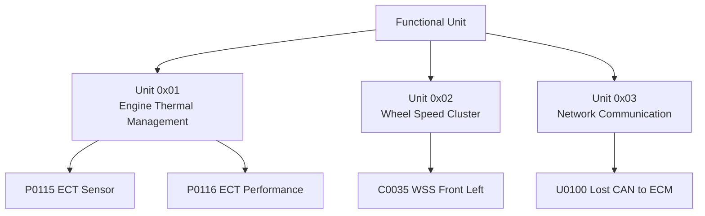

---

## 7.4.6 DTC Significance

DTC significance định nghĩa **ý nghĩa phân loại của lỗi** – cụ thể là liệu lỗi đang phản ánh một **fault thực sự đang tồn tại** hay chỉ là **ghi nhận một lần xuất hiện trong lịch sử**.

AUTOSAR DEM định nghĩa hai mức significance:

| Giá trị | Tên | Ý nghĩa |
|---|---|---|
| `DEM_EVENT_SIGNIFICANCE_FAULT` | Fault | Lỗi này phản ánh sự cố thực sự trong hệ thống, cần quan tâm chẩn đoán nghiêm túc |
| `DEM_EVENT_SIGNIFICANCE_OCCURRENCE` | Occurrence | Chỉ ghi nhận rằng sự kiện đã xảy ra, không nhất thiết là lỗi đang hiện diện |

### 7.4.6.1 DTC Significance = FAULT

Đây là loại phổ biến nhất. DTC significance FAULT đồng nghĩa với:

1. DTC được set khi monitor xác nhận lỗi thực sự tồn tại.
2. DTC có vòng đời đầy đủ: pending → confirmed → aging → cleared.
3. DTC tác động đến indicator, FiM inhibition, BswM mode change.
4. DTC cần được persist qua key-off/key-on.

**Ví dụ thực tế**:

```
Cảm biến oxy (O2 sensor) không phản hồi trong 500ms
→ Monitor gửi FAILED
→ DEM debounce → DTC P0130 xuất hiện
→ Significance = FAULT
→ MIL indicator bật, dữ liệu freeze frame được chụp
→ DTC tồn tại cho đến khi aging hoặc clear bởi tester
```

### 7.4.6.2 DTC Significance = OCCURRENCE

DTC significance OCCURRENCE thường dùng cho:

1. Sự kiện chỉ cần đếm số lần xảy ra, không cần phân tích nguyên nhân.
2. Transient events không nhất thiết đồng nghĩa hỏng hoàn toàn.
3. Calibration/manufacturing events.
4. Thống kê sử dụng của hệ thống.

**Ví dụ thực tế**:

```
Sự kiện: "ECU nhận gói CAN bị CRC error lần đầu tiên trong key cycle này"
→ Không phải lỗi hardware nghiêm trọng, chỉ cần ghi nhận
→ DTC Significance = OCCURRENCE
→ DTC không kéo theo indicator
→ DTC không block FiM
→ Dữ liệu hữu ích cho phân tích field noise sau bán hàng
```

**So sánh FAULT vs OCCURRENCE**:

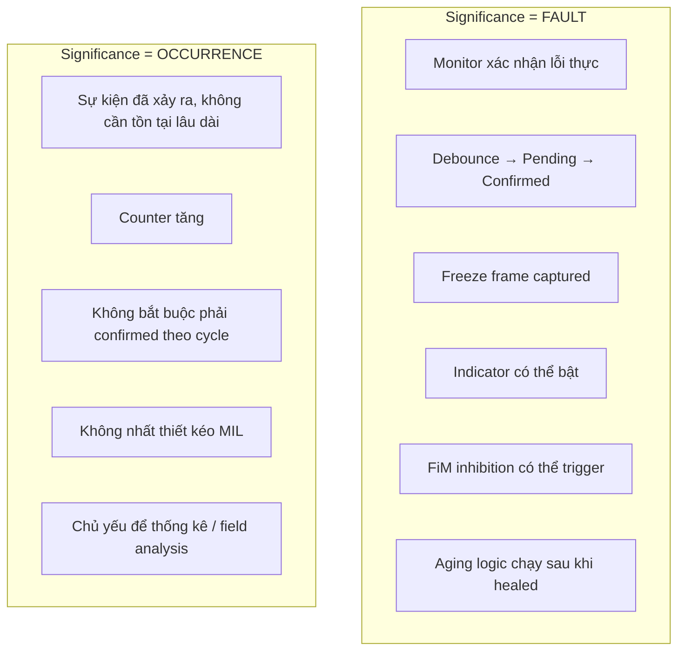

**Liên tưởng**:

> FAULT giống như bệnh nhân đang bị bệnh và đang điều trị – cần theo dõi, ghi vào hồ sơ bệnh án, điều trị tới khi khỏi.
>
> OCCURRENCE giống như ghi nhận "bệnh nhân từng bị cảm lạnh một lần tháng 3" – không cần can thiệp, chỉ cần lưu vào hồ sơ lịch sử để tham khảo.

```c
/* AUTOSAR configuration của DTC significance */
/* Trong DEM configuration container DemDTCAttributes */

/* Ví dụ FAULT significance */
DemDTCAttributes_OxygenSensorFault {
    DemDTCSignificance = DEM_EVENT_SIGNIFICANCE_FAULT;
    DemDTCSeverity     = DEM_SEVERITY_CHECK_AT_NEXT_HALT;
    /* Freeze frame, extended data sẽ được capture */
}

/* Ví dụ OCCURRENCE significance */
DemDTCAttributes_CANErrorOccurrence {
    DemDTCSignificance = DEM_EVENT_SIGNIFICANCE_OCCURRENCE;
    DemDTCSeverity     = DEM_SEVERITY_NO_SEVERITY;
    /* Chỉ tăng counter, không capture freeze frame */
}
```

---

## 7.4.7 Suppress DTC Output

DTC suppression là cơ chế cho phép DEM **ẩn một DTC khỏi kết quả phản hồi chẩn đoán** (`0x19`, `0x14`) trong khi vẫn đang quản lý nó nội bộ.

**Khi nào cần suppress**:

1. Trong quá trình manufacturing hoặc end-of-line test – không muốn gây nhầm lẫn.
2. ECU ở chế độ workshop đặc biệt không muốn DTC nhất định hiển thị.
3. DTC liên quan đến feature chưa được kích hoạt trong project này.
4. DTC của component không có mặt trong cấu hình xe cụ thể.

**Luồng suppress**:

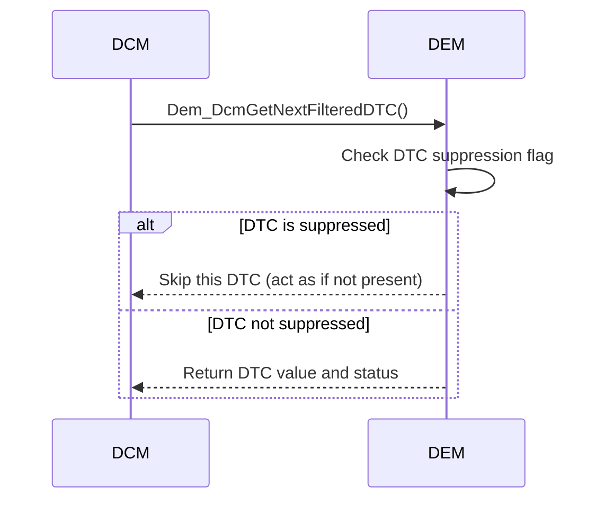

**API kiểm soát suppression** (AUTOSAR):

```c
/* Set suppression: ẩn DTC khỏi response */
Dem_ReturnType ret = Dem_SetDTCSuppression(
    0xD00100,                    /* DTC value       */
    DEM_DTC_FORMAT_UDS,
    TRUE                         /* suppress = TRUE */
);

/* Clear suppression: cho phép DTC hiển thị lại */
ret = Dem_SetDTCSuppression(
    0xD00100,
    DEM_DTC_FORMAT_UDS,
    FALSE                        /* suppress = FALSE */
);
```

**Điều quan trọng**:

1. Suppression không xóa DTC khỏi event memory – DTC vẫn tồn tại nội bộ.
2. Suppression chỉ ảnh hưởng đến **output visibility** khi tester query.
3. DEM vẫn tiếp tục xử lý event, debounce, aging như bình thường.
4. Một số implementation restrict: DTC đang có `testFailed` có thể không cho suppress.

---

## 7.4.8 Availability of Events (Visibility and Computation)

Availability kiểm soát liệu một event/DTC có **được phép hoạt động** hay không ở cả hai khía cạnh:

1. **Computation availability**: DEM có xử lý báo cáo từ monitor cho event này không?
2. **Visibility availability**: DTC này có hiển thị với tester không?

**Hai chiều availability**:

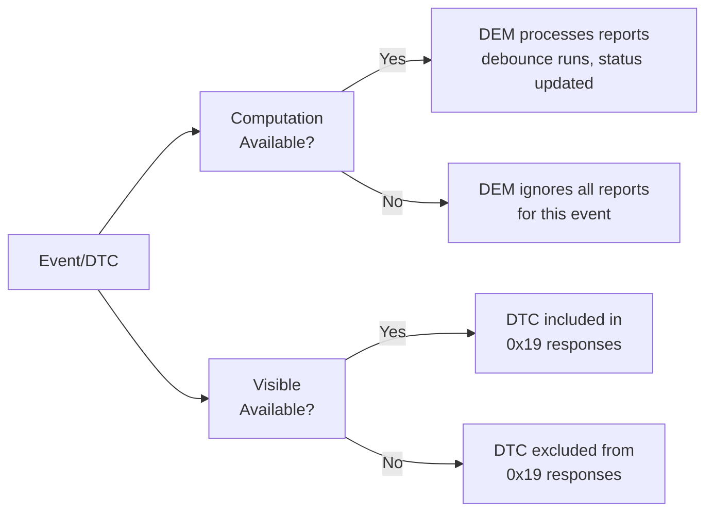

**Use case điển hình**:

| Tình huống | Computation | Visibility | Lý do |
|---|---|---|---|
| Feature không có trong xe này | Disabled | Hidden | ECU generic, feature không được trang bị |
| Đang trong assembly/EOL test | Disabled | Hidden | Không xử lý lỗi trong khi sản xuất |
| Feature có nhưng đang trong disable mode | Disabled | Visible | Tester phải thấy DTC để biết nó tồn tại nhưng không active |
| Normal operation | Enabled | Visible | Hoạt động bình thường |

**API AUTOSAR**:

```c
/* Đặt availability của event */
Dem_ReturnType ret = Dem_SetEventAvailable(
    DemConf_DemEventParameter_CoolantTempSensor, /* EventId   */
    FALSE                                         /* available */
);
/* Khi available = FALSE:
   - DEM không xử lý Dem_SetEventStatus cho event này
   - DTC không xuất hiện trong 0x19
   - Như thể event/DTC không tồn tại trong ECU này */
```

**Liên tưởng**:

> Availability giống như tính năng trên xe: một ECU generic có thể được lập trình cho 10 model xe khác nhau. Trên model entry-level không có cảm biến mù điểm, DEM vẫn có event cho nó trong code nhưng được đặt unavailable – nên kỹ sư workshop không thấy DTC giả từ feature không tồn tại.

---

## 7.4.9 Status Bit of DTC

DTC status byte là **8-bit chuẩn hóa theo ISO-14229** mô tả đầy đủ trạng thái hiện tại và lịch sử của một DTC. Đây là trường thông tin quan trọng nhất khi tester đọc DTC.

**Cấu trúc status byte**:

```
Bit 7    Bit 6    Bit 5    Bit 4    Bit 3    Bit 2    Bit 1    Bit 0
 WIR      TNCTOC   TFTOC    TFSLC    CDTC     PDTC     TF      TF'
  │         │        │        │        │        │        │       │
  │         │        │        │        │        │        │       └─ testFailed (hiện tại)
  │         │        │        │        │        │        └───────── testFailed (redundant/mir)
  │         │        │        │        │        └────────────────── pendingDTC
  │         │        │        │        └─────────────────────────── confirmedDTC
  │         │        │        └──────────────────────────────────── testFailedSinceLastClear
  │         │        └───────────────────────────────────────────── testFailedThisOperationCycle
  │         └────────────────────────────────────────────────────── testNotCompletedThisOperationCycle
  └──────────────────────────────────────────────────────────────── warningIndicatorRequested
```

**Định nghĩa từng bit**:

| Bit | Tên chuẩn ISO | Ký hiệu | Mô tả |
|---|---|---|---|
| 0 | testFailed | TF | Monitor hiện đang báo FAILED (active fault) |
| 1 | testFailedThisOperationCycle | TFTOC | Lỗi đã xảy ra ít nhất một lần trong cycle hiện tại |
| 2 | pendingDTC | PDTC | DTC đang chờ xác nhận (thấy fail nhưng chưa confirmed) |
| 3 | confirmedDTC | CDTC | DTC đã được xác nhận theo tiêu chí confirmation |
| 4 | testFailedSinceLastClear | TFSLC | Đã fail ít nhất một lần kể từ lần clear cuối |
| 5 | testNotCompletedThisOperationCycle | TNCTOC | Monitor chưa hoàn thành test trong cycle này |
| 6 | testNotCompletedSinceLastClear | TNCSLC | Monitor chưa hoàn thành kể từ lần clear cuối |
| 7 | warningIndicatorRequested | WIR | DEM đang yêu cầu bật warning indicator (MIL/đèn) |

**Ví dụ đọc status byte trong thực tế**:

```
Tester gửi: 19 02 08   (ReadDTCByStatusMask, mask = 0x08 = confirmedDTC)
ECU trả về: 59 02 08
             [DTC1: D0 01 15] [StatusByte: 0x2F]
             [DTC2: D0 03 08] [StatusByte: 0x09]

Phân tích DTC1 status byte = 0x2F = 0b00101111:
  Bit 0 (TF)     = 1 → đang fail
  Bit 1 (TFTOC)  = 1 → đã fail trong cycle này
  Bit 2 (PDTC)   = 1 → pending
  Bit 3 (CDTC)   = 1 → confirmed
  Bit 4 (TFSLC)  = 0 → chưa fail kể từ lần clear cuối (hoặc mới clear gần đây)
  Bit 5 (TNCTOC) = 1 → monitor chưa hoàn tất cycle này
  Bit 6          = 0
  Bit 7 (WIR)    = 0 → không yêu cầu indicator

Phân tích DTC2 status byte = 0x09 = 0b00001001:
  Bit 0 (TF)     = 1 → đang fail
  Bit 3 (CDTC)   = 1 → confirmed
  Tất cả bit còn lại = 0
```

**Vòng đời status byte điển hình**:

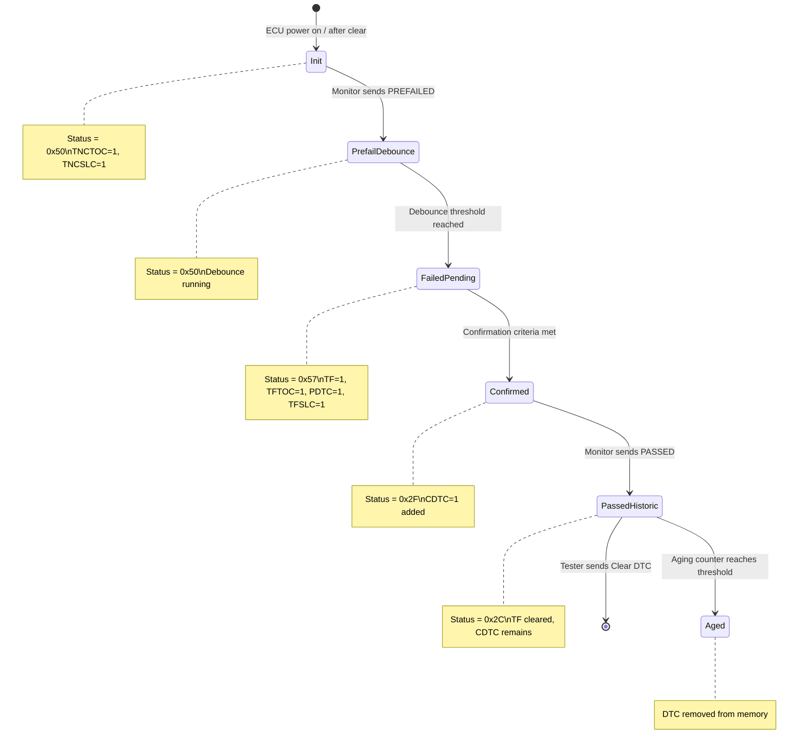

**Code minh họa đọc status bit cụ thể**:

```c
/* Đọc status byte của một DTC cụ thể */
Dem_UdsStatusByteType statusByte;
Dem_ReturnType ret;

ret = Dem_GetDTCStatusAvailabilityMask(&statusByte);

/* Kiểm tra từng bit */
#define DEM_STATUS_BIT_TF      0x01U  /* testFailed                      */
#define DEM_STATUS_BIT_TFTOC   0x02U  /* testFailedThisOperationCycle     */
#define DEM_STATUS_BIT_PDTC    0x04U  /* pendingDTC                       */
#define DEM_STATUS_BIT_CDTC    0x08U  /* confirmedDTC                     */
#define DEM_STATUS_BIT_TFSLC   0x10U  /* testFailedSinceLastClear         */
#define DEM_STATUS_BIT_TNCTOC  0x20U  /* testNotCompletedThisOpCycle      */
#define DEM_STATUS_BIT_TNCSLC  0x40U  /* testNotCompletedSinceLastClear   */
#define DEM_STATUS_BIT_WIR     0x80U  /* warningIndicatorRequested        */

if (statusByte & DEM_STATUS_BIT_CDTC) {
    /* DTC has been confirmed */
}
if (statusByte & DEM_STATUS_BIT_TF) {
    /* Fault is currently active */
}
if (statusByte & DEM_STATUS_BIT_WIR) {
    /* MIL or warning lamp is requested */
}
```

**Mask availability**: không phải mọi implementation đều hỗ trợ tất cả 8 bit. DEM có thể cấu hình một `StatusAvailabilityMask` để báo cho tester biết bit nào được hỗ trợ:

```
Ví dụ mask = 0x2F → chỉ bit 0,1,2,3,5 được hỗ trợ
Tester phải AND status byte với mask trước khi phân tích
```

---

## Tổng kết: Quan hệ giữa các thuộc tính DTC

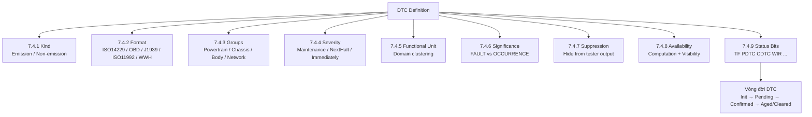

> Mỗi thuộc tính trên phục vụ một mục đích kiến trúc cụ thể: **kind** và **format** xác định ngôn ngữ giao tiếp; **group** và **severity** hỗ trợ lọc và phân loại; **significance** và **availability** kiểm soát xử lý logic; **suppression** kiểm soát tầm nhìn kết quả; **status bits** là trái tim runtime phản ánh vòng đời chẩn đoán của DTC.

---

## Ghi chú nguồn tham khảo

Tài liệu này được tổng hợp dựa trên:

1. AUTOSAR Classic Platform SRS Diagnostic Event Manager (DEM specification) – phần 7.4.
2. ISO 14229-1 UDS specification – DTC status byte và format definition.
3. SAE J2012 – OBD DTC format (2-byte) và WWH-OBD DTC format (3-byte).
4. SAE J1939-73 – Diagnostics in J1939 networks, SPN/FMI structure.
5. ISO 11992-4 – Communication between towing vehicle and trailer.
6. Nguồn public: DeepWiki `openAUTOSAR/classic-platform`, EmbeddedTutor AUTOSAR DEM.

Tất cả sơ đồ và code ví dụ được tạo hoàn toàn từ nội dung kiến thức kiến trúc, không sao chép trực tiếp từ tài liệu bản quyền.
