# DEM – Diagnostic Event Definition

> Tài liệu này mô tả chi tiết phần **7.3 – Diagnostic Event Definition** trong đặc tả AUTOSAR DEM. Event là đơn vị chẩn đoán nội bộ cơ bản nhất trong DEM – khác với DTC (mã chuẩn hóa ra ngoài), Event là cách DEM "nhìn nhận lỗi từ bên trong". Mỗi khái niệm được giải thích kèm ví dụ liên tưởng thực tế, sơ đồ Mermaid và code minh họa.

---

## 7.3 Diagnostic Event Definition

**Diagnostic Event** (hay đơn giản là **Event**) trong AUTOSAR DEM là đơn vị chẩn đoán cơ bản nhất mà một monitor có thể báo cáo. Mỗi event đại diện cho **một nguồn lỗi riêng biệt** trong hệ thống – ví dụ: một cảm biến cụ thể, một actuator cụ thể, hoặc một điều kiện hệ thống cụ thể.

**Sự khác biệt giữa Event và DTC**:

| Khía cạnh | Event | DTC |
|---|---|---|
| Phạm vi | Nội bộ DEM | Giao tiếp với tester bên ngoài |
| Mức độ chi tiết | Có thể rất chi tiết (từng pin, từng channel) | Chuẩn hóa, gom nhóm hơn |
| Ánh xạ | Nhiều event → một DTC (có thể) | Một DTC ← từ event |
| Trực tiếp thay đổi | Monitor gọi API DEM | Không thể set DTC trực tiếp |
| Tồn tại độc lập | Có – event không cần có DTC | Không – DTC cần có event |


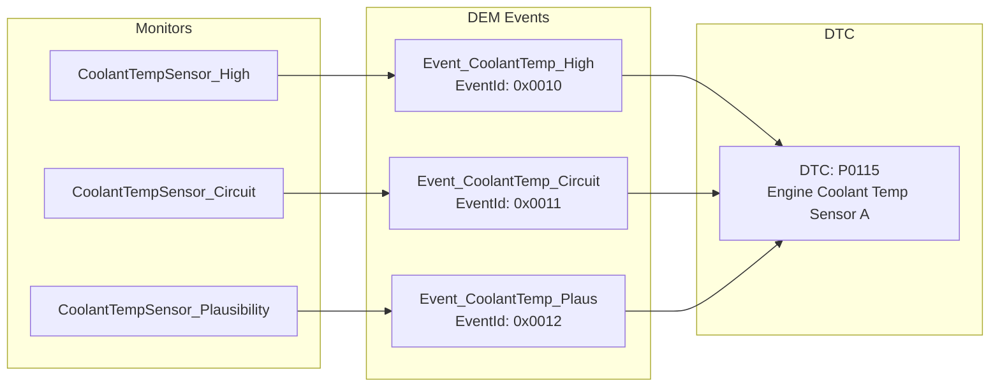

**Mỗi event trong DEM được xác định bởi**:

1. `EventId` – định danh số duy nhất trong ECU.
2. Các thuộc tính cấu hình: priority, kind, destination, debounce class, memory class, DTC mapping, v.v.
3. Trạng thái runtime: passed/failed/prefailed/prepassed, debounce counter, status bits.

---

## 7.3.1 Event Priority

Event priority xác định **độ quan trọng** của một event trong bối cảnh quản lý event memory. Khi event memory đầy, DEM cần quyết định event nào bị thay thế (displaced) và event nào được giữ lại – priority là yếu tố trọng tâm trong quyết định đó.

**Nguyên tắc priority**:

1. Priority được biểu diễn bằng số nguyên.
2. **Giá trị nhỏ hơn = ưu tiên cao hơn** (1 là cao nhất, n là thấp nhất).
3. Event priority cao hơn sẽ **không** bị displace bởi event priority thấp hơn.
4. Khi hai event có cùng priority, displacement strategy khác (ví dụ: LIFO, FIFO) được dùng để quyết định.

**Tại sao cần priority**:

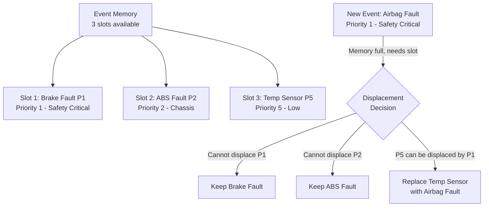

**Liên tưởng**:

> Priority giống như hàng đợi phòng cấp cứu: bệnh nhân ngừng tim (priority 1) luôn được xử lý trước bệnh nhân bong gân (priority 5). Khi phòng chờ đầy, người bong gân sẽ nhường chỗ cho ca cấp cứu mới nếu cần.

**Ví dụ cấu hình AUTOSAR**:

```xml
<!-- Ví dụ cấu hình priority cho các event khác nhau -->
<DEM-EVENT-PARAMETER>
  <SHORT-NAME>DemEvent_BrakePressureLoss</SHORT-NAME>
  <DEM-OPERATION-CYCLE-REF>/DemOperationCycles/DemOperationCycle_Driving</DEM-OPERATION-CYCLE-REF>
  <DEM-DTC-ATTRIBUTES-REF>/DemDTCAttributes/SafetyCritical</DEM-DTC-ATTRIBUTES-REF>
  <!-- Priority 1 = highest priority -->
  <DEM-EVENT-PRIORITY>1</DEM-EVENT-PRIORITY>
</DEM-EVENT-PARAMETER>

<DEM-EVENT-PARAMETER>
  <SHORT-NAME>DemEvent_FuelCapSensor</SHORT-NAME>
  <DEM-EVENT-PRIORITY>8</DEM-EVENT-PRIORITY>
  <!-- Priority 8 = lower priority, eligible for displacement -->
</DEM-EVENT-PARAMETER>
```

**Code kiểm tra logic displacement**:

```c
/*
 * Khi DEM cần allocate slot cho event mới trong full memory,
 * nó so sánh priority:
 *
 * candidatePriority < existingEntryPriority
 *   → candidate CÓ THỂ displace entry hiện tại
 *
 * candidatePriority >= existingEntryPriority
 *   → candidate KHÔNG được displace entry hiện tại
 */
static boolean Dem_CanDisplace(
    Dem_EventIdType candidateEvent,
    Dem_EventIdType existingEvent)
{
    uint8 candidatePriority = Dem_GetEventPriority(candidateEvent);
    uint8 existingPriority  = Dem_GetEventPriority(existingEvent);

    /* Số nhỏ hơn = ưu tiên cao hơn */
    return (candidatePriority < existingPriority);
}
```

**Ảnh hưởng thực tế của priority không được thiết kế đúng**:

| Sai lầm thiết kế | Hậu quả |
|---|---|
| Tất cả event cùng priority | Displacement ngẫu nhiên, mất DTC quan trọng khi memory đầy |
| Safety event priority thấp | Lỗi an toàn bị displaced bởi lỗi nhỏ |
| Priority quá chi tiết không nhất quán | Khó dự đoán behavior trong field |

---

## 7.3.2 Event Occurrence

Event occurrence ghi nhận **số lần một event đã đạt trạng thái FAILED** kể từ lần mà occurrence counter bắt đầu đếm (thường là kể từ lần DTC được lưu vào memory hoặc kể từ lần clear cuối).

**Mục đích của occurrence counter**:

1. Giúp tester phân biệt lỗi xuất hiện một lần (fluke) và lỗi tái diễn liên tục.
2. Là dữ liệu đầu vào cho aging và confirmation logic.
3. Là thông tin hữu ích trong extended data records.
4. Hỗ trợ chính sách displacement khi có hai event cùng priority.

**Hai loại occurrence tracking**:

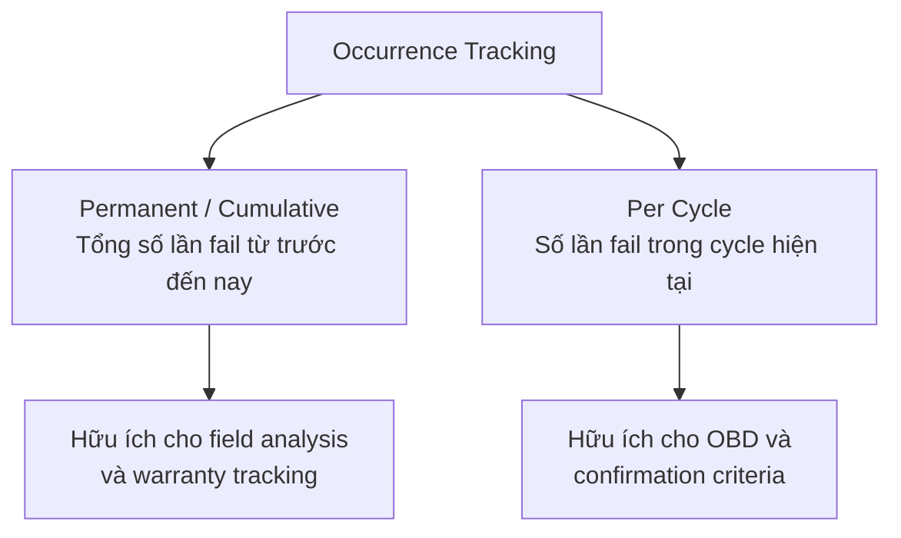

**Cơ chế tăng occurrence counter**:

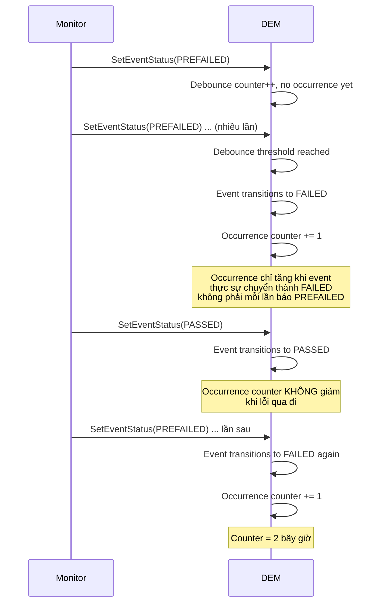

**Ví dụ thực tế – occurrence trong extended data**:

```
DTC: P0115 (ECT Sensor Fault)
Extended Data Record 0x01:
  Byte 0x01: Occurrence Counter = 0x07
  → Lỗi đã xảy ra 7 lần kể từ lần clear cuối

Ý nghĩa với kỹ sư workshop:
  Nếu counter = 1 → Có thể là lỗi thoáng qua
  Nếu counter = 7 → Lỗi tái diễn, cần kiểm tra thực sự
```

**Ngưỡng occurrence trong confirmation**:

```c
/* Một số DEM implementation dùng occurrence để confirm DTC */
/* Ví dụ: DTC cần fail ít nhất 2 lần để trở thành confirmed */
DemConfirmationThreshold {
    DemConfirmationThresholdValue = 2U;
    /* Sau 2 lần fail qualified, CDTC bit sẽ được set */
}
```

**Liên tưởng**:

> Occurrence counter giống như số lần đi trễ của nhân viên được ghi vào hồ sơ. Đi trễ 1 lần có thể là trường hợp bất thường. Đi trễ 7 lần trong một tháng là dấu hiệu rõ ràng cần xử lý.

---

## 7.3.3 Event Kind

Event kind phân loại **bản chất nguồn gốc** của event – cụ thể là event thuộc loại nào trong hệ thống AUTOSAR phân cấp chức năng.

**Các loại event kind được AUTOSAR định nghĩa**:

| Kind | Tên | Mô tả |
|---|---|---|
| `DEM_EVENT_KIND_SWC` | Software Component Event | Lỗi từ SWC application, báo cáo qua RTE port |
| `DEM_EVENT_KIND_BSW` | Basic Software Event | Lỗi từ BSW modules (Com, NvM, CanSM, v.v.) |

**DEM_EVENT_KIND_SWC**:

Event loại SWC xuất phát từ **application monitors** chạy trong SWC (Software Component). Monitor trong SWC đánh giá điều kiện logic application (cảm biến, actuator, plausibility) rồi báo kết quả qua RTE client-server interface.

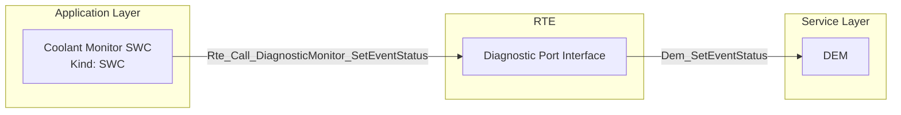

```c
/* SWC gọi DEM thông qua RTE - điển hình SWC event kind */
Std_ReturnType ret = Rte_Call_DiagnosticMonitor_CoolantTempHigh_SetEventStatus(
    DEM_EVENT_STATUS_FAILED  /* Monitor kết luận FAILED */
);
```

**DEM_EVENT_KIND_BSW**:

Event loại BSW xuất phát từ **AUTOSAR BSW modules** như CAN State Manager, NvM, Memory driver, v.v. Chúng gọi DEM API trực tiếp không thông qua RTE.

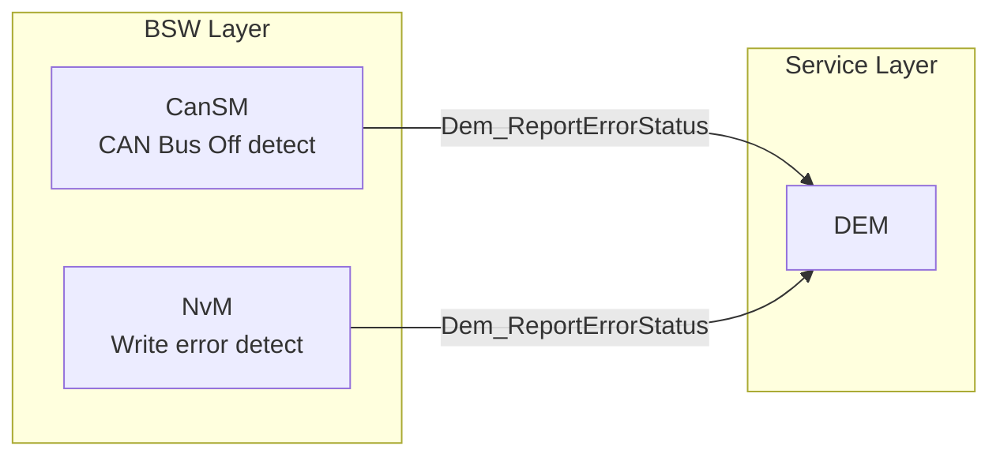

```c
/* BSW module gọi DEM trực tiếp - BSW event kind */
/* Ví dụ: CanSM phát hiện Bus Off */
Dem_ReportErrorStatus(
    DemConf_DemEventParameter_CanSM_BusOff_Channel1,  /* EventId */
    DEM_EVENT_STATUS_FAILED                            /* Status  */
);
```

**Tại sao cần phân biệt**:

1. **API khác nhau**: SWC dùng `Dem_SetEventStatus` (có operation cycle semantics), BSW dùng `Dem_ReportErrorStatus` (simpler interface).
2. **RTE dependency**: SWC events đi qua RTE port, BSW events không.
3. **Cấu hình dependency**: SWC event thường liên kết với Runnable Entities, BSW event không.
4. **Testing**: SWC events dễ mocked qua RTE stub, BSW events cần integration testing thực sự.

**Liên tưởng**:

> Event kind giống như nguồn gốc báo cáo tại bệnh viện: một số báo cáo từ bệnh nhân trực tiếp (SWC – application đánh giá), một số từ thiết bị tự động đo và báo cáo (BSW – hardware/infrastructure tự giám sát).

---

## 7.3.4 Event Destination

Event destination xác định **event memory nào** sẽ lưu trữ entry khi event đủ điều kiện được ghi.

**Các loại event memory trong DEM**:

| Destination | Tên | Mô tả |
|---|---|---|
| `DEM_DTC_ORIGIN_PRIMARY_MEMORY` | Primary Memory | Bộ nhớ chính, thường là fault records có tầm quan trọng cao |
| `DEM_DTC_ORIGIN_SECONDARY_MEMORY` | Secondary Memory | Bộ nhớ thứ hai, thường cho fault records phụ hoặc pending |
| `DEM_DTC_ORIGIN_MIRROR_MEMORY` | Mirror Memory | Bản sao của primary memory, dùng cho redundancy hoặc field tracking |
| `DEM_DTC_ORIGIN_PERMANENT_MEMORY` | Permanent Memory | OBD-specific memory, persistent đặc biệt theo OBD regulation |
| Vendor-defined | Custom Memory | Một số implementation có thêm memory partition riêng |

**Quan hệ giữa destination và policy**:

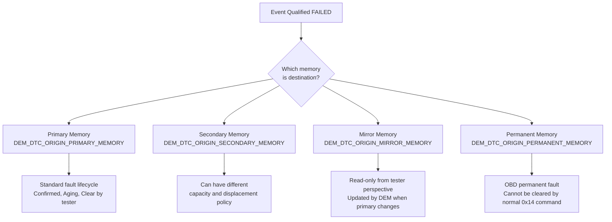

**Permanent Memory – kịch bản OBD đặc biệt**:

> Theo OBD regulation, một số DTC sau khi được confirmed **không thể bị xóa** bởi lệnh clear thông thường (0x14). DTC phải tự biến mất sau khi driving cycle sạch. Đây là Permanent Memory.

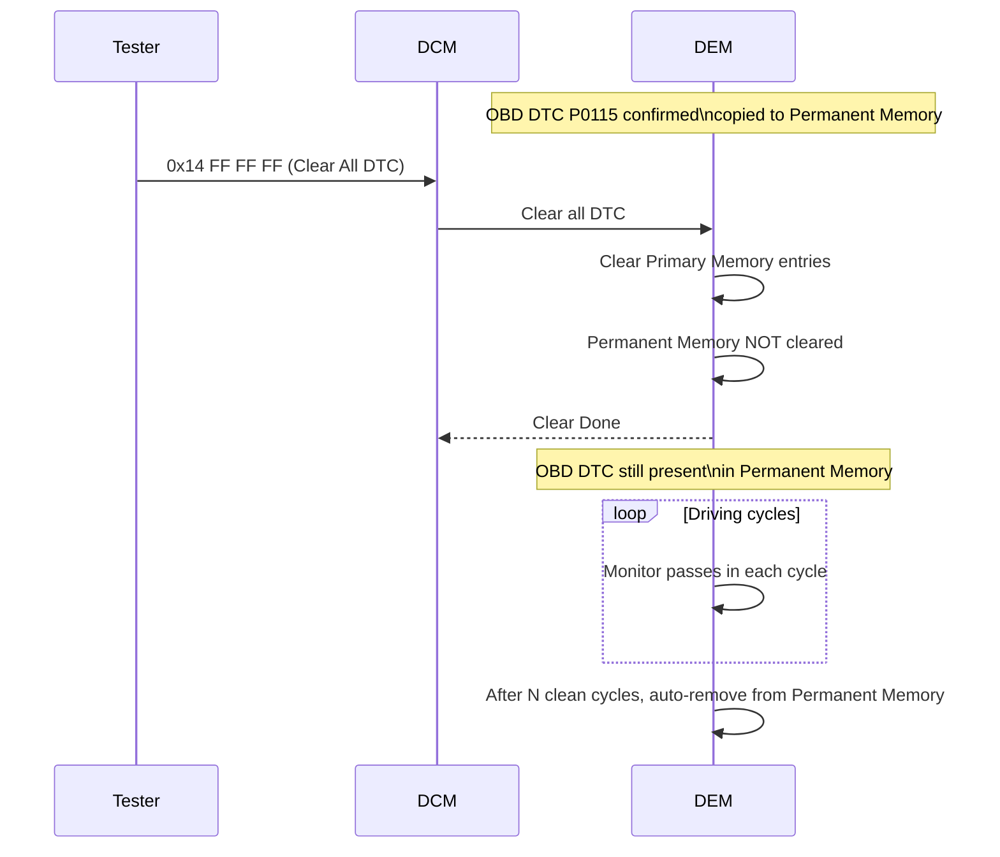

**Ví dụ cấu hình destination**:

```xml
<!-- Safety-critical fault goes to Primary Memory -->
<DEM-EVENT-PARAMETER>
  <SHORT-NAME>DemEvent_BrakePressureLoss</SHORT-NAME>
  <DEM-DTC-ORIGIN>DEM_DTC_ORIGIN_PRIMARY_MEMORY</DEM-DTC-ORIGIN>
</DEM-EVENT-PARAMETER>

<!-- OBD emission fault goes to Primary + Permanent -->
<DEM-EVENT-PARAMETER>
  <SHORT-NAME>DemEvent_OxygenSensorFault</SHORT-NAME>
  <DEM-DTC-ORIGIN>DEM_DTC_ORIGIN_PRIMARY_MEMORY</DEM-DTC-ORIGIN>
  <!-- Additional OBD permanent memory linkage via DemDTCAttributes -->
</DEM-EVENT-PARAMETER>
```

**Liên tưởng**:

> Destination giống như hệ thống lưu trữ hồ sơ y tế: có hồ sơ thông thường (primary), hồ sơ lưu trữ backup (mirror), hồ sơ pháp lý bắt buộc không được tiêu hủy (permanent). Mỗi loại theo quy tắc lưu giữ khác nhau.

---

## 7.3.5 Diagnostic Monitor Definition

Monitor là thực thể thực sự **đánh giá điều kiện lỗi** và báo cáo kết quả vào DEM. Cấu hình monitor trong DEM định nghĩa cách DEM nhận và xử lý báo cáo từ một nguồn quan sát cụ thể.

**Các thành phần cấu thành một monitor definition**:

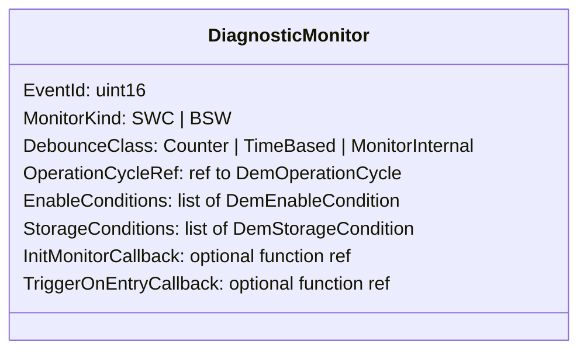

**Debounce class – trọng tâm của monitor definition**:

Debounce quyết định sau bao nhiêu bằng chứng monitor thì DEM mới chính thức coi event là FAILED hoặc PASSED.

**Loại 1: Counter-based debounce**

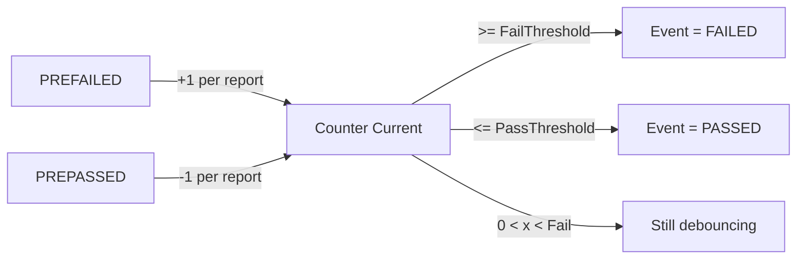

```c
/* Ví dụ cấu hình Counter-based debounce */
DemDebounceCounterBasedClass_CoolantTemp {
    DemDebounceCounterFailedThreshold  = 10;   /* phải nhận 10 PREFAILED */
    DemDebounceCounterPassedThreshold  = -5;   /* phải nhận 5 PREPASSED  */
    DemDebounceCounterIncrementStepSize = 1;
    DemDebounceCounterDecrementStepSize = 1;
    DemDebounceCounterJumpDown         = FALSE; /* không nhảy về 0 khi PASSED */
    DemDebounceCounterJumpUp           = FALSE;
}
```

**Loại 2: Time-based debounce**

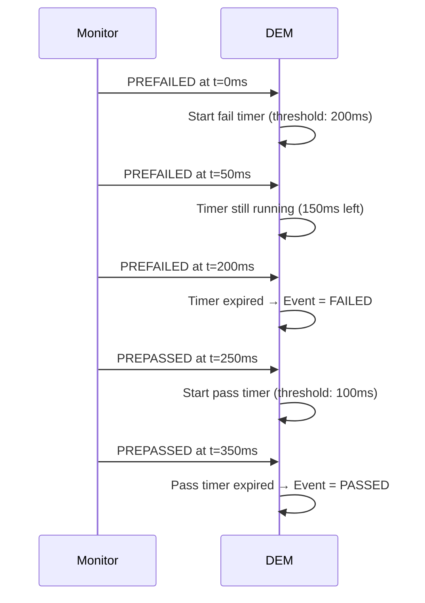

**Loại 3: Monitor-internal debounce**

```
Khi DemDebounceClass = DEM_DEBOUNCE_MONITOR_INTERNAL:
- Monitor tự quyết định khi nào gửi FAILED/PASSED
- Monitor chỉ gọi DEM khi đã chắc chắn kết luận
- DEM không có debounce logic riêng, tin hoàn toàn vào monitor
```

Dùng khi: monitor đã có debounce algorithm riêng (ví dụ: filter Kalman, plausibility check phức tạp).

**Enable Conditions trong monitor definition**:

Enable conditions là các điều kiện môi trường cần được thỏa mãn để DEM **xử lý báo cáo** từ monitor này.

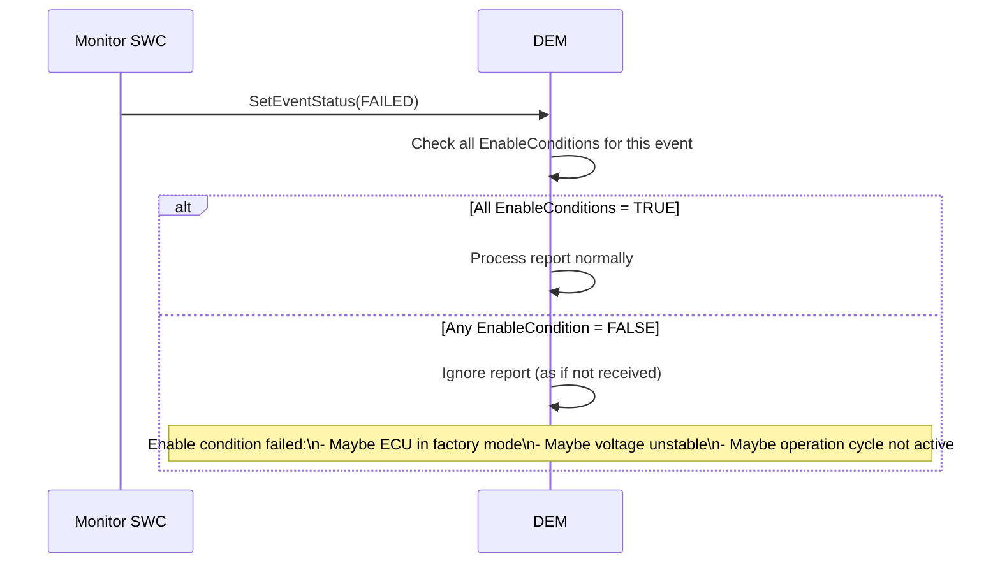

```c
/* Enable condition API – BswM hoặc application set condition */
Dem_SetEnableCondition(
    DemConf_DemEnableCondition_VoltageStable,  /* condition ID */
    TRUE                                         /* condition satisfied */
);

/* Khi voltage unstable: */
Dem_SetEnableCondition(
    DemConf_DemEnableCondition_VoltageStable,
    FALSE  /* monitors sẽ bị ignore cho đến khi voltage ổn định lại */
);
```

**Storage Conditions**:

Storage conditions quyết định liệu entry có **được phép ghi vào event memory** hay không, kể cả khi event đã FAILED.

```
EnableCondition  = điều kiện để DEM ĐÁNH GIÁ monitor
StorageCondition = điều kiện để DEM LƯU fault vào memory

Ví dụ:
- Enable condition: ECU đang hoạt động bình thường (không phải programming session)
- Storage condition: Key đang ON và vehicle speed > 0 (không phải parking diagnostic)
```

**Liên tưởng monitor definition**:

> Monitor definition giống như quy trình kiểm tra chất lượng trong nhà máy:
> - Debounce = bao nhiêu lần đo lỗi liên tiếp mới kết luận sản phẩm hỏng (tránh false reject).
> - Enable condition = chỉ kiểm tra khi máy đang chạy đúng tốc độ và nhiệt độ đúng ngưỡng.
> - Storage condition = chỉ ghi vào sổ hỏng hóc khi đang trong ca sản xuất chính thức.

---

## 7.3.6 Event Dependencies

Event dependencies mô tả quan hệ phụ thuộc giữa các event trong hệ thống, cho phép DEM và FiM xây dựng **logic inhibition** (ngăn chặn một chức năng hoặc ngừng đánh giá monitor phụ khi nguồn lỗi gốc đã được xác định).

**Vấn đề cần giải quyết**:

> Trong hệ thống phức tạp, một lỗi vật lý gốc có thể gây ra nhiều lỗi thứ cấp. Nếu không có dependency modeling, DEM và tester sẽ thấy hàng loạt DTC nhưng không biết đâu là nguyên nhân gốc, đâu là hậu quả.

**Ví dụ kinh điển – CAN Bus Off**:

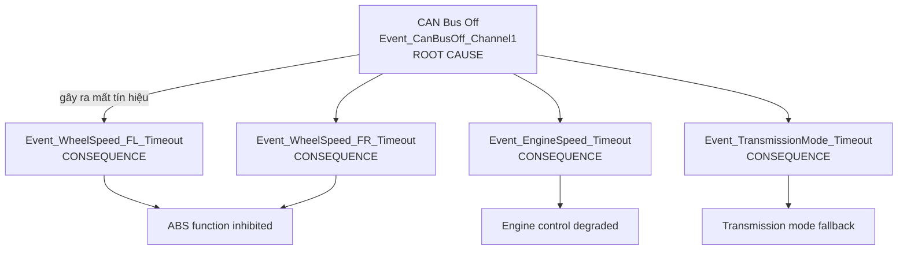

Nếu không có dependency:
- Tester thấy 5 DTC: CAN Bus Off + 4 timeout DTC.
- Không rõ đâu là original fault.

Với dependency modeling:
- Khi `Event_CanBusOff` = FAILED, DEM/FiM biết rằng các event timeout kia là **consequence**, không phải independent fault.
- FiM có thể ngừng evaluate các monitor phụ sẽ tất nhiên fail vì CAN đã off.

**FiM (Function Inhibition Manager) – trái tim của dependency**:

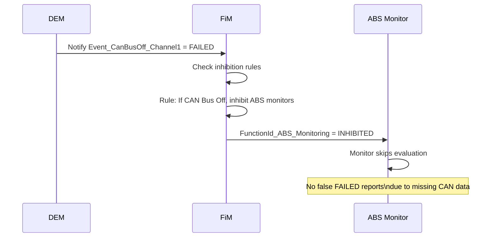

**API FiM – SWC kiểm tra trước khi chạy monitor**:

```c
/* SWC kiểm tra inhibition trước khi evaluate điều kiện lỗi */
boolean functionPermission;

FiM_GetFunctionPermission(
    FiMConf_FiMFunctionId_ABSMonitoring,  /* Function ID */
    &functionPermission
);

if (functionPermission == TRUE) {
    /* Proceed with normal ABS monitoring logic */
    RunABSMonitor();
} else {
    /* Skip monitoring – source condition is inhibited */
    /* Do NOT report PASSED or FAILED to DEM */
}
```

**Cascade dependency – nhiều cấp**:

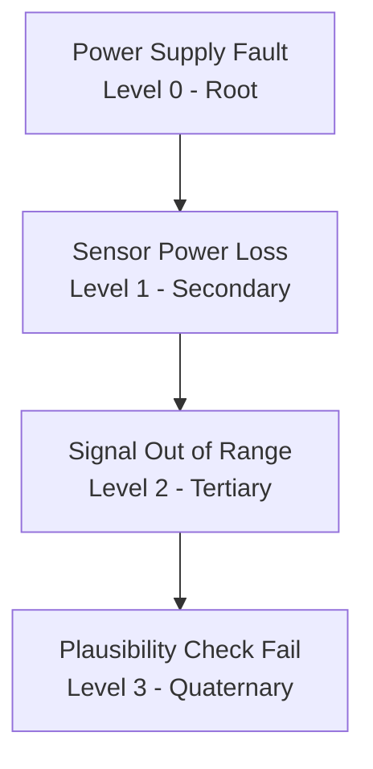

> Khi Power Supply fault xuất hiện, DEM/FiM có thể cascade inhibit toàn bộ chain phía dưới – ngăn chặn việc ghi hàng loạt DTC vô nghĩa vào event memory.

**Storage của event dependency trong ARXML**:

```xml
<!-- Cấu hình event dependency trong DEM -->
<DEM-COMPONENT-IDENTIFIER>
  <SHORT-NAME>DemComponent_CANNode1</SHORT-NAME>
  <DEM-FAILED-DEPS>
    <!-- Nếu CAN Node fail, các event sau sẽ bị inhibited -->
    <DEM-FAILED-DEP>
      <DEM-EVENT-REF>/DemEvents/Event_WheelSpeed_FL</DEM-EVENT-REF>
    </DEM-FAILED-DEP>
    <DEM-FAILED-DEP>
      <DEM-EVENT-REF>/DemEvents/Event_WheelSpeed_FR</DEM-EVENT-REF>
    </DEM-FAILED-DEP>
  </DEM-FAILED-DEPS>
</DEM-COMPONENT-IDENTIFIER>
```

**Liên tưởng**:

> Event dependency giống như sơ đồ nguồn điện trong tòa nhà: nếu máy biến áp tổng (root) bị sự cố, tất nhiên các tầng không có điện (consequence). Kỹ thuật điện không cần ghi sự cố "Tầng 3 mất điện", "Tầng 5 mất điện" riêng – điều đó implied bởi sự cố máy biến áp gốc.

---

## 7.3.7 Component Availability

Component availability kiểm soát liệu một **component chẩn đoán** (một logic group của events) có đang **hoạt động và được phép đánh giá** trong cấu hình xe hiện tại hay không.

**Khái niệm component trong DEM**:

Một **DEM component** là một nhóm logic đại diện cho một thực thể vật lý hoặc chức năng trong xe – ví dụ: ECU con, cảm biến, actuator, network node. Mỗi component có thể có nhiều event gắn với nó.

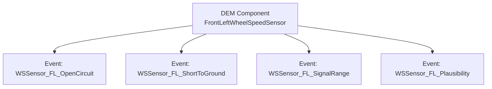

**Khi component không available**:

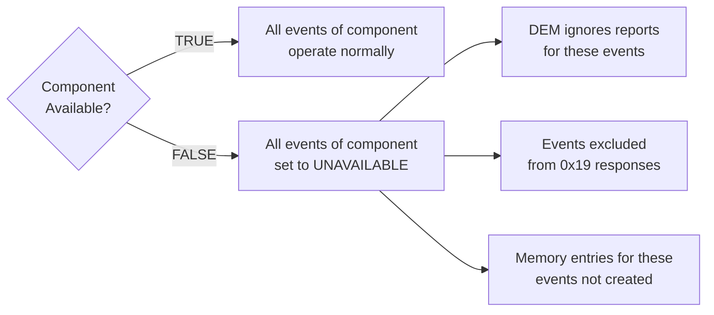

**Ứng dụng điển hình của component availability**:

**1. Feature không có trong xe (variant coding)**:

```
Xe basic model: không có cảm biến mù điểm (blind spot sensor)
Component_BlindSpotLeft → Availability = FALSE
→ Tất cả event của component này bị skip
→ Tester không thấy DTC giả liên quan đến feature không có
```

**2. Sensor chưa connected / đang ECU diagnostic mode**:

```
Trong quá trình EOL (End of Line) assembly:
Một số sensor chưa được kết nối vật lý
→ Component_RearCamera → Availability = FALSE
→ DEM không ghi false open-circuit faults
```

**3. Optional hardware module**:

```
ECU software chạy trên nhiều hardware variant:
- Hardware variant A: có accelerometer chip
- Hardware variant B: không có accelerometer chip
→ Runtime detect: nếu accelerometer không detect → set component unavailable
→ Tránh false DTC cho hardware không tồn tại
```

**API kiểm soát component availability**:

```c
/* Set component availability at runtime */
Dem_ReturnType ret = Dem_SetComponentAvailable(
    DemConf_DemComponent_FrontLeftWSS,  /* Component reference */
    FALSE                                /* not available       */
);

/* Sau khi component available = FALSE:
   - Tất cả events thuộc component này bị suspend
   - DEM trả DEM_AVAILABILITY_CHANGED nếu cần
   - FiM được notify nếu cấu hình */
```

**Visibility vs Computation trong availability**:

Giống như trong DTC availability (7.4.8), component availability cũng có thể tách biệt hai chiều:

| Trạng thái | Computation | Visibility trong 0x19 |
|---|---|---|
| Fully available | Enabled | Visible |
| Computation disabled, visible | Disabled | Visible (tester thấy DTC tồn tại nhưng không được update) |
| Fully unavailable | Disabled | Hidden |

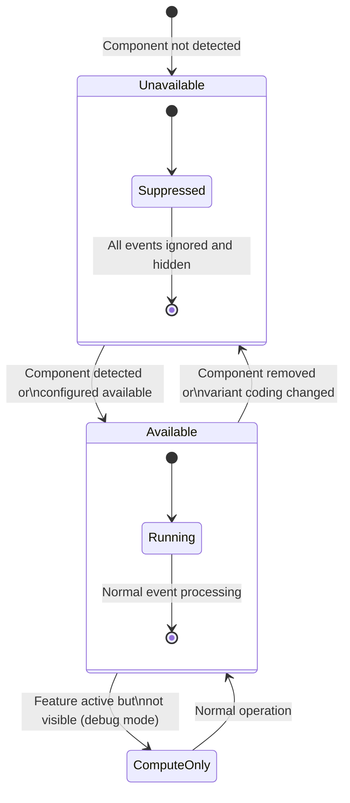

**Liên tưởng**:

> Component availability giống như danh sách môn học của học sinh theo lớp: học sinh lớp cơ bản không có môn Vật lý nâng cao. Hệ thống giáo vụ không liệt kê môn đó trong học bạ của họ, và giáo viên Vật lý nâng cao cũng không chờ đợi điểm từ học sinh lớp cơ bản. Component availability làm điều tương tự với ECU.

**Ví dụ cấu hình trong ARXML**:

```xml
<DEM-COMPONENT-IDENTIFIER>
  <SHORT-NAME>DemComponent_BlindSpotLeft</SHORT-NAME>
  <!-- Events linked to this component -->
  <DEM-EVENTS>
    <DEM-EVENT-REF>/DemEvents/Event_BSS_Left_ShortCircuit</DEM-EVENT-REF>
    <DEM-EVENT-REF>/DemEvents/Event_BSS_Left_OpenCircuit</DEM-EVENT-REF>
  </DEM-EVENTS>
</DEM-COMPONENT-IDENTIFIER>

<!-- Runtime: Application sets availability based on variant coding -->
<!-- DemVariantCoding reads hardware config byte at startup -->
```

---

## Tổng kết: Quan hệ giữa các thuộc tính Event

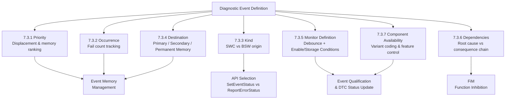

**Tổng hợp luồng hoạt động từ Event Definition đến DTC**:

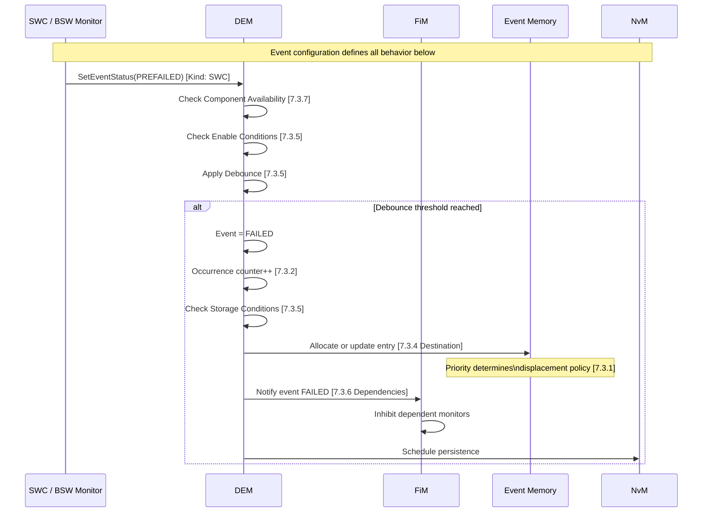

---

## Ghi chú nguồn tham khảo

Tài liệu này được tổng hợp dựa trên:

1. AUTOSAR Classic Platform SRS Diagnostic Event Manager (DEM specification) – phần 7.3.
2. AUTOSAR SWS FiM (Function Inhibition Manager) – quan hệ với DEM event dependencies.
3. ISO 14229-1 – event status byte definition và operation cycle semantics.
4. Nguồn public: DeepWiki `openAUTOSAR/classic-platform`, EmbeddedTutor AUTOSAR DEM/FiM series.
5. Tài liệu bổ sung từ [DEM - Functional Description](/dem-functional/) và [DEM - Overview](/dem-overview/).

Tất cả sơ đồ, code ví dụ và liên tưởng được tạo hoàn toàn từ nội dung kiến thức kiến trúc, không sao chép trực tiếp từ tài liệu bản quyền.
