# DEM – Event Memory (Part 4): Fault Confirmation, Event Combination & Conditions

> Tài liệu này mô tả các phần **7.7.4 Fault Confirmation**, **7.7.5 Event Combination** và **7.7.6 Enable and Storage Conditions** – ba cơ chế kiểm soát **khi nào DTC được xác nhận chính thức**, **cách nhiều event gộp thành một DTC** và **điều kiện môi trường để chẩn đoán hoạt động**.

---

## 7.7.4 Fault Confirmation

**Fault confirmation** là quá trình nâng trạng thái DTC từ "đã phát hiện" lên "đã xác nhận chính thức". Đây là cột mốc quan trọng trong vòng đời DTC vì:

1. `confirmedDTC` (CDTC bit) được set.
2. Dữ liệu freeze frame có thể được chốt lưu.
3. Indicator (MIL) có thể được kích hoạt.
4. DTC được coi là có độ tin cậy cao về sự tồn tại lỗi thực sự.

**Sự khác biệt giữa pending và confirmed**:

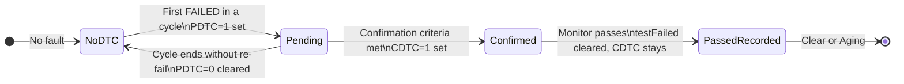

**Confirmation criterion – hai model phổ biến**:

### Model 1: Single-cycle confirmation

```
DTC được confirmed ngay khi FAILED trong cycle đầu tiên.
→ ConfirmationThreshold = 1 cycle
→ CDTC set cùng lúc với PDTC
```

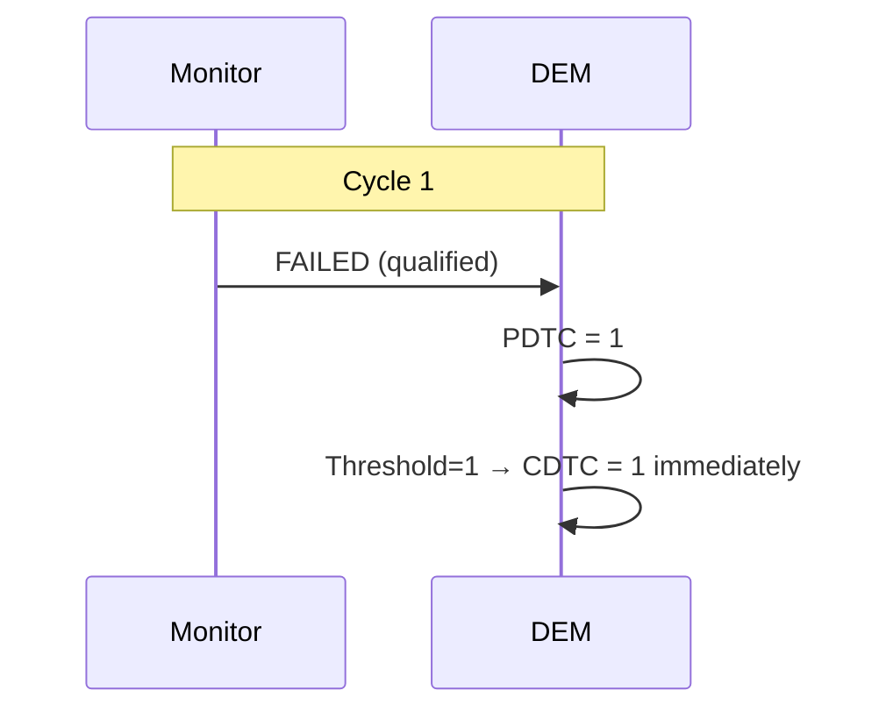

### Model 2: Multi-cycle confirmation

```
DTC được confirmed sau N cycles có FAILED.
→ ConfirmationThreshold = 2 cycles (ví dụ)
→ Cycle 1: PDTC=1, CDTC=0 (pending chờ)
→ Cycle 2 cũng FAILED → CDTC=1 (confirmed)
→ Nếu Cycle 2 sạch → PDTC cleared, reset counter
```

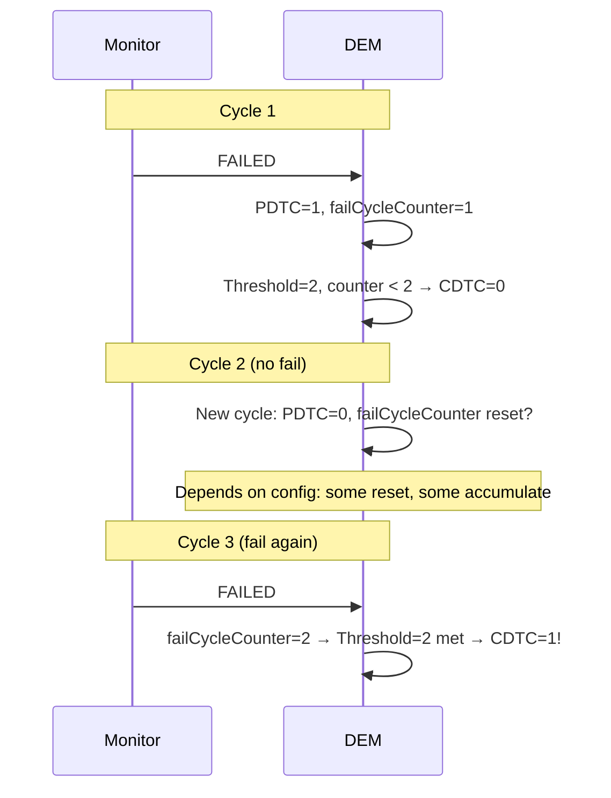

**Cấu hình confirmation threshold**:

```xml
<DEM-DTC-ATTRIBUTES>
  <SHORT-NAME>DemDTCAttr_CoolantTemp</SHORT-NAME>
  <!-- Number of operation cycles with FAILED needed to confirm -->
  <DEM-CONFIRMATION-THRESHOLD>2</DEM-CONFIRMATION-THRESHOLD>
</DEM-DTC-ATTRIBUTES>
```

```c
/* DEM internal: update confirmation counter */
static void Dem_UpdateConfirmationCounter(Dem_EventIdType EventId)
{
    uint8* confirmCtr = Dem_GetConfirmationCounter(EventId);
    uint8  threshold  = Dem_GetConfirmationThreshold(EventId);

    if (*confirmCtr < threshold) {
        (*confirmCtr)++;
    }

    if (*confirmCtr >= threshold) {
        /* Set confirmedDTC bit */
        Dem_SetStatusBit(EventId, DEM_STATUS_BIT_CDTC);
        /* Notify indicator logic */
        Dem_UpdateIndicatorRequest(EventId);
    }
}
```

---

### 7.7.4.1 Method for Grouping of Association of Events for OBD Purpose

Trong OBD (On-Board Diagnostics), một số DTC cần được xác nhận theo **driving cycle** cụ thể, không phải theo operation cycle thông thường.

**OBD Driving Cycle vs Operation Cycle**:

| Cycle | Định nghĩa | Dùng cho |
|---|---|---|
| Operation Cycle | Mỗi key-on/key-off | Standard DEM events |
| OBD Driving Cycle | "Trip" theo chuẩn OBD: đạt điều kiện speed/temp/load nhất định | OBD emission DTCs |

**OBD Readiness và DTC status**:

```
OBD DTC lifecycle:
1. Monitor đánh giá trong driving cycle
2. Nếu FAILED: PDTC = 1
3. Nếu FAILED trong N consecutive driving cycles: CDTC = 1
4. MIL bật sau khi CDTC = 1

SAE J1979 / ISO 15031 định nghĩa:
  - 2 consecutive failing driving cycles = confirmed OBD DTC
  - MIL phải bật sau 2nd failed driving cycle
```

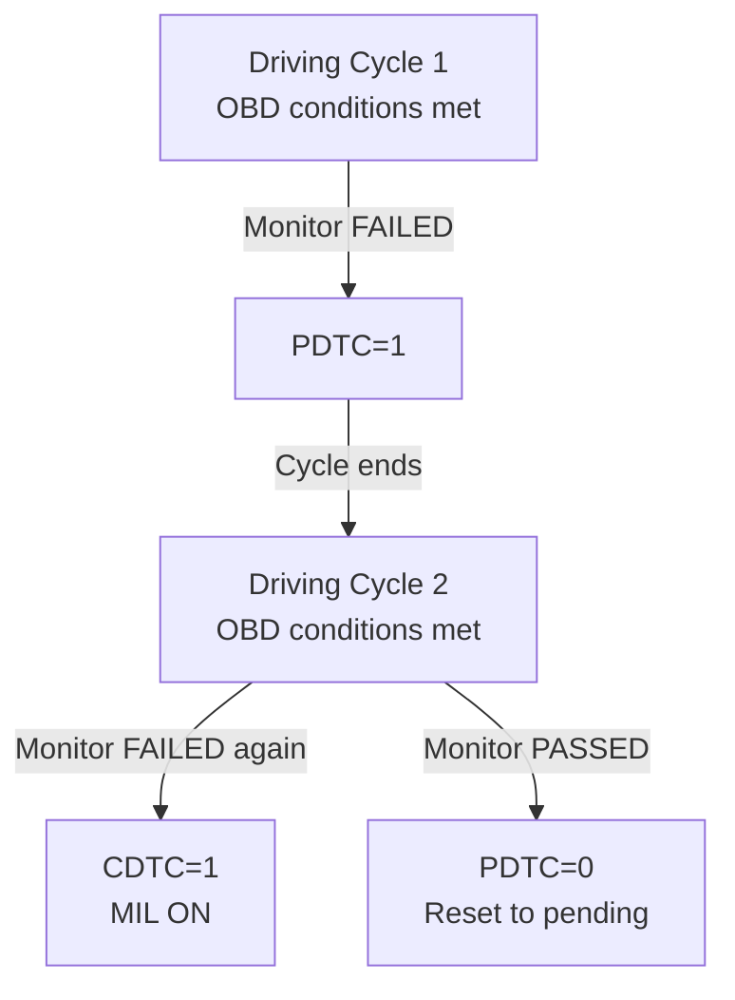

**Grouping for OBD purpose – liên kết monitor với OBD readiness**:

```
Mỗi OBD-relevant monitor được gán vào một "readiness group":
- Comprehensive Component Monitoring (CCM)
- Catalyst Monitor
- Heated Catalyst Monitor
- Evaporative System Monitor
- Oxygen Sensor Monitor
- EGR System Monitor
...

Khi tester đọc 0x01 01 (OBD Mode 1), ECU trả về readiness bitmap
cho mỗi group: $00 = Not complete, $01 = Complete
```

---

## 7.7.5 Event Combination

**Event combination** là cơ chế AUTOSAR DEM cho phép **nhiều event** chia sẻ **một DTC** – tức là nhiều nguồn lỗi khác nhau đều ánh xạ đến cùng một mã DTC mà tester thấy.

**Hai phương thức combination**:

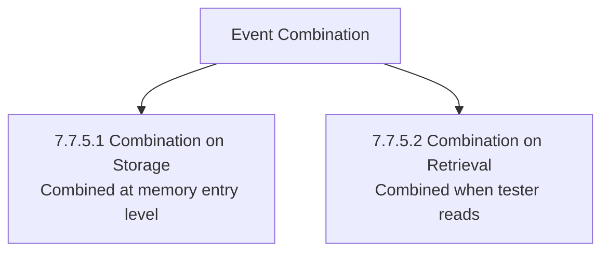

---

### 7.7.5.1 Combination On Storage

**Combination on Storage** nghĩa là nhiều event **chia sẻ một memory entry**. Khi bất kỳ event nào trong nhóm FAILED, tất cả đều được ghi chung vào một entry.

**Ví dụ kinh điển – Wheel Speed Sensor unit**:

```
DTC: C0035 (Wheel Speed Sensor Front Left circuit)

Combined events:
  Event_WSS_FL_OpenCircuit    → ánh xạ vào DTC C0035
  Event_WSS_FL_ShortToGround  → ánh xạ vào DTC C0035
  Event_WSS_FL_ShortToVBatt   → ánh xạ vào DTC C0035

→ Chỉ một entry trong event memory cho C0035
→ Status byte là OR của tất cả event status
→ Freeze frame chụp khi bất kỳ event nào first-failed
```

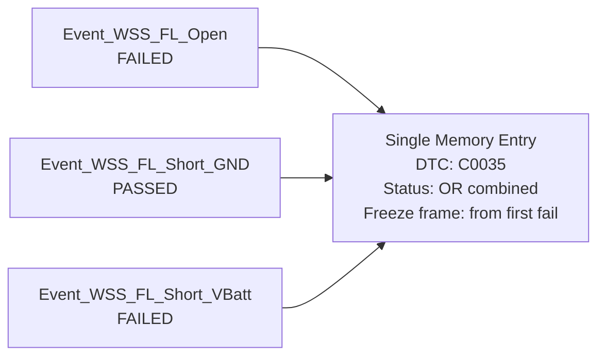

**Status byte logic trong Combination on Storage**:

```c
/* Status byte của combined entry = OR của tất cả member events */
Dem_UdsStatusByteType combinedStatus = 0;
for (uint8 i = 0; i < numCombinedEvents; i++) {
    combinedStatus |= Dem_GetEventStatusByte(combinedEventIds[i]);
}
/* Ví dụ:
   E1 status = 0x09 (TF=1, CDTC=1)
   E2 status = 0x08 (CDTC=1 only)
   E3 status = 0x09 (TF=1, CDTC=1)
   Combined = 0x09 | 0x08 | 0x09 = 0x09 */
```

**Freeze frame trong combined entry**:

```
Capture trigger: khi bất kỳ member event nào đạt trigger condition
Capture data: lấy từ event nào FAILED đầu tiên (hoặc cấu hình specific)
```

**Liên tưởng Combination on Storage**:

> Giống như một phòng bệnh có nhiều bệnh nhân cùng chẩn đoán viêm phổi. Bệnh viện mở một hồ sơ nhóm thay vì hồ sơ riêng cho từng người. Khi một trong số họ xấu đi, hồ sơ nhóm được cập nhật.

---

### 7.7.5.2 Combination On Retrieval

**Combination on Retrieval** nghĩa là mỗi event vẫn có **memory entry riêng**, nhưng khi tester đọc qua `0x19`, DEM **gộp** chúng thành một DTC trong response.

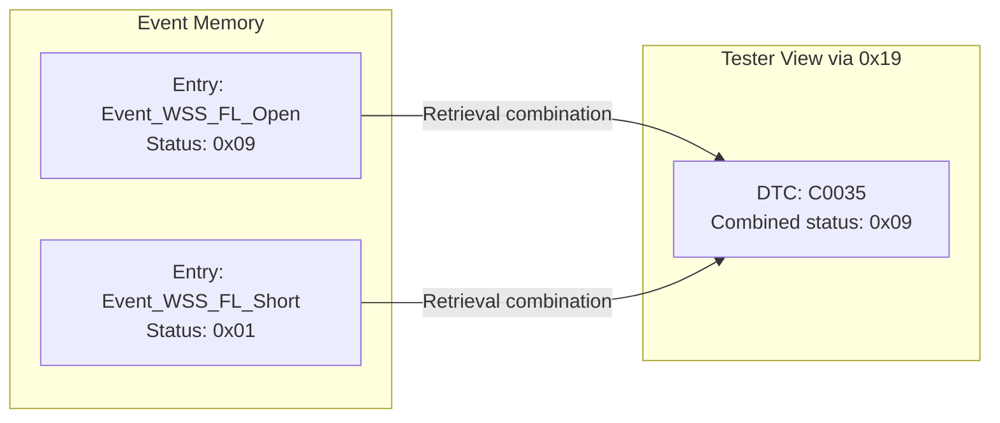

**Sự khác biệt giữa hai loại**:

| Aspect | Combination on Storage | Combination on Retrieval |
|---|---|---|
| Memory usage | 1 entry shared | N entries (one per event) |
| Granularity | DTC-level granularity only | Per-event granularity in memory |
| Freeze frame | Shared record | Each event has own record |
| Status byte | OR of all members | OR when returned to tester |
| Data scope | Less detailed | More detailed per source |

**Khi nào chọn loại nào**:

```
Combination on Storage:
  ✓ Tiết kiệm memory slots
  ✓ Đơn giản hóa xử lý
  ✗ Mất granularity per-event freeze frame

Combination on Retrieval:
  ✓ Giữ được chi tiết từng event
  ✓ Freeze frame riêng cho từng nguồn lỗi
  ✗ Tốn nhiều memory slots hơn
```

---

## 7.7.6 Enable and Storage Conditions of Diagnostic Events

Enable và storage conditions là hai lớp điều kiện kiểm soát **khi nào DEM xử lý** và **khi nào DEM lưu** lỗi. Đây là cơ chế cực kỳ quan trọng để tránh false DTC trong các tình huống môi trường không phù hợp.

**Hai loại condition**:

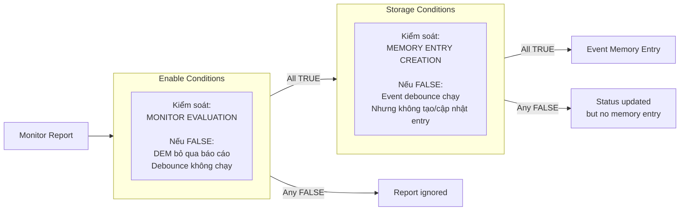

**Enable Conditions – ví dụ thực tế**:

| Enable Condition | Khi FALSE | Lý do |
|---|---|---|
| `VoltageStable` | Bỏ qua báo cáo điện áp | Voltage noise ở startup không phải lỗi |
| `NotInProgrammingSession` | Bỏ qua mọi event | Không chẩn đoán khi đang flash |
| `IgnitionOn` | Bỏ qua event ECU cụ thể | Một số ECU không active khi ignition OFF |
| `NetworkInitialized` | Bỏ qua CAN timeout | Bus chưa alive ngay khi bật nguồn |
| `SensorWarmupComplete` | Bỏ qua O2 sensor | Cảm biến cần thời gian warm-up |

**API set enable condition**:

```c
/* Application hoặc BswM set enable condition */

/* ECU vào programming session → disable all diagnostics */
void OnProgrammingSessionEntered(void)
{
    Dem_SetEnableCondition(
        DemConf_DemEnableCondition_NotInProgramming,
        FALSE   /* condition not satisfied → no monitoring */
    );
}

/* ECU thoát programming session → re-enable */
void OnDefaultSessionRestored(void)
{
    Dem_SetEnableCondition(
        DemConf_DemEnableCondition_NotInProgramming,
        TRUE    /* condition satisfied → monitoring resumes */
    );
}
```

**Behavior khi enable condition FALSE**:

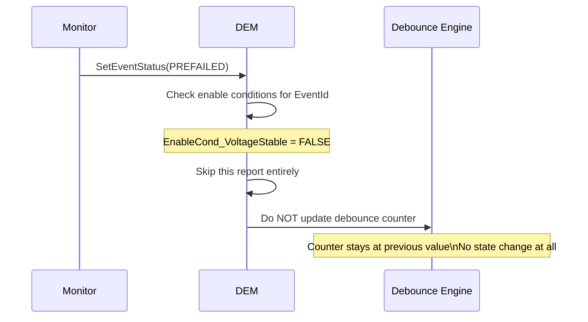

**Storage Conditions – ví dụ thực tế**:

| Storage Condition | Khi FALSE | Lý do |
|---|---|---|
| `VehicleMoving` | ABS fault không lưu | ABS chỉ relevant khi xe đang chạy |
| `EngineRunning` | Một số actuator fault không lưu | Actuator chỉ active khi engine chạy |
| `NvMReady` | Không tạo entry | Tránh mất entry nếu NvM chưa sẵn sàng |
| `NotInEndOfLineTesting` | Không lưu trong EOL | Test production không nên tạo DTC |

**Behavior khi storage condition FALSE (nhưng enable condition TRUE)**:

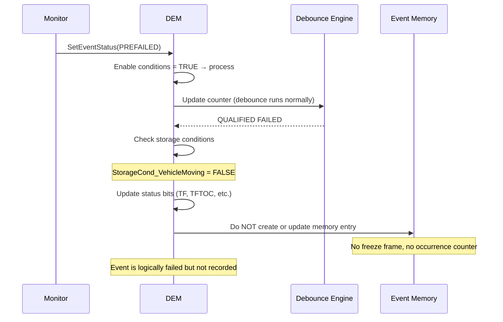

**Cấu hình trong ARXML**:

```xml
<!-- Enable condition definition -->
<DEM-ENABLE-CONDITION>
  <SHORT-NAME>DemEnableCond_NetworkInitialized</SHORT-NAME>
</DEM-ENABLE-CONDITION>

<!-- Storage condition definition -->
<DEM-STORAGE-CONDITION>
  <SHORT-NAME>DemStorageCond_VehicleMoving</SHORT-NAME>
</DEM-STORAGE-CONDITION>

<!-- Event linked to both conditions -->
<DEM-EVENT-PARAMETER>
  <SHORT-NAME>DemEvent_WheelSpeedSensor_FL</SHORT-NAME>

  <!-- Must have network alive to even evaluate -->
  <DEM-ENABLE-CONDITION-REFS>
    <DEM-ENABLE-CONDITION-REF>
      /DemEnableConditions/DemEnableCond_NetworkInitialized
    </DEM-ENABLE-CONDITION-REF>
  </DEM-ENABLE-CONDITION-REFS>

  <!-- Must be moving to store fault record -->
  <DEM-STORAGE-CONDITION-REFS>
    <DEM-STORAGE-CONDITION-REF>
      /DemStorageConditions/DemStorageCond_VehicleMoving
    </DEM-STORAGE-CONDITION-REF>
  </DEM-STORAGE-CONDITION-REFS>
</DEM-EVENT-PARAMETER>
```

**Enable/Storage condition state machine**:

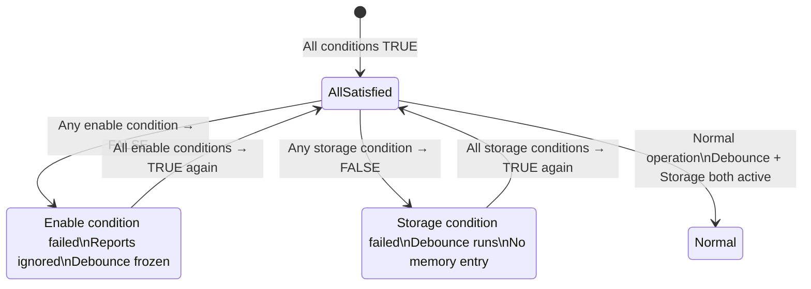

**Liên tưởng Enable vs Storage Conditions**:

> **Enable Condition** = điều kiện để giáo viên **chấm bài** (nếu không đủ điều kiện, bài không được chấm).
>
> **Storage Condition** = điều kiện để kết quả bài thi được **ghi vào học bạ** (bài có thể được chấm, có điểm, nhưng chưa đủ điều kiện để vào học bạ chính thức).

---

## Tổng kết Part 4

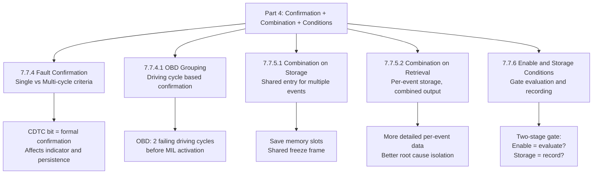

> Phần 4 giải quyết ba vấn đề kiến trúc quan trọng: **khi nào DTC đủ tin cậy để confirmed** (7.7.4), **cách tổ chức dữ liệu khi nhiều event chia sẻ một DTC** (7.7.5) và **cơ chế tắt chẩn đoán có chọn lọc theo môi trường** (7.7.6).

---

## Ghi chú nguồn tham khảo

1. AUTOSAR Classic Platform SRS DEM – Section 7.7.4, 7.7.5, 7.7.6.
2. SAE J1979 / ISO 15031-5 – OBD service $01 readiness, driving cycle definition.
3. ISO 14229-1 – DTC status byte, pendingDTC and confirmedDTC semantics.
4. Nguồn public: EmbeddedTutor AUTOSAR DEM, DeepWiki openAUTOSAR/classic-platform.
