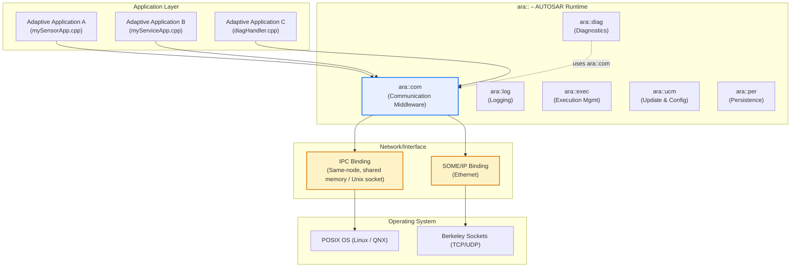
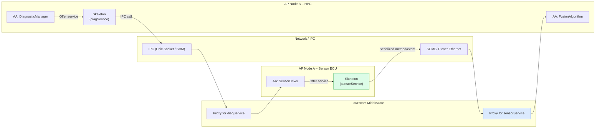
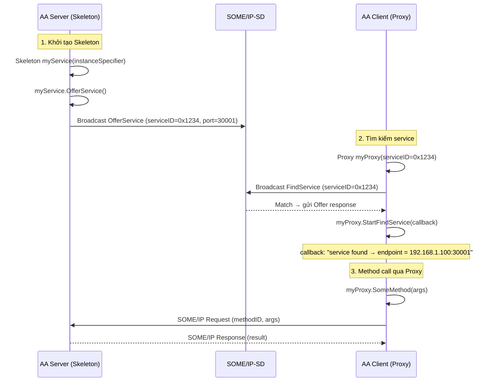
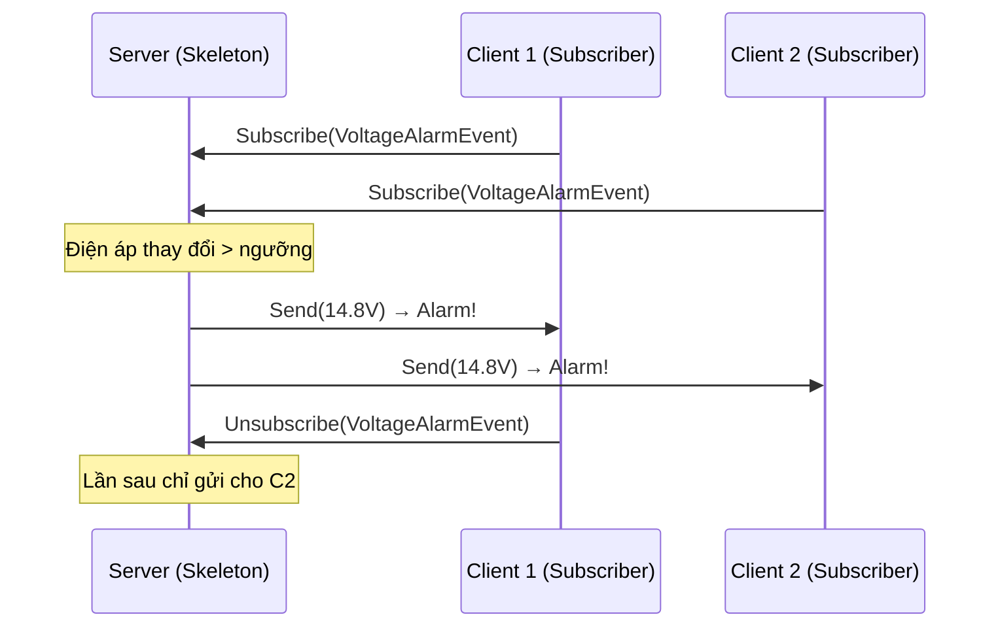
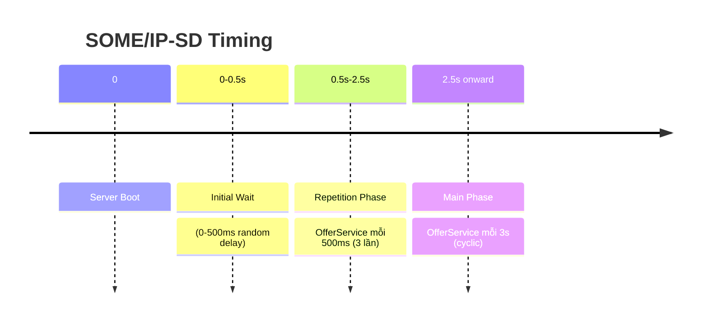
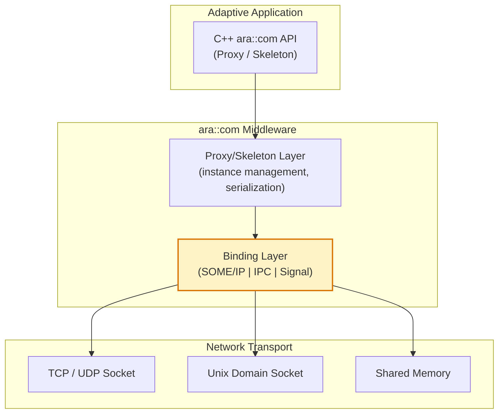
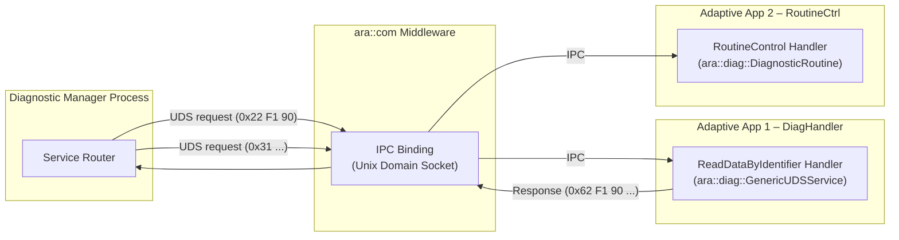

# ara::com – Tầng Giao tiếp Trung gian của AUTOSAR Adaptive Platform

> **Nguồn tham chiếu:**
> - [AUTOSAR AP SWS Communication Management R25-11](https://www.autosar.org/fileadmin/standards/R25-11/AP/AUTOSAR_AP_SWS_CommunicationManagement.pdf) – Specification of `ara::com`
> - [AUTOSAR AP SWS SOME/IP R25-11](https://www.autosar.org/fileadmin/standards/R25-11/AP/AUTOSAR_AP_SWS_SOMEIP.pdf) – SOME/IP Protocol Binding
> - [AUTOSAR AP TPS Manifest R25-11](https://www.autosar.org/fileadmin/standards/R25-11/AP/AUTOSAR_AP_TPS_Manifest.pdf) – Service Interface & Manifest
> - ISO 13400-2:2019 – DoIP Transport

---

## 1. Tổng quan về `ara::com`

`ara::com` là **Functional Cluster** trung tâm của AUTOSAR Adaptive Platform, chịu trách nhiệm
toàn bộ giao tiếp giữa các **Adaptive Application (AA)** trong một node và giữa các node với nhau.
Nó là phiên bản "SOA hóa" của RTE (Runtime Environment) trong Classic Platform.

### 1.1 Vị trí trong AP Stack




> **So sánh với Classic Platform:**
>
> | Classic RTE | Adaptive `ara::com` |
> |---|---|
> | Cấu hình tĩnh (compile-time) | Cấu hình qua manifest (runtime deployment) |
> | Gọi hàm trực tiếp qua RTE | Gọi dịch vụ qua Proxy/Skeleton pattern |
> | Single-ECU, single-core | Multi-node, multi-core, multi-process |
> | C – function call | C++ – object-oriented, Future-based async |
> | Không service discovery | SOME/IP-SD tự động tìm/deregister service |

### 1.2 Vai trò của `ara::com` trong Stack



---

## 2. Service-Oriented Architecture (SOA) – Mô hình Kiến trúc Hướng Dịch vụ

Trái ngược với giao tiếp signal-oriented của CP (CAN signal mapping),
`ara::com` xoay quanh khái niệm **Service** – một tập hợp các **Method**, **Event**, và **Field**
có ý nghĩa nghiệp vụ rõ ràng.

### 2.1 Service Interface

**Service Interface** là định nghĩa trừu tượng của một service, được khai báo độc lập với
implementation và deployment. Một Service Interface gồm ba loại "port":

| Thành phần | Từ khóa C++ | Mô tả | Ví dụ |
|---|---|---|---|
| **Method** | `ara::com::Method` | Hàm có request/response, gọi đồng bộ hoặc bất đồng bộ | `AdjustMirrorPosition(x, y)` → `Result` |
| **Event** | `ara::com::Event` | Gửi dữ liệu từ server → client(s), không có response | `VehicleSpeedEvent(120 km/h)` |
| **Field** | `ara::com::Field` | Dữ liệu có trạng thái: get/set + notification khi thay đổi | `BatteryVoltage` (get, set, subscribe) |

> **💡 Điểm mấu chốt:** Service Interface là **hợp đồng** giữa client và server.
> Nó được định nghĩa trong ARXML (hoặc C++ header generated từ ARXML),
> không phải trong code viết tay.

### 2.2 Service Instance vs. Service Interface

- **Service Interface:** Kiểu (type) – giống như `class` trong C++
- **Service Instance:** Đối tượng cụ thể (concrete) – giống như một `object`
- Một Interface có thể có **nhiều Instance** trên cùng một node hoặc nhiều node

```cpp
// Service Interface: com::mycompany::IMirrorAdjustment
// Service Instance 1: MirrorAdjustment_DriverSide  (port 30001)
// Service Instance 2: MirrorAdjustment_PassengerSide (port 30002)

// Cả hai instance đều cùng interface, nhưng endpoint khác nhau
```

### 2.3 SOA vs. Signal-Oriented – So sánh trực quan

```plaintext
SIGNAL-ORIENTED (Classic Platform)
====================================
  SWC_A ──┬── signal_SensorRaw (0x123, 2 bytes) ──▶ SWC_B
          └── signal_Status     (0x124, 1 byte)  ──▶ SWC_C

  → Gửi tín hiệu thô, receiver phải tự map ý nghĩa
  → Cấu hình tĩnh tại COM stack

SERVICE-ORIENTED (Adaptive Platform)
=====================================
  AA_A ──┬── GetTemperature() → float             ──▶ AA_B
          └── SubscribeTemperatureEvent() → stream ──▶ AA_C

  → Gọi phương thức / đăng ký sự kiện có ngữ nghĩa rõ ràng
  → Tự động discovery qua SOME/IP-SD
```

---

## 3. Proxy & Skeleton Pattern

`ara::com` triển khai mẫu thiết kế **Proxy / Skeleton** (còn gọi là **Broker pattern**):

```
  ┌──────────────┐          ┌──────────────────┐          ┌──────────────┐
  │  Client AA   │          │   ara::com       │          │  Server AA   │
  │  (Proxy)     │◄────────►│   Middleware     │◄────────►│  (Skeleton)  │
  └──────────────┘          │   + Binding      │          └──────────────┘
                            └──────────────────┘
```

- **Proxy (Client-side):** Object đại diện cho service ở phía client. Client gọi method
  trên Proxy → Proxy serialize request → gửi qua network → nhận response → deserialize → trả kết quả.
- **Skeleton (Server-side):** Object đại diện cho service ở phía server. Skeleton nhận
  request từ network → deserialize → gọi implementation method → serialize response → gửi lại.

### 3.1 Lifecycle: Offer / Find / Subscribe



### 3.2 Proxy – Phía Client

```cpp
// ===== Client: sử dụng Proxy để gọi service =====

#include "ara/com/someip/someip_proxy.h"
#include "generated/IBatteryManager_proxy.h"

using namespace com::mycompany;

int main() {
    // 1. Khởi tạo Proxy với InstanceSpecifier từ manifest
    ara::core::InstanceSpecifier spec{"BatteryManager_SensorProxy"};
    IBatteryManagerProxy proxy(spec);

    // 2. Tìm service bất đồng bộ
    auto findHandle = proxy.StartFindService(
        [&proxy](ara::com::ServiceHandleContainer<IBatteryManagerProxy::HandleType> handles) {
            if (!handles.empty()) {
                std::cout << "✅ Service BatteryManager found!" << std::endl;
                // Service đã sẵn sàng – có thể gọi method
            }
        }
    );

    // 3. Gọi Method – bất đồng bộ với Future
    auto future = proxy.GetVoltage(ara::com::MethodCallInfo{});

    // Chờ kết quả
    auto status = future.wait_for(std::chrono::seconds(2));
    if (status == ara::core::FutureStatus::Ready) {
        auto result = future.get();
        if (result.HasValue()) {
            float voltage = result.Value();
            std::cout << "Battery voltage: " << voltage << " V" << std::endl;
        }
    }

    // 4. Subscribe Event
    auto sub = proxy.VoltageAlarmEvent.subscribe(/* event handler */);

    // 5. Dọn dẹp
    proxy.StopFindService(findHandle);
    return 0;
}
```

### 3.3 Skeleton – Phía Server

```cpp
// ===== Server: triển khai Skeleton =====

#include "ara/com/someip/someip_skeleton.h"
#include "generated/IBatteryManager_skeleton.h"

using namespace com::mycompany;

class BatteryManagerSkeleton
    : public IBatteryManagerSkeleton {

private:
    float currentVoltage_ = 12.6f;

public:
    // Constructor – nhận InstanceSpecifier từ manifest
    explicit BatteryManagerSkeleton(
        const ara::core::InstanceSpecifier& spec)
        : IBatteryManagerSkeleton(spec) {}

    // Triển khai method GetVoltage (override từ generated class)
    ara::core::Future<GetVoltageOutput> GetVoltage(
        const ara::com::MethodCallInfo& callInfo) override
    {
        // Tạo Promise và set value
        ara::core::Promise<GetVoltageOutput> promise;
        GetVoltageOutput output;
        output.voltage = currentVoltage_;
        promise.set_value(output);
        return promise.get_future();
    }

    // Gửi Event khi điện áp thay đổi
    void UpdateVoltage(float newVoltage) {
        if (std::abs(newVoltage - currentVoltage_) > 0.1f) {
            currentVoltage_ = newVoltage;
            // Broadcast event đến tất cả subscriber
            VoltageAlarmEvent.Send(currentVoltage_);
        }
    }
};

int main() {
    // 1. Khởi tạo Skeleton
    BatteryManagerSkeleton skeleton(
        ara::core::InstanceSpecifier{"BatteryManager_Monitor"}
    );

    // 2. Offer service – bắt đầu lắng nghe request từ network
    skeleton.OfferService();

    // 3. Vòng lặp chính
    while (true) {
        std::this_thread::sleep_for(std::chrono::seconds(1));
        skeleton.UpdateVoltage(12.5f + (rand() % 10) / 10.0f);
    }

    skeleton.StopOffer();
    return 0;
}
```

> **⚠️ Cạm bẫy phổ biến:** Quên gọi `OfferService()` hoặc gọi quá sớm trước khi
> service sẵn sàng sẽ dẫn đến `FindService` timeout bên client.
> Luôn đảm bảo Skeleton đã init xong mới Offer.

---

## 4. Các Communication Pattern

### 4.1 Method Call – Gọi hàm từ xa

Method là pattern **request/response**: client gửi request, server trả response.

| Kiểu | Mô tả | Khi nào dùng |
|---|---|---|
| **Sync (blocking)** | Thread client block đến khi có response | Hàm nhanh, thời gian chờ biết trước |
| **Async (Future)** | Trả về `ara::core::Future<T>` ngay lập tức | Hàm chậm, không block caller |
| **Fire & Forget** | Gửi request, không cần response | Logging, notification không quan trọng |

```cpp
// Async Method call với Future
ara::core::Future<GetVoltageOutput> future = proxy.GetVoltage({});

// Có thể wait, poll, hoặc attach callback
future.then([](ara::core::Future<GetVoltageOutput> f) {
    auto result = f.get();
    if (result.HasValue()) {
        // Xử lý kết quả
    }
});
```

### 4.2 Event – Sự kiện một chiều

Event là pattern **publish/subscribe**: server gửi event, tất cả subscriber nhận.



```cpp
// Client subscribe event
auto subscription = proxy.VoltageAlarmEvent.subscribe(
    [](const float& voltage) {
        // Callback: xử lý khi nhận event
        std::cout << "🚨 Voltage alarm: " << voltage << "V" << std::endl;
    },
    [](const ara::com::SubscriptionState& state) {
        // Callback: trạng thái subscription
        std::cout << (state == ara::com::SubscriptionState::kSubscribed
                      ? "Subscribed!" : "Pending...") << std::endl;
    }
);
```

### 4.3 Field – Thuộc tính có trạng thái

Field kết hợp **Method** + **Event**: có thể **get** (đọc), **set** (ghi),
và **subscribe** (nhận notification khi thay đổi).

| Thao tác | Ý nghĩa | Tương tự |
|---|---|---|
| `Field.Get()` | Đọc giá trị hiện tại | Method call |
| `Field.Set(value)` | Ghi giá trị mới | Method call |
| `Field.subscribe(callback)` | Nhận notification khi giá trị thay đổi | Event subscribe |

```cpp
// Đọc field
proxy.BatteryVoltage.Get().then([](auto f) {
    std::cout << "Battery: " << f.get().Value() << "V" << std::endl;
});

// Ghi field (nếu server cho phép set)
proxy.BatteryVoltage.Set(13.8f);

// Subscribe thay đổi field
proxy.BatteryVoltage.subscribe([](float newVoltage) {
    std::cout << "⚡ Voltage changed to " << newVoltage << "V" << std::endl;
});
```

---

## 5. Service Discovery – SOME/IP-SD

**SOME/IP-SD** (Service Discovery) là giao thức cho phép các node trong mạng Ethernet
tự động phát hiện service mà không cần cấu hình tĩnh địa chỉ IP/cổng.

### 5.1 Giao thức SD

SOME/IP-SD hoạt động qua **UDP multicast** với hai message chính:

| Message | Mục đích | Gửi bởi |
|---|---|---|
| **OfferService** | Server thông báo "tôi có service X tại endpoint Y" | Server |
| **FindService** | Client hỏi "ai có service X?" | Client |

```plaintext
UDP Multicast Group: 224.0.0.0 / Port: 30490

[Server] ─── OfferService(0x1234, 192.168.1.100:30001) ───▶ [Multicast]
[Client] ─── FindService(0x1234)                           ───▶ [Multicast]
[Server] ─── Unicast Response: OfferService(0x1234, ...)   ───▶ [Client]
```

### 5.2 Entry Types trong SD

| Entry Type | Giá trị | Ý nghĩa |
|---|---|---|
| `FIND_SERVICE` | 0x00 | Client tìm service |
| `OFFER_SERVICE` | 0x01 | Server quảng bá service |
| `STOP_OFFER_SERVICE` | 0x02 | Server dừng service |
| `SUBSCRIBE_EVENTGROUP` | 0x06 | Client đăng ký nhận event/filed |
| `STOP_SUBSCRIBE_EVENTGROUP` | 0x07 | Client hủy đăng ký |

### 5.3 Timing & Repetition

SOME/IP-SD có cơ chế **repetition phase** để đảm bảo phát hiện nhanh:



> **⚠️ Cạm bẫy:** Nếu Initial Wait trùng nhau giữa nhiều server (e.g. đồng loạt boot),
> có thể gây broadcast storm. AUTOSAR yêu cầu random delay 0-500ms để giảm xung đột.

---

## 6. Network Binding

`ara::com` hỗ trợ nhiều **binding** (phương thức vận chuyển) cho cùng một API.

### 6.1 Các loại Binding

| Binding | Giao thức | Use case |
|---|---|---|
| **SOME/IP** | TCP/UDP port | Giao tiếp giữa các node qua Ethernet |
| **IPC** | Unix Domain Socket / Shared Memory | Giao tiếp trong cùng một node, process khác nhau |
| **Signal-based** | CAN/LIN | Tương thích ngược với Classic Platform signals |

### 6.2 Binding Stack



### 6.3 SOME/IP Binding – Cấu trúc gói tin

SOME/IP header giúp định tuyến request đến đúng method/event:

```plaintext
SOME/IP PACKET FORMAT
┌──────────────────────────────┬──────────┐
│ Field                        │ Size     │
├──────────────────────────────┼──────────┤
│ Message ID (ServiceID + MethodID) │ 4 bytes │
│ Length                       │ 4 bytes  │
│ Request ID (ClientID + SessionID) │ 4 bytes │
│ Protocol Version (0x01)      │ 1 byte   │
│ Interface Version            │ 1 byte   │
│ Message Type                 │ 1 byte   │
│ Return Code                  │ 1 byte   │
├──────────────────────────────┼──────────┤
│ Payload (serialized data)    │ N bytes  │
└──────────────────────────────┴──────────┘
```

| Message Type | Value | Ý nghĩa |
|---|---|---|
| `REQUEST` | 0x00 | Request (cần response) |
| `REQUEST_NO_RETURN` | 0x01 | Fire & Forget |
| `NOTIFICATION` | 0x02 | Event notification |
| `RESPONSE` | 0x80 | Response thành công |

---

## 7. `ara::com` và `ara::diag` – Tích hợp với Diagnostic Stack

Trong kiến trúc UDS Adaptive, `ara::com` đóng vai trò **IPC middleware** giữa
**Diagnostic Manager (DM)** và **Adaptive Application handlers**.

### 7.1 DM sử dụng `ara::com` để giao tiếp với AA

Từ kiến trúc DM đã thấy ở phần trước:



### 7.2 Service-Oriented view của Diagnostic Stack

Từ góc nhìn `ara::com`, DM là một service provider, AA handlers là subscribers/nodes:

| `ara::com` concept | Trong DM context |
|---|---|
| **Skeleton (Server)** | DM – nhận UDS request từ DoIP, gọi phương thức xử lý |
| **Proxy (Client)** | Mỗi AA handler – đăng ký SID, nhận request từ DM |
| **Event** | DEM event notification (DTC change) |
| **Method** | Xử lý UDS request và trả response |
| **Service Discovery** | DM đăng ký với SOME/IP-SD: "tôi hỗ trợ UDS" |

```cpp
// ===== Một Adaptive Application handler đăng ký với DM qua ara::com =====

#include "ara/diag/generic_uds_service.h"

class MyDiagHandler : public ara::diag::GenericUDSService {
public:
    explicit MyDiagHandler(const ara::core::InstanceSpecifier& spec)
        : ara::diag::GenericUDSService(spec)
    {
        // InstanceSpecifier này map đến ARXML entry
        // ARXML định nghĩa SID, sub-function, và endpoint ara::com
    }

    // Hàm này được DM gọi qua ara::com IPC khi nhận UDS request
    ara::core::Future<ara::diag::OperationOutput> HandleMessage(
        const ara::diag::RequestData&     request,
        ara::diag::MetaInfo&              metaInfo,
        ara::diag::CancellationHandler&   cancelHandler
    ) override
    {
        // Xử lý UDS request
        // ...
    }
};

// Trong main():
MyDiagHandler handler(ara::core::InstanceSpecifier{"MyHandler"});
handler.Offer();  // → gọi OfferService(ara::com) để DM có thể route request đến handler này

// handler.StopOffer(); // khi ứng dụng shutdown
```

> **💡 Điểm mấu chốt:** `ara::diag::GenericUDSService::Offer()` bên trong gọi
> `ara::com::Skeleton::OfferService()`. DM dùng `ara::com::Proxy` tương ứng để
> gọi `HandleMessage()` khi có UDS request từ tester.

---

## 8. Cấu hình Manifest (ARXML)

`ara::com` yêu cầu cấu hình qua **manifest** (ARXML hoặc JSON).
Đây là deployment descriptor giúp middleware biết:

- Service Interface nào được triển khai
- Instance nào chạy ở process nào, port nào
- Binding nào được dùng (SOME/IP, IPC)
- Endpoint (IP, port, protocol)

### 8.1 Ví dụ cấu hình Service Interface

```xml
<!-- ARXML: Định nghĩa Service Interface -->
<SERVICE-INTERFACE-DEF>
    <SHORT-NAME>IBatteryManager</SHORT-NAME>
    <METHODS>
        <METHOD-DEF>
            <SHORT-NAME>GetVoltage</SHORT-NAME>
            <ARGUMENT-DEF>
                <SHORT-NAME>voltage</SHORT-NAME>
                <DIRECTION>OUT</DIRECTION>
                <TYPE-TREF>float</TYPE-TREF>
            </ARGUMENT-DEF>
        </METHOD-DEF>
    </METHODS>
    <EVENTS>
        <EVENT-DEF>
            <SHORT-NAME>VoltageAlarmEvent</SHORT-NAME>
            <TYPE-TREF>float</TYPE-TREF>
        </EVENT-DEF>
    </EVENTS>
</SERVICE-INTERFACE-DEF>
```

### 8.2 Ví dụ cấu hình Deployment

```xml
<!-- ARXML: Machine & Network Endpoint -->
<MACHINE>
    <SHORT-NAME>MachineHPC</SHORT-NAME>
    <IP-ADDRESS>192.168.1.100</IP-ADDRESS>
    <NETWORK-ENDPOINT>
        <SHORT-NAME>DiagEndpoint</SHORT-NAME>
        <PORT>30001</PORT>
        <PROTOCOL>TCP</PROTOCOL>
    </NETWORK-ENDPOINT>
</MACHINE>

<!-- ARXML: Service Instance -->
<SERVICE-INSTANCE>
    <SHORT-NAME>BatteryServiceInstance</SHORT-NAME>
    <SERVICE-INTERFACE-REF>IBatteryManager</SERVICE-INTERFACE-REF>
    <SERVICE-ID>0x1234</SERVICE-ID>
    <INSTANCE-ID>0x0001</INSTANCE-ID>
    <NETWORK-BINDING>
        <ENDPOINT-REF>DiagEndpoint</ENDPOINT-REF>
    </NETWORK-BINDING>
</SERVICE-INSTANCE>
```

---

## 9. Tổng kết

### 9.1 Bảng kiến trúc

| Thành phần | Vai trò | Giao thức tương ứng |
|---|---|---|
| `ara::com` API (Proxy/Skeleton) | Giao tiếp AA với nhau | C++ object, Future-based |
| SOME/IP Binding | Serialization + transport cho Ethernet | SOME/IP (ServiceID, MethodID, payload) |
| SOME/IP-SD | Service Discovery tự động | UDP multicast (port 30490) |
| IPC Binding | Giao tiếp cùng node | Unix Domain Socket, Shared Memory |
| Manifest (ARXML) | Cấu hình deployment | ARXML, JSON |
| `ara::diag` over `ara::com` | DM ↔ AA handler | IPC Binding |

### 9.2 Bảng tóm tắt

| Kỹ thuật | Vấn đề giải quyết | Bối cảnh sử dụng |
|---|---|---|
| **Proxy/Skeleton Pattern** | Tách biệt interface khỏi implementation, che giấu network complexity | Mọi giao tiếp AA↔AA, AA↔DM |
| **SOME/IP-SD** | Tự động phát hiện service không cần cấu hình tĩnh IP/port | Mạng Ethernet động, nhiều ECU |
| **Future-based async** | Non-blocking IPC, không treo thread gọi | Method call lâu, event stream |
| **Event/Field subscribe** | Publish-subscribe một-nhiều, real-time notification | Cảm biến, alarm, trạng thái |

---

### Xem thêm

| Tài liệu | Mô tả |
|---|---|
| [ara::com – Intra-ECU & Inter-ECU]({{ '/ara-com/ara-com-intra-inter-ecu/' | relative_url }}) | Giao tiếp giữa các AA trong một ECU và giữa các ECU với nhau |
| [Phần 1 – OSI & Adaptive Communication]({{ '/uds-adaptive/uds-adaptive-p1/' | relative_url }}) | Vị trí của ara::com trong OSI stack |
| [UDS Adaptive – Phần 2: Kiến trúc DM]({{ '/uds-adaptive/uds-adaptive-p2/' | relative_url }}) | DM dùng ara::com để giao tiếp AA |
| [SOME/IP & Ethernet Automotive]({{ '/communication/ethernet-autosar-adaptive/' | relative_url }}) | Giao thức SOME/IP chi tiết |
| [AUTOSAR AP SWS Communication Management](https://www.autosar.org/fileadmin/standards/R25-11/AP/AUTOSAR_AP_SWS_CommunicationManagement.pdf) | Specification gốc của ara::com |
