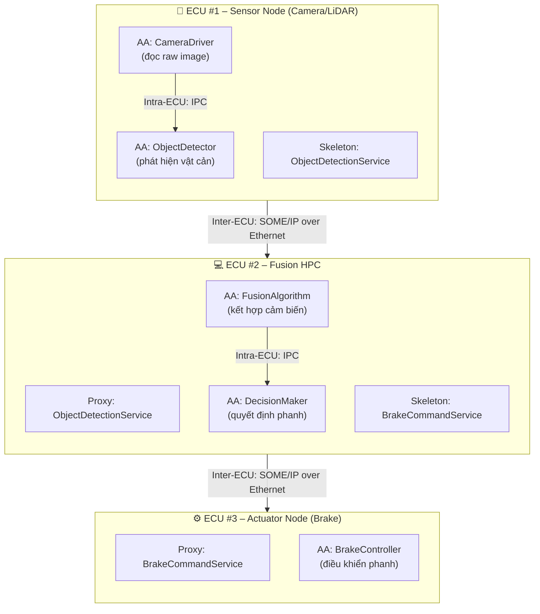
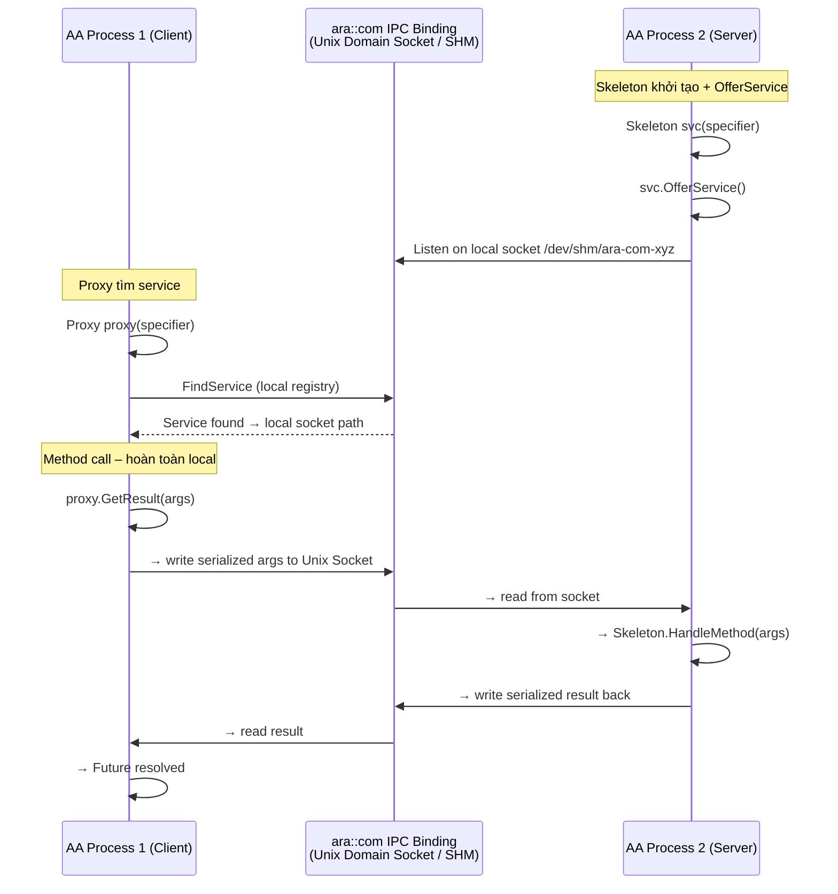
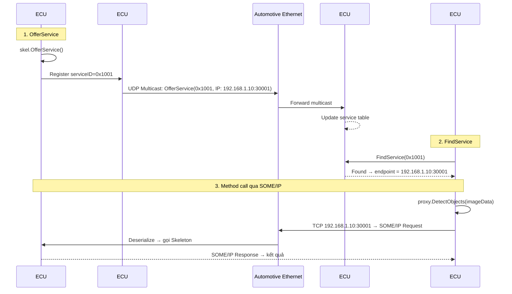
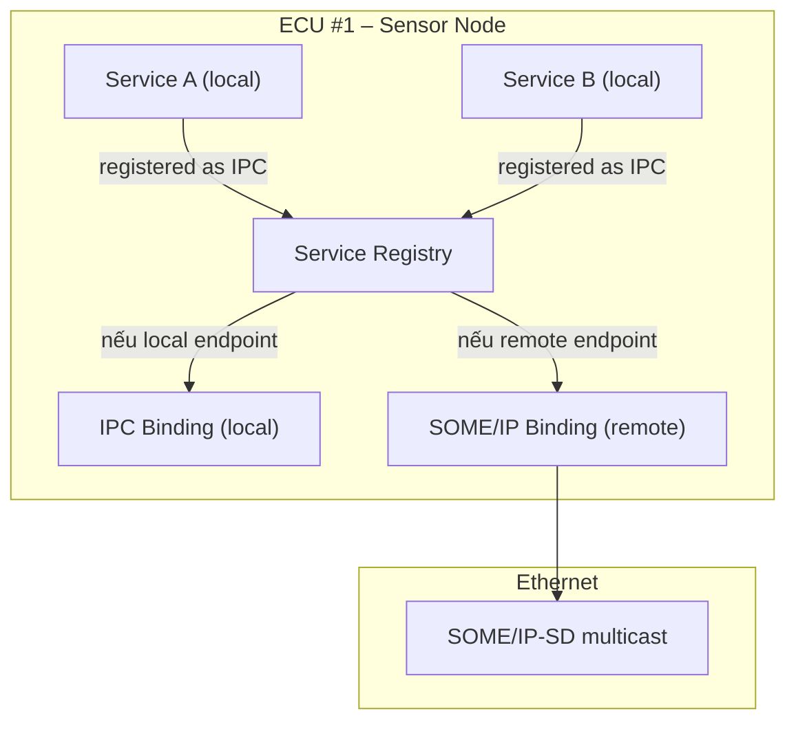
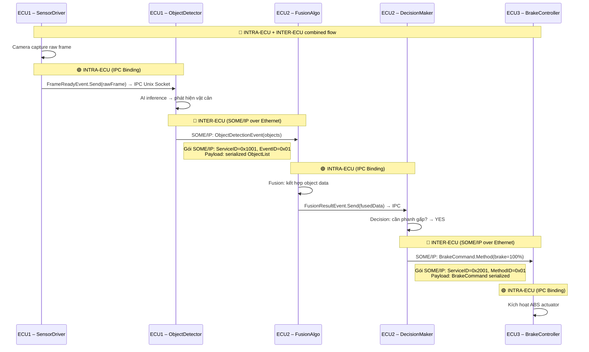

# ara::com – Giao tiếp Intra-ECU & Inter-ECU

> **Nguồn tham chiếu:**
> - [AUTOSAR AP SWS Communication Management R25-11](https://www.autosar.org/fileadmin/standards/R25-11/AP/AUTOSAR_AP_SWS_CommunicationManagement.pdf)
> - [AUTOSAR AP SWS SOME/IP R25-11](https://www.autosar.org/fileadmin/standards/R25-11/AP/AUTOSAR_AP_SWS_SOMEIP.pdf)
> - [AUTOSAR AP TPS Manifest R25-11](https://www.autosar.org/fileadmin/standards/R25-11/AP/AUTOSAR_AP_TPS_Manifest.pdf)

---

## 1. Bức tranh toàn cảnh

Trong một hệ thống ô tô hiện đại trên AUTOSAR Adaptive Platform, **một tính năng duy nhất**
(thí dụ: phanh khẩn cấp tự động AEB) liên quan đến **nhiều ECU** và **nhiều Adaptive Application (AA)**
trên mỗi ECU.



**Hai câu hỏi cốt lõi mà `ara::com` giải quyết:**

1. **Intra-ECU:** Làm sao AA chạy trên cùng một ECU có thể gọi service của nhau nhanh nhất?
2. **Inter-ECU:** Làm sao AA trên ECU khác nhau có thể gọi service của nhau qua mạng?

---

## 2. Giao tiếp nội bộ ECU – Intra-ECU

### 2.1 Vấn đề

Các AA trên cùng một ECU chạy trong **process riêng biệt** (isolated memory space).
AA-A không thể gọi hàm C++ trực tiếp vào AA-B vì khác process.

### 2.2 Giải pháp: IPC Binding

`ara::com` sử dụng **IPC Binding** (Inter-Process Communication) cho giao tiếp nội bộ:

- **Unix Domain Socket (UDS):** Kết nối socket local, không qua network stack
- **Shared Memory (SHM):** Vùng nhớ dùng chung, zero-copy cho dữ liệu lớn

```plaintext
ECU #1 – Single Physical Node
══════════════════════════════

╔══════════════════════════════════════════════════════╗
║                  POSIX OS (Linux/QNX)                ║
║                                                      ║
║  ┌──────────────── Process Boundary ──────────────┐  ║
║                                                      ║
║  ┌─────────────┐                    ┌─────────────┐  ║
║  │  Process A  │                    │  Process B  │  ║
║  │ (AA: Sensor)│                    │ (AA: Fusion)│  ║
║  │             │                    │             │  ║
║  │ Proxy ─────── IPC (Unix Socket) ───── Skeleton │  ║ 
║  │             │                    │             │  ║
║  └─────────────┘                    └─────────────┘  ║
║                                                      ║
╚══════════════════════════════════════════════════════╝
```

### 2.3 IPC Binding hoạt động thế nào?



### 2.4 Ví dụ: 3 AA trên cùng một ECU

```cpp
// ===== ECU #1 – Cấu hình máy ảo: 3 process, 3 AA =====

// ─── Process 1: SensorDriver (Server: cung cấp dữ liệu cảm biến) ───
// File: ecu1_sensor/main.cpp

#include "ara/com/ipc/ipc_skeleton.h"
#include "generated/ISensorData_skeleton.h"

class SensorDataSkeleton : public ISensorDataSkeleton {
    float lastDistance_ = 0.0f;
public:
    explicit SensorDataSkeleton(const ara::core::InstanceSpecifier& spec)
        : ISensorDataSkeleton(spec) {}

    // Được các AA khác gọi qua IPC để lấy khoảng cách vật cản
    ara::core::Future<GetDistanceOutput> GetDistance(
        const ara::com::MethodCallInfo&) override
    {
        ara::core::Promise<GetDistanceOutput> promise;
        GetDistanceOutput out;
        out.distance = lastDistance_;
        promise.set_value(out);
        return promise.get_future();
    }

    // Send event qua IPC – tất cả subscriber trong ECU đều nhận
    void OnObstacleDetected(float distance) {
        lastDistance_ = distance;
        ObstacleAlertEvent.Send(distance);
    }
};

int main() {
    SensorDataSkeleton skel(ara::core::InstanceSpecifier{"SensorDataService"});
    skel.OfferService();  // Đăng ký với ara::com IPC Binding → local socket
    // ... event loop
    skel.StopOffer();
}


// ─── Process 2: Logger (Client: subscribe event từ SensorDriver) ───
// File: ecu1_logger/main.cpp

#include "ara/com/ipc/ipc_proxy.h"
#include "generated/ISensorData_proxy.h"

int main() {
    ISensorDataProxy proxy(ara::core::InstanceSpecifier{"SensorDataProxy"});

    proxy.StartFindService([&proxy](auto handles) {
        if (!handles.empty()) {
            std::cout << "[Logger] SensorData service found locally!" << std::endl;

            // Subscribe event – IPC Binding đảm bảo nhận cùng process boundary
            proxy.ObstacleAlertEvent.subscribe(
                [](float distance) {
                    std::cout << "[Logger] 📢 Obstacle at " << distance << "m" << std::endl;
                }
            );
        }
    });

    // Subscribe Field
    proxy.SystemVoltage.subscribe([](float v) {
        std::cout << "[Logger] ⚡ Voltage: " << v << "V" << std::endl;
    });

    std::this_thread::sleep_for(std::chrono::hours(1));
}


// ─── Process 3: HealthMonitor (Client: gọi Method định kỳ) ───
// File: ecu1_health/main.cpp

#include "ara/com/ipc/ipc_proxy.h"
#include "generated/ISensorData_proxy.h"

int main() {
    ISensorDataProxy proxy(ara::core::InstanceSpecifier{"SensorDataProxy"});

    proxy.StartFindService([&proxy](auto handles) {
        if (!handles.empty()) {
            std::cout << "[HealthMonitor] Connected to SensorData" << std::endl;
        }
    });

    while (true) {
        // Gọi Method – local IPC, latency ~microseconds
        auto future = proxy.GetDistance({});
        if (future.wait_for(std::chrono::milliseconds(100))
            == ara::core::FutureStatus::Ready)
        {
            float d = future.get().Value().distance;
            std::cout << "[HealthMonitor] Current distance: " << d << "m" << std::endl;
        }
        std::this_thread::sleep_for(std::chrono::seconds(1));
    }
}
```

### 2.5 Intra-ECU: IPC Binding Performance

| Yếu tố | IPC (Unix Socket) | IPC (Shared Memory) |
|---|---|---|
| **Latency** | ~1–10 µs | <1 µs |
| **Throughput** | ~1 GB/s | >10 GB/s |
| **Dùng cho** | Method call, event | Dữ liệu lớn (camera frame, point cloud) |
| **Zero-copy** | Không (cần copy qua kernel) | Có (map trực tiếp) |

> **💡 Điểm mấu chốt:** IPC Binding là lựa chọn mặc định cho mọi giao tiếp intra-ECU.
> SOME/IP Binding không được dùng trong nội bộ ECU vì overhead TCP/IP không cần thiết.

---

## 3. Giao tiếp giữa các ECU – Inter-ECU

### 3.1 Vấn đề

ECU #1 và ECU #2 nằm trên hai bo mạch riêng, kết nối qua **Automotive Ethernet** (100BASE-T1 / 1000BASE-T1).
AA trên các ECU khác nhau cần giao tiếp như thể chúng ở cùng ECU.

### 3.2 Giải pháp: SOME/IP Binding

`ara::com` sử dụng **SOME/IP Binding** cho giao tiếp giữa các ECU:

- **SOME/IP Protocol:** Serialization + header định tuyến qua TCP/UDP
- **SOME/IP-SD (Service Discovery):** Tự động tìm service trên mạng

```plaintext
ECU #1 (Sensor)          ──── Ethernet ────    ECU #2 (HPC)
═══════════════════════╗│     ║
║                        │                          ║
║  AA: CameraDriver      │                          ║  AA: FusionAlgorithm
║    ↓ (IPC)             │                          ║    ↑
║  Skeleton: ObjDetect ──┼── SOME/IP ──────────────┼── Proxy: ObjDetect
║                        │                          ║
╚════════════════════════╝                          ╚════════════════════════╝
```

### 3.3 SOME/IP Binding hoạt động thế nào?



### 3.4 Ví dụ: 3 ECU giao tiếp với nhau

Xét hệ thống 3 ECU như mục 1:

```cpp
// ====================================================================
// ECU #2 – Fusion HPC (vừa là client của ECU1, vừa là server cho ECU3)
// ====================================================================

#include "ara/com/someip/someip_proxy.h"
#include "ara/com/someip/someip_skeleton.h"
#include "generated/IObjectDetection_proxy.h"
#include "generated/IBrakeCommand_skeleton."

// ─── Phần 1: Proxy gọi service ObjectDetection từ ECU #1 ───
class FusionSystem {
    IObjectDetectionProxy objProxy_;
    IBrakeCommandSkeleton brakeSkel_;

public:
    FusionSystem()
        : objProxy_(ara::core::InstanceSpecifier{"ObjectDetectionProxy"})
        , brakeSkel_(ara::core::core::InstanceSpecifier{"BrakeCommandSkeleton"})
    {}

    void Start() {
        // Tìm ObjectDetectionService từ ECU #1 (qua SOME/IP-SD)
        objProxy_.StartFindService(
            [this](auto handles) {
                if (handles.empty()) return;
                std::cout << "[Fusion] 🔍 Found ObjectDetection on ECU #1!" << std::endl;

                // Gửi ảnh sang ECU #1 để detect (Inter-ECU via SOME/IP)
                auto future = objProxy_.DetectObjects(ImageData{/*...*/});
                future.then([this](auto f) {
                    auto result = f.get();
                    if (result.HasValue()) {
                        auto objects = result.Value().objects;
                        std::cout << "[Fusion] 🎯 Detected " << objects.size()
                                  << " objects" << std::endl;

                        // Quyết định phanh
                        bool needBrake = Evaluate(objects);

                        // Gửi lệnh phanh sang ECU #3 (Inter-ECU via SOME/IP)
                        if (needBrake) {
                            brakeSkel_.BrakeCommandEvent.Send(
                                BrakeCommand{100, 0.8f}  // 100% pressure, 0.8s ramp
                            );
                        }
                    }
                });
            }
        );

        // Offer BrakeCommandService cho ECU #3
        brakeSkel_.OfferService();
        std::cout << "[Fusion] 🛑 BrakeCommandService offered for ECU #3" << std::endl;
    }
};
```

---

## 4. Cơ chế định tuyến: Làm sao `ara::com` biết service ở local hay remote?

### 4.1 Service Registry

Mỗi ECU có một **Service Registry** nội bộ, quản lý bởi `ara::com` middleware:



Khi một AA gọi `FindService()`, `ara::com` làm:

```
1. Kiểm tra Service Registry local → có service nào khớp không?
   ├── Có:  → Dùng IPC Binding (Unix Socket / SHM)
   └── Không: → Gửi SOME/IP-SD FindService broadcast qua mạng
                └── Có ECU remote trả lời → Dùng SOME/IP Binding
                     (TCP/UDP đến IP:Port của ECU đó)
```

### 4.2 InstanceSpecifier – Chìa khóa định tuyến

`InstanceSpecifier` là string định danh duy nhất, map đến một **Service Instance** trong manifest.
Manifest khai báo instance đó dùng binding nào.

```xml
<!-- ARXML Manifest: Khai báo binding cho từng instance -->
<SERVICE-INSTANCE>
    <SHORT-NAME>ObjectDetection_ECU1</SHORT-NAME>

    <!-- Intra-ECU: các AA trên cùng ECU #1 dùng IPC -->
    <IPC-BINDING>
        <SOCKET-PATH>/var/run/ara-com/objdetect.sock</SOCKET-PATH>
    </IPC-BINDING>

    <!-- Inter-ECU: ECU #2 truy cập qua SOME/IP -->
    <SOMEIP-BINDING>
        <UDP-PORT>30001</UDP-PORT>
        <TCP-PORT>30002</TCP-PORT>
        <MULTICAST-IP>224.0.0.1</MULTICAST-PORT>30490</MULTICAST-PORT>
    </SOMEIP-BINDING>
</SERVICE-INSTANCE>
```

> **💡 Điểm mấu chốt:** **Một service instance có thể có cả IPC lẫn SOME/IP binding**.
> AA trong cùng ECU gọi qua IPC (nhanh), AA ở ECU khác gọi qua SOME/IP (mạng).
> `ara::com` tự động chọn binding phù hợp dựa trên vị trí của caller.

---

## 5. Luồng dữ liệu toàn diện: Intra + Inter kết hợp

### 5.1 Kịch bản: Hệ thống 3 ECU – AEB (Sensor → Fusion → Actuator)



### 5.2 Nhìn từ góc độ binding

```mermaid
flowchart LR
    subgraph ECU1["ECU #1 – Sensor"]
        direction TB
        APP1A["AA: CameraDriver"]
        APP1B["AA: ObjectDetector"]
        IPC1["IPC Binding 🔗"]
        SOMEIP1["SOME/IP Binding 🌐"]
    end

    subgraph ECU2["ECU #2 – Fusion HPC"]
        direction TB
        APP2A["AA: FusionAlgo"]
        APP2B["AA: DecisionMaker"]
        IPC2["IPC Binding 🔗"]
        SOMEIP2["SOME/IP Binding 🌐"]
    end

    subgraph ECU3["ECU #3 – Brake Actuator"]
        direction TB
        APP3A["AA: BrakeController"]
        IPC3["IPC Binding 🔗"]
        SOMEIP3["SOME/IP Binding 🌐"]
    end

    %% Intra-ECU
    APP1A <--> IPC1 <--> APP1B
    APP2A <--> IPC2 <--> APP2B
    APP3A <--> IPC3

    %% Inter-ECU
    APP1B <--> SOMEIP1
    SOMEIP1 <==>|Ethernet 1000BASE-T1==> SOMEIP2
    SOMEIP2 <--> APP2A
    APP2B <--> SOMEIP2
    SOMEIP2 <==thernet 1000BASE-T1==> SOMEIP3
    SOMEIP3 <--> APP3A

    style IPC1 fill:#d1fae5,stroke:#059669
    style IPC2 fill:#d1fae5,stroke:#059669
    style IPC3 fill:#d1fae5,stroke:#059669
    style SOMEIP1 fill:#dbeafe,stroke:#2563eb
    style SOMEIP2 fill:#dbeafe,stroke:#2563eb
    style SOMEIP3 fill:#dbeafe,stroke:#2563eb
```

### 5.3 Mã nguồn mô phỏng kịch bản 3 ECU

```cpp
// ============================================================
// ECU #1 – CameraDriver.cpp  (Intra-ECU: gửi event cho ObjectDetector)
// ============================================================

#include "generated/ICameraFrame_skeleton.h"

class CameraDriverSkeleton : public ICameraFrameSkeleton {
public:
    void CaptureAndSend() {
        CameraFrame frame = CaptureFromSensor();  // đọc raw từ camera

        // Intra-ECU: gửi frame qua IPC Binding
        // → ObjectDetectedEvent.Send(frame);

        // Inter-ECU: ECU #2 có đăng ký thì cũng nhận được qua SOME/IP Binding
        // (binding do manifest quyết định)
    }
};


// ============================================================
// ECU #1 – ObjectDetector.cpp  (Intra + Inter: detect xong gửi đi xa)
// ============================================================

#include "generated/IObjectDetection_skeleton.h"

class ObjectDetectorSkeleton : public IObjectDetectionSkeleton {
public:
    ara::core::Future<DetectObjectsOutput> DetectObjects(
        const ara::com::MethodCallInfo&, const ImageData& img) override
    {
        // Được gọi bởi:
        //   - ECU #2 FusionAlgo qua SOME/IP (Inter-ECU)
        //   - Các AA trên ECU #1 qua IPC (Intra-ECU)
        // ara::com tự động chọn binding – code không thay đổi!

        ara::core::Promise<DetectObjectsOutput> promise;
        auto objects = RunInference(img);  // AI inference
        promise.set_value({objects});
        return promise.get_future();
    }
};


// ============================================================
// ECU #2 – FusionAlgo.cpp  (Client của ECU1, Server cho local AA)
// ============================================================

#include "generated/IObjectDetection_proxy.h"
#include "generated/IFusionResult_skeleton.h"

class FusionSystem {
    IObjectDetectionProxy objDetectProxy_;  // Proxy → ECU #1 (SOME/IP)
    IFusionResultSkeleton fusionSkel_;      // Skeleton → local AA (IPC)

public:
    void Run() {
        // Gọi DetectObjects – ara::com tự động chọn SOME/IP Binding
        // vì service ObjectDetection ở ECU xa
        objDetectProxy_.DetectObjects(currentFrame_)
            .then([this](auto f) {
                auto result = f.get().Value();

                // Gửi kết quả fusion cho DecisionMaker trong cùng ECU
                // → IPC Binding (nhanh, local)
                fusionSkel_.FusionResultEvent.Send(result);
            });
    }
};


// ============================================================
// ECU #3 – BrakeController.cpp  (Client của ECU2)
// ============================================================

#include "generated/IBrakeCommand_proxy.h"

class BrakeController {
    IBrakeCommandProxy brakeProxy_;  // Proxy → ECU #2 (SOME/IP)

public:
    void MonitorBrakeCommands() {
        brakeProxy_.BrakeCommandEvent.subscribe(
            [](const BrakeCommand& cmd) {
                // Nhận lệnh phanh từ ECU #2 qua SOME/IP
                std::cout << "[Brake] 🛑 Apply " << cmd.pressurePercent
                          << "% pressure" << std::endl;
                ActuateBrake(cmd);
            }
        );
    }
};
```

> **💡 Điểm mấu chốt:** Code của AA **không thay đổi** dù service ở local hay remote.
> `ara::com` và manifest quyết định binding. Đây là sức mạnh của **Location Transparency**.

---

## 6. Intra-ECU vs Inter-ECU: So sánh chi tiết

| Tiêu chí | Intra-ECU (IPC Binding) | Inter-ECU (SOME/IP Binding) |
|---|---|---|
| **Physical path** | Cùng bo mạch, cùng RAM | Qua cáp Ethernet (100BASE-T1) |
| **Latency** | 1–10 µs | 100–1000 µs |
| **Jitter** | Rất thấp (±1 µs) | Phụ thuộc switch tải |
| **Throughput** | GB/s (Shared Memory) | 100 Mbit/s – 1 Gbit/s |
| **Protocol overhead** | Minimal (socket write/read) | SOME/IP header (16 bytes) + TCP/IP |
| **Discovery** | Local registry (instant) | SOME/IP-SD (multicast, ~500ms) |
| **Security boundary** | Same OS, same trust domain | Network isolation, cần MACsec/TLS |
| **Reliability** | OS process lifecycle | TCP retransmit, timeout |
| **Dùng cho** | Method call nhanh, event real-time, dữ liệu lớn nội bộ | Dịch vụ phân tán, cross-ECU |

---

## 7. Cấu hình Manifest cho Intra/Inter

Manifest quyết định `ara::com` dùng binding nào. Cùng service, có thể có cả hai:

```xml
<!-- ARXML: Dual-binding cho cùng Service Instance -->
<SERVICE-INSTANCE>
    <SHORT-NAME>ObjectDetectionService</SHORT-NAME>
    <SERVICE-ID>0x1001</SERVICE-ID>

    <!-- Intra-ECU: local AA gọi qua IPC -->
    <IPC-BINDING>
        <IPC-ADDRESS>/var/run/ara-com/objdetect</IPC-ADDRESS>
        <IPC-PROTOCOL>UNIX-DOMAIN-SOCKET</IPC-PROTOCOL>
    </IPC-BINDING>

    <!-- Inter-ECU: remote ECU gọi qua SOME/IP -->
    <SOMEIP-BINDING>
        <ENDPOINT>
            <IP-ADDRESS>192.168.1.10</IP-ADDRESS>
            <PORT>30001</PORT>
            <PROTOCOL>TCP</PROTOCOL>
        </ENDPOINT>
        <SD-CONFIG>
            <OFFER-CYCLIC-TIME-MS>3000</OFFER-CYCLIC-TIME-MS>
        </SD-CONFIG>
    </SOMEIP-BINDING>
</SERVICE-INSTANCE>
```

Khi một AA gọi `FindService("ObjectDetectionService")`:

```plaintext
AA trên ECU #1:
  → ara::com thấy service có IPC Binding → dùng Unix Socket → local

AA trên ECU #2:
  → ara::com không thấy IPC Binding local
  → Gửi SOME/IP-SD FindService broadcast
  → ECU #1 trả OfferService → endpoint = 192.168.1.10:30001
  → Dùng SOME/IP Binding → TCP đến ECU #1
```

---

## 8. Tổng kết

### 8.1 Bảng kiến trúc

| Mô hình | Binding | Giao thức | Latency | Dùng khi |
|---|---|---|---|---|
| **Intra-ECU** (cùng ECU) | IPC | Unix Socket / SHM | ~µs | Giao tiếp nội bộ, real-time critical |
| **Inter-ECU** (khác ECU) | SOME/IP | TCP/UDP over Ethernet | ~ms | Giao tiếp cross-ECU, service-oriented |

### 8.2 Bảng tóm tắt

| Kỹ thuật | Vấn đề giải quyết | Bối cảnh sử dụng |
|---|---|---|
|---|---|---|---|
| **IPC Binding** | AA trên cùng ECU giao tiếp nhanh, không qua network | Sensor → Fusion, Fusion → Decision, trong 1 ECU |
| **SOME/IP Binding** | AA trên ECU khác nhau giao tiếp qua mạng | ECU#1 Sensor → ECU#2 HPC → ECU#3 Actuator |
| **Dual-binding** | Một service phục vụ cả local lẫn remote | ObjectDetectionService: local AA dùng IPC, remote AA dùng SOME/IP |
| **Location Transparency** | Code AA không cần biết service ở đâu | `proxy.Method()` – tự động chọn binding |

---

### Xem thêm

| Tài liệu | Mô tả |
|---|---|
| [ara::com – Tổng quan]({{ '/ara-com/ara-com-overview/' | relative_url }}) | Proxy/Skeleton, SOA, cấu trúc cơ bản |
| [ara::com & Mô hình OSI]({{ '/ara-com/ara-com-osi/' | relative_url }}) | Vị trí của ara::com và SOME/IP trong OSI |
| [SOME/IP & Ethernet Automotive]({{ '/communication/ethernet-autosar-adaptive/' | relative_url }}) | Chi tiết giao thức SOME/IP |
| [UDS Adaptive – Kiến trúc DM]({{ '/uds-adaptive/uds-adaptive-p2/' | relative_url }}) | DM dùng ara::com IPC để giao tiếp AA |