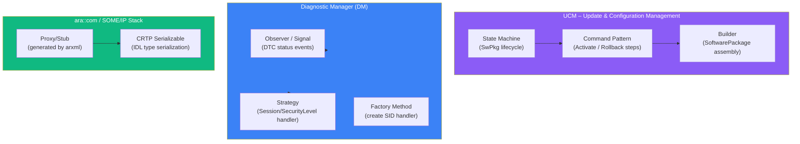

# Advanced C++ – Phần 4: Design Patterns & AP Architecture

> **Môi trường:** C++17/C++20  
> **AP Context:** Mỗi Functional Cluster (DM, UCM, SM, EM) trong AUTOSAR AP đều dùng ít nhất một pattern dưới đây

---

## 1. State Machine – std::variant approach

State machine là pattern cốt lõi trong automotive: UCM state, DTC lifecycle, diagnostic session.

### 1.1 Variant-based State Machine (type-safe, zero overhead)

```cpp
#include <variant>

// ===== States =====
struct Idle          {};
struct Transferring  { std::uint32_t transfer_id; std::size_t bytes_received; };
struct Transferred   { std::uint32_t transfer_id; };
struct Processing    { std::uint32_t transfer_id; std::uint8_t progress; };
struct Verified      { std::uint32_t transfer_id; };
struct Activating    { std::uint32_t transfer_id; };
struct Activated     {};
struct RolledBack    { std::string reason; };
struct Invalid       { std::string error; };

using SwPkgState = std::variant<
    Idle, Transferring, Transferred, Processing,
    Verified, Activating, Activated, RolledBack, Invalid>;

// ===== Events =====
struct EvTransferStart  { std::uint32_t id; std::size_t total_size; };
struct EvTransferData   { std::uint32_t id; std::vector<std::uint8_t> chunk; };
struct EvTransferExit   {};
struct EvProcessStart   {};
struct EvSigValid       {};
struct EvSigInvalid     { std::string reason; };
struct EvActivate       {};
struct EvActivationOk   {};
struct EvActivationFail { std::string reason; };
struct EvRollbackOk     {};

// ===== Transition table via std::visit =====
class UcmStateMachine {
    SwPkgState state_{Idle{}};

public:
    template<typename Event>
    void process(Event&& ev) {
        state_ = std::visit(
            [&ev](auto& s) -> SwPkgState {
                return on_event(s, ev);
            },
            state_
        );
        log_state_change();
    }

    const SwPkgState& state() const noexcept { return state_; }

private:
    // Default: ignore unknown event in this state
    template<typename S, typename E>
    static SwPkgState on_event(S& s, const E&) { return s; }

    // Valid transitions
    static SwPkgState on_event(Idle&, const EvTransferStart& ev) {
        return Transferring{ev.id, 0};
    }
    static SwPkgState on_event(Transferring& s, const EvTransferData& ev) {
        s.bytes_received += ev.chunk.size();
        return s;
    }
    static SwPkgState on_event(Transferring& s, const EvTransferExit&) {
        return Transferred{s.transfer_id};
    }
    static SwPkgState on_event(Transferred& s, const EvProcessStart&) {
        return Processing{s.transfer_id, 0};
    }
    static SwPkgState on_event(Processing& s, const EvSigValid&) {
        return Verified{s.transfer_id};
    }
    static SwPkgState on_event(Processing& s, const EvSigInvalid& ev) {
        return Invalid{ev.reason};
    }
    static SwPkgState on_event(Verified& s, const EvActivate&) {
        return Activating{s.transfer_id};
    }
    static SwPkgState on_event(Activating&, const EvActivationOk&) {
        return Activated{};
    }
    static SwPkgState on_event(Activating&, const EvActivationFail& ev) {
        return RolledBack{ev.reason};
    }

    void log_state_change() {
        std::visit([](const auto& s) {
            std::printf("UCM State → %s\n", typeid(s).name());
        }, state_);
    }
};

// Usage
UcmStateMachine ucm;
ucm.process(EvTransferStart{0xA1B2, 12'000'000});
ucm.process(EvTransferData{0xA1B2, chunk1});
ucm.process(EvTransferExit{});
ucm.process(EvProcessStart{});
ucm.process(EvSigValid{});
ucm.process(EvActivate{});
ucm.process(EvActivationOk{});

// Type-safe state check
if (std::holds_alternative<Activated>(ucm.state())) {
    notify_backend_success();
}
```

---

## 2. Observer / Event System

### 2.1 Type-safe Observer với std::function

```cpp
template<typename... Args>
class Signal {
    using Slot = std::function<void(Args...)>;
    std::vector<std::pair<int, Slot>> slots_;
    int next_id_{0};
    mutable std::shared_mutex mtx_;

public:
    // Đăng ký – trả connection ID để unsubscribe
    int connect(Slot slot) {
        std::unique_lock lk(mtx_);
        int id = next_id_++;
        slots_.emplace_back(id, std::move(slot));
        return id;
    }

    void disconnect(int id) {
        std::unique_lock lk(mtx_);
        std::erase_if(slots_, [id](const auto& p) { return p.first == id; });
    }

    void emit(Args... args) const {
        std::shared_lock lk(mtx_);
        for (const auto& [id, slot] : slots_) {
            slot(args...);
        }
    }

    // RAII connection guard
    struct ScopedConnection {
        Signal&    sig;
        int        id;
        ScopedConnection(Signal& s, Slot slot) : sig(s), id(s.connect(std::move(slot))) {}
        ~ScopedConnection() { sig.disconnect(id); }
        ScopedConnection(const ScopedConnection&) = delete;
    };
};

// AP: DM emits event khi security level thay đổi
Signal<std::uint8_t>           on_security_level_changed;
Signal<std::uint8_t, DtcStatus> on_dtc_status_changed;

// Subscribe – tự unsubscribe khi monitor bị huỷ
class SecurityMonitor {
    Signal<std::uint8_t>::ScopedConnection conn_;
public:
    SecurityMonitor()
        : conn_(on_security_level_changed,
                [this](std::uint8_t lvl) { on_level_change(lvl); }) {}
private:
    void on_level_change(std::uint8_t lvl) {
        std::printf("Security level → %d\n", lvl);
    }
};
```

---

## 3. Strategy Pattern – Policy-based Design

### 3.1 Runtime strategy với std::function

```cpp
class DataLogger {
public:
    using Sink = std::function<void(std::string_view, LogLevel)>;

    explicit DataLogger(Sink sink) : sink_(std::move(sink)) {}

    void log(std::string_view msg, LogLevel level = LogLevel::kInfo) {
        sink_(msg, level);
    }

    void set_sink(Sink sink) { sink_ = std::move(sink); }

private:
    Sink sink_;
};

// Swap strategy at runtime – AP: different sink trong testing vs production
DataLogger logger(console_sink);
if (in_production) logger.set_sink(can_log_sink);
```

### 3.2 Compile-time strategy: Policy-based design (CRTP variant)

```cpp
// Policy classes
struct LittleEndianPolicy {
    template<typename T>
    static void encode(T val, std::uint8_t* out) {
        for (std::size_t i = 0; i < sizeof(T); ++i)
            out[i] = (val >> (8 * i)) & 0xFF;
    }
};

struct BigEndianPolicy {
    template<typename T>
    static void encode(T val, std::uint8_t* out) {
        for (std::size_t i = 0; i < sizeof(T); ++i)
            out[sizeof(T) - 1 - i] = (val >> (8 * i)) & 0xFF;
    }
};

// Consumer với policy injected at compile-time
template<typename EndianPolicy = BigEndianPolicy>
class SomeIpSerializer : private EndianPolicy {
    std::vector<std::uint8_t> buf_;
public:
    template<typename T>
    void write(T val) {
        auto offset = buf_.size();
        buf_.resize(offset + sizeof(T));
        EndianPolicy::encode(val, buf_.data() + offset);
    }
    const std::vector<std::uint8_t>& data() const { return buf_; }
};

// AP: SOME/IP dùng big-endian theo default
SomeIpSerializer<> someip_ser;          // BigEndian
SomeIpSerializer<LittleEndianPolicy> le; // LittleEndian (host internal)
```

---

## 4. CRTP – Curiously Recurring Template Pattern

CRTP tạo **static polymorphism** – kế thừa không cần vtable, zero overhead.

### 4.1 Cơ bản

```cpp
// Base CRTP – inject interface
template<typename Derived>
class Printable {
public:
    void print() const {
        // gọi method của Derived mà không cần virtual
        static_cast<const Derived*>(this)->print_impl();
    }
};

class Sensor : public Printable<Sensor> {
    float value_{0};
public:
    void print_impl() const {
        std::printf("Sensor: %.2f\n", value_);
    }
};
```

### 4.2 CRTP Mixin – thêm capability không dùng virtual

```cpp
// Mixin: thêm serialization cho bất kỳ class nào
template<typename Derived>
class Serializable {
public:
    std::vector<std::uint8_t> to_bytes() const {
        std::vector<std::uint8_t> out;
        static_cast<const Derived*>(this)->serialize_into(out);
        return out;
    }

    static Derived from_bytes(std::span<const std::uint8_t> data) {
        Derived obj;
        obj.deserialize_from(data);
        return obj;
    }
};

template<typename Derived>
class Hashable {
public:
    std::uint32_t hash() const noexcept {
        auto bytes = static_cast<const Derived*>(this)->to_bytes();
        return crc32(bytes.data(), bytes.size());
    }
};

// Combine mixins
class DiagnosticEvent
    : public Serializable<DiagnosticEvent>
    , public Hashable<DiagnosticEvent>
{
    std::uint32_t dtc_;
    DtcStatus     status_;
public:
    void serialize_into(std::vector<std::uint8_t>& out) const {
        out.push_back((dtc_ >> 16) & 0xFF);
        out.push_back((dtc_ >> 8) & 0xFF);
        out.push_back(dtc_ & 0xFF);
        out.push_back(static_cast<std::uint8_t>(status_));
    }
    void deserialize_from(std::span<const std::uint8_t> d) {
        dtc_    = (d[0] << 16) | (d[1] << 8) | d[2];
        status_ = static_cast<DtcStatus>(d[3]);
    }
};

DiagnosticEvent ev;
auto bytes = ev.to_bytes();    // from Serializable
auto h     = ev.hash();        // from Hashable (calls to_bytes internally)
```

---

## 5. Builder Pattern – Fluent API

```cpp
// Builder cho DoIP frame – tránh telescoping constructor
class DoipFrameBuilder {
    std::uint8_t  proto_ver_{0x02};
    std::uint16_t payload_type_{0};
    std::uint16_t src_addr_{0};
    std::uint16_t dst_addr_{0};
    std::vector<std::uint8_t> uds_payload_;

public:
    DoipFrameBuilder& proto_version(std::uint8_t v)    { proto_ver_ = v;        return *this; }
    DoipFrameBuilder& payload_type(std::uint16_t t)    { payload_type_ = t;     return *this; }
    DoipFrameBuilder& source(std::uint16_t addr)       { src_addr_ = addr;      return *this; }
    DoipFrameBuilder& target(std::uint16_t addr)       { dst_addr_ = addr;      return *this; }
    DoipFrameBuilder& uds(std::vector<std::uint8_t> p) { uds_payload_ = std::move(p); return *this; }

    std::vector<std::uint8_t> build() const {
        std::uint32_t payload_len = 4 + uds_payload_.size();
        std::vector<std::uint8_t> frame;
        frame.reserve(8 + payload_len);

        // Generic header
        frame.push_back(proto_ver_);
        frame.push_back(~proto_ver_);
        frame.push_back(payload_type_ >> 8);
        frame.push_back(payload_type_ & 0xFF);
        frame.push_back((payload_len >> 24) & 0xFF);
        frame.push_back((payload_len >> 16) & 0xFF);
        frame.push_back((payload_len >> 8)  & 0xFF);
        frame.push_back( payload_len        & 0xFF);
        // Addresses
        frame.push_back(src_addr_ >> 8); frame.push_back(src_addr_ & 0xFF);
        frame.push_back(dst_addr_ >> 8); frame.push_back(dst_addr_ & 0xFF);
        // UDS
        frame.insert(frame.end(), uds_payload_.begin(), uds_payload_.end());
        return frame;
    }
};

// Usage – easy to read, impossible to confuse argument order
auto frame = DoipFrameBuilder{}
    .proto_version(0x02)
    .payload_type(0x8001)
    .source(0x0E00)
    .target(0x0010)
    .uds({0x22, 0xF1, 0x90})
    .build();
```

---

## 6. Command Pattern – Queue-able Actions

```cpp
// Command interface
class Command {
public:
    virtual ~Command() = default;
    virtual void execute()  = 0;
    virtual void rollback() = 0;
};

// Concrete command: UCM activate step
class ActivateSoftwareCluster : public Command {
    std::string   swcl_name_;
    std::string   backup_path_;
    std::string   new_path_;
    bool          executed_{false};
public:
    ActivateSoftwareCluster(std::string name, std::string backup, std::string next)
        : swcl_name_(std::move(name))
        , backup_path_(std::move(backup))
        , new_path_(std::move(next)) {}

    void execute() override {
        symlink_swap(swcl_name_, new_path_);   // atomic switch
        executed_ = true;
        std::printf("Activated SWCL: %s\n", swcl_name_.c_str());
    }

    void rollback() override {
        if (executed_) {
            symlink_swap(swcl_name_, backup_path_);
            std::printf("Rolled back SWCL: %s\n", swcl_name_.c_str());
        }
    }
};

// Command executor with rollback-on-failure
class TransactionExecutor {
    std::vector<std::unique_ptr<Command>> completed_;
public:
    bool execute_all(std::vector<std::unique_ptr<Command>>& cmds) {
        for (auto& cmd : cmds) {
            try {
                cmd->execute();
                completed_.push_back(std::move(cmd));
            } catch (...) {
                // rollback all completed in reverse order
                for (auto it = completed_.rbegin(); it != completed_.rend(); ++it)
                    (*it)->rollback();
                return false;
            }
        }
        return true;
    }
};
```

---

## 7. Service Locator – AP Style

```cpp
// Type-safe service locator dùng std::any + type_index
class ServiceContainer {
    std::unordered_map<std::type_index, std::any> services_;
    mutable std::shared_mutex mtx_;

public:
    template<typename T>
    void register_service(std::shared_ptr<T> svc) {
        std::unique_lock lk(mtx_);
        services_[std::type_index(typeid(T))] = std::move(svc);
    }

    template<typename T>
    std::shared_ptr<T> get() const {
        std::shared_lock lk(mtx_);
        auto it = services_.find(std::type_index(typeid(T)));
        if (it == services_.end()) return nullptr;
        return std::any_cast<std::shared_ptr<T>>(it->second);
    }
};

// Global AP service container
ServiceContainer ap_services;

// Startup: đăng ký
ap_services.register_service(std::make_shared<CryptoService>());
ap_services.register_service(std::make_shared<LoggingService>());

// Runtime: lấy service anywhere
auto crypto = ap_services.get<CryptoService>();
if (crypto) crypto->verify_signature(data, sig);
```

---

## 8. Diagram: Pattern mapping trong AP



---

## 9. Bài tập thực hành

### Bài 1 – Hierarchical State Machine
Mở rộng state machine mục 1 để hỗ trợ **history state** (khi re-enter một state, khôi phục sub-state cũ).  
Implement `DiagSessionStateMachine`: States = Default → Extended → Programming, mỗi state có sub-state Security(locked/unlocked).

### Bài 2 – Reactive Pipeline
Dùng Observer + Coroutine để build reactive pipeline:
```cpp
auto pipeline = observe(vehicle_speed_signal)
              | debounce(50ms)
              | map([](float s) { return s > 130.0f; })    // over_speed flag
              | distinct_until_changed()
              | subscribe([](bool over) { trigger_dtc(over); });
```

### Bài 3 – Type-safe Builder với Validation
Implement `UdsDiagRequestBuilder` dùng phantom type để enforce build order tại **compile-time**:
```cpp
// Compile error nếu gọi build() trước khi set targetAddress:
auto req = UdsDiagRequestBuilder{}
    .session(SessionType::kExtended)    // returns Builder<HasSession>
    .target(0x0010)                     // returns Builder<HasSession|HasTarget>
    .payload({0x22, 0xF1, 0x90})
    .build();                           // OK – tất cả required field đã set
```
Hint: dùng NTTP flags template `Builder<std::uint8_t Flags>`.

### Bài 4 – Command + Undo Stack
Implement text editor với undo/redo dùng Command pattern:
- `InsertCommand`, `DeleteCommand`, `ReplaceCommand`
- Undo stack giới hạn 50 entry
- Macro: gom nhiều command thành một, undo toàn bộ cùng lúc

### Bài 5 – DI Container
Implement Dependency Injection container:
```cpp
Container di;
di.bind<ICryptoService>().to<OpensslCrypto>().singleton();
di.bind<ILogger>().to<SyslogLogger>().transient();

auto app = di.resolve<UcmApplication>();
// UcmApplication constructor nhận ICryptoService + ILogger tự động
```
Dùng template để resolve dependency graph tại compile-time nếu có thể.

---

## Tóm tắt

| Pattern | C++ mechanism | AP component sử dụng |
|---|---|---|
| **State Machine** | `std::variant` + `std::visit` | UCM (SwPkg), DM (session), SM |
| **Observer / Signal** | `std::function` + signal/slot | DTC status, SOME/IP event |
| **Strategy** | Policy template / `std::function` | Endianness, logging sink, auth scheme |
| **CRTP Mixin** | Template inheritance | ara::com IDL serialization |
| **Builder** | Fluent API + method chaining | DoIP frame, UDS request |
| **Command** | Virtual base + rollback() | UCM activation steps |
| **Service Locator** | `std::any` + `type_index` | AP service registry |

**Phần trước ←** [C++ Nâng cao Phần 3: Concurrency & Async](/cpp-concurrency/)
