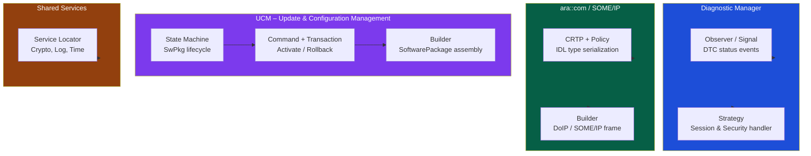
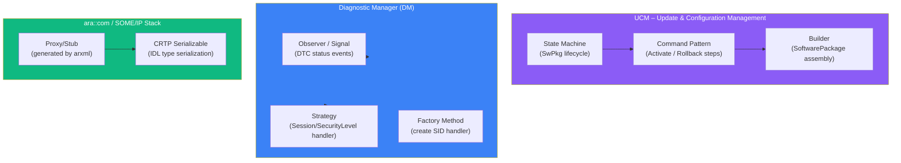

# Advanced C++ – Phần 4: Design Patterns & AP Architecture

> **Mục tiêu bài này:** Bạn sẽ hiểu TẠI SAO từng pattern tồn tại (vấn đề gì nó giải quyết), HOW nó hoạt động bằng C++ hiện đại, và thấy nó được dùng thực tế ở đâu trong AUTOSAR Adaptive Platform.  
> **Cách đọc hiệu quả nhất:** Với mỗi pattern, đọc phần "Vấn đề trước" trước để hiểu motivation; code sẽ tự nhiên hơn.  
> **Compiler:** GCC ≥ 11, Clang ≥ 12 với `-std=c++20`

---

## 1. State Machine – Kiểm soát vòng đời phức tạp

### Vấn đề trước: Switch/if-else khổng lồ

```cpp
// BAD (trước khi dùng pattern):
void UcmPackage::handleEvent(Event e) {
    if (state_ == "idle") {
        if (e == TRANSFER_START) { state_ = "transferring"; start_transfer(); }
        else if (e == RESET) { /* ignore */ }
        // ... 5 events khác trong state Idle
    } else if (state_ == "transferring") {
        if (e == DATA_CHUNK) { append_data(); }
        else if (e == TRANSFER_EXIT) { state_ = "transferred"; }
        else if (e == ERROR) { state_ = "idle"; cleanup(); }
        // ... 8 events khác
    } else if (state_ == "processing") {
        // ... thêm 6 state nữa
    }
    // 400 dòng if/else, không thể thêm state mới,
    // không thể kiểm tra trạng thái, không thể log transition
}
```

**Vấn đề:** không scale, dễ bug khi thêm state, không type-safe, state không mang data.

---

### 1.1 Variant-based State Machine (C++17)

**Ý tưởng:** Mỗi state là một **struct riêng biệt** (có thể mang data). Trạng thái hiện tại là `std::variant` của tất cả states. Transitions được định nghĩa bằng `std::visit` + overloaded handlers.

```
States là TYPES, không phải enum:
  Idle          {}          ← không có data
  Transferring  {id, size}  ← mang data transfer hiện tại
  Verified      {id}
  Activated     {}

std::variant<Idle, Transferring, Verified, ...>
       ↑ chứa CHÍNH XÁC MỘT state tại một thời điểm
       ↑ compiler biết: khi ở Idle, chắc chắn không có transfer_id

std::visit → gọi handler phù hợp cho state hiện tại, type-safe
```

```cpp
#include <variant>

// ===== Khai báo States – mỗi state chứa data mà nó cần =====
struct Idle {};

struct Transferring {
    std::uint32_t transfer_id;
    std::size_t   bytes_received;
    std::size_t   total_size;
    // Chỉ state Transferring mới có bytes_received – không thể nhầm lẫn
};

struct Transferred { std::uint32_t transfer_id; };
struct Processing  { std::uint32_t transfer_id; std::uint8_t progress; };
struct Verified    { std::uint32_t transfer_id; };
struct Activating  { std::uint32_t transfer_id; };
struct Activated   {};
struct RolledBack  { std::string reason; };
struct Failed      { std::string error; };

// variant: State Machine chỉ có thể ở một trong các states này
using SwPkgState = std::variant<
    Idle, Transferring, Transferred, Processing,
    Verified, Activating, Activated, RolledBack, Failed>;

// ===== Khai báo Events =====
struct EvTransferStart  { std::uint32_t id; std::size_t total_size; };
struct EvDataChunk      { std::uint32_t id; std::vector<std::uint8_t> data; };
struct EvTransferDone   {};
struct EvSignatureValid {};
struct EvSignatureInvalid  { std::string reason; };
struct EvActivate          {};
struct EvActivationSuccess {};
struct EvActivationFailed  { std::string reason; };

// ===== State Machine =====
class UcmStateMachine {
    SwPkgState current_state_{Idle{}};  // bắt đầu ở Idle

public:
    // process: nhận bất kỳ event, transition tương ứng
    template<typename Event>
    void process(Event&& ev) {
        // std::visit:
        //   nhận callable và variant
        //   gọi callable với TYPE thật sự đang được giữ trong variant
        //   → type-safe: chỉ gọi on_event(Idle, ...) khi đang ở Idle
        current_state_ = std::visit(
            [&ev](auto& current) -> SwPkgState {
                // on_event trả SwPkgState mới (hoặc giữ nguyên nếu event không hợp lệ)
                return transition(current, ev);
            },
            current_state_
        );

        log_state();
    }

    // Kiểm tra state hiện tại – type-safe
    template<typename S>
    bool is_in() const { return std::holds_alternative<S>(current_state_); }

    const SwPkgState& state() const { return current_state_; }

private:
    // Default: event không được xử lý trong state này → giữ nguyên
    // Compiler sẽ gọi cái này cho mọi (state, event) combo không có specific handler
    template<typename S, typename E>
    static SwPkgState transition(S& s, const E&) {
        return s;  // không đổi state
    }

    // ===== Specific transitions =====
    // Chỉ Idle + EvTransferStart → Transferring
    static SwPkgState transition(Idle&, const EvTransferStart& ev) {
        return Transferring{ev.id, 0, ev.total_size};
    }

    // Chỉ Transferring + EvDataChunk → cập nhật bytes, ở lại Transferring
    static SwPkgState transition(Transferring& s, const EvDataChunk& ev) {
        s.bytes_received += ev.data.size();
        return s;
    }

    // Chỉ Transferring + EvTransferDone → Transferred
    static SwPkgState transition(Transferring& s, const EvTransferDone&) {
        return Transferred{s.transfer_id};
    }

    static SwPkgState transition(Transferred& s, const EvSignatureValid&) {
        return Verified{s.transfer_id};
    }
    static SwPkgState transition(Transferred&, const EvSignatureInvalid& ev) {
        return Failed{ev.reason};
    }
    static SwPkgState transition(Verified& s, const EvActivate&) {
        return Activating{s.transfer_id};
    }
    static SwPkgState transition(Activating&, const EvActivationSuccess&) {
        return Activated{};
    }
    static SwPkgState transition(Activating&, const EvActivationFailed& ev) {
        return RolledBack{ev.reason};
    }

    void log_state() const {
        std::visit([](const auto& s) {
            std::printf("[UCM] State = %s\n", typeid(s).name());
        }, current_state_);
    }
};
```

**Sử dụng:**

```cpp
UcmStateMachine ucm;
ucm.process(EvTransferStart{0xA1B2, 10'000'000});  // → Transferring
ucm.process(EvDataChunk{0xA1B2, chunk_data});       // → Transferring (updated)
ucm.process(EvTransferDone{});                      // → Transferred
ucm.process(EvSignatureValid{});                    // → Verified
ucm.process(EvActivate{});                          // → Activating
ucm.process(EvActivationSuccess{});                 // → Activated

if (ucm.is_in<Activated>()) {
    std::puts("UCM: Software package activated successfully");
}
```

> **💡 Tại sao tốt hơn switch/if-else:**
> - State data chỉ tồn tại khi cần (Transferring.bytes_received chỉ có khi đang transfer)
> - Thêm state mới: thêm struct + overload transition
> - Lỗi transition (Idle nhận EvDataChunk): tự động bị default handler ignore
> - `static_assert` có thể verify exhaustiveness

---

## 2. Observer / Signal – Decouple Event Producer từ Consumer

### Vấn đề trước: Tight coupling

```cpp
// BAD: DiagnosticManager biết về mọi consumer của nó
class DiagnosticManager {
    Dashboard* dashboard_;
    Logger*    logger_;
    Auditor*   auditor_;

    void on_dtc_changed(DtcId id, DtcStatus s) {
        dashboard_->update_dtc(id, s);     // phụ thuộc Diamond
        logger_->log_dtc_event(id, s);     // phụ thuộc Logger
        auditor_->record_audit(id, s);     // phụ thuộc Auditor
        // Thêm consumer mới → phải sửa DiagnosticManager
    }
};
```

**Vấn đề:** DM phải biết về tất cả consumer, khó test, khó thêm consumer mới.

---

### 2.1 Type-safe Signal/Slot

```cpp
// Signal<Args...>: event source
// subscriber nhận callback với đúng signature (type-safe)
// nhiều subscriber, thread-safe

template<typename... Args>
class Signal {
    // Mỗi subscriber có ID (để disconnect sau) và callback
    using Slot = std::function<void(Args...)>;
    struct Connection { int id; Slot fn; };

    std::vector<Connection>  slots_;
    int                      next_id_{0};
    mutable std::shared_mutex mtx_;
    // shared_mutex: nhiều thread có thể emit cùng lúc (shared_lock)
    //               chỉ một thread connect/disconnect tại một lúc (unique_lock)

public:
    // connect: đăng ký callback, trả ID để disconnect sau
    int connect(Slot fn) {
        std::unique_lock lk(mtx_);  // exclusive: đang modify slots_
        int id = next_id_++;
        slots_.push_back({id, std::move(fn)});
        return id;
    }

    // disconnect: hủy đăng ký theo ID
    void disconnect(int id) {
        std::unique_lock lk(mtx_);
        std::erase_if(slots_, [id](const auto& c) { return c.id == id; });
    }

    // emit: gọi TẤT CẢ subscriber với args
    // const vì không thay đổi danh sách subscribers
    void emit(Args... args) const {
        // shared_lock: cho phép nhiều thread emit cùng lúc (đọc slots_ không thay đổi)
        std::shared_lock lk(mtx_);
        for (const auto& conn : slots_) {
            conn.fn(args...);  // copy args vào mỗi lần gọi
        }
    }

    // ScopedConnection: RAII – tự disconnect khi ra scope
    // Dùng khi subscriber có lifetime ngắn hơn Signal
    struct ScopedConnection {
        Signal& signal_;
        int     id_;

        ScopedConnection(Signal& sig, Slot fn)
            : signal_(sig), id_(sig.connect(std::move(fn))) {}

        ~ScopedConnection() { signal_.disconnect(id_); }

        // Không thể copy – ownership rõ ràng
        ScopedConnection(const ScopedConnection&) = delete;
    };
};

// ===== Sử dụng trong AP =====

// DM expose signals – không biết subscriber là ai
Signal<DtcId, DtcStatus>  on_dtc_status_changed;
Signal<std::uint8_t>      on_security_level_changed;

// SecurityMonitor: subscribe và tự unsubscribe khi bị destroy
class SecurityMonitor {
    Signal<std::uint8_t>::ScopedConnection sec_conn_;

public:
    SecurityMonitor()
        : sec_conn_(on_security_level_changed,
                    [this](std::uint8_t lvl) { handle_level_change(lvl); })
    {}
    // ~SecurityMonitor() → sec_conn_ destroyed → disconnect tự động
    // Không cần gọi disconnect() thủ công

private:
    void handle_level_change(std::uint8_t lvl) {
        std::printf("[Security] Level changed to %d\n", lvl);
    }
};

// Dashboard subscribe (manual):
int dash_id = on_dtc_status_changed.connect([](DtcId id, DtcStatus s) {
    update_dashboard(id, s);
});
// Sau: on_dtc_status_changed.disconnect(dash_id);
```

> **⚠️ Chú ý lifetime:** Nếu subscriber (lambda) capture `this` và object bị destroy trước Signal.emit() được gọi → dangling pointer. Dùng `ScopedConnection` hoặc `std::weak_ptr` trong lambda capture.

---

## 3. Strategy Pattern – Thuật toán có thể thay thế

### Vấn đề trước: Hardcoded algorithm

```cpp
// BAD: thêm encoding mới → phải sửa class, rebuild tất cả
class UdsFrameSerializer {
    void serialize_header(std::uint16_t val, std::vector<uint8_t>& out) {
        // Hardcoded big-endian
        out.push_back((val >> 8) & 0xFF);
        out.push_back(val & 0xFF);
    }
};
// Muốn little-endian host: phải tạo class mới hoặc sửa class cũ
```

---

### 3.1 Runtime Strategy với `std::function`

```cpp
// DataFormatter: thuật toán định dạng có thể swap lúc runtime
class DataFormatter {
public:
    // Sink = "strategy": nhận message và level, xử lý theo cách riêng
    using Sink = std::function<void(std::string_view, std::uint8_t)>;

    explicit DataFormatter(Sink sink) : sink_(std::move(sink)) {}

    void format(std::string_view msg, std::uint8_t level = 0) {
        // Gọi strategy – không biết cụ thể nó sẽ làm gì
        sink_(msg, level);
    }

    // Cho phép swap strategy lúc runtime – không cần subclass
    void set_sink(Sink new_sink) { sink_ = std::move(new_sink); }

private:
    Sink sink_;
};

// Testing: log to console
DataFormatter fmt([](std::string_view msg, std::uint8_t) {
    std::printf("[CONSOLE] %s\n", msg.data());
});

// Production: log qua CAN DLT
fmt.set_sink([](std::string_view msg, std::uint8_t lvl) {
    dlt_send(lvl, msg.data(), msg.size());
});

// Test environment: suppress all logs
fmt.set_sink([](std::string_view, std::uint8_t) { /* noop */ });
```

---

### 3.2 Compile-time Strategy – Policy-Based Design

Khi strategy được biết lúc **compile-time**, ta có thể dùng template thay `std::function` → zero virtual dispatch overhead.

```cpp
// Policy class: xác định cách encode integer thành bytes
struct BigEndianPolicy {
    template<typename T>
    static void encode(T val, std::uint8_t* out) {
        // Big-endian: byte cao nhất trước (network byte order)
        // Ví dụ: 0x1234 → [0x12, 0x34]
        for (int i = sizeof(T) - 1; i >= 0; --i) {
            out[sizeof(T) - 1 - i] = (val >> (8 * i)) & 0xFF;
        }
    }
};

struct LittleEndianPolicy {
    template<typename T>
    static void encode(T val, std::uint8_t* out) {
        // Little-endian: byte thấp nhất trước (x86 native)
        // Ví dụ: 0x1234 → [0x34, 0x12]
        for (std::size_t i = 0; i < sizeof(T); ++i) {
            out[i] = (val >> (8 * i)) & 0xFF;
        }
    }
};

// Serializer nhận Policy như template parameter
// Compiler sẽ generate hai class khác nhau:
//   SomeIpSerializer<BigEndianPolicy>
//   SomeIpSerializer<LittleEndianPolicy>
// Mỗi class có code được inlined hoàn toàn – zero overhead

template<typename EndianPolicy = BigEndianPolicy>
class SomeIpSerializer : private EndianPolicy {
    // private inheritance: dùng EndianPolicy như implementation detail
    std::vector<std::uint8_t> buf_;

public:
    template<typename T>
    SomeIpSerializer& write(T val) {
        auto offset = buf_.size();
        buf_.resize(offset + sizeof(T));
        // Gọi static method của Policy – inlined tại compile-time
        EndianPolicy::encode(val, buf_.data() + offset);
        return *this;  // method chaining
    }

    const std::vector<std::uint8_t>& data() const { return buf_; }
    void clear() { buf_.clear(); }
};

// SOME/IP đặc tả big-endian → dùng default
SomeIpSerializer<> someip;           // BigEndian
someip.write<std::uint16_t>(0x1234); // → [0x12, 0x34]

// Host internal format (x86 little-endian)
SomeIpSerializer<LittleEndianPolicy> local;
local.write<std::uint16_t>(0x1234);  // → [0x34, 0x12]
```

---

## 4. CRTP – Static Polymorphism không cần vtable

### Vấn đề trước: virtual dispatch overhead

```cpp
// BAD: vtable overhead cho mỗi lần gọi
class ISensor {
public:
    virtual ~ISensor() = default;
    virtual void calibrate() = 0;
    virtual float read()     = 0;
};
// Mỗi lần gọi read(): lookup vtable → indirect jump → CPU branch mispredict
// Trong hot path (10kHz sensor loop): overhead đáng kể
```

**CRTP** cho phép "đa hình" mà không cần vtable: **tất cả được giải quyết tại compile-time**.

---

### 4.1 CRTP cơ bản

```cpp
// Pattern: Base<Derived> – base class biết kiểu Derived tại compile-time
// static_cast<Derived*>(this): cast về Derived → gọi override method
// KHÔNG có virtual: compile-time dispatch → inlining hoàn toàn

template<typename Derived>
class SensorMixin {
public:
    // "Interface" định nghĩa trong base, implementation ở Derived
    void start_sampling() {
        // static_cast<Derived*>(this): safe vì ta biết this trỏ đến Derived
        static_cast<Derived*>(this)->do_start();  // gọi Derived::do_start() trực tiếp
    }

    float read_value() {
        return static_cast<Derived*>(this)->do_read();
    }
};

// Derived 1: cảm biến nhiệt độ
class TempSensor : public SensorMixin<TempSensor> {
public:
    void  do_start()  { init_adc_channel(ADC_CH_TEMP); }
    float do_read()   { return adc_read(ADC_CH_TEMP) * 0.01f - 40.0f; }
};

// Derived 2: cảm biến tốc độ
class SpeedSensor : public SensorMixin<SpeedSensor> {
public:
    void  do_start()  { configure_hall_sensor(); }
    float do_read()   { return read_pulse_frequency() * SPEED_FACTOR; }
};

// Generic function: nhận bất kỳ SensorMixin<T>
// Compiler tạo versión riêng cho TempSensor và SpeedSensor
// KHÔNG có virtual dispatch: static_cast inlining
template<typename S>
void calibrate_sensor(SensorMixin<S>& sensor) {
    sensor.start_sampling();
    float baseline = sensor.read_value();
    std::printf("Baseline: %.2f\n", baseline);
}

TempSensor  temp;
SpeedSensor spd;
calibrate_sensor(temp);  // compiler generates calibrate_sensor<TempSensor>
calibrate_sensor(spd);   // compiler generates calibrate_sensor<SpeedSensor>
```

---

### 4.2 CRTP Mixin – Thêm capability mà không có virtual

Mixin cho phép "copy-paste" interface vào một class mà không cần đa kế thừa interface ảo.

```cpp
// Mixin 1: thêm serialization capability
template<typename Derived>
class Serializable {
public:
    std::vector<std::uint8_t> to_bytes() const {
        std::vector<std::uint8_t> out;
        // Gọi Derived::serialize_into() – được định nghĩa bởi Derived
        static_cast<const Derived*>(this)->serialize_into(out);
        return out;
    }

    static Derived from_bytes(std::span<const std::uint8_t> raw) {
        Derived obj;
        obj.deserialize_from(raw);
        return obj;
    }
};

// Mixin 2: thêm hashing capability (dùng TỪ serialization)
template<typename Derived>
class Hashable {
public:
    std::uint32_t hash32() const noexcept {
        // Gọi Derived::to_bytes() (from Serializable<Derived>)
        // → hàm hash là UNIVERSAL: không cần override
        auto bytes = static_cast<const Derived*>(this)->to_bytes();
        return crc32(bytes.data(), bytes.size());
    }
};

// DiagnosticEvent: kết hợp cả hai mixin
// Chỉ cần implement serialize_into() và deserialize_from()
// → tự nhiên có to_bytes(), from_bytes(), và hash32()
class DiagnosticEvent
    : public Serializable<DiagnosticEvent>   // ← thêm to_bytes/from_bytes
    , public Hashable<DiagnosticEvent>        // ← thêm hash32 (dùng to_bytes)
{
    std::uint32_t dtc_id_{};
    std::uint8_t  status_{};

public:
    DiagnosticEvent() = default;
    DiagnosticEvent(std::uint32_t dtc, std::uint8_t st) : dtc_id_(dtc), status_(st) {}

    // Bắt buộc phải implement (Serializable dùng nó)
    void serialize_into(std::vector<std::uint8_t>& out) const {
        out.push_back((dtc_id_ >> 16) & 0xFF);
        out.push_back((dtc_id_ >> 8)  & 0xFF);
        out.push_back( dtc_id_        & 0xFF);
        out.push_back(status_);
    }

    void deserialize_from(std::span<const std::uint8_t> d) {
        dtc_id_ = (std::uint32_t(d[0]) << 16) | (d[1] << 8) | d[2];
        status_ = d[3];
    }
};

// Giờ DiagnosticEvent có đầy đủ capabilities:
DiagnosticEvent ev{0xA01234, 0x08};
auto bytes = ev.to_bytes();    // from Serializable – [0xA0, 0x12, 0x34, 0x08]
auto h     = ev.hash32();      // from Hashable – CRC32 của bytes trên
auto ev2   = DiagnosticEvent::from_bytes(bytes);  // round-trip
```

> **⚠️ Sử dụng đúng:** CRTP không thích hợp cho heterogeneous container (vector với nhiều loại sensor khác nhau). Trong trường hợp đó, dùng virtual interface + shared_ptr. CRTP dành cho homogeneous code generation và mixin.

---

## 5. Builder Pattern – Tránh Telescoping Constructor

### Vấn đề trước: Constructor với quá nhiều tham số

```cpp
// BAD: 6 tham số – ai biết thứ tự? Dễ nhầm
DoipFrame frame(0x02, 0x8001, 0x0E00, 0x0010, {0x22, 0xF1, 0x90}, true);
//              ver   type    src     dst     payload               verify_checksum
// Nhầm src/dst → lỗi routing, khó debug
```

---

### 5.1 Fluent Builder

```cpp
class DoipFrameBuilder {
    std::uint8_t  proto_ver_{0x02};    // thường là 0x02 theo DoIP spec
    std::uint16_t payload_type_{0};
    std::uint16_t src_addr_{0};
    std::uint16_t dst_addr_{0};
    std::vector<std::uint8_t> uds_payload_;
    bool verify_checksum_{false};

public:
    // Mỗi setter trả *this → cho phép method chaining (fluent)
    DoipFrameBuilder& proto_version(std::uint8_t v)    { proto_ver_ = v;     return *this; }
    DoipFrameBuilder& payload_type(std::uint16_t t)    { payload_type_ = t;  return *this; }
    DoipFrameBuilder& source_address(std::uint16_t a)  { src_addr_ = a;      return *this; }
    DoipFrameBuilder& target_address(std::uint16_t a)  { dst_addr_ = a;      return *this; }
    DoipFrameBuilder& with_checksum(bool v = true)     { verify_checksum_ = v; return *this; }

    DoipFrameBuilder& uds_payload(std::vector<std::uint8_t> p) {
        uds_payload_ = std::move(p);
        return *this;
    }

    // build(): validate và tạo frame hoàn chỉnh
    std::vector<std::uint8_t> build() const {
        // Validation tập trung ở đây – builder đảm bảo frame hợp lệ
        if (uds_payload_.empty()) throw std::invalid_argument("UDS payload required");
        if (src_addr_ == dst_addr_) throw std::invalid_argument("src == dst");

        std::vector<std::uint8_t> frame;
        frame.reserve(8 + 4 + uds_payload_.size());  // header + addr + payload

        // DoIP Generic Header (8 bytes)
        frame.push_back(proto_ver_);
        frame.push_back(~proto_ver_);              // inverse của proto_ver (DoIP spec)
        frame.push_back((payload_type_ >> 8) & 0xFF);
        frame.push_back( payload_type_ & 0xFF);

        std::uint32_t len = 4 + uds_payload_.size();  // addr (4 bytes) + payload
        frame.push_back((len >> 24) & 0xFF);
        frame.push_back((len >> 16) & 0xFF);
        frame.push_back((len >> 8)  & 0xFF);
        frame.push_back( len        & 0xFF);

        // Source + Target Address
        frame.push_back((src_addr_ >> 8) & 0xFF);
        frame.push_back( src_addr_       & 0xFF);
        frame.push_back((dst_addr_ >> 8) & 0xFF);
        frame.push_back( dst_addr_       & 0xFF);

        // UDS payload
        frame.insert(frame.end(), uds_payload_.begin(), uds_payload_.end());

        return frame;
    }
};

// Sử dụng – self-documenting:
auto frame = DoipFrameBuilder{}
    .proto_version(0x02)
    .payload_type(0x8001)          // Diagnostic Message (DoIP Table 22)
    .source_address(0x0E00)        // Tester logical address
    .target_address(0x0010)        // ECU logical address
    .uds_payload({0x22, 0xF1, 0x90})  // ReadDataByIdentifier: VIN
    .with_checksum()
    .build();
// Rõ ràng, không nhầm thứ tự tham số
```

---

## 6. Command Pattern – Lưu trữ và hoàn tác hành động

### Tại sao cần Command Pattern?

Command pattern **đóng gói hành động thành object**. Ưu điểm:
1. **Queue-able** – hành động có thể xếp hàng, delay
2. **Undoable** – mỗi command có `execute()` và `rollback()`  
3. **Loggable** – dễ log từng bước vì command là object

```
TransactionExecutor:
  [Cmd1] → [Cmd2] → [Cmd3]
  Nếu Cmd2 fail:
    Cmd2: rollback()
    Cmd1: rollback()  ← reverse order
  → Toàn bộ transaction được hoàn tác
```

```cpp
// Abstract Command interface
class Command {
public:
    virtual ~Command() = default;
    virtual void execute()  = 0;  // thực hiện hành động
    virtual void rollback() = 0;  // hoàn tác hành động
    virtual std::string description() const = 0;  // mô tả cho logging
};

// Concrete Command: activate một Software Cluster
class ActivateSoftwareCluster : public Command {
    std::string cluster_name_;
    std::string backup_path_;   // lưu để rollback
    std::string new_path_;
    bool        executed_{false};

public:
    ActivateSoftwareCluster(std::string name, std::string backup, std::string next)
        : cluster_name_(std::move(name))
        , backup_path_(std::move(backup))
        , new_path_(std::move(next)) {}

    void execute() override {
        // atomic symlink swap: old → backup, new → active
        create_backup_symlink(cluster_name_, backup_path_);
        symlink_swap(cluster_name_, new_path_);
        executed_ = true;
        std::printf("[UCM] Activated: %s\n", cluster_name_.c_str());
    }

    void rollback() override {
        if (!executed_) return;  // không rollback nếu chưa execute
        symlink_swap(cluster_name_, backup_path_);  // khôi phục backup
        std::printf("[UCM] Rolled back: %s\n", cluster_name_.c_str());
    }

    std::string description() const override {
        return "Activate SWCL: " + cluster_name_;
    }
};

// Transaction executor với automatic rollback on failure
class TransactionExecutor {
    std::vector<std::unique_ptr<Command>> completed_;  // đã execute thành công

public:
    // execute_all: thực hiện tất cả commands
    // Nếu bất kỳ command nào fail → rollback hết những cái đã làm
    bool execute_all(std::vector<std::unique_ptr<Command>>& cmds) {
        for (auto& cmd : cmds) {
            std::printf("[TX] Executing: %s\n", cmd->description().c_str());
            try {
                cmd->execute();
                completed_.push_back(std::move(cmd));  // move: cmd nhường ownership
            } catch (const std::exception& e) {
                std::printf("[TX] FAILED: %s\nRolling back...\n", e.what());

                // Rollback theo thứ tự ngược (LIFO)
                for (auto it = completed_.rbegin(); it != completed_.rend(); ++it) {
                    try { (*it)->rollback(); }
                    catch (...) { /* rollback không được throw */ }
                }
                return false;
            }
        }
        std::printf("[TX] Transaction committed successfully\n");
        return true;
    }
};

// Sử dụng khi activate software:
std::vector<std::unique_ptr<Command>> activation_steps;
activation_steps.push_back(
    std::make_unique<ActivateSoftwareCluster>("DiagMgr", "/backup/dm-1.2", "/new/dm-1.3"));
activation_steps.push_back(
    std::make_unique<ActivateSoftwareCluster>("ComMgr", "/backup/com-2.1", "/new/com-2.2"));

TransactionExecutor tx;
if (!tx.execute_all(activation_steps)) {
    std::puts("[UCM] Activation failed – system rolled back to previous state");
}
```

---

## 7. Service Locator – Truy cập Service mà không cần Dependency Injection

### Khi nào dùng Service Locator vs Dependency Injection?

- **DI (Dependency Injection):** tốt cho unit testing, nhưng cần wiring infrastructure.
- **Service Locator:** đơn giản hơn, phù hợp cho **singleton services** trong AP (Crypto, Logging).

```cpp
// Type-safe Service Locator dùng std::type_index như key
// Lưu std::any (type-erased) → không cần template khi get()

class ServiceContainer {
    // key: type_index của service interface
    // value: shared_ptr được wrap trong std::any
    std::unordered_map<std::type_index, std::any> services_;
    mutable std::shared_mutex                      mtx_;

public:
    // register_service: đăng ký một service
    // T thường là interface class, svc là implementation
    template<typename T>
    void register_service(std::shared_ptr<T> svc) {
        std::unique_lock lk(mtx_);
        services_[std::type_index(typeid(T))] = std::move(svc);
        // type_index(typeid(T)): unique key cho type T
    }

    // get: lấy service theo type T
    // Trả nullptr nếu chưa được đăng ký
    template<typename T>
    std::shared_ptr<T> get() const {
        std::shared_lock lk(mtx_);
        auto it = services_.find(std::type_index(typeid(T)));
        if (it == services_.end()) return nullptr;
        // any_cast: extract shared_ptr<T> từ std::any
        return std::any_cast<std::shared_ptr<T>>(it->second);
    }

    // get_required: throw nếu service không tồn tại
    template<typename T>
    std::shared_ptr<T> get_required() const {
        auto svc = get<T>();
        if (!svc) throw std::runtime_error(
            std::string("Service not registered: ") + typeid(T).name());
        return svc;
    }
};

// Global AP service container
ServiceContainer ap_services;

// Startup: đăng ký services
ap_services.register_service(std::make_shared<CryptoServiceImpl>());
ap_services.register_service(std::make_shared<LoggingServiceImpl>());
ap_services.register_service(std::make_shared<TimeServiceImpl>());

// Anywhere in code: lấy service mà không cần pass qua hàm
void verify_package_signature(const SoftwarePackage& pkg) {
    auto crypto = ap_services.get_required<ICryptoService>();
    // crypto != nullptr đảm bảo bởi get_required
    auto ok = crypto->verify_rsa_signature(pkg.data(), pkg.signature());
    if (!ok) throw std::runtime_error("Signature verification failed");
}
```

> **⚠️ Nhược điểm Service Locator:** dependencies không tường minh (caller không khai báo "tôi cần CryptoService"). Khó mock trong unit test. Với module được test nhiều: dùng constructor injection thay vì Service Locator.

---

## 8. Pattern Map trong AUTOSAR Adaptive Platform



---

## 9. Bài tập thực hành

### Bài 1 – Hierarchical State Machine

Mở rộng `UcmStateMachine` để có **nested state**:
- Top-level states: `Idle`, `Transferring`, `Activated`
- `Transferring` có sub-states: `ReceivingHeader`, `ReceivingPayload`, `Verifying`
- Khi re-enter `Transferring`: khôi phục sub-state cũ (history state)

**Gợi ý:** mỗi state có thể là variant lồng nhau.

---

### Bài 2 – Reactive Data Pipeline

Dùng `Signal` + coroutine Generator:

```cpp
auto pipeline = observe(vehicle_speed_signal)
              | debounce(std::chrono::milliseconds(50))
              | map([](float s) { return s > 130.0f; })
              | distinct_until_changed()
              | subscribe([](bool overspeed) {
                    if (overspeed) trigger_dtc(0xC0001);
                });
```

`operator|` trả Lazy Pipeline, mỗi stage là generator coroutine.  
`observe()`: tạo generator từ Signal.

---

### Bài 3 – Type-safe Builder với Phantom Types

Implement `UdsDiagRequestBuilder` với **compile-time state**:

```cpp
// Compile error nếu build() trước khi có target address:
auto req = UdsDiagRequestBuilder{}
    .session(SessionType::kExtended)   // Builder<HasSession>
    .target(0x0010)                    // Builder<HasSession|HasTarget>
    .payload({0x22, 0xF1, 0x90})       // Builder<HasSession|HasTarget|HasPayload>
    .build();                          // OK – tất cả required đã set

// UdsDiagRequestBuilder{}.build();    // COMPILE ERROR: missing session, target
```

**Gợi ý:** `Builder<uint8_t Flags>` với NTTP bits, `build()` chỉ enable khi `Flags == ALL_REQUIRED`.

---

### Bài 4 – Command Undo Stack

Implement text editor với undo/redo:
- Commands: `InsertText`, `DeleteText`, `ReplaceText`, `MoveCursor`
- Undo stack: giới hạn 50 entry (ring buffer)
- Macro: `MacroCommand` gom nhiều command, undo/redo như một unit

---

### Bài 5 – Dependency Injection Container

Implement DI container:

```cpp
Container di;
di.bind<ICrypto>().to<OpensslCrypto>().as_singleton();
di.bind<ILogger>().to<SyslogLogger>().as_transient();
di.bind<IStorage>().to<EepromStorage>().as_singleton();

// Di-resolvable constructor:
// UcmApplication(ICrypto&, ILogger&, IStorage&)
auto app = di.resolve<UcmApplication>();
// Container tự inject ICrypto, ILogger, IStorage vào constructor
```

**Gợi ý:** dùng CTAD và constructor argument deduction hoặc traits để detect constructor types.

---

## Tóm tắt – Khi nào dùng pattern nào?

| Pattern | Vấn đề giải quyết | C++ Mechanism | AP Component |
|---|---|---|---|
| **State Machine** | Lifecyle phức tạp, nhiều state | `std::variant` + `std::visit` | UCM, DM session |
| **Observer/Signal** | Decouple event source/consumer | `std::function` + `shared_mutex` | DTC event, SOME/IP subscribe |
| **Runtime Strategy** | Algorithm thay thế lúc runtime | `std::function` | Log sink, auth scheme |
| **Policy Strategy** | Algorithm thay thế lúc compile | Template + Policy class | Endianness, serialization format |
| **CRTP Static Poly** | Interface không vtable overhead | Template inheritance | Sensor hot path |
| **CRTP Mixin** | Reuse functionality không vtable | Multiple CRTP inheritance | IDL type serialization |
| **Builder** | Complex object, nhiều optional fields | Method chaining + `build()` | DoIP/SOME/IP frame |
| **Command + Rollback** | Undoable transactions | Virtual base + rollback() | UCM activation steps |
| **Service Locator** | Global singleton access | `std::any` + `type_index` | Crypto, Logging, Time |

**← Phần trước:** [C++ Nâng cao Phần 3: Concurrency & Async](/adaptive-cpp/cpp-concurrency/)

### 1.1 Variant-based State Machine (type-safe, zero overhead)

```cpp
#include <variant>

// ===== States =====
struct Idle          {};
struct Transferring  { std::uint32_t transfer_id; std::size_t bytes_received; };
struct Transferred   { std::uint32_t transfer_id; };
struct Processing    { std::uint32_t transfer_id; std::uint8_t progress; };
struct Verified      { std::uint32_t transfer_id; };
struct Activating    { std::uint32_t transfer_id; };
struct Activated     {};
struct RolledBack    { std::string reason; };
struct Invalid       { std::string error; };

using SwPkgState = std::variant<
    Idle, Transferring, Transferred, Processing,
    Verified, Activating, Activated, RolledBack, Invalid>;

// ===== Events =====
struct EvTransferStart  { std::uint32_t id; std::size_t total_size; };
struct EvTransferData   { std::uint32_t id; std::vector<std::uint8_t> chunk; };
struct EvTransferExit   {};
struct EvProcessStart   {};
struct EvSigValid       {};
struct EvSigInvalid     { std::string reason; };
struct EvActivate       {};
struct EvActivationOk   {};
struct EvActivationFail { std::string reason; };
struct EvRollbackOk     {};

// ===== Transition table via std::visit =====
class UcmStateMachine {
    SwPkgState state_{Idle{}};

public:
    template<typename Event>
    void process(Event&& ev) {
        state_ = std::visit(
            [&ev](auto& s) -> SwPkgState {
                return on_event(s, ev);
            },
            state_
        );
        log_state_change();
    }

    const SwPkgState& state() const noexcept { return state_; }

private:
    // Default: ignore unknown event in this state
    template<typename S, typename E>
    static SwPkgState on_event(S& s, const E&) { return s; }

    // Valid transitions
    static SwPkgState on_event(Idle&, const EvTransferStart& ev) {
        return Transferring{ev.id, 0};
    }
    static SwPkgState on_event(Transferring& s, const EvTransferData& ev) {
        s.bytes_received += ev.chunk.size();
        return s;
    }
    static SwPkgState on_event(Transferring& s, const EvTransferExit&) {
        return Transferred{s.transfer_id};
    }
    static SwPkgState on_event(Transferred& s, const EvProcessStart&) {
        return Processing{s.transfer_id, 0};
    }
    static SwPkgState on_event(Processing& s, const EvSigValid&) {
        return Verified{s.transfer_id};
    }
    static SwPkgState on_event(Processing& s, const EvSigInvalid& ev) {
        return Invalid{ev.reason};
    }
    static SwPkgState on_event(Verified& s, const EvActivate&) {
        return Activating{s.transfer_id};
    }
    static SwPkgState on_event(Activating&, const EvActivationOk&) {
        return Activated{};
    }
    static SwPkgState on_event(Activating&, const EvActivationFail& ev) {
        return RolledBack{ev.reason};
    }

    void log_state_change() {
        std::visit([](const auto& s) {
            std::printf("UCM State → %s\n", typeid(s).name());
        }, state_);
    }
};

// Usage
UcmStateMachine ucm;
ucm.process(EvTransferStart{0xA1B2, 12'000'000});
ucm.process(EvTransferData{0xA1B2, chunk1});
ucm.process(EvTransferExit{});
ucm.process(EvProcessStart{});
ucm.process(EvSigValid{});
ucm.process(EvActivate{});
ucm.process(EvActivationOk{});

// Type-safe state check
if (std::holds_alternative<Activated>(ucm.state())) {
    notify_backend_success();
}
```

---

## 2. Observer / Event System

### 2.1 Type-safe Observer với std::function

```cpp
template<typename... Args>
class Signal {
    using Slot = std::function<void(Args...)>;
    std::vector<std::pair<int, Slot>> slots_;
    int next_id_{0};
    mutable std::shared_mutex mtx_;

public:
    // Đăng ký – trả connection ID để unsubscribe
    int connect(Slot slot) {
        std::unique_lock lk(mtx_);
        int id = next_id_++;
        slots_.emplace_back(id, std::move(slot));
        return id;
    }

    void disconnect(int id) {
        std::unique_lock lk(mtx_);
        std::erase_if(slots_, [id](const auto& p) { return p.first == id; });
    }

    void emit(Args... args) const {
        std::shared_lock lk(mtx_);
        for (const auto& [id, slot] : slots_) {
            slot(args...);
        }
    }

    // RAII connection guard
    struct ScopedConnection {
        Signal&    sig;
        int        id;
        ScopedConnection(Signal& s, Slot slot) : sig(s), id(s.connect(std::move(slot))) {}
        ~ScopedConnection() { sig.disconnect(id); }
        ScopedConnection(const ScopedConnection&) = delete;
    };
};

// AP: DM emits event khi security level thay đổi
Signal<std::uint8_t>           on_security_level_changed;
Signal<std::uint8_t, DtcStatus> on_dtc_status_changed;

// Subscribe – tự unsubscribe khi monitor bị huỷ
class SecurityMonitor {
    Signal<std::uint8_t>::ScopedConnection conn_;
public:
    SecurityMonitor()
        : conn_(on_security_level_changed,
                [this](std::uint8_t lvl) { on_level_change(lvl); }) {}
private:
    void on_level_change(std::uint8_t lvl) {
        std::printf("Security level → %d\n", lvl);
    }
};
```

---

## 3. Strategy Pattern – Policy-based Design

### 3.1 Runtime strategy với std::function

```cpp
class DataLogger {
public:
    using Sink = std::function<void(std::string_view, LogLevel)>;

    explicit DataLogger(Sink sink) : sink_(std::move(sink)) {}

    void log(std::string_view msg, LogLevel level = LogLevel::kInfo) {
        sink_(msg, level);
    }

    void set_sink(Sink sink) { sink_ = std::move(sink); }

private:
    Sink sink_;
};

// Swap strategy at runtime – AP: different sink trong testing vs production
DataLogger logger(console_sink);
if (in_production) logger.set_sink(can_log_sink);
```

### 3.2 Compile-time strategy: Policy-based design (CRTP variant)

```cpp
// Policy classes
struct LittleEndianPolicy {
    template<typename T>
    static void encode(T val, std::uint8_t* out) {
        for (std::size_t i = 0; i < sizeof(T); ++i)
            out[i] = (val >> (8 * i)) & 0xFF;
    }
};

struct BigEndianPolicy {
    template<typename T>
    static void encode(T val, std::uint8_t* out) {
        for (std::size_t i = 0; i < sizeof(T); ++i)
            out[sizeof(T) - 1 - i] = (val >> (8 * i)) & 0xFF;
    }
};

// Consumer với policy injected at compile-time
template<typename EndianPolicy = BigEndianPolicy>
class SomeIpSerializer : private EndianPolicy {
    std::vector<std::uint8_t> buf_;
public:
    template<typename T>
    void write(T val) {
        auto offset = buf_.size();
        buf_.resize(offset + sizeof(T));
        EndianPolicy::encode(val, buf_.data() + offset);
    }
    const std::vector<std::uint8_t>& data() const { return buf_; }
};

// AP: SOME/IP dùng big-endian theo default
SomeIpSerializer<> someip_ser;          // BigEndian
SomeIpSerializer<LittleEndianPolicy> le; // LittleEndian (host internal)
```

---

## 4. CRTP – Curiously Recurring Template Pattern

CRTP tạo **static polymorphism** – kế thừa không cần vtable, zero overhead.

### 4.1 Cơ bản

```cpp
// Base CRTP – inject interface
template<typename Derived>
class Printable {
public:
    void print() const {
        // gọi method của Derived mà không cần virtual
        static_cast<const Derived*>(this)->print_impl();
    }
};

class Sensor : public Printable<Sensor> {
    float value_{0};
public:
    void print_impl() const {
        std::printf("Sensor: %.2f\n", value_);
    }
};
```

### 4.2 CRTP Mixin – thêm capability không dùng virtual

```cpp
// Mixin: thêm serialization cho bất kỳ class nào
template<typename Derived>
class Serializable {
public:
    std::vector<std::uint8_t> to_bytes() const {
        std::vector<std::uint8_t> out;
        static_cast<const Derived*>(this)->serialize_into(out);
        return out;
    }

    static Derived from_bytes(std::span<const std::uint8_t> data) {
        Derived obj;
        obj.deserialize_from(data);
        return obj;
    }
};

template<typename Derived>
class Hashable {
public:
    std::uint32_t hash() const noexcept {
        auto bytes = static_cast<const Derived*>(this)->to_bytes();
        return crc32(bytes.data(), bytes.size());
    }
};

// Combine mixins
class DiagnosticEvent
    : public Serializable<DiagnosticEvent>
    , public Hashable<DiagnosticEvent>
{
    std::uint32_t dtc_;
    DtcStatus     status_;
public:
    void serialize_into(std::vector<std::uint8_t>& out) const {
        out.push_back((dtc_ >> 16) & 0xFF);
        out.push_back((dtc_ >> 8) & 0xFF);
        out.push_back(dtc_ & 0xFF);
        out.push_back(static_cast<std::uint8_t>(status_));
    }
    void deserialize_from(std::span<const std::uint8_t> d) {
        dtc_    = (d[0] << 16) | (d[1] << 8) | d[2];
        status_ = static_cast<DtcStatus>(d[3]);
    }
};

DiagnosticEvent ev;
auto bytes = ev.to_bytes();    // from Serializable
auto h     = ev.hash();        // from Hashable (calls to_bytes internally)
```

---

## 5. Builder Pattern – Fluent API

```cpp
// Builder cho DoIP frame – tránh telescoping constructor
class DoipFrameBuilder {
    std::uint8_t  proto_ver_{0x02};
    std::uint16_t payload_type_{0};
    std::uint16_t src_addr_{0};
    std::uint16_t dst_addr_{0};
    std::vector<std::uint8_t> uds_payload_;

public:
    DoipFrameBuilder& proto_version(std::uint8_t v)    { proto_ver_ = v;        return *this; }
    DoipFrameBuilder& payload_type(std::uint16_t t)    { payload_type_ = t;     return *this; }
    DoipFrameBuilder& source(std::uint16_t addr)       { src_addr_ = addr;      return *this; }
    DoipFrameBuilder& target(std::uint16_t addr)       { dst_addr_ = addr;      return *this; }
    DoipFrameBuilder& uds(std::vector<std::uint8_t> p) { uds_payload_ = std::move(p); return *this; }

    std::vector<std::uint8_t> build() const {
        std::uint32_t payload_len = 4 + uds_payload_.size();
        std::vector<std::uint8_t> frame;
        frame.reserve(8 + payload_len);

        // Generic header
        frame.push_back(proto_ver_);
        frame.push_back(~proto_ver_);
        frame.push_back(payload_type_ >> 8);
        frame.push_back(payload_type_ & 0xFF);
        frame.push_back((payload_len >> 24) & 0xFF);
        frame.push_back((payload_len >> 16) & 0xFF);
        frame.push_back((payload_len >> 8)  & 0xFF);
        frame.push_back( payload_len        & 0xFF);
        // Addresses
        frame.push_back(src_addr_ >> 8); frame.push_back(src_addr_ & 0xFF);
        frame.push_back(dst_addr_ >> 8); frame.push_back(dst_addr_ & 0xFF);
        // UDS
        frame.insert(frame.end(), uds_payload_.begin(), uds_payload_.end());
        return frame;
    }
};

// Usage – easy to read, impossible to confuse argument order
auto frame = DoipFrameBuilder{}
    .proto_version(0x02)
    .payload_type(0x8001)
    .source(0x0E00)
    .target(0x0010)
    .uds({0x22, 0xF1, 0x90})
    .build();
```

---

## 6. Command Pattern – Queue-able Actions

```cpp
// Command interface
class Command {
public:
    virtual ~Command() = default;
    virtual void execute()  = 0;
    virtual void rollback() = 0;
};

// Concrete command: UCM activate step
class ActivateSoftwareCluster : public Command {
    std::string   swcl_name_;
    std::string   backup_path_;
    std::string   new_path_;
    bool          executed_{false};
public:
    ActivateSoftwareCluster(std::string name, std::string backup, std::string next)
        : swcl_name_(std::move(name))
        , backup_path_(std::move(backup))
        , new_path_(std::move(next)) {}

    void execute() override {
        symlink_swap(swcl_name_, new_path_);   // atomic switch
        executed_ = true;
        std::printf("Activated SWCL: %s\n", swcl_name_.c_str());
    }

    void rollback() override {
        if (executed_) {
            symlink_swap(swcl_name_, backup_path_);
            std::printf("Rolled back SWCL: %s\n", swcl_name_.c_str());
        }
    }
};

// Command executor with rollback-on-failure
class TransactionExecutor {
    std::vector<std::unique_ptr<Command>> completed_;
public:
    bool execute_all(std::vector<std::unique_ptr<Command>>& cmds) {
        for (auto& cmd : cmds) {
            try {
                cmd->execute();
                completed_.push_back(std::move(cmd));
            } catch (...) {
                // rollback all completed in reverse order
                for (auto it = completed_.rbegin(); it != completed_.rend(); ++it)
                    (*it)->rollback();
                return false;
            }
        }
        return true;
    }
};
```

---

## 7. Service Locator – AP Style

```cpp
// Type-safe service locator dùng std::any + type_index
class ServiceContainer {
    std::unordered_map<std::type_index, std::any> services_;
    mutable std::shared_mutex mtx_;

public:
    template<typename T>
    void register_service(std::shared_ptr<T> svc) {
        std::unique_lock lk(mtx_);
        services_[std::type_index(typeid(T))] = std::move(svc);
    }

    template<typename T>
    std::shared_ptr<T> get() const {
        std::shared_lock lk(mtx_);
        auto it = services_.find(std::type_index(typeid(T)));
        if (it == services_.end()) return nullptr;
        return std::any_cast<std::shared_ptr<T>>(it->second);
    }
};

// Global AP service container
ServiceContainer ap_services;

// Startup: đăng ký
ap_services.register_service(std::make_shared<CryptoService>());
ap_services.register_service(std::make_shared<LoggingService>());

// Runtime: lấy service anywhere
auto crypto = ap_services.get<CryptoService>();
if (crypto) crypto->verify_signature(data, sig);
```

---

## 8. Diagram: Pattern mapping trong AP



---

## 9. Bài tập thực hành

### Bài 1 – Hierarchical State Machine
Mở rộng state machine mục 1 để hỗ trợ **history state** (khi re-enter một state, khôi phục sub-state cũ).  
Implement `DiagSessionStateMachine`: States = Default → Extended → Programming, mỗi state có sub-state Security(locked/unlocked).

### Bài 2 – Reactive Pipeline
Dùng Observer + Coroutine để build reactive pipeline:
```cpp
auto pipeline = observe(vehicle_speed_signal)
              | debounce(50ms)
              | map([](float s) { return s > 130.0f; })    // over_speed flag
              | distinct_until_changed()
              | subscribe([](bool over) { trigger_dtc(over); });
```

### Bài 3 – Type-safe Builder với Validation
Implement `UdsDiagRequestBuilder` dùng phantom type để enforce build order tại **compile-time**:
```cpp
// Compile error nếu gọi build() trước khi set targetAddress:
auto req = UdsDiagRequestBuilder{}
    .session(SessionType::kExtended)    // returns Builder<HasSession>
    .target(0x0010)                     // returns Builder<HasSession|HasTarget>
    .payload({0x22, 0xF1, 0x90})
    .build();                           // OK – tất cả required field đã set
```
Hint: dùng NTTP flags template `Builder<std::uint8_t Flags>`.

### Bài 4 – Command + Undo Stack
Implement text editor với undo/redo dùng Command pattern:
- `InsertCommand`, `DeleteCommand`, `ReplaceCommand`
- Undo stack giới hạn 50 entry
- Macro: gom nhiều command thành một, undo toàn bộ cùng lúc

### Bài 5 – DI Container
Implement Dependency Injection container:
```cpp
Container di;
di.bind<ICryptoService>().to<OpensslCrypto>().singleton();
di.bind<ILogger>().to<SyslogLogger>().transient();

auto app = di.resolve<UcmApplication>();
// UcmApplication constructor nhận ICryptoService + ILogger tự động
```
Dùng template để resolve dependency graph tại compile-time nếu có thể.

---

## Tóm tắt

| Pattern | C++ mechanism | AP component sử dụng |
|---|---|---|
| **State Machine** | `std::variant` + `std::visit` | UCM (SwPkg), DM (session), SM |
| **Observer / Signal** | `std::function` + signal/slot | DTC status, SOME/IP event |
| **Strategy** | Policy template / `std::function` | Endianness, logging sink, auth scheme |
| **CRTP Mixin** | Template inheritance | ara::com IDL serialization |
| **Builder** | Fluent API + method chaining | DoIP frame, UDS request |
| **Command** | Virtual base + rollback() | UCM activation steps |
| **Service Locator** | `std::any` + `type_index` | AP service registry |

**← Phần trước:** [C++ Nâng cao Phần 3: Concurrency & Async](/adaptive-cpp/cpp-concurrency/)  
**Phần tiếp →** [OOP Phần 5: Encapsulation](/adaptive-cpp/cpp-oop-encapsulation/)
