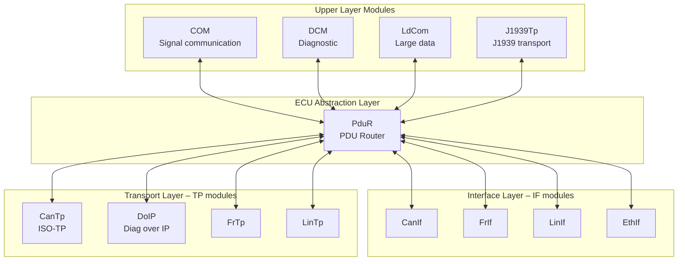
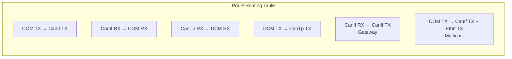
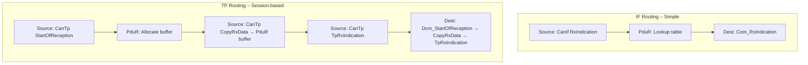
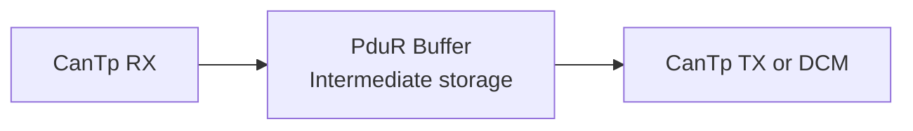
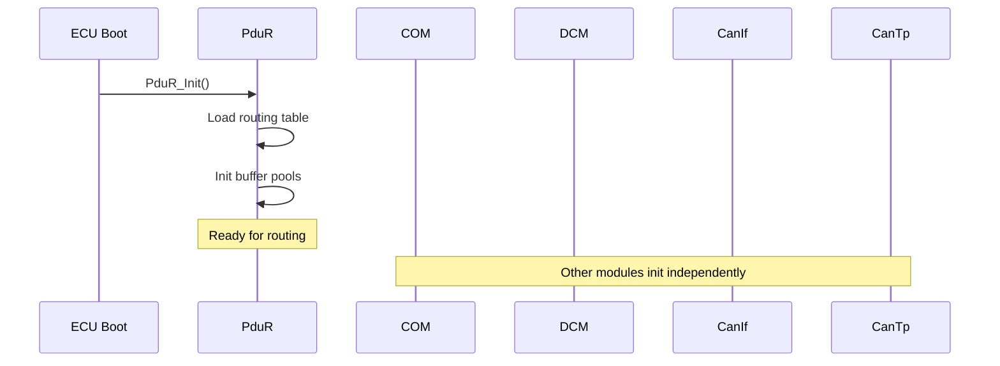
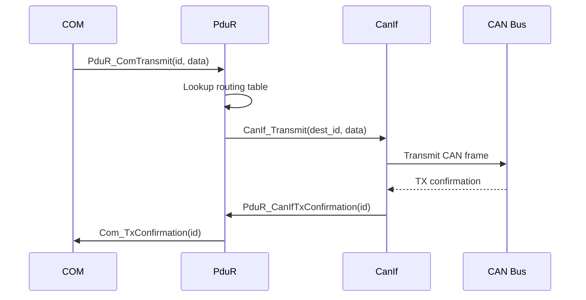
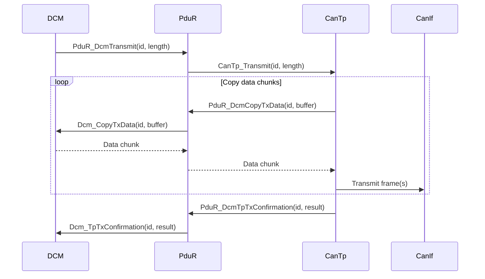
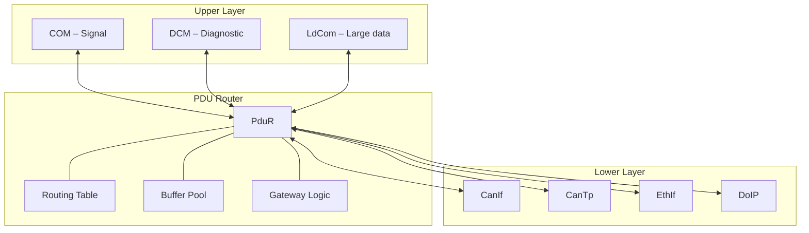

---
layout: default
category: uds
title: "PduR - PDU Router"
nav_exclude: true
module: true
tags: [autosar, pdur, communication, routing, pdu]
description: "Tài liệu kỹ thuật về PduR – module định tuyến PDU giữa các tầng trong AUTOSAR Classic."
permalink: /pdur/
---

# PduR - PDU Router

> Tài liệu này trình bày chi tiết module **PduR (PDU Router)** trong AUTOSAR Classic Platform. PduR là module trung tâm của communication stack, chịu trách nhiệm **định tuyến I-PDU** giữa các module upper layer (COM, DCM, LDCOM, J1939) và lower layer (CanIf, CanTp, FrIf, LinIf, EthIf, DoIP).

## 1. Tổng quan module

**PduR (PDU Router)** là module thuộc **ECU Abstraction Layer** trong AUTOSAR Classic. Nó đóng vai trò **bộ chuyển mạch trung tâm** chuyển I-PDU giữa các module sản xuất và tiêu thụ dữ liệu.

Vai trò cốt lõi:

1. **Routing** I-PDU từ source module đến destination module.
2. **Tách biệt** upper layer khỏi lower layer – COM không cần biết I-PDU đi qua CAN hay Ethernet.
3. **Multicast** – một I-PDU có thể được route tới nhiều destination.
4. **Gateway** – I-PDU nhận từ bus A có thể được forward sang bus B.
5. **Buffer management** – quản lý buffer cho TP (Transport Protocol) routing.

Nếu COM là nơi đóng gói/tách signal, DCM là nơi xử lý diagnostic, thì PduR là **ngã tư giao thông** nơi tất cả I-PDU đi qua để đến đúng đích.

### 1.1 PduR không làm gì

1. Không inspect nội dung payload – PduR chỉ routing, không hiểu signal hay service bên trong.
2. Không xử lý phân mảnh transport – CanTp hoặc DoIP làm việc đó.
3. Không quản lý session/security – DCM làm việc đó.
4. Không pack/unpack signal – COM làm việc đó.

## 2. Vị trí của PduR trong AUTOSAR Communication Stack

PduR nằm ở vị trí **trung tâm** giữa upper modules và lower modules.



Ở góc nhìn kiến trúc:

| Vai trò | Module | PduR tương tác |
|---|---|---|
| Upper – signal | COM | TX: `PduR_ComTransmit` / RX: `Com_RxIndication` |
| Upper – diagnostic | DCM | TX: `PduR_DcmTransmit` / RX: `Dcm_StartOfReception`, `Dcm_CopyRxData` |
| Lower – IF | CanIf, EthIf | TX: `CanIf_Transmit` / RX: `PduR_CanIfRxIndication` |
| Lower – TP | CanTp, DoIP | TX: TP API chain / RX: TP API chain |

## 3. Mục tiêu chức năng của PduR

1. **Định tuyến có cấu hình** – routing table quyết định I-PDU nào đi đâu.
2. **Tách upper/lower** – cho phép thêm/bớt bus mà không ảnh hưởng COM/DCM.
3. **Hỗ trợ multicast** – một source I-PDU route tới nhiều destination.
4. **Hỗ trợ gateway** – forward I-PDU giữa các bus khác nhau.
5. **Buffer cho TP** – quản lý bộ đệm cho diagnostic message lớn.
6. **Tối ưu hiệu năng** – routing decision tại thời điểm compile/link hoặc pre-compile.

## 4. Các khái niệm cốt lõi trong PduR

### 4.1 I-PDU (Interaction Layer PDU)

I-PDU là đơn vị dữ liệu mà PduR routing. Có hai loại chính:

1. **IF I-PDU** (Interface PDU) – I-PDU ngắn, truyền trong một frame, không cần transport protocol. Ví dụ: signal communication qua COM.
2. **TP I-PDU** (Transport Protocol PDU) – I-PDU lớn, cần phân mảnh/gom bởi CanTp hoặc DoIP. Ví dụ: diagnostic request/response qua DCM.

### 4.2 Routing Path

**Routing path** là quy tắc ánh xạ từ source I-PDU đến destination I-PDU:

```
Source Module + Source PDU ID  →  Destination Module + Destination PDU ID
```

Ví dụ:

| Source | Source PDU | Destination | Dest PDU | Mô tả |
|---|---|---|---|---|
| COM | TX_VehicleSpeed_IPDU | CanIf | CAN_TX_VehicleSpeed | Signal TX qua CAN |
| CanIf | CAN_RX_BrakeStatus | COM | RX_BrakeStatus_IPDU | Signal RX từ CAN |
| CanTp | CANTP_RX_DiagReq | DCM | DCM_RX_DiagReq | Diagnostic request |
| DCM | DCM_TX_DiagResp | CanTp | CANTP_TX_DiagResp | Diagnostic response |

### 4.3 Routing Table

Routing table là tập hợp tất cả routing path. Nó được tạo **tại thời điểm cấu hình** (pre-compile hoặc post-build) chứ không phải runtime.



### 4.4 IF Routing vs TP Routing

PduR xử lý hai kiểu routing khác nhau:

#### IF Routing (Interface PDU)

1. I-PDU ngắn, fit trong 1 frame.
2. Routing đồng bộ (synchronous callback).
3. Không cần buffer management phức tạp.
4. API: `PduR_<Lo>RxIndication`, `PduR_<Up>Transmit`.

#### TP Routing (Transport Protocol PDU)

1. I-PDU lớn, cần phân mảnh.
2. Routing qua session-based API (StartOfReception → CopyRxData → RxIndication).
3. Cần buffer management cho intermediate storage.
4. API: `PduR_<Lo>StartOfReception`, `PduR_<Lo>CopyRxData`, `PduR_<Lo>TpRxIndication`.



### 4.5 Multicast Routing

Một source I-PDU có thể được route tới **nhiều destination** cùng lúc.

Ví dụ:

1. Signal VehicleSpeed cần gửi đồng thời lên CAN bus và Ethernet bus.
2. Routing path: `COM TX_VehicleSpeed → [CanIf TX, EthIf TX]`.

PduR xử lý multicast bằng cách:

1. Nhận transmit request từ source 1 lần.
2. Gọi transmit cho từng destination module.
3. Aggregation kết quả: nếu một destination fail, PduR quyết định return code theo cấu hình.

### 4.6 Gateway Routing

PduR hỗ trợ **gateway** – forward I-PDU từ bus A sang bus B mà không qua upper layer.

Ví dụ: ECU gateway nhận message từ CAN bus chassis và forward sang CAN bus infotainment.


Đặc điểm gateway routing:

1. Không đi qua COM hoặc DCM – PduR trực tiếp forward.
2. Có thể có buffer ở giữa (FIFO buffer).
3. Latency thấp vì bỏ qua upper layer.
4. Áp dụng cho cả IF và TP routing.

### 4.7 Buffer Management

PduR quản lý buffer cho các trường hợp:

1. **TP routing**: buffer chứa dữ liệu trong quá trình phân mảnh/gom.
2. **Gateway with buffering**: buffer chứa I-PDU chờ truyền sang bus khác.
3. **FIFO buffer**: nhiều instance của cùng gateway I-PDU có thể queue.



Buffer configuration:

| Parameter | Mô tả |
|---|---|
| Buffer size | Kích thước byte cho TP PDU |
| FIFO depth | Số I-PDU có thể queue cho gateway |
| Buffer type | Dedicated / shared pool |

## 5. Functional Description của PduR

### 5.1 Khởi tạo PduR

Khi ECU khởi động:

1. PduR nạp routing table từ cấu hình.
2. Khởi tạo buffer pools nếu có.
3. Reset tất cả routing session state.
4. PduR sẵn sàng routing ngay khi init hoàn tất.



### 5.2 Luồng TX – Upper to Lower (IF)

Khi COM muốn truyền I-PDU:

1. COM gọi `PduR_ComTransmit(TxPduId, PduInfoPtr)`.
2. PduR tra routing table → tìm destination module và dest PDU ID.
3. PduR gọi `CanIf_Transmit(DestPduId, PduInfoPtr)`.
4. CanIf truyền frame lên bus.
5. Khi truyền xong, CanIf gọi `PduR_CanIfTxConfirmation`.
6. PduR forward confirmation lên COM: `Com_TxConfirmation`.



### 5.3 Luồng RX – Lower to Upper (IF)

Khi nhận I-PDU từ bus:

1. CanIf nhận frame từ bus.
2. CanIf gọi `PduR_CanIfRxIndication(RxPduId, PduInfoPtr)`.
3. PduR tra routing table → tìm destination upper module.
4. PduR gọi `Com_RxIndication(DestPduId, PduInfoPtr)`.
5. COM tách signal và cập nhật buffer.

### 5.4 Luồng TX – Upper to Lower (TP)

Khi DCM cần truyền diagnostic response lớn:

1. DCM gọi `PduR_DcmTransmit(TxPduId, PduInfoPtr)`.
2. PduR tra routing table → destination là CanTp.
3. PduR bắt đầu TP session phía TX:
   - CanTp gọi `PduR_DcmCopyTxData` để lấy dữ liệu từng phần.
   - CanTp phân mảnh và truyền qua CanIf.
4. Khi hoàn tất, CanTp gọi `PduR_DcmTpTxConfirmation`.
5. PduR forward cho DCM.



### 5.5 Luồng RX – Lower to Upper (TP)

Khi nhận diagnostic request lớn từ tester:

1. CanTp nhận và gom multi-frame.
2. CanTp gọi `PduR_CanTpStartOfReception(RxPduId, TpSduLength, bufferPtr)`.
3. PduR tra routing table → destination là DCM.
4. PduR gọi `Dcm_StartOfReception(DestPduId, TpSduLength, bufferPtr)`.
5. DCM trả buffer available size.
6. CanTp gọi `PduR_CanTpCopyRxData` → PduR → `Dcm_CopyRxData`.
7. Khi hoàn tất, CanTp gọi `PduR_CanTpTpRxIndication`.
8. PduR → `Dcm_TpRxIndication` → DCM bắt đầu xử lý request.

### 5.6 Luồng Gateway IF

ECU gateway forward I-PDU giữa hai bus:

1. CanIf Bus A → `PduR_CanIfRxIndication`.
2. PduR tra routing table → destination là CanIf Bus B.
3. PduR gọi `CanIf_Transmit` trên Bus B.
4. Không đi qua COM hoặc DCM.

Nếu có buffering:

1. PduR copy I-PDU vào buffer nội bộ.
2. Trong main function hoặc TX confirmation, PduR truyền từ buffer sang đích.

### 5.7 Luồng Gateway TP

Gateway cho message TP (ví dụ: diagnostic request gateway qua ECU trung gian):

1. CanTp Bus A gom multi-frame → `PduR_CanTpStartOfReception`.
2. PduR allocate internal buffer.
3. PduR nhận data từ Bus A vào buffer (`PduR_CanTpCopyRxData`).
4. Song song hoặc sau khi nhận xong, PduR bắt đầu TX session sang CanTp Bus B.
5. CanTp Bus B lấy data từ PduR buffer (`PduR_CanTpCopyTxData`).
6. CanTp Bus B phân mảnh và truyền lên Bus B.


### 5.8 Error handling

PduR xử lý lỗi:

1. **Route not found**: nếu PDU ID không có trong routing table → discard (nếu development mode: báo DET).
2. **Buffer full**: nếu TP buffer không đủ → trả `BUFREQ_E_OVFL`, CanTp abort reception.
3. **TX failure**: nếu lower layer trả lỗi → forward lỗi lên upper layer.
4. **Multicast partial failure**: nếu 1 trong N destination fail → kết quả tùy cấu hình (fail-all hoặc best-effort).

## 6. Luồng hoạt động điển hình

### 6.1 SWC gửi signal qua CAN

1. SWC → RTE → COM → `PduR_ComTransmit` → CanIf → CAN Bus.
2. Confirmation: CAN Bus → CanIf → `PduR_CanIfTxConfirmation` → `Com_TxConfirmation`.

### 6.2 SWC nhận signal từ CAN

1. CAN Bus → CanIf → `PduR_CanIfRxIndication` → `Com_RxIndication` → SWC qua RTE.

### 6.3 Tester gửi diagnostic request (multi-frame)

1. Tester → CAN Bus → CanIf → CanTp (gom frame).
2. CanTp → `PduR_CanTpStartOfReception` → `PduR_CanTpCopyRxData` → `PduR_CanTpTpRxIndication`.
3. PduR → `Dcm_StartOfReception` → `Dcm_CopyRxData` → `Dcm_TpRxIndication`.
4. DCM xử lý → response → `PduR_DcmTransmit` → CanTp → CanIf → CAN Bus.

### 6.4 Gateway CAN-to-CAN

1. CAN Bus A → CanIf A → `PduR_CanIfRxIndication`.
2. PduR → buffer (nếu cấu hình) → `CanIf_Transmit` trên Bus B.
3. CAN Bus B nhận message từ Bus A.

## 7. Module Dependencies của PduR

### 7.1 Ma trận dependency

| Module | Hướng | Mức độ | Mô tả |
|---|---|---|---|
| COM | Upper ↔ PduR | Rất cao | Routing signal I-PDU TX/RX |
| DCM | Upper ↔ PduR | Rất cao | Routing diagnostic I-PDU (TP) |
| LdCom | Upper ↔ PduR | Tùy | Routing large data I-PDU |
| CanIf | Lower ↔ PduR | Rất cao | CAN IF routing |
| CanTp | Lower ↔ PduR | Rất cao | CAN TP routing |
| EthIf | Lower ↔ PduR | Tùy bus | Ethernet IF routing |
| DoIP | Lower ↔ PduR | Tùy | Diagnostic over IP |
| FrIf / FrTp | Lower ↔ PduR | Tùy bus | FlexRay routing |
| LinIf / LinTp | Lower ↔ PduR | Tùy bus | LIN routing |
| SchM / OS | Hạ tầng | Cao | Scheduling, exclusive area |
| DET | Hạ tầng | Trung bình | Development error reporting |

### 7.2 PduR là module "glue"

PduR kết nối mọi module trong communication stack. Nếu PduR cấu hình sai:

1. Signal COM không đến được bus → tất cả communication ứng dụng tê liệt.
2. Diagnostic request không đến DCM → tester không chẩn đoán được ECU.
3. Gateway không hoạt động → bus bị cô lập.

## 8. Sơ đồ phụ thuộc chức năng



## 9. Các điểm cấu hình quan trọng

| Nhóm cấu hình | Ảnh hưởng |
|---|---|
| Routing table entries | Quyết định I-PDU nào đi đâu – sai routing = mất communication |
| Source / destination PDU ID | Phải khớp với ID trong COM, DCM, CanIf, CanTp |
| TP buffer size | Phải đủ cho diagnostic message lớn nhất |
| Gateway buffer (FIFO depth) | Ảnh hưởng khả năng gateway khi bus load cao |
| Multicast config | Quyết định I-PDU nào gửi tới nhiều đích |
| IF vs TP routing type | Phải đúng loại – IF cho signal, TP cho diagnostic |

Sai sót phổ biến:

1. PDU ID mismatch giữa PduR và COM/DCM → I-PDU bị drop.
2. TP buffer quá nhỏ → diagnostic request lớn bị reject.
3. Gateway path thiếu → message không forward giữa các bus.
4. Routing type sai (IF thay vì TP) → crash hoặc data corruption.
5. Multicast không cấu hình → signal chỉ đến một bus thay vì nhiều.

## 10. PduR làm gì và không làm gì

### 10.1 PduR làm gì

1. Routing I-PDU giữa upper và lower modules.
2. Gateway forwarding giữa các bus.
3. Multicast I-PDU tới nhiều destination.
4. Buffer management cho TP routing.
5. Forward TX confirmation và RX indication.

### 10.2 PduR không làm gì

1. Không inspect hoặc modify payload.
2. Không phân mảnh/gom frame (CanTp làm).
3. Không pack/unpack signal (COM làm).
4. Không xử lý diagnostic service (DCM làm).
5. Không quản lý communication state (ComM làm).

## 11. Góc nhìn tích hợp hệ thống

1. **Cấu hình routing table là công việc critical** – một dòng sai trong routing table có thể khiến toàn bộ communication trên ECU không hoạt động.
2. **PDU ID consistency** – ID phải nhất quán giữa COM ↔ PduR ↔ CanIf/CanTp. Thường được sinh tự động từ ARXML/DBC.
3. **Buffer sizing** – TP buffer phải đủ cho response lớn nhất (ví dụ: flash transfer, large DID read). Thiếu buffer → reject request.
4. **Gateway latency** – PduR gateway thêm latency. Cần tính toán worst-case khi thiết kế gateway ECU.
5. **Test routing path end-to-end** – test signal từ SWC → bus → receiver và ngược lại. Test diagnostic request từ tester → DCM → response.

## 12. Kết luận

PduR là **ngã tư giao thông** của communication stack AUTOSAR. Nó không nhìn vào nội dung dữ liệu, nhưng nó quyết định **dữ liệu đi đâu**. Giá trị của PduR:

1. **Tách biệt layers** – upper layer không cần biết bus vật lý.
2. **Linh hoạt routing** – thêm bus, thêm module chỉ cần cập nhật routing table.
3. **Gateway native** – forward I-PDU giữa các bus mà không cần upper layer.
4. **TP support** – quản lý buffer cho message lớn qua transport protocol.

Nếu COM là nơi đóng gói signal, DCM là nơi xử lý diagnostic, và CanTp là nơi phân mảnh frame, thì **PduR là người điều phối giao thông đảm bảo tất cả đến đúng đích**.

## 13. Ghi chú và nguồn tham khảo

Tài liệu này tổng hợp từ các nguồn công khai:

1. AUTOSAR Classic Platform PduR SWS overview (public).
2. Vector Knowledge Base – PduR module.
3. DeepWiki openAUTOSAR – PDU Router.
4. Các tài liệu public về AUTOSAR communication stack architecture và gateway concepts.

Nội dung được viết lại theo cách giải thích thực dụng, phù hợp mục đích học tập.
