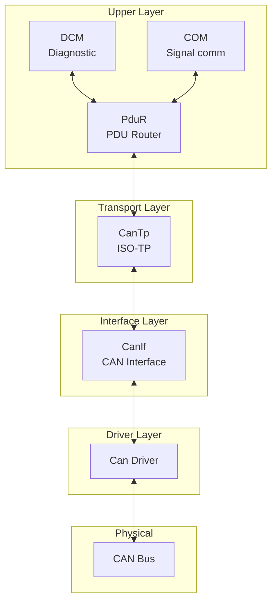
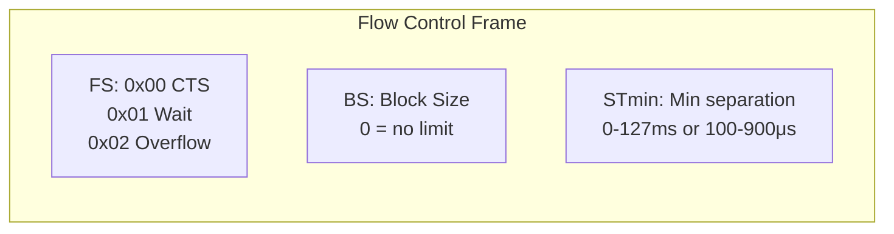
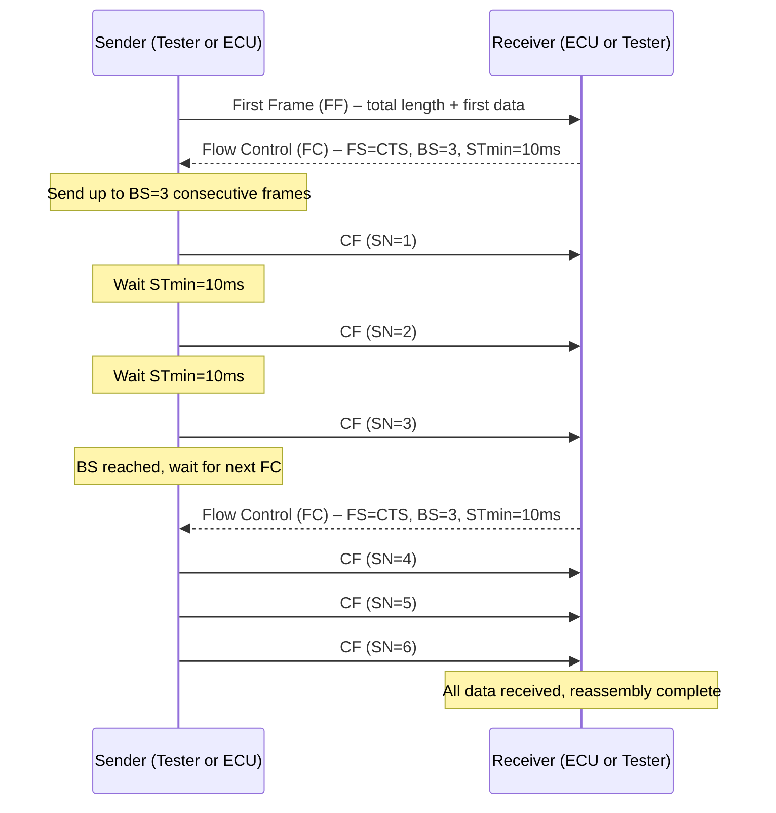
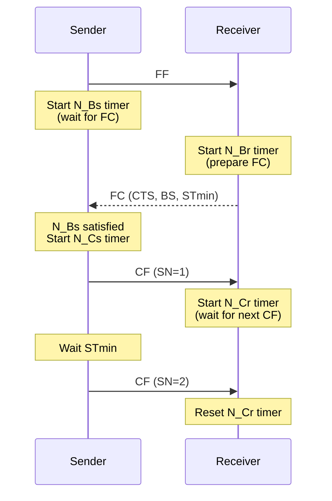
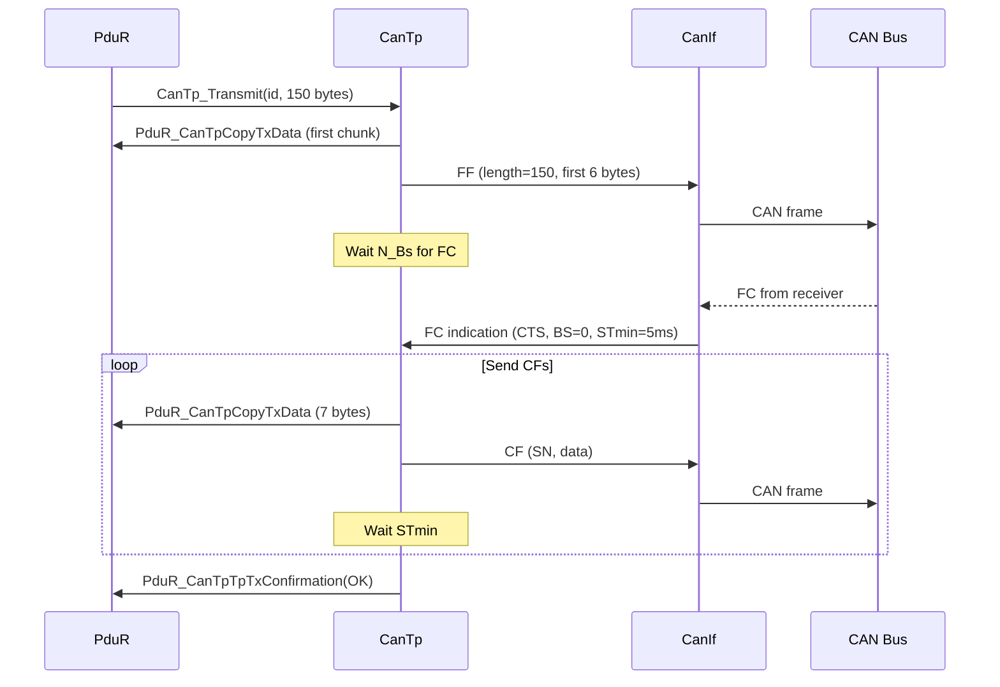
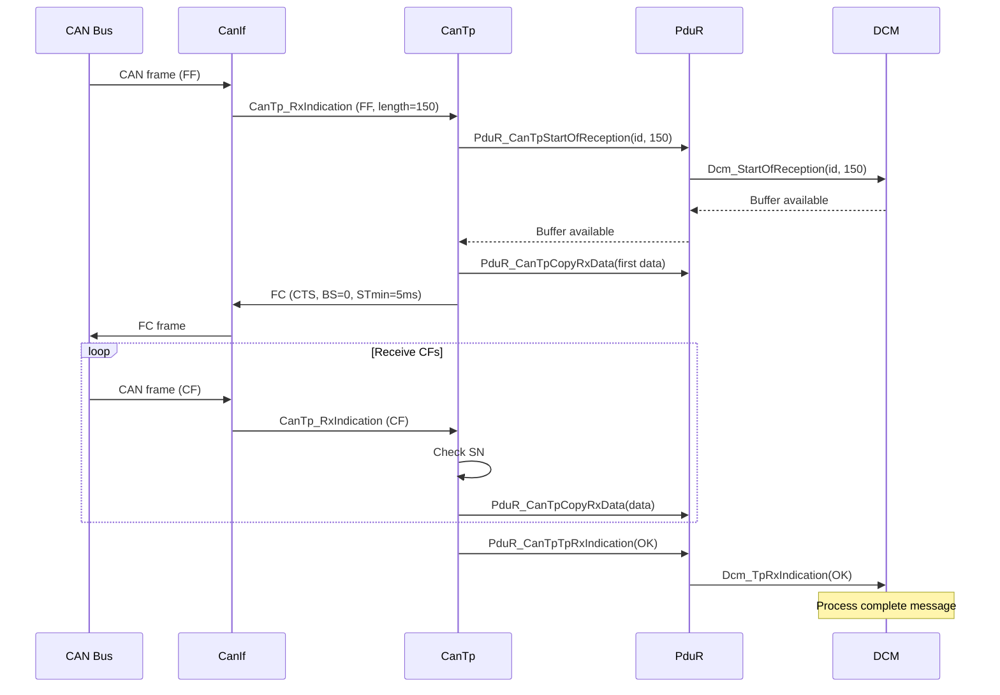
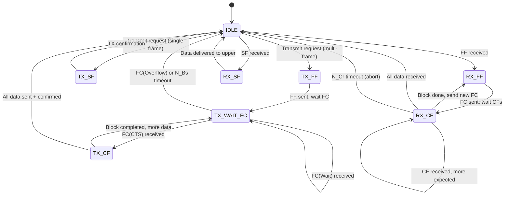
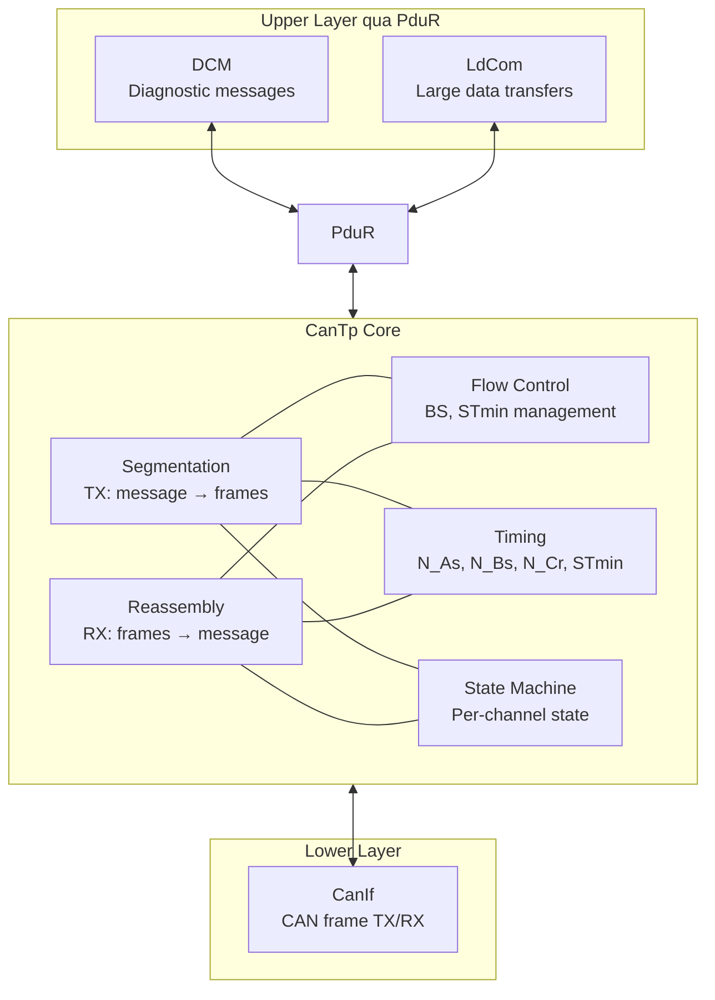

---
layout: default
category: uds
title: "CanTp - CAN Transport Protocol"
nav_exclude: true
module: true
tags: [autosar, cantp, transport, iso-15765, can, iso-tp]
description: "Tài liệu kỹ thuật về CanTp – module transport protocol trên CAN theo ISO 15765-2 trong AUTOSAR Classic."
permalink: /cantp/
---

# CanTp - CAN Transport Protocol

> Tài liệu này trình bày chi tiết module **CanTp (CAN Transport Protocol)** trong AUTOSAR Classic Platform. CanTp triển khai **ISO 15765-2 (ISO-TP)** – giao thức truyền tải trên CAN cho phép truyền nhận message **lớn hơn payload tối đa** của một CAN frame thông qua cơ chế phân mảnh (segmentation) và tái lắp ghép (reassembly).

## 1. Tổng quan module

**CanTp (CAN Transport Protocol)** là module thuộc communication stack AUTOSAR Classic, nằm giữa **PduR** phía trên và **CanIf** phía dưới. Nó giải quyết vấn đề cơ bản: CAN classic chỉ cho phép **8 byte payload** (CAN FD: 64 byte), nhưng nhiều message chẩn đoán hoặc dữ liệu lớn cần truyền hàng trăm đến hàng nghìn byte.

CanTp cung cấp:

1. **Segmentation** – chia message lớn thành nhiều CAN frame.
2. **Reassembly** – gom nhiều CAN frame thành message hoàn chỉnh.
3. **Flow control** – cho phép receiver điều khiển tốc độ truyền của sender.
4. **Error detection** – phát hiện lỗi truyền qua timeout và sequence number.

### 1.1 Tại sao cần CanTp?

Ví dụ: Tester yêu cầu đọc VIN (Vehicle Identification Number) qua UDS `0x22 F190`. Response chứa RSID + DID + VIN string ≈ 20 byte. Trên CAN classic (8 byte payload), response này **không fit** trong một single frame.

Không có CanTp:

1. Không thể truyền diagnostic response > 7 byte trên CAN.
2. Không thể flash ECU (dữ liệu hàng KB-MB).
3. Không thể đọc freeze frame lớn.

Với CanTp:

1. Message được chia nhỏ, truyền qua nhiều CAN frame.
2. Receiver gom lại thành message hoàn chỉnh.
3. Flow control đảm bảo không tràn buffer.

### 1.2 CanTp không làm gì

1. Không inspect nội dung payload – CanTp không hiểu UDS SID.
2. Không xử lý giao thức chẩn đoán – DCM làm việc đó.
3. Không routing PDU – PduR làm việc đó.
4. Không truyền CAN frame trực tiếp – CanIf làm việc đó.

## 2. Vị trí của CanTp trong AUTOSAR Communication Stack



Vị trí kiến trúc:

| Module | Vai trò |
|---|---|
| DCM / COM | Sản xuất/tiêu thụ message |
| PduR | Routing I-PDU giữa upper và transport layer |
| **CanTp** | **Phân mảnh/gom message, flow control** |
| CanIf | Giao tiếp với CAN driver |
| Can Driver | Truyền/nhận CAN frame vật lý |

## 3. Mục tiêu chức năng của CanTp

1. **Cho phép truyền message lớn** hơn payload CAN frame.
2. **Flow control** – receiver điều khiển tốc độ sender, tránh tràn buffer.
3. **Timeout detection** – phát hiện mất frame, abort session.
4. **Sequence checking** – phát hiện frame thứ tự sai.
5. **Padding** – đảm bảo frame đúng DLC (Data Length Code) yêu cầu.
6. **Hỗ trợ nhiều addressing format** – normal, extended, mixed.

## 4. Các khái niệm cốt lõi – ISO 15765-2 (ISO-TP)

### 4.1 Các loại frame

ISO-TP định nghĩa 4 loại frame, phân biệt qua **PCI (Protocol Control Information)** ở đầu payload:

| Frame Type | Abbreviation | PCI Nibble | Chức năng |
|---|---|---|---|
| Single Frame | SF | `0x0` | Chứa toàn bộ message (≤ 7 byte trên CAN classic) |
| First Frame | FF | `0x1` | Frame đầu tiên của multi-frame, chứa tổng chiều dài |
| Consecutive Frame | CF | `0x2` | Các frame tiếp theo, chứa sequence number |
| Flow Control | FC | `0x3` | Receiver gửi cho sender để điều khiển tốc độ |

### 4.2 Single Frame (SF)

Dùng khi **toàn bộ message fit trong một CAN frame**.

Cấu trúc (CAN classic, normal addressing):

```
| PCI: 0x0N | Data (N bytes) | Padding (if configured) |
```

- `N`: chiều dài data (1-7 byte cho CAN classic, 1-62 byte cho CAN FD).
- Nếu N ≤ 7: dùng SF thay vì multi-frame.

Ví dụ: UDS request `0x3E 00` (TesterPresent) = 2 byte → SF:

```
| 0x02 | 0x3E | 0x00 | 0xCC | 0xCC | 0xCC | 0xCC | 0xCC |
          SID    Sub    ---------- Padding ----------
```

### 4.3 First Frame (FF)

Dùng khi message **lớn hơn single frame**. FF chứa tổng chiều dài và phần data đầu tiên.

Cấu trúc (CAN classic, normal addressing):

```
| PCI: 0x1X | XX | Data (6 bytes) |
```

- Byte 0-1: `0x1` + 12-bit message length (tối đa 4095 byte).
- Nếu length > 4095: dùng extended FF format (ISO 15765-2:2016) với 32-bit length.

Ví dụ: Message 150 byte → FF:

```
| 0x10 | 0x96 | D0 | D1 | D2 | D3 | D4 | D5 |
  PCI    len     --------- First 6 data bytes ---------
```

### 4.4 Consecutive Frame (CF)

Các frame tiếp theo sau FF, chứa phần data còn lại.

Cấu trúc:

```
| PCI: 0x2N | Data (7 bytes) |
```

- `N`: sequence number (0-F), wrap quanh 0 sau F.
- CF đầu tiên có SN = 1 (SN 0 ngầm thuộc FF).

Ví dụ: CF thứ 3 (SN=3):

```
| 0x23 | D19 | D20 | D21 | D22 | D23 | D24 | D25 |
  SN=3   ------------- 7 data bytes ---------------
```

### 4.5 Flow Control (FC)

Receiver gửi FC **sau khi nhận FF** để cho sender biết:

1. **FS (Flow Status)**: cho phép tiếp tục, chờ, hoặc abort.
2. **BS (Block Size)**: số CF sender được gửi trước khi chờ FC tiếp.
3. **STmin (Separation Time minimum)**: khoảng cách tối thiểu giữa các CF.

Cấu trúc:

```
| PCI: 0x30 | BS | STmin |
```

Flow Status:

| FS | Ý nghĩa |
|---|---|
| `0x00` | ContinueToSend (CTS) |
| `0x01` | Wait – receiver chưa sẵn sàng, gửi FC khác sau |
| `0x02` | Overflow – receiver không đủ buffer, abort |



### 4.6 Luồng hoàn chỉnh multi-frame



### 4.7 Block Size (BS) chi tiết

BS = số CF sender được gửi trước khi phải chờ FC tiếp theo.

| BS value | Ý nghĩa |
|---|---|
| `0x00` | Không giới hạn – sender gửi hết không cần thêm FC |
| `0x01-0xFF` | Sender gửi BS frame, sau đó chờ FC |

Ví dụ BS=4: sender gửi FF → FC(BS=4) → CF1, CF2, CF3, CF4 → FC → CF5, CF6, ... → FC → ...

### 4.8 STmin (Separation Time minimum) chi tiết

STmin = khoảng cách tối thiểu giữa 2 CF liên tiếp.

| STmin value | Ý nghĩa |
|---|---|
| `0x00-0x7F` | 0-127 milliseconds |
| `0xF1-0xF9` | 100-900 microseconds |
| `0x80-0xF0`, `0xFA-0xFF` | Reserved |

Tác dụng:

1. Cho receiver đủ thời gian xử lý mỗi CF.
2. Tránh tràn buffer receiver.
3. STmin quá cao → truyền chậm. STmin quá thấp → có thể mất frame.

## 5. Timing Parameters

### 5.1 Bảng timing ISO-TP

| Parameter | Mô tả | Timeout điển hình |
|---|---|---|
| **N_As** | Sender: thời gian từ khi yêu cầu transmit đến khi CanIf confirm | 1000 ms |
| **N_Ar** | Receiver: thời gian từ khi yêu cầu transmit FC đến khi CanIf confirm | 1000 ms |
| **N_Bs** | Sender: thời gian chờ FC từ receiver sau khi gửi FF hoặc sau block | 1000 ms |
| **N_Br** | Receiver: thời gian chuẩn bị buffer trước khi gửi FC | < N_Ar |
| **N_Cs** | Sender: thời gian giữa khi nhận FC và khi bắt đầu gửi CF | < N_As |
| **N_Cr** | Receiver: thời gian chờ CF tiếp theo từ sender | 1000 ms |
| **STmin** | Separation time tối thiểu giữa các CF | 0-127 ms hoặc 100-900 μs |

### 5.2 Sơ đồ timing



### 5.3 Timeout handling

Khi timeout xảy ra:

| Timeout | Bên | Hành động |
|---|---|---|
| N_Bs expired | Sender | Abort TX session, báo PduR lỗi |
| N_Cr expired | Receiver | Abort RX session, báo PduR lỗi |
| N_As expired | Sender | CanIf không confirm → abort |
| N_Ar expired | Receiver | CanIf không confirm FC → abort |

## 6. Addressing Formats

### 6.1 Normal Addressing

Mỗi N-PDU trên CAN dùng một **CAN ID** duy nhất cho mỗi hướng communication.

| CAN ID | Hướng | Mô tả |
|---|---|---|
| `0x7DF` | Tester → ECU (functional) | Functional request |
| `0x7E0` | Tester → ECU A (physical) | Physical request to ECU A |
| `0x7E8` | ECU A → Tester | Response from ECU A |

Toàn bộ 8 byte CAN payload dùng cho ISO-TP PCI + data.

### 6.2 Extended Addressing

Byte đầu tiên của CAN payload chứa **target address (TA)** hoặc **source address (SA)**. Payload cho PCI + data giảm còn 7 byte.

```
| TA/SA (1 byte) | PCI | Data... |
```

Dùng khi cần nhiều logical address trên cùng CAN ID.

### 6.3 Mixed Addressing

Kết hợp CAN ID 29-bit và address extension byte.

```
| AE (1 byte) | PCI | Data... |
```

### 6.4 So sánh

| Addressing | Payload cho data | Use case |
|---|---|---|
| Normal | 7 byte (SF), 6 byte (FF) | Phổ biến nhất trên CAN 11-bit |
| Extended | 6 byte (SF), 5 byte (FF) | Nhiều ECU chia sẻ CAN ID |
| Mixed | 6 byte (SF), 5 byte (FF) | CAN FD / 29-bit ID |

## 7. Functional Description của CanTp

### 7.1 Khởi tạo CanTp

Khi ECU khởi động:

1. CanTp nạp cấu hình N-SDU, N-PDU, timing parameters, addressing mode.
2. Khởi tạo state machine cho tất cả RX/TX channel.
3. Reset session state.
4. CanTp sẵn sàng xử lý khi CanIf bắt đầu routing frame.

### 7.2 Luồng TX (Segmentation)

Khi PduR yêu cầu CanTp truyền message lớn:

1. PduR gọi `CanTp_Transmit(TxNSduId, PduLength)`.
2. CanTp kiểm tra: nếu length ≤ SF payload → gửi SF.
3. Nếu length > SF payload → bắt đầu multi-frame:
   a. CanTp tạo FF với total length + first data.
   b. CanTp gửi FF qua CanIf.
   c. CanTp khởi động N_Bs timer, chờ FC từ receiver.
   d. Khi nhận FC:
      - FS = CTS: ghi nhận BS, STmin. Bắt đầu gửi CF.
      - FS = Wait: reset N_Bs, chờ FC khác.
      - FS = Overflow: abort.
   e. CanTp gửi CF theo STmin, mỗi CF lấy data từ PduR qua `PduR_CanTpCopyTxData`.
   f. Sau BS frame: chờ FC tiếp.
   g. Lặp đến hết data.
4. Khi hoàn tất: `PduR_CanTpTpTxConfirmation(result)`.



### 7.3 Luồng RX (Reassembly)

Khi CanTp nhận frame từ CanIf:

1. CanIf gọi `CanTp_RxIndication(RxPduId, PduInfo)`.
2. CanTp kiểm tra PCI:
   - SF → message hoàn chỉnh:
     a. Gọi `PduR_CanTpStartOfReception` → PduR → DCM/upper.
     b. Gọi `PduR_CanTpCopyRxData` để copy data.
     c. Gọi `PduR_CanTpTpRxIndication(OK)`.
   - FF → multi-frame bắt đầu:
     a. Gọi `PduR_CanTpStartOfReception(totalLength)` → upper layer trả buffer size.
     b. Nếu buffer đủ → gửi FC(CTS, BS, STmin).
     c. Nếu buffer không đủ → gửi FC(Overflow) hoặc FC(Wait).
     d. Copy first data via `PduR_CanTpCopyRxData`.
     e. Khởi động N_Cr timer, chờ CF.
   - CF → data tiếp theo:
     a. Kiểm tra SN đúng thứ tự.
     b. Copy data via `PduR_CanTpCopyRxData`.
     c. Reset N_Cr timer.
     d. Nếu block completed và còn data → gửi FC.
     e. Nếu all data received → `PduR_CanTpTpRxIndication(OK)`.



### 7.4 State machine CanTp channel

Mỗi RX/TX channel trong CanTp có state machine:



### 7.5 Padding

CanTp có thể pad frame cuối cùng (SF hoặc CF cuối) để đạt **DLC cố định** (thường 8 byte trên CAN classic).

1. Padding byte thường là `0xCC`, `0xAA`, `0x55` hoặc `0x00` tùy cấu hình.
2. Mục đích: đảm bảo DLC nhất quán, tránh CAN controller reject frame ngắn.
3. CAN FD có thêm yêu cầu DLC cố định theo chuẩn.

### 7.6 Concurrent channel handling

CanTp hỗ trợ **nhiều channel đồng thời**:

1. Mỗi N-SDU có channel riêng.
2. RX và TX có thể chạy song song trên cùng channel (full-duplex ở mức logic).
3. Nhiều diagnostic connection có thể hoạt động đồng thời nếu cấu hình cho phép.

Hạn chế:

1. Trên cùng physical CAN bus, chỉ một message ở một thời điểm → CAN arbitration.
2. Nếu nhiều TP session → bus load tăng, timing có thể bị ảnh hưởng.

## 8. Luồng hoạt động điển hình

### 8.1 Tester đọc VIN qua UDS (multi-frame response)

1. Tester gửi SF: `0x02 22 F1 90` (ReadDataByIdentifier, DID F190).
2. CanTp ECU nhận SF → PduR → DCM.
3. DCM đọc VIN (17 chars + RSID + DID = 20 byte) → cần multi-frame.
4. DCM → PduR → `CanTp_Transmit(20 bytes)`.
5. CanTp gửi FF: `0x10 0x14 62 F1 90 V I N _` (first 6 data bytes).
6. Tester gửi FC: `0x30 00 05` (CTS, BS=0, STmin=5ms).
7. CanTp gửi CF1: `0x21 N _ N U M B E` (7 bytes).
8. CanTp gửi CF2: `0x22 R _ C H A R S` (7 bytes).
9. Transmission complete.

### 8.2 Flash ECU – large transfer

1. Tester gửi `0x34 RequestDownload` (address, size=100KB).
2. ECU positive response kèm max block length.
3. Tester gửi `0x36 TransferData` lần 1: block 1 (multi-frame, hàng KB).
4. CanTp phía ECU nhận FF → FC → CF... → gom block hoàn chỉnh → DCM.
5. DCM ghi data vào flash.
6. DCM response (SF, vài byte).
7. Tester gửi `0x36` lần 2, 3, ... cho đến hết.
8. Tester gửi `0x37 RequestTransferExit`.

### 8.3 Timeout scenario

1. Tester gửi FF cho diagnostic request.
2. ECU CanTp gửi FC(CTS).
3. Tester bắt đầu gửi CF... nhưng bus bị interference.
4. ECU CanTp khởi động N_Cr timer.
5. CF tiếp theo không đến.
6. N_Cr timeout → ECU CanTp abort RX session.
7. ECU CanTp báo PduR → PduR báo DCM: reception failed.

## 9. Module Dependencies của CanTp

### 9.1 Ma trận dependency

| Module | Hướng | Mức độ | Mô tả |
|---|---|---|---|
| PduR | Upper ↔ CanTp | Rất cao | Routing TP I-PDU, buffer management |
| CanIf | Lower ↔ CanTp | Rất cao | TX/RX CAN frame |
| SchM / OS | Hạ tầng | Cao | Scheduling main function, exclusive area |
| DET | Hạ tầng | Trung bình | Development error reporting |
| EcuM | Hạ tầng | Trung bình | Init/shutdown lifecycle |

### 9.2 Dependency với PduR

PduR là upper layer duy nhất mà CanTp giao tiếp:

1. **RX**: CanTp gọi `PduR_CanTpStartOfReception`, `PduR_CanTpCopyRxData`, `PduR_CanTpTpRxIndication`.
2. **TX**: PduR gọi `CanTp_Transmit`. CanTp gọi `PduR_CanTpCopyTxData`, `PduR_CanTpTpTxConfirmation`.

### 9.3 Dependency với CanIf

CanIf là lower layer duy nhất mà CanTp giao tiếp:

1. **TX**: CanTp gọi `CanIf_Transmit` để gửi frame.
2. **TX confirm**: CanIf gọi `CanTp_TxConfirmation`.
3. **RX**: CanIf gọi `CanTp_RxIndication` khi nhận frame.

### 9.4 CanTp main function

`CanTp_MainFunction` được gọi theo chu kỳ:

1. Kiểm tra timeout cho tất cả active channel.
2. Xử lý pending TX (gửi CF tiếp theo khi STmin đã qua).
3. Phát hiện N_Bs, N_Cr timeout và abort session.

Chu kỳ gọi main function ảnh hưởng:

1. Độ phân giải STmin.
2. Độ chính xác timeout detection.
3. Throughput truyền multi-frame.

## 10. Sơ đồ phụ thuộc chức năng



## 11. Các điểm cấu hình quan trọng

| Nhóm cấu hình | Ảnh hưởng |
|---|---|
| N-SDU to N-PDU mapping | Quyết định message nào dùng CAN ID nào |
| Addressing format (normal/extended/mixed) | Ảnh hưởng payload available per frame |
| BS (Block Size) | Ảnh hưởng tần suất FC, throughput |
| STmin | Ảnh hưởng tốc độ truyền CF |
| N_As, N_Bs, N_Cr timeouts | Ảnh hưởng thời gian detect lỗi |
| Padding mode | Đảm bảo DLC nhất quán |
| Max buffer size | Giới hạn message size lớn nhất |
| Channel count | Số session đồng thời |
| Main function period | Độ phân giải timing |

Sai sót phổ biến:

1. N-SDU mapping sai CAN ID → message không nhận được.
2. STmin quá thấp → receiver miss CF → N_Cr timeout.
3. BS quá lớn → receiver buffer overflow.
4. Timeout quá ngắn → abort session trên bus load cao.
5. Addressing format không khớp giữa sender/receiver → frame parse sai.
6. Padding không đúng → CAN controller reject frame.

## 12. CanTp làm gì và không làm gì

### 12.1 CanTp làm gì

1. Phân mảnh message lớn thành CAN frame.
2. Gom CAN frame thành message hoàn chỉnh.
3. Quản lý flow control (BS, STmin).
4. Giám sát timing và phát hiện timeout.
5. Kiểm tra sequence number.
6. Padding frame theo cấu hình.

### 12.2 CanTp không làm gì

1. Không hiểu nội dung payload (UDS SID, data meaning).
2. Không routing PDU (PduR làm).
3. Không truyền CAN frame trực tiếp (CanIf làm).
4. Không xử lý giao thức UDS (DCM làm).
5. Không quản lý signal ứng dụng (COM làm).

## 13. Góc nhìn tích hợp hệ thống

1. **CanTp là invisible nhưng critical** – khi mọi thứ hoạt động, không ai nghĩ đến CanTp. Khi CanTp lỗi, tất cả diagnostic và large data transfer đều chết.
2. **Timing tuning** – STmin và timeout phải phù hợp bus load thực tế. Bus load 80%+ có thể cần STmin cao hơn.
3. **Buffer sizing** – phải đủ cho message lớn nhất: flash transfer, large DID response.
4. **Test end-to-end** – test multi-frame request/response với tester thật, kiểm tra FC handling, timeout recovery.
5. **CAN FD consideration** – CAN FD cho phép 64 byte per frame, giảm số CF cần thiết nhưng CanTp vẫn cần cho message > 64 byte.

## 14. Kết luận

CanTp là **cầu nối** giữa thế giới CAN frame (giới hạn 8/64 byte) và thế giới ứng dụng (message lên đến hàng nghìn byte). Giá trị của CanTp:

1. **Cho phép diagnostic** – UDS request/response thường vượt quá single frame.
2. **Cho phép programming** – flash transfer cần truyền hàng KB-MB.
3. **Flow control** – receiver kiểm soát tốc độ, tránh tràn buffer.
4. **Reliability** – timeout detection và sequence checking.
5. **Transparency** – upper layer (DCM, COM) không cần biết message bị phân mảnh.

Nếu PduR là ngã tư giao thông và COM là nơi đóng gói signal, thì **CanTp là nhân viên bưu điện** – chia kiện hàng lớn thành bưu kiện nhỏ, giao từng bưu kiện qua bưu cục (CAN bus), và gom lại thành kiện hàng hoàn chỉnh phía nhận.

## 15. Ghi chú và nguồn tham khảo

Tài liệu này tổng hợp từ các nguồn công khai:

1. ISO 15765-2 (ISO-TP) public summaries và tutorials.
2. AUTOSAR Classic Platform CanTp SWS overview (public).
3. Vector Knowledge Base – CanTp module.
4. DeepWiki openAUTOSAR – CAN Transport Protocol.
5. Các tài liệu public về ISO-TP frame format, timing parameters và flow control.

Nội dung được viết lại theo cách giải thích thực dụng, phù hợp mục đích học tập.
