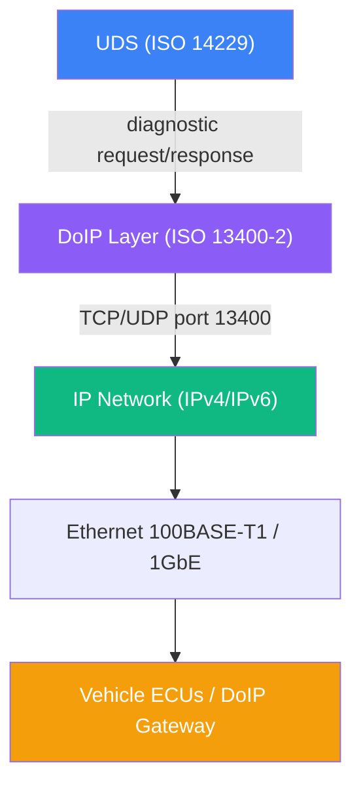
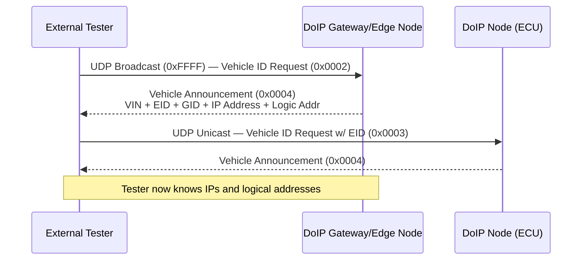
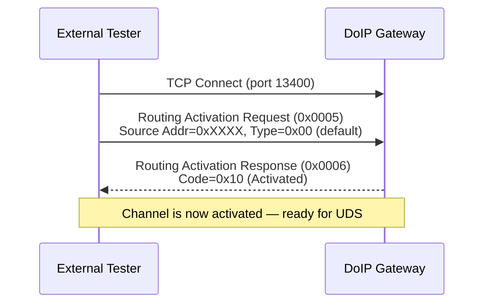
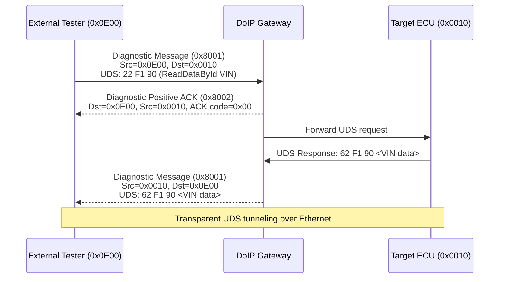

# DoIP – Diagnostics over Internet Protocol

## 1. Giới thiệu

**DoIP** (Diagnostics over Internet Protocol) là giao thức tầng transport được định nghĩa theo **ISO 13400-2**, cho phép truyền tải UDS messages qua mạng **Ethernet/TCP-IP** thay vì CAN bus.

Trong xe hơi thế hệ mới (EV, ADAS, high-bandwidth ECU), Ethernet được dùng như backbone network chính. DoIP là cầu nối giữa **external tester** (máy chẩn đoán) và **ECU** thông qua hạ tầng Ethernet sẵn có.

### So sánh DoIP và CanTp

| Đặc điểm | CanTp (ISO 15765-2) | DoIP (ISO 13400-2) |
|---|---|---|
| Transport Network | CAN Bus | Ethernet (TCP/UDP) |
| Tốc độ | 500 kbit/s – 8 Mbit/s | 100 Mbit/s – 1 Gbit/s |
| Max payload | ~4095 bytes (CanTp 2.0) | Không giới hạn thực tế |
| Port cố định | Không có | TCP/UDP 13400 |
| Phát hiện ECU | Không | UDP broadcast (vehicle discovery) |
| Authentication layer | Không tích hợp | TLS tuỳ chọn (ISO 13400-3) |
| Dùng trong | Xe truyền thống, in-vehicle | Flash lập trình, OTA, HPC ECU |

---

## 2. Kiến trúc Protocol Stack

```
┌─────────────────────────────────┐
│   UDS Application (ISO 14229)   │  ◄── Service Layer (SIDs)
├─────────────────────────────────┤
│   DoIP Transport (ISO 13400-2)  │  ◄── Frame routing, session mgmt
├─────────────────────────────────┤
│       TCP / UDP (Port 13400)    │  ◄── Reliable / Unreliable
├─────────────────────────────────┤
│         IPv4 / IPv6             │
├─────────────────────────────────┤
│   Ethernet (100BASE-T1 / 1GbE)  │
└─────────────────────────────────┘
```

- **UDP port 13400**: Vehicle discovery, entity status queries (connectionless)
- **TCP port 13400**: Diagnostic sessions – đảm bảo đủ thứ tự và tin cậy



---

## 3. Cấu trúc DoIP Frame

Mỗi DoIP message đều bắt đầu bằng một **generic header** 8 byte cố định:

```
 Byte 0         Byte 1         Byte 2     Byte 3     Byte 4–7
┌──────────────┬──────────────┬──────────────────────┬──────────────────────┐
│ Protocol Ver │ ~Protocol Ver│  Payload Type (2 B)  │  Payload Length (4B) │
└──────────────┴──────────────┴──────────────────────┴──────────────────────┘
│<──── Header ──────────────────────────────── 8 bytes ───────────────────>│
│<──── Payload data (0 … N bytes) ──────────────────────────────────────>  │
```

| Field | Size | Mô tả |
|---|---|---|
| Protocol Version | 1 byte | `0x02` = ISO 13400-2:2012; `0x03` = 2019 |
| ~Protocol Version | 1 byte | Bitwise inversion của byte trước (kiểm tra lỗi) |
| Payload Type | 2 bytes | Loại nội dung (xem bảng bên dưới) |
| Payload Length | 4 bytes | Số byte của payload (big-endian) |
| Payload | N bytes | Dữ liệu tuỳ loại message |

### Bảng Payload Type quan trọng

| Payload Type | Tên | Giao thức |
|---|---|---|
| `0x0001` | Generic DoIP Header Negative Acknowledge | UDP/TCP |
| `0x0002` | Vehicle Identification Request | UDP |
| `0x0003` | Vehicle Identification Request w/ EID | UDP |
| `0x0004` | Vehicle Identification Request w/ VIN | UDP |
| `0x0004` | Vehicle Announcement / VIN Response | UDP |
| `0x0005` | Routing Activation Request | TCP |
| `0x0006` | Routing Activation Response | TCP |
| `0x0007` | Alive Check Request | TCP |
| `0x0008` | Alive Check Response | TCP |
| `0x4001` | DoIP Entity Status Request | UDP/TCP |
| `0x4002` | DoIP Entity Status Response | UDP/TCP |
| `0x8001` | Diagnostic Message | TCP |
| `0x8002` | Diagnostic Message Positive ACK | TCP |
| `0x8003` | Diagnostic Message Negative ACK | TCP |

---

## 4. Luồng hoạt động

### 4.1 Vehicle Discovery (UDP Broadcast)

Trước khi thiết lập kết nối TCP, tester dùng UDP để tìm kiếm các DoIP entity trong mạng.



**Vehicle Announcement payload** (33 bytes tối thiểu):

| Field | Size | Mô tả |
|---|---|---|
| VIN | 17 B | Vehicle Identification Number |
| Logical Address | 2 B | Địa chỉ logic của DoIP entity |
| EID | 6 B | Entity Identifier (thường là MAC addr) |
| GID | 6 B | Group Identifier |
| Further Action | 1 B | `0x00` = không cần thêm, `0x10` = TLS required |

---

### 4.2 Routing Activation (TCP)

Sau khi kết nối TCP, tester phải thực hiện **Routing Activation** trước khi gửi UDS message.



**Routing Activation Request payload:**

| Field | Size | Giá trị |
|---|---|---|
| Source Address | 2 B | Tester logical address (e.g. `0x0E00`) |
| Activation Type | 1 B | `0x00` = Default, `0x01` = WWH-OBD |
| Reserved | 4 B | `0x00000000` |

**Response codes (byte cuối của response):**

| Code | Ý nghĩa |
|---|---|
| `0x10` | Routing successfully activated |
| `0x00` | Denied – unknown source address |
| `0x02` | Denied – connection already used |
| `0x04` | Denied – missing auth confirmed |

---

### 4.3 Diagnostic Message Exchange



**Diagnostic Message payload:**

| Field | Size | Mô tả |
|---|---|---|
| Source Address | 2 B | Logical addr người gửi |
| Target Address | 2 B | Logical addr người nhận (ECU/gateway) |
| UDS Message | N B | Byte thô của UDS request/response |

---

## 5. Ví dụ: DoIP Frame bytes

### ReadDataByIdentifier VIN (`0x22 0xF1 0x90`)

```
DoIP Header (8 bytes):
  02 FD           ← Protocol version 0x02, ~ver = 0xFD
  80 01           ← Payload Type = 0x8001 (Diagnostic Message)
  00 00 00 09     ← Payload Length = 9 bytes

Payload (9 bytes):
  0E 00           ← Source Address = 0x0E00 (tester)
  00 10           ← Target Address = 0x0010 (ECU)
  22 F1 90        ← UDS: ReadDataByIdentifier, DID=0xF190 (VIN)

Raw frame:
  02 FD 80 01 00 00 00 09 0E 00 00 10 22 F1 90
```

---

## 6. Ví dụ Code: Gửi DoIP Request (C)

```c
#include <stdio.h>
#include <stdint.h>
#include <string.h>
#include <sys/socket.h>
#include <netinet/in.h>
#include <arpa/inet.h>
#include <unistd.h>

#define DOIP_PORT        13400
#define DOIP_PROTO_VER   0x02
#define PT_ROUTING_REQ   0x0005
#define PT_DIAG_MSG      0x8001

/* Build a DoIP generic header */
static void build_header(uint8_t *buf, uint16_t payload_type, uint32_t payload_len)
{
    buf[0] = DOIP_PROTO_VER;
    buf[1] = (uint8_t)(~DOIP_PROTO_VER);        /* inverse version */
    buf[2] = (uint8_t)(payload_type >> 8);
    buf[3] = (uint8_t)(payload_type & 0xFF);
    buf[4] = (uint8_t)(payload_len >> 24);
    buf[5] = (uint8_t)(payload_len >> 16);
    buf[6] = (uint8_t)(payload_len >> 8);
    buf[7] = (uint8_t)(payload_len & 0xFF);
}

/* Send Routing Activation Request */
static int send_routing_activation(int sock, uint16_t tester_addr)
{
    uint8_t buf[8 + 7];
    build_header(buf, PT_ROUTING_REQ, 7);
    buf[8]  = (uint8_t)(tester_addr >> 8);
    buf[9]  = (uint8_t)(tester_addr & 0xFF);
    buf[10] = 0x00;                 /* activation type: default */
    buf[11] = buf[12] = buf[13] = buf[14] = 0x00; /* reserved */
    return send(sock, buf, sizeof(buf), 0);
}

/* Send Diagnostic Message wrapping a raw UDS payload */
static int send_diag_message(int sock,
                              uint16_t src, uint16_t dst,
                              const uint8_t *uds, size_t uds_len)
{
    uint8_t buf[8 + 4 + uds_len];
    build_header(buf, PT_DIAG_MSG, (uint32_t)(4 + uds_len));
    buf[8]  = (uint8_t)(src >> 8);
    buf[9]  = (uint8_t)(src & 0xFF);
    buf[10] = (uint8_t)(dst >> 8);
    buf[11] = (uint8_t)(dst & 0xFF);
    memcpy(&buf[12], uds, uds_len);
    return send(sock, buf, sizeof(buf), 0);
}

int main(void)
{
    /* UDS: ReadDataByIdentifier – DID 0xF190 (VIN) */
    const uint8_t uds_req[] = { 0x22, 0xF1, 0x90 };

    int sock = socket(AF_INET, SOCK_STREAM, 0);

    struct sockaddr_in addr = {
        .sin_family = AF_INET,
        .sin_port   = htons(DOIP_PORT),
    };
    inet_pton(AF_INET, "192.168.1.10", &addr.sin_addr);

    if (connect(sock, (struct sockaddr*)&addr, sizeof(addr)) < 0) {
        perror("connect"); return 1;
    }

    send_routing_activation(sock, 0x0E00);

    /* Read and discard routing activation response (13 bytes) */
    uint8_t resp[64];
    recv(sock, resp, sizeof(resp), 0);

    send_diag_message(sock, 0x0E00, 0x0010, uds_req, sizeof(uds_req));

    /* Read Positive ACK (12 bytes) then diagnostic response */
    recv(sock, resp, sizeof(resp), 0);  /* DiagMsg Positive ACK */
    int n = recv(sock, resp, sizeof(resp), 0);  /* UDS response */

    if (n > 12 && resp[12] == 0x62) {
        printf("VIN: %.17s\n", &resp[15]); /* bytes 15..31 = 17 chars */
    }

    close(sock);
    return 0;
}
```

> **Lưu ý bảo mật:** Trong production, DoIP nên chạy qua **TLS** (ISO 13400-3) để chống MITM và replay attacks. Port TLS là `13400` với STARTTLS hoặc wrap TLS socket.

---

## 7. DoIP trong AUTOSAR Classic

Trong AUTOSAR Classic, DoIP được implement bởi module **SoAd** (Socket Adaptor) + **DoIP** module phía trên PduR:

```
         DCM
          │
         PduR
       ┌──┴──┐
     CanTp  DoIP
       │      │
      Can   SoAd
              │
           TcpIp
              │
           EthIf → Ethernet Driver
```

- `DoIP` module nhận PDU từ PduR, đóng gói thành DoIP frame, gửi xuống SoAd
- `SoAd` quản lý TCP/UDP socket, map giữa PDU và socket connection
- Configuration chính: `DoIPConfig.xml` – khai báo logical addresses, Tester whitelist, activation type

---

## 8. Tóm tắt

| Bước | Action | Protocol |
|---|---|---|
| 1 | UDP broadcast tìm ECU | Vehicle ID Request → Announcement |
| 2 | TCP connect tới gateway | TCP SYN/SYN-ACK port 13400 |
| 3 | Routing Activation | PT=0x0005 → PT=0x0006 (code 0x10) |
| 4 | Gửi UDS request | PT=0x8001 (Diagnostic Message) |
| 5 | Nhận ACK | PT=0x8002 (Positive ACK) |
| 6 | Nhận UDS response | PT=0x8001 (nguồn từ ECU) |

DoIP là **backbone chẩn đoán** trong xe Ethernet, cung cấp tốc độ cao, phát hiện tự động qua UDP, và kết nối đáng tin cậy qua TCP – làm nền tảng cho flash lập trình, OTA update, và diagnostics trên xe EV/ADAS thế hệ mới.
