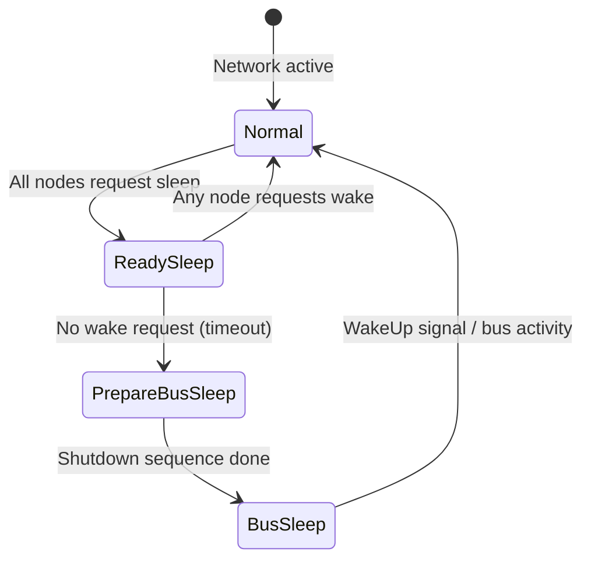

# Ethernet trong AUTOSAR Adaptive – SOME/IP & ara::com

## 1. Tại sao cần Ethernet trong ô tô?

**Vấn đề cần giải quyết:** xe hơi thế hệ mới (EV, ADAS, autonomous driving, V2X) yêu cầu truyền tải hàng trăm MB/s dữ liệu giữa các ECU – camera, radar, LiDAR, HPC, gateway. CAN bus (1–8 Mbit/s) không thể đáp ứng.

Ví dụ nhu cầu băng thông thực tế:

| Sensor / Hệ thống | Băng thông yêu cầu | Bus phù hợp |
|---|---|---|
| Camera 1080p × 8 | ~800 Mbit/s tổng | Ethernet |
| LiDAR (1M points/s) | ~200–500 Mbit/s | Ethernet |
| Radar raw data | ~50 Mbit/s | Ethernet |
| CAN diagnostic, body control | 0,5–8 Mbit/s | CAN / CAN FD |
| OTA update package (GB) | phụ thuộc tốc độ | Ethernet |
| Audio/Video stream | ~50–100 Mbit/s | Ethernet |

```
CAN bus max: 8 Mbit/s  ────────[không đủ]────────→ ✘
Ethernet:    100 Mbit/s – 10 Gbit/s   ────────→ ✔
```

Ngoài băng thông, Ethernet còn mang lại:
1. **IP protocol suite** – TCP/IP đã trưởng thành, ecosystem tooling phong phú.
2. **Khả năng kết nối cloud / V2X** – dùng chung giao thức với internet.
3. **Service-Oriented Architecture (SOA)** – kiến trúc phần mềm linh hoạt, dễ scale.
4. **Security foundation** – TLS, IPsec chạy native trên IP stack.

---

## 2. Automotive Ethernet – Physical Layer

### 2.1 Tại sao không dùng Ethernet chuẩn (IEEE 802.3)?

Ethernet tiêu chuẩn dùng cáp UTP 4 đôi (8 dây). Trong xe, mỗi kg cáp và từng cm không gian đều quan trọng. Cần:
1. **Ít dây hơn** – để giảm trọng lượng, đơn giản harness.
2. **Chịu được EMI** – môi trường xe đầy nhiễu điện từ từ motor, ignition.
3. **Hoạt động ở dải nhiệt độ rộng** (-40°C đến +125°C).
4. **BroadR-Reach / 100BASE-T1** – đây là câu trả lời.

### 2.2 100BASE-T1 (IEEE 802.3bw)

100BASE-T1 là chuẩn Ethernet automotive được thiết kế riêng cho ô tô:

```
Chuẩn Ethernet thường (100BASE-TX)    Automotive Ethernet (100BASE-T1)
━━━━━━━━━━━━━━━━━━━━━━━━━━━━      ━━━━━━━━━━━━━━━━━━━━━━━━━━━━━━
Cáp:    4 đôi xoắn (8 dây)            1 đôi xoắn (2 dây)
Tốc độ: 100 Mbit/s (half-duplex ok)   100 Mbit/s full-duplex
Kết nối: RJ-45 connector               Automotive connector (FAKRA, HSD…)
Mã hóa: 4B5B + MLT-3                   PAM3 (3-level pulse amplitude)
Khoảng cách: ~100 m                    ~15 m (in-vehicle ok)
EMI:    Standard                        Enhanced shielding spec
```

**PAM3 encoding** (3 mức tín hiệu: -1, 0, +1) cho phép truyền 100 Mbit/s qua 1 đôi dây nhờ hiệu quả mã hóa cao hơn NRZ.

### 2.3 1000BASE-T1 (IEEE 802.3bp)

Cho ứng dụng cần băng thông cao hơn (camera backbone, HPC interconnect):

| Đặc điểm | 100BASE-T1 | 1000BASE-T1 |
|---|---|---|
| Tốc độ | 100 Mbit/s | 1 Gbit/s |
| Cặp dây | 1 đôi | 1 đôi |
| Mã hóa | PAM3 | PAM3 |
| Khoảng cách xe | ~15 m | ~15 m |
| Dùng cho | Sensor control, ECU network | Camera aggregator, HPC |

> **💡 Điểm mấu chốt:** Automotive Ethernet không phải "Ethernet bị cắt bớt" – đây là chuẩn IEEE đầy đủ, chỉ tối ưu lớp vật lý cho môi trường xe. Từ lớp MAC trở lên, mọi thứ giống Ethernet hoàn toàn.

### 2.4 Multi-Gig và 10BASE-T1S

| Chuẩn | Tốc độ | Ứng dụng chính |
|---|---|---|
| 10BASE-T1S | 10 Mbit/s | In-vehicle bus thay CAN (đơn giản, giá thấp) |
| 100BASE-T1 | 100 Mbit/s | Mainstream ECU connectivity |
| 1000BASE-T1 | 1 Gbit/s | Camera, radar, gateway |
| 2.5/5GBASE-T1 | 2,5–5 Gbit/s | HPC, zonal architecture |
| 10GBASE-T1 | 10 Gbit/s | Backbone, compute cluster |

---

## 3. In-Vehicle Network Architecture

### 3.1 Zone-based Architecture

Kiến trúc xe hiện đại đang chuyển từ **domain-based** (mỗi domain ECU riêng) sang **zone-based** (các ECU gần nhau trong không gian xe được gom vào zone):

```
         ┌──────────────────────────────────────────────────┐
         │              Central HPC / Vehicle Computer       │
         │   (AUTOSAR Adaptive, Linux, QNX, Hypervisor)     │
         └──────┬──────────────┬─────────────┬──────────────┘
                │ 10G Ethernet │             │              │
         ┌──────┴───┐    ┌─────┴────┐  ┌────┴─────┐  ┌────┴──────┐
         │ Zone ECU │    │ Zone ECU │  │ Zone ECU │  │ Zone ECU  │
         │ Front    │    │ Rear     │  │ Left     │  │ Right     │
         │ 100BASE  │    │ 100BASE  │  │ 100BASE  │  │ 100BASE   │
         └────┬─────┘    └────┬─────┘  └────┬─────┘  └────┬──────┘
              │               │              │              │
         [Sensors]       [Sensors]      [Sensors]      [Sensors]
         Camera, Radar   Taillights     Door ctrl      Door ctrl
```

**Lợi ích zone architecture:**
1. Giảm tổng chiều dài cáp (wire harness ngắn hơn).
2. Zone ECU làm gateway giữa sensor và HPC.
3. HPC chạy AUTOSAR Adaptive, xử lý logic cao cấp.
4. Zone ECU có thể chạy AUTOSAR Classic cho hard-realtime functions.

### 3.2 Ethernet Switch trong xe

Không như CAN (bus topology, tất cả share 1 medium), Ethernet dùng **switch topology**:

```
ECU-A ──┐
ECU-B ──┤
ECU-C ──┼── [Ethernet Switch] ── ECU-D
ECU-E ──┤                    ── ECU-F
ECU-G ──┘                    ── External (OBD, V2X)
```

Ethernet Switch trong xe cần đặc thù:
1. **TSN (Time-Sensitive Networking)** – đảm bảo latency cho real-time traffic.
2. **VLAN** – tách biệt traffic giữa các domain (safety-critical vs infotainment).
3. **Managed switch** – cấu hình được, hỗ trợ profiling traffic.
4. **Redundancy** – HSR/PRP cho safety application.

---

## 4. AUTOSAR Adaptive Platform – Ethernet Stack

### 4.1 Tổng quan Adaptive Platform

AUTOSAR Adaptive Platform (AP) được thiết kế cho **high-performance ECU** chạy OS thực (Linux, QNX) với khả năng:
1. Dynamic service discovery – ứng dụng tìm service tại runtime.
2. Service-Oriented Architecture (SOA) thay vì signal-based communication.
3. Cập nhật phần mềm (OTA) không cần đặt trước cấu hình tĩnh.
4. Tích hợp với POSIX OS, multi-core, hypervisor.

```
   AUTOSAR Classic Platform         AUTOSAR Adaptive Platform
   ─────────────────────────        ──────────────────────────
   Static configuration             Dynamic configuration
   Signal-based (I-PDU)            Service-based (ara::com)
   Hard-RTOS (OSEK/AUTOSAR OS)     POSIX OS (Linux/QNX)
   ECU: body controller, BCM…       ECU: HPC, ADAS, gateway
   CAN dominant                     Ethernet dominant
   Flash microcontroller            SoC với GB RAM
```

### 4.2 Ethernet trong AP Stack

Trong Adaptive Platform, IP stack là nền tảng cho toàn bộ communication:

```
┌──────────────────────────────────────────────────────────┐
│                  Adaptive Applications                    │
│              (C++ services, consumers)                    │
├──────────────────────────────────────────────────────────┤
│                    ara::com API                           │  ← Service interface
├────────────────────┬─────────────────────────────────────┤
│   Service Discovery │      Data Transfer                  │
│   (SD / SOME/IP-SD) │   (SOME/IP / DDS / raw IP)         │
├────────────────────┴─────────────────────────────────────┤
│                    IP Stack (UDP/TCP)                     │
├──────────────────────────────────────────────────────────┤
│               Ethernet Driver / Network Interface         │
│             (100BASE-T1, 1000BASE-T1, loopback IPC)       │
└──────────────────────────────────────────────────────────┘
```

Các thành phần chính:
1. **ara::com** – Communication API cho application developer.
2. **SOME/IP** – Middleware protocol cho service communication.
3. **SOME/IP-SD** – Service Discovery để tìm kiếm service tại runtime.
4. **DDS** (optional) – Data Distribution Service, dùng cho ADAS/autonomous.
5. **DoIP** – Chẩn đoán qua IP (kết hợp với ara::diag).

---

## 5. SOME/IP – Scalable service-Oriented MiddlewarE over IP

### 5.1 SOME/IP là gì?

**SOME/IP** (Scalable service-Oriented MiddlewarE over IP) là middleware protocol được AUTOSAR và các OEM (BMW, Daimler, Bosch…) phát triển để thực hiện giao tiếp **hướng dịch vụ** qua IP trong môi trường automotive.

**Vấn đề SOME/IP giải quyết:** trong kiến trúc SOA, ứng dụng không gửi signal nữa mà gọi **service** hoặc subscribe **event**. Cần một giao thức định nghĩa rõ cách:
1. Serialize dữ liệu (method arguments, event payload).
2. Đóng gói vào frame (header format).
3. Gọi method từ xa (RPC – Remote Procedure Call).
4. Publish/subscribe event.

### 5.2 SOME/IP Frame Structure

Mỗi SOME/IP message có header 16 byte cố định:

```
 0                   1                   2                   3
 0 1 2 3 4 5 6 7 8 9 0 1 2 3 4 5 6 7 8 9 0 1 2 3 4 5 6 7 8 9 0 1
├─────────────────────────────────────────────────────────────────┤
│                      Service ID (16 bit)                        │
│                      Method ID (16 bit)                         │
├─────────────────────────────────────────────────────────────────┤
│                      Length (32 bit)                            │
│               (length of remaining message in bytes)            │
├─────────────────────────────────────────────────────────────────┤
│                      Client ID (16 bit)                         │
│                      Session ID (16 bit)                        │
├─────────────────────────────────────────────────────────────────┤
│  Protocol Ver (8) │ Interface Ver (8) │ Msg Type (8) │ RC (8)  │
├─────────────────────────────────────────────────────────────────┤
│                        Payload ...                              │
└─────────────────────────────────────────────────────────────────┘
```

| Field | Size | Ý nghĩa |
|---|---|---|
| Service ID | 16 bit | Định danh service (0x0000–0xFFFE) |
| Method ID | 16 bit | Định danh method hoặc event trong service |
| Length | 32 bit | Số byte còn lại (từ Client ID đến hết payload) |
| Client ID | 16 bit | Định danh phía gọi (để match response) |
| Session ID | 16 bit | Phân biệt các request đồng thời |
| Protocol Version | 8 bit | Phiên bản SOME/IP (thường = 0x01) |
| Interface Version | 8 bit | Phiên bản service interface |
| Message Type | 8 bit | REQUEST, RESPONSE, NOTIFICATION, ERROR… |
| Return Code | 8 bit | E_OK=0x00, hoặc mã lỗi |

**Message Type phổ biến:**

| Giá trị | Tên | Mô tả |
|---|---|---|
| 0x00 | REQUEST | Gọi method, yêu cầu response |
| 0x01 | REQUEST_NO_RETURN | Gọi method fire-and-forget |
| 0x02 | NOTIFICATION | Event/Field notification (không cần ack) |
| 0x80 | RESPONSE | Response cho REQUEST |
| 0x81 | ERROR | Response lỗi cho REQUEST |

### 5.3 Các mô hình giao tiếp trong SOME/IP

**5.3.1 Method Call (Request/Response)**

Giống RPC – consumer gọi method trên provider, provider xử lý và trả kết quả:

```
Consumer                          Provider
   │                                 │
   │── REQUEST (Svc 0x1234, #GetVIN)→│
   │        Service/Method ID        │── xử lý
   │        Client ID = 0xAB         │
   │        Session ID = 0x01        │
   │                                 │
   │←── RESPONSE (Svc 0x1234, 0x8000)│
   │        Session ID = 0x01        │  ← match bằng Session ID
   │        Payload: "WBA12345..."   │
```

**5.3.2 Fire-and-Forget**

Consumer gửi đi không chờ response, dùng cho command không cần xác nhận:

```
Consumer                          Provider
   │── REQUEST_NO_RETURN ──────────→ │
   │        Method: SetBrightness    │── thực thi
   │        Payload: 80%             │  (không trả gì)
```

**5.3.3 Event / Notification (Publish-Subscribe)**

Provider tự động gửi giá trị mới khi có thay đổi, consumer đã subscribe:

```
Provider                                 Consumer A  Consumer B
   │                                          │           │
   │    [Subscribe via SOME/IP-SD]            │           │
   │←──────────────────────────────────── sub │           │
   │←─────────────────────────────────────────────── sub  │
   │                                          │           │
   │── NOTIFICATION (speed = 60 km/h) ──────→│──────────→│
   │── NOTIFICATION (speed = 65 km/h) ──────→│──────────→│
```

**5.3.4 Field**

Kết hợp của getter, setter và notification – đại diện cho một giá trị có thể đọc, ghi và subscribe event khi thay đổi:

```
Field = Getter method + Setter method + Event notification
      = Truy cập current value + Cập nhật value + Subscribe change
```

> **💡 Điểm mấu chốt:** SOME/IP không tự serialize dữ liệu phức tạp – đó là việc của SOME/IP serialization format (kiểu dữ liệu được biểu diễn tuần tự theo little-endian với type info). AUTOSAR AP thêm tầng IDL (Interface Description Language) qua `.arxml` để generate code tự động.

### 5.4 SOME/IP-SD – Service Discovery

**SOME/IP-SD** (Service Discovery) là sub-protocol chạy trên UDP multicast, cho phép:
1. **Announce**: provider thông báo service của mình lên mạng.
2. **Find**: consumer tìm kiếm service theo Service ID.
3. **Subscribe**: consumer đăng ký eventgroup của service.
4. **Stop Announce / Stop Subscribe**: lifecycle management.

```
Provider (service available)          Consumer (looking for service)
   │                                          │
   │ OFFER_SERVICE (UDP multicast 224.x.x.x) │
   │─────────────────────────────────────────→│
   │                                          │
   │     ←── SUBSCRIBE_EVENTGROUP ────────────│
   │         (unicast, sau khi nhận Offer)    │
   │                                          │
   │── SUBSCRIBE_EVENTGROUP_ACK ─────────────→│
   │                                          │
   │== SOME/IP events flow now (unicast/mc) ==│
```

SD message structure:

```
[SOME/IP Header: Service=0xFFFF, Method=0x8100 (SD)]
[SOME/IP-SD Header: Flags, Entries Length, Options Length]
[Entries Array: OfferService / FindService / Subscribe…]
[Options Array: IPv4 Endpoint, IPv6 Endpoint, Multicast…]
```

> **⚠️ Cạm bẫy phổ biến:** Service Discovery dùng UDP multicast – nếu Ethernet switch không cấu hình IGMP snooping đúng, SD packet có thể flood toàn bộ mạng hoặc không đến đúng subscriber.

---

## 6. ara::com – Communication API trong AUTOSAR Adaptive

### 6.1 Vị trí của ara::com

`ara::com` là API C++ chính thức của AUTOSAR Adaptive Platform cho giao tiếp giữa các Adaptive Application. Nó **trừu tượng hóa lớp transport** (SOME/IP, DDS, local IPC) khỏi application code.

```
┌─────────────────────────────────────────────────────┐
│         Adaptive Application C++ code               │
│                                                     │
│   ProxyClass::method()     SkeletonClass::method()  │
│   consumer side            provider side            │
└──────────────────┬──────────────────────────────────┘
                   │ ara::com API
┌──────────────────┴──────────────────────────────────┐
│         Communication Management (CM)               │
│              SOME/IP binding / DDS binding          │
└──────────────────┬──────────────────────────────────┘
                   │ UDP/TCP socket
┌──────────────────┴──────────────────────────────────┐
│               IP Stack / Ethernet Driver             │
└─────────────────────────────────────────────────────┘
```

### 6.2 Hai vai trò: Skeleton (Provider) và Proxy (Consumer)

**Skeleton** = phía triển khai service (server):
- Code-generated từ `.arxml` interface description.
- Developer implement abstract methods, register event publishers.
- Runtime xử lý deserialize request và serialize response.

**Proxy** = phía dùng service (client):
- Code-generated từ cùng interface description.
- Developer sử dụng typed methods, subscribe events.
- Runtime xử lý serialize request, deserialize response.

### 6.3 Ví dụ thực tế – Speed Service

**Interface Definition** (conceptual, trong `.arxml`):

```
Service: VehicleSpeedService (ID = 0x1001)
  Method:  GetCurrentSpeed() → float64     (ID = 0x0001)
  Event:   SpeedChanged(float64 speed)     (ID = 0x8001)
  Field:   MaxSpeed : float64              (Getter=0x0002, Setter=0x0003)
```

**Skeleton (Provider) – viết trong ECU chứa speed sensor:**

```cpp
// VehicleSpeedServiceSkeleton.h – auto-generated từ ARXML
class VehicleSpeedServiceSkeleton {
public:
    // Constructor: đăng ký service với runtime
    VehicleSpeedServiceSkeleton(
        ara::core::InstanceSpecifier const& instance_specifier,
        ara::com::MethodCallProcessingMode mode);

    // Method handler – developer implement
    virtual ara::core::Future<GetCurrentSpeedOutput>
    GetCurrentSpeed() = 0;

    // Event publisher – developer calls này khi có dữ liệu mới
    ara::com::SampleAllocateePtr<float64> SpeedChanged;

    // OfferService – bắt đầu announce service lên mạng
    void OfferService();
    void StopOfferService();
};

// Implementation – developer viết
class SpeedServiceImpl : public VehicleSpeedServiceSkeleton {
public:
    SpeedServiceImpl(ara::core::InstanceSpecifier const& spec)
        : VehicleSpeedServiceSkeleton(spec,
            ara::com::MethodCallProcessingMode::kEvent) {}

    // Xử lý GetCurrentSpeed request
    ara::core::Future<GetCurrentSpeedOutput>
    GetCurrentSpeed() override {
        ara::core::Promise<GetCurrentSpeedOutput> promise;
        GetCurrentSpeedOutput output;
        // Đọc giá trị thực từ sensor/internal state
        output.speed = sensor_driver_.ReadSpeedKph();
        promise.set_value(output);
        return promise.get_future();   // async-friendly
    }

    // Gọi khi tốc độ thay đổi (từ sensor interrupt hoặc periodic task)
    void NotifySpeedChange(float64 new_speed) {
        auto sample = SpeedChanged.Allocate();
        *sample = new_speed;
        SpeedChanged.Send(std::move(sample));  // multicast tới subscribers
    }
};
```

**Proxy (Consumer) – viết trong ADAS hoặc dashboard application:**

```cpp
// Auto-generated từ cùng ARXML interface
class VehicleSpeedServiceProxy {
public:
    // FindService – tìm service trên mạng (async, không block)
    static ara::core::Result<ara::com::ServiceHandleContainer<
        VehicleSpeedServiceProxy::HandleType>>
    FindService(ara::com::InstanceIdentifier const& id);

    // Constructor từ handle tìm được
    explicit VehicleSpeedServiceProxy(HandleType const& handle);

    // Method call – trả Future, không block caller
    ara::core::Future<GetCurrentSpeedOutput> GetCurrentSpeed();

    // Event subscription – nhận notification khi speed thay đổi
    ara::com::Event<float64> SpeedChanged;
};

// Dashboard application
class SpeedDashboard {
    std::optional<VehicleSpeedServiceProxy> speed_proxy_;

    void Init() {
        // Tìm service theo specifier
        auto handles = VehicleSpeedServiceProxy::FindService(
            ara::com::InstanceIdentifier{"VehicleSpeed/1"});

        if (!handles || handles->empty()) {
            // Service chưa available – đăng ký callback khi có
            VehicleSpeedServiceProxy::StartFindService(
                [this](auto handles, auto) { OnServiceFound(handles); },
                ara::com::InstanceIdentifier{"VehicleSpeed/1"});
            return;
        }

        ConnectToService((*handles)[0]);
    }

    void ConnectToService(VehicleSpeedServiceProxy::HandleType const& handle) {
        speed_proxy_.emplace(handle);

        // Subscribe SpeedChanged event
        speed_proxy_->SpeedChanged.Subscribe(
            ara::com::EventCacheUpdatePolicy::kNewestN,
            5);   // giữ 5 sample gần nhất

        speed_proxy_->SpeedChanged.SetReceiveHandler(
            [this]() { OnSpeedEvent(); });
    }

    void OnSpeedEvent() {
        // Đọc tất cả sample đang có trong cache
        speed_proxy_->SpeedChanged.GetNewSamples(
            [this](auto sample) {
                float64 speed = *sample;
                UpdateDisplay(speed);   // cập nhật dashboard
            });
    }

    void RequestCurrentSpeed() {
        auto future = speed_proxy_->GetCurrentSpeed();

        // Gọi method async – không block
        future.then([this](auto result) {
            if (result.HasValue()) {
                UpdateDisplay(result.Value().speed);
            }
        });
    }
};
```

> **💡 Điểm mấu chốt:** `ara::com` dùng `ara::core::Future<T>` (tương tự `std::future`) cho mọi method call – giao tiếp luôn non-blocking. Đây là thiết kế bắt buộc vì service có thể ở xa qua mạng và độ trễ không xác định.

### 6.4 Binding Layer – SOME/IP vs DDS

`ara::com` là API trừu tượng. Binding layer quyết định dùng transport gì:

```
Application code ──→ ara::com API
                          │
          ┌───────────────┼───────────────────┐
          ▼               ▼                   ▼
    SOME/IP Binding   DDS Binding       Local IPC Binding
    (UDP/TCP port)    (RTPS/UDP)        (shared memory)
    ─────────────     ──────────        ─────────────────
    Phổ biến nhất     ADAS/Autosar CP   Cùng process/VM
    CAN replacement   Data-centric      Latency ~μs
    OEM-standard      Publish/Subscribe
```

Cấu hình binding được thực hiện qua `ara::com` manifest (`.arxml`) – application code không cần thay đổi khi đổi binding.

---

## 7. Network Management (NM) trong Automotive Ethernet

### 7.1 Tại sao cần Network Management?

Trong xe, không phải lúc nào Ethernet cũng cần hoạt động. Ví dụ:
1. Xe đang đỗ, chỉ có hệ thống bảo mật cần chạy.
2. Một số ECU cần ngủ (sleep) để tiết kiệm pin.
3. Khi có yêu cầu diagnostic, cần wake-up toàn bộ network.

**AUTOSAR NM over Ethernet** (Nm, UdpNm) quản lý:
1. **Partial Networking** – chỉ một số ECU/switch port active.
2. **Network wakeup** – khi có request.
3. **Coordinated shutdown** – tất cả node đồng ý tắt mạng.

### 7.2 UdpNm hoạt động thế nào?

**UdpNm** (UDP Network Management) dùng UDP multicast để các node vote về trạng thái network:

```
Mỗi ECU gửi NM message định kỳ qua UDP multicast:
[NM PDU header][Vote bit][Node state]

Nếu ECU A muốn giữ network sống: set "Keep-Alive" vote
Nếu tất cả ECU vote "Ready-to-Sleep": network coordinator
đồng ý shutdown, gửi Sleep Indication
```

Trạng thái NM theo AUTOSAR:



---

## 8. Security cho Ethernet trong AUTOSAR Adaptive

### 8.1 Tại sao Ethernet tăng attack surface?

CAN bus: không có địa chỉ, không có firewall native, nhưng isolated về vật lý – không ai từ internet gọi thẳng vào CAN được.

Ethernet: IP-connected, có thể reach từ V2X, cloud, Wi-Fi, OBD port (Ethernet). Attack surface lớn hơn nhiều.

**Các vector tấn công phổ biến qua Ethernet:**
1. **Spoofed SOME/IP service** – giả mạo service để inject bad data.
2. **DoS attack** – flood UDP, làm tắc network.
3. **Man-in-the-Middle** – intercept và modify SOME/IP messages.
4. **Replay attack** – gửi lại SOME/IP request cũ.

### 8.2 AUTOSAR AP Security Layers

```
Application Layer:       SecOC (Secure Onboard Communication)
                         – MAC authentication cho SOME/IP payload

Transport Layer:         TLS 1.3 (cho TCP-based SOME/IP)
                         DTLS 1.2/1.3 (cho UDP-based SOME/IP)

Network Layer:           IPsec (optional, firewall)
                         VLAN segmentation (IEEE 802.1Q)

Physical/Link Layer:     MACsec (IEEE 802.1AE)
                         – encryption at Ethernet frame level
```

**SecOC với SOME/IP** (phổ biến nhất trong AP):

```cpp
// SecOC thêm Freshness Value + MAC vào cuối mỗi SOME/IP payload
// Application không thấy – CM layer xử lý transparent

SOME/IP Payload (plain):  [speed: 60.0f]
SecOC-protected payload:  [speed: 60.0f][FreshnessValue: 4B][MAC: 4B]
```

> **⚠️ Cạm bẫy phổ biến:** TLS cho SOME/IP tăng latency đáng kể (handshake + encryption overhead). Cần phân tích kỹ QoS requirement trước khi enable cho safety-critical events. Thường dùng DTLS cho event notifications vì latency-sensitive.

---

## 9. Quan hệ giữa Ethernet, DoIP và ara::diag

### 9.1 Chẩn đoán qua Ethernet trong Adaptive Platform

AUTOSAR AP dùng **DoIP + ara::diag** cho diagnostic:

```
External Tester ──[DoIP/TCP 13400]──→ AP ECU
                                          │
                                     ara::diag (Diagnostic Manager - DM)
                                          │
                               ┌──────────┴──────────┐
                               │  UDS service handlers │
                               │  0x22, 0x2E, 0x31    │
                               │  0x19 via DEM         │
                               └──────────────────────┘
```

Quan hệ:
- **DoIP** = transport protocol (ISO 13400-2), thay CanTp cho Ethernet.
- **ara::diag** = AUTOSAR AP Diagnostic Manager, xử lý UDS logic.
- **DM** không cần biết transport dùng CAN hay Ethernet – DoIP binding là trong Communication Management layer.

### 9.2 OTA Update qua Ethernet và UCM

AUTOSAR AP **UCM (Update & Configuration Management)** nhận software package qua mạng:

```
Cloud/Backend ──[HTTPS/TLS]──→ [Telematics ECU] ──[SOME/IP/ara::com]──→ UCM
                                                                           │
                                              UCM xử lý & phân phối ──→   │
                                     ┌─────────────────────────────────────┘
                                     │
                           App/Service packages
                           → Install / Update / Rollback
```

Ethernet là backbone bắt buộc cho OTA payload – không thể truyền GB software package qua CAN.

---

## 10. TSN – Time-Sensitive Networking cho Real-time Ethernet

### 10.1 Vấn đề của Ethernet standard với real-time

Ethernet chuẩn là **best-effort** – không đảm bảo latency. Với gói data camera ảnh hưởng đến xe tự lái, latency không ổn định là không chấp nhận được.

**TSN (IEEE 802.1 TSN)** là tập hợp extension cho Ethernet cung cấp:
1. **Deterministic latency** – bounded worst-case delay.
2. **Traffic scheduling** – ưu tiên safety-critical traffic.
3. **Frame preemption** – interrupt low-priority frame để gửi urgent frame.
4. **Time synchronization** – IEEE 802.1AS (gPTP).

### 10.2 Các chuẩn TSN quan trọng

| Chuẩn | Tên | Chức năng |
|---|---|---|
| IEEE 802.1AS | gPTP | Time sync giữa các node (sub-μs precision) |
| IEEE 802.1Qbv | TAS | Time-aware shaper – schedule transmission window |
| IEEE 802.1Qbu | Frame Preemption | Interrupt low-prio frame ngay lập tức |
| IEEE 802.1Qcc | YANG CNC | Centralized TSN configuration |
| IEEE 802.1CB | FRER | Frame Replication for redundancy |

**Time-Aware Shaper (TAS)** là trung tâm của TSN:

```
Thời gian chia thành cycle cố định (ví dụ: 1 ms):
┌────────────┬────────────────────────────────────────────┐
│ Window A   │ Window B                                   │
│ Safety     │ Best-effort (infotainment, background)     │
│ critical   │                                           │
│ (ADAS msg) │                                           │
└────────────┴────────────────────────────────────────────┘
     ▲ Guaranteed slot             ▲ Can be delayed if needed
     Latency: deterministic        Latency: best-effort
```

### 10.3 TSN trong AUTOSAR

AUTOSAR AP hỗ trợ TSN thông qua:
1. **EthTrcv** – Ethernet Transceiver driver hỗ trợ TSN transceivers.
2. **EthSwt** – Ethernet Switch driver, cấu hình TSN rules.
3. **StbM** – Synchronized Time Base Manager, liên kết gPTP với internal clock.
4. **TimeMaster/TimeSlave** – role assignment cho gPTP domain.

---

## 11. Tóm tắt

| Kỹ thuật | Vấn đề giải quyết | Bối cảnh sử dụng |
|---|---|---|
| 100BASE-T1 / 1000BASE-T1 | Truyền tốc độ cao qua 1 đôi dây, chịu EMI | In-vehicle ECU connectivity thay / bổ sung CAN |
| Zone Architecture | Giảm wire harness, tập trung compute vào HPC | Xe EV/autonomous thế hệ mới |
| SOME/IP | Service-oriented communication qua IP cho ECU | AP-to-AP và AP-to-CP communication |
| SOME/IP-SD | Tìm kiếm service động, không cần cấu hình tĩnh | Multi-ECU Adaptive clusters |
| ara::com | Trừu tượng hóa transport, portable application code | Mọi Adaptive Application giao tiếp liên process/ECU |
| DoIP (ISO 13400-2) | Chẩn đoán UDS qua Ethernet thay CanTp | HPC ECU, OTA-capable vehicle |
| TSN (802.1Qbv/AS) | Deterministic latency trên Ethernet | ADAS, safety-critical realtime data |
| UCM + Ethernet | OTA update payload truyền qua mạng | Software-defined vehicle, fleet update |
| SecOC / TLS / DTLS | Bảo vệ SOME/IP messages khỏi tấn công | Gateway, internet-connected ECU |

---

**← Phần trước:** [DoIP - Diagnostics over Internet Protocol](/communication/doip/)
