# UDS - Unified Diagnostic Services Overview

<div class="callout callout--note">
<strong>📖 Về tài liệu này</strong>
Trình bày tổng quan giao thức <strong>UDS (Unified Diagnostic Services)</strong> theo chuẩn <strong>ISO 14229</strong>. UDS là nền tảng giao thức chẩn đoán được sử dụng rộng rãi nhất trong ngành ô tô hiện đại, là cơ sở để các module AUTOSAR như DCM, DEM, CanTp phối hợp hoạt động.
</div>

## 1. Tổng quan về UDS

**UDS (Unified Diagnostic Services)** là bộ giao thức chẩn đoán chuẩn hóa theo **ISO 14229**, định nghĩa cách một diagnostic tester giao tiếp với ECU (Electronic Control Unit) trên xe.

UDS thống nhất các dịch vụ chẩn đoán thay cho nhiều giao thức cũ riêng biệt, bao gồm:

- Đọc và xóa mã lỗi (DTC)
- Đọc/ghi dữ liệu cấu hình, ID, calibration
- Điều khiển routine kiểm tra, hiệu chỉnh
- Quản lý session và bảo mật
- Cập nhật phần mềm (flashing/programming)
- Điều khiển communication và DTC setting

UDS không phụ thuộc vào một physical bus cụ thể. Nó có thể hoạt động trên CAN, CAN FD, Ethernet (DoIP), LIN, FlexRay thông qua các transport protocol tương ứng.

### 1.1 Lịch sử và vị trí trong hệ sinh thái

Trước UDS, các OEM và nhà cung cấp sử dụng các giao thức chẩn đoán riêng hoặc các tiêu chuẩn cũ hơn như KWP2000 (ISO 14230). UDS ra đời để:

- **Thống nhất** giao diện chẩn đoán giữa nhiều OEM
- **Mở rộng** khả năng dịch vụ so với KWP2000
- **Tách biệt** application-level diagnostic khỏi transport/physical layer
- **Hỗ trợ** các yêu cầu OBD/WWH-OBD emission-related

### 1.2 Các tiêu chuẩn liên quan

| Tiêu chuẩn | Nội dung |
|---|---|
| **ISO 14229-1** | UDS application layer – định nghĩa services, request/response format |
| **ISO 14229-2** | Session layer services |
| **ISO 14229-3** | UDS on CAN (UDSonCAN) |
| **ISO 14229-5** | UDS on IP (UDSonIP / DoIP) |
| **ISO 15765-2** | ISO-TP – transport protocol trên CAN, xử lý phân mảnh/gom frame |
| **ISO 15765-3** | Diagnostic communication on CAN |
| **ISO 13400** | DoIP – Diagnostics over Internet Protocol |
| **ISO 14230** | KWP2000 – giao thức tiền nhiệm |
| **SAE J1979** | OBD services |

## 2. Mô hình OSI và vị trí của UDS

UDS hoạt động ở tầng **Application Layer** trong mô hình tham chiếu OSI. Nó phụ thuộc vào các tầng dưới để truyền tải dữ liệu qua bus vật lý.

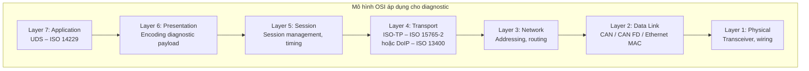

Trong AUTOSAR Classic, mapping tương ứng:

| OSI Layer | AUTOSAR Module |
|---|---|
| Application (L7) | DCM (UDS server) |
| Transport (L4) | CanTp / DoIP |
| Network (L3) | PduR (routing) |
| Data Link (L2) | CanIf / EthIf |
| Physical (L1) | Can / Eth driver |

## 3. Mô hình Client-Server

UDS hoạt động theo mô hình **client-server**:

1. **Client** = diagnostic tester (thiết bị ngoài xe hoặc phần mềm PC).
2. **Server** = ECU trên xe, cụ thể là module DCM trong AUTOSAR.

Đặc điểm chính:

- Tester **chủ động** gửi request
- ECU **phản hồi** bằng positive response hoặc negative response
- Giao tiếp là **request-driven**, không phải publisher-subscriber
- Một tester có thể gửi request tới nhiều ECU (functional addressing) hoặc một ECU cụ thể (physical addressing)

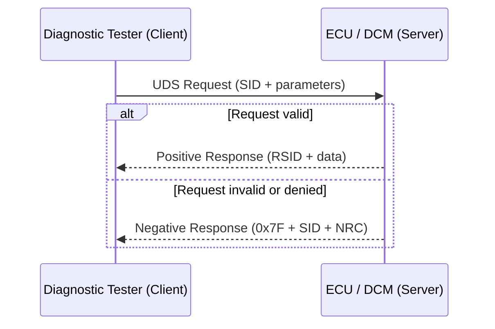

### 3.1 Suppression of positive response

<div class="callout callout--tip">
<strong>💡 Suppress Positive Response</strong>
Một số request có thể yêu cầu <strong>suppress positive response</strong> bằng cách set bit đặc biệt trong sub-function byte. Khi đó ECU không gửi response nếu kết quả thành công, chỉ gửi negative response nếu thất bại. Điều này giảm tải bus trong functional addressing.
</div>

## 4. Cấu trúc Diagnostic Message

### 4.1 Request message

Cấu trúc cơ bản của một UDS request:

```
| SID (1 byte) | [Sub-function (1 byte)] | [Parameters...] |
```

1. **SID** (Service Identifier): byte đầu tiên, xác định dịch vụ.
2. **Sub-function**: byte thứ hai (nếu có), chứa sub-function ID và suppress bit.
3. **Parameters**: phần còn lại tùy dịch vụ – DID, RID, DTC group, address, data payload.

### 4.2 Positive response

```
| RSID (1 byte) | [Sub-function echo] | [Response data...] |
```

**RSID = SID + 0x40**.

Ví dụ:

| Request SID | Dịch vụ | Response RSID |
|---|---|---|
| `0x10` | DiagnosticSessionControl | `0x50` |
| `0x22` | ReadDataByIdentifier | `0x62` |
| `0x27` | SecurityAccess | `0x67` |
| `0x31` | RoutineControl | `0x71` |
| `0x19` | ReadDTCInformation | `0x59` |

### 4.3 Negative response

```
| 0x7F | SID gốc | NRC (1 byte) |
```

Negative response luôn có format cố định 3 byte:

| Byte | Giá trị | Mô tả |
|---|---|---|
| 1 | `0x7F` | Negative response service ID |
| 2 | SID gốc | Service ID của request bị từ chối |
| 3 | NRC | Negative Response Code – lý do từ chối |

### 4.4 Sơ đồ cấu trúc message

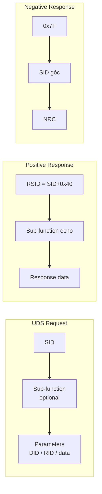

## 5. UDS Service Identifier (SID) – Bảng dịch vụ

### 5.1 Bảng SID chính

| SID | Dịch vụ | Mô tả ngắn |
|---|---|---|
| `0x10` | DiagnosticSessionControl | Chuyển đổi session |
| `0x11` | ECUReset | Reset ECU |
| `0x14` | ClearDiagnosticInformation | Xóa DTC |
| `0x19` | ReadDTCInformation | Đọc thông tin DTC |
| `0x22` | ReadDataByIdentifier | Đọc dữ liệu theo DID |
| `0x23` | ReadMemoryByAddress | Đọc memory trực tiếp |
| `0x24` | ReadScalingDataByIdentifier | Đọc scaling data |
| `0x27` | SecurityAccess | Xác thực bảo mật |
| `0x28` | CommunicationControl | Điều khiển communication |
| `0x2A` | ReadDataByPeriodicIdentifier | Đọc dữ liệu theo chu kỳ |
| `0x2C` | DynamicallyDefineDataIdentifier | Định nghĩa DID động |
| `0x2E` | WriteDataByIdentifier | Ghi dữ liệu theo DID |
| `0x2F` | InputOutputControlByIdentifier | Điều khiển IO |
| `0x31` | RoutineControl | Điều khiển routine |
| `0x34` | RequestDownload | Bắt đầu download |
| `0x35` | RequestUpload | Bắt đầu upload |
| `0x36` | TransferData | Truyền dữ liệu |
| `0x37` | RequestTransferExit | Kết thúc transfer |
| `0x3E` | TesterPresent | Giữ kết nối active |
| `0x85` | ControlDTCSetting | Bật/tắt DTC recording |
| `0x86` | ResponseOnEvent | Cấu hình event-triggered response |
| `0x87` | LinkControl | Điều khiển communication link |

### 5.2 Phân nhóm dịch vụ theo chức năng

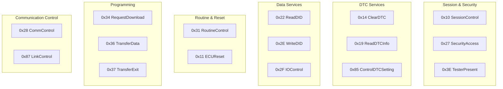

## 6. Addressing Mode

UDS request có thể đi theo hai kiểu địa chỉ logic:

### 6.1 Physical addressing

Request nhắm tới **một ECU cụ thể** qua địa chỉ vật lý riêng.

Đặc điểm:

- Luôn có response (positive hoặc negative) trừ khi suppress bit được set
- Dùng cho hầu hết các dịch vụ: đọc/ghi DID, routine, programming, security access
- Trong CAN: sử dụng RX CAN ID riêng cho từng ECU

### 6.2 Functional addressing

Request phát **quảng bá logic** tới tất cả ECU hỗ trợ cùng dịch vụ.

Đặc điểm:

- Nhiều ECU có thể nhận cùng request
- Response handling phụ thuộc vào service và suppress bit
- Một số service chỉ hỗ trợ physical addressing
- Functional addressing thường dùng cho: `TesterPresent`, `ClearDTC`, `ControlDTCSetting`, `CommunicationControl`

### 6.3 Ảnh hưởng tới hành vi DCM

- Một số service chỉ hợp lệ với physical addressing (ví dụ: `SecurityAccess`, `WriteDataByIdentifier`)
- Trong functional addressing, positive response có thể bị suppress để tránh bus collision
- DCM phải kiểm tra addressing mode trước khi quyết định gửi response

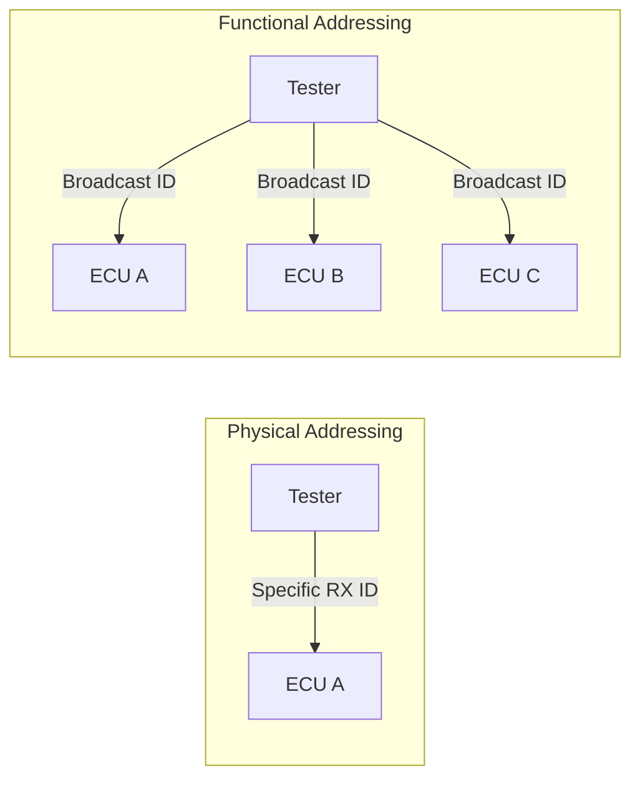

## 7. Diagnostic Session

### 7.1 Khái niệm session

Session xác định **mức truy cập** mà tester có trên ECU tại một thời điểm. ECU luôn ở đúng một session.

Các session phổ biến:

| Session | Sub-function | Mô tả |
|---|---|---|
| Default session | `0x01` | Session sau power-on, cho phép các dịch vụ cơ bản |
| Programming session | `0x02` | Cho phép flash/download/upload |
| Extended diagnostic session | `0x03` | Cho phép dịch vụ nâng cao: DID ghi, routine, IO control |
| Vendor-specific sessions | `0x40-0x5F` | Do OEM/vendor định nghĩa |

### 7.2 Chuyển đổi session

Chuyển session bằng `0x10 DiagnosticSessionControl`:

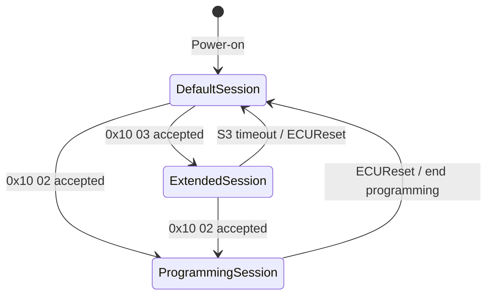

### 7.3 Quy tắc session

<div class="callout callout--warn">
<strong>⚠️ Lưu ý về session</strong>

- **Service permission**: mỗi service có danh sách session được phép. Ví dụ `WriteDataByIdentifier` thường chỉ được phép trong extended session
- **Security level**: một số service còn yêu cầu security access đã mở khóa
- **S3 timeout**: nếu tester không gửi request hoặc `TesterPresent` trong thời gian S3, ECU tự quay về default session
- **Reset effect**: khi session thay đổi, timing parameters (P2, P2*) có thể thay đổi theo
</div>

## 8. Security Access

### 8.1 Mục đích

Nhiều dịch vụ UDS nhạy cảm (ghi dữ liệu, flash ECU, điều khiển IO) cần được bảo vệ. **Security Access** (`0x27`) đảm bảo chỉ tester có khóa hợp lệ mới được phép thực hiện.

### 8.2 Luồng seed-key

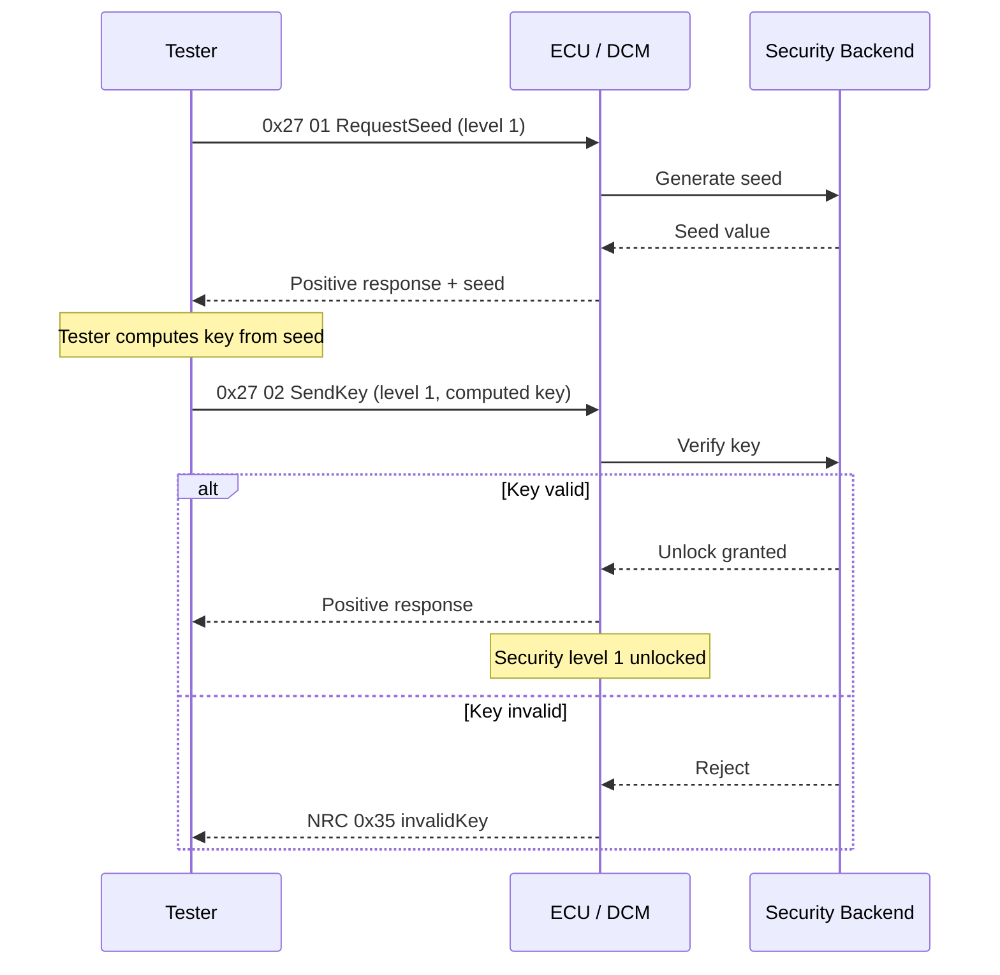

### 8.3 Cơ chế bảo vệ

- **Attempt counter**: sau N lần gửi key sai, ECU trả NRC `0x36 exceedNumberOfAttempts`
- **Time delay**: sau khi bị khóa, tester phải chờ một khoảng thời gian trước khi thử lại (NRC `0x37 requiredTimeDelayNotExpired`)
- **Security level**: có thể có nhiều level cho các mức truy cập khác nhau
- **Session dependency**: security access thường chỉ được phép ở extended hoặc programming session

## 9. Negative Response Code (NRC)

### 9.1 Bảng NRC quan trọng

| NRC | Tên | Ý nghĩa |
|---|---|---|
| `0x10` | generalReject | Từ chối chung, không xác định lý do cụ thể |
| `0x11` | serviceNotSupported | Service không được hỗ trợ bởi ECU |
| `0x12` | subFunctionNotSupported | Sub-function không hợp lệ |
| `0x13` | incorrectMessageLengthOrInvalidFormat | Chiều dài message hoặc format sai |
| `0x14` | responseTooLong | Response vượt quá khả năng transport |
| `0x21` | busyRepeatRequest | Server đang bận, yêu cầu gửi lại |
| `0x22` | conditionsNotCorrect | Điều kiện chưa đúng (mode, state) |
| `0x24` | requestSequenceError | Thứ tự request sai |
| `0x25` | noResponseFromSubnetComponent | Subnet component không phản hồi |
| `0x26` | failurePreventsExecutionOfRequestedAction | Lỗi nội bộ ngăn thực thi |
| `0x31` | requestOutOfRange | Tham số ngoài phạm vi hợp lệ |
| `0x33` | securityAccessDenied | Chưa mở khóa security |
| `0x35` | invalidKey | Key gửi không đúng |
| `0x36` | exceedNumberOfAttempts | Vượt quá số lần thử |
| `0x37` | requiredTimeDelayNotExpired | Chưa hết thời gian chờ |
| `0x70` | uploadDownloadNotAccepted | Upload/download bị từ chối |
| `0x71` | transferDataSuspended | Transfer data bị treo |
| `0x72` | generalProgrammingFailure | Lỗi programming chung |
| `0x73` | wrongBlockSequenceCounter | Sai thứ tự block |
| `0x78` | requestCorrectlyReceived-ResponsePending | Request nhận đúng, đang xử lý |
| `0x7E` | subFunctionNotSupportedInActiveSession | Sub-function không hỗ trợ trong session hiện tại |
| `0x7F` | serviceNotSupportedInActiveSession | Service không hỗ trợ trong session hiện tại |

### 9.2 Phân loại NRC theo ngữ cảnh

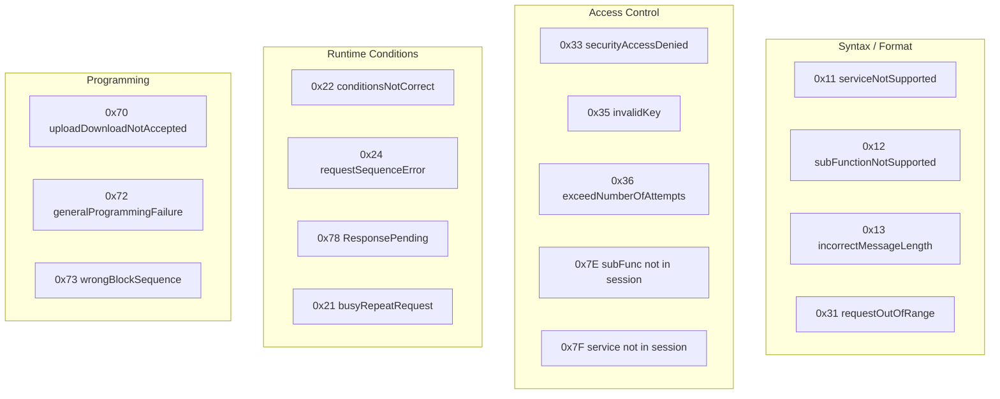

### 9.3 Thứ tự kiểm tra NRC trong DCM

<div class="callout callout--note">
<strong>🔍 Ưu tiên kiểm tra NRC</strong>

DCM kiểm tra theo thứ tự:

1. Service có được hỗ trợ không → `0x11` / `0x7F`
2. Sub-function có hợp lệ không → `0x12` / `0x7E`
3. Message length đúng không → `0x13`
4. Session hiện tại cho phép không → `0x7F` / `0x7E`
5. Security level đủ không → `0x33`
6. Conditions runtime đúng không → `0x22`
7. Parameters hợp lệ không → `0x31`
8. Xử lý kéo dài → `0x78` ResponsePending
</div>

## 10. Timing Parameters

### 10.1 Các timing quan trọng

| Parameter | Mô tả | Giá trị điển hình |
|---|---|---|
| **P2Server** | Thời gian server phải phản hồi sau khi nhận request | 50 ms |
| **P2\*Server** | Thời gian mở rộng sau ResponsePending | 5000 ms |
| **S3Server** | Timeout session – nếu không có request mới, ECU rơi về default session | 5000 ms |
| **P2Client** | Timeout client chờ response từ server | P2Server + margin |
| **P2\*Client** | Timeout client chờ response sau ResponsePending | P2*Server + margin |

### 10.2 Cơ chế ResponsePending (NRC 0x78)

Khi service cần thời gian xử lý vượt quá P2Server:

1. DCM gửi NRC `0x78` trước khi P2 hết hạn
2. Tester nhận `0x78` → chuyển sang chờ với timeout P2*
3. DCM tiếp tục xử lý backend
4. Nếu vẫn chưa xong trước P2*, DCM gửi thêm `0x78`
5. Khi xử lý xong, DCM gửi positive hoặc negative response cuối cùng

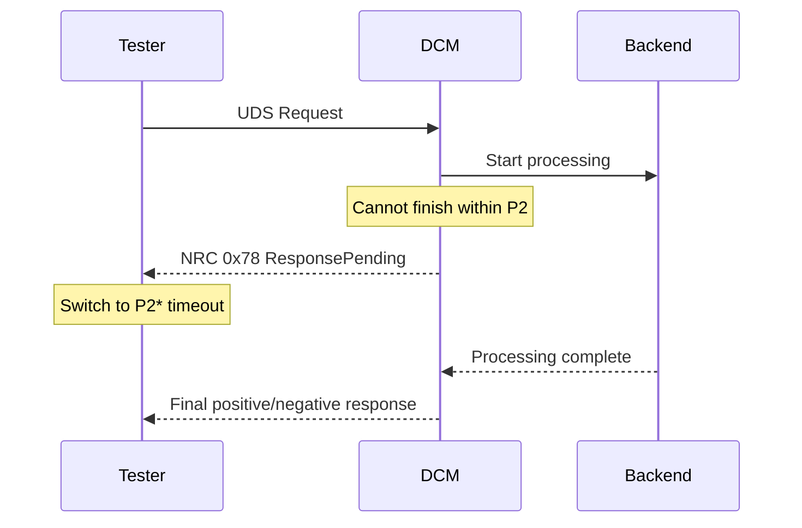

### 10.3 S3Server và TesterPresent

`TesterPresent` (`0x3E`) giữ session active:

- Nếu tester không gửi **bất kỳ request nào** (bao gồm `TesterPresent`) trong thời gian S3, DCM tự chuyển về default session
- `TesterPresent` thường được gửi với suppress positive response bit = 1 để không tải bus
- Trong thực tế, tester thường gửi `0x3E 80` (sub-function `0x00` + suppress bit) theo chu kỳ

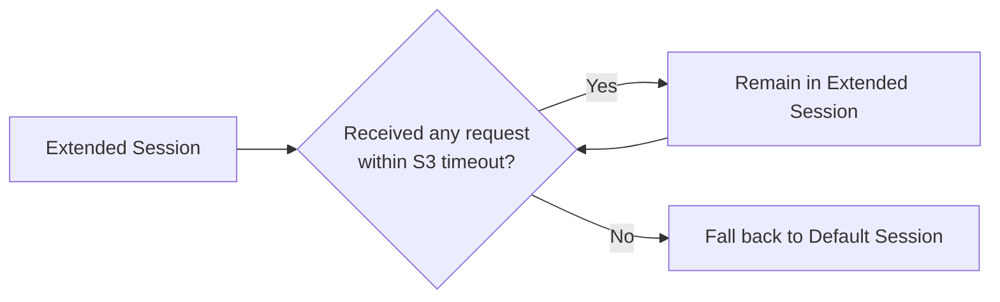

## 11. Relationship: UDS và AUTOSAR Diagnostic Stack

### 11.1 Mapping UDS concepts → AUTOSAR modules

| UDS Concept | AUTOSAR Module | Vai trò |
|---|---|---|
| UDS server | DCM | Điều phối giao thức, session, security |
| DTC management | DEM | Quản lý event, DTC status, event memory |
| Transport protocol | CanTp / DoIP | Phân mảnh/gom frame, flow control |
| PDU routing | PduR | Định tuyến PDU giữa layers |
| Signal communication | COM | Truyền/nhận signal ứng dụng |
| Network interface | CanIf / EthIf | Giao tiếp bus vật lý |

### 11.2 Sơ đồ tổng thể

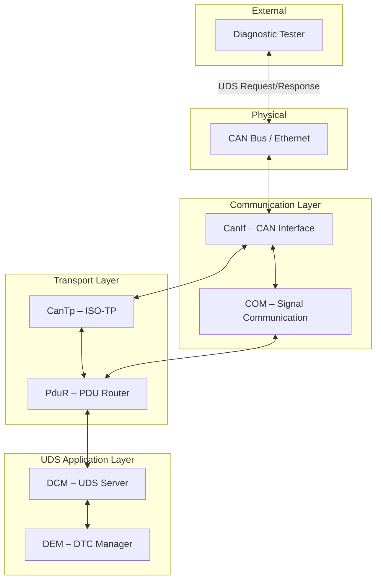

## 12. Single-frame và Multi-frame Communication

### 12.1 Giới hạn CAN frame

Trên CAN classic, một frame chứa tối đa **8 byte** payload (CAN FD: 64 byte). Với ISO-TP addressing overhead, payload thực tế cho UDS trên CAN classic chỉ còn **6-7 byte** trong single frame.

Khi request hoặc response **vượt quá** payload single frame, cần sử dụng **ISO-TP (ISO 15765-2)** để phân mảnh.

### 12.2 Các loại frame ISO-TP

| Frame Type | Abbreviation | Chức năng |
|---|---|---|
| Single Frame | SF | Chứa toàn bộ message nếu đủ ngắn |
| First Frame | FF | Frame đầu tiên của multi-frame, chứa tổng chiều dài |
| Consecutive Frame | CF | Các frame tiếp theo, chứa sequence number |
| Flow Control | FC | Receiver gửi cho sender để điều khiển tốc độ truyền |

### 12.3 Luồng multi-frame

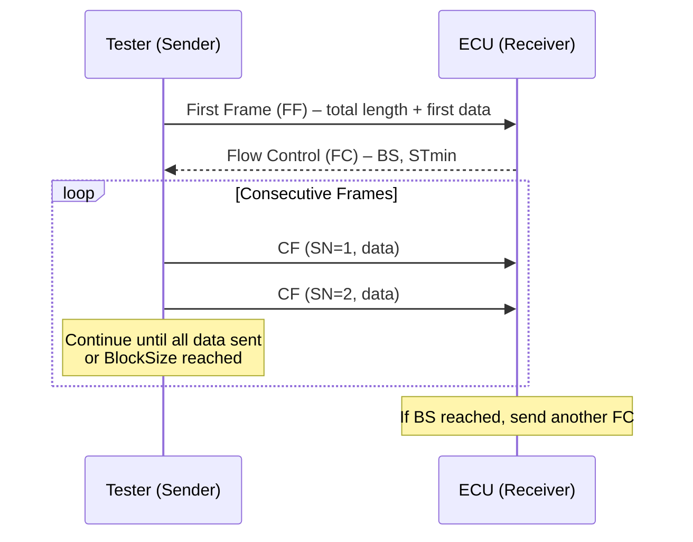

Chi tiết đầy đủ về ISO-TP được trình bày tại [CanTp - CAN Transport Protocol](/cantp/).

## 13. Tổng quan các dịch vụ UDS quan trọng

### 13.1 DiagnosticSessionControl (0x10)

Chuyển đổi session. Sau khi chuyển, timing parameters P2/P2* có thể thay đổi. ECU phải reset security level khi chuyển session (tùy cấu hình).

### 13.2 ECUReset (0x11)

Reset ECU về trạng thái mong muốn: hard reset, key-off-on, soft reset. Sau reset, ECU thường quay về default session và locked security.

### 13.3 ClearDiagnosticInformation (0x14)

Xóa DTC theo group hoặc toàn bộ. DCM chuyển yêu cầu cho DEM xử lý. Xóa DTC thường kèm theo reset status bits, counters, freeze frame.

### 13.4 ReadDTCInformation (0x19)

Service phức tạp nhất với nhiều sub-function:

| Sub-function | Chức năng |
|---|---|
| `0x01` | reportNumberOfDTCByStatusMask |
| `0x02` | reportDTCByStatusMask |
| `0x04` | reportDTCSnapshotRecordByDTCNumber |
| `0x06` | reportDTCExtDataRecordByDTCNumber |
| `0x09` | reportSeverityInformationOfDTC |
| `0x0A` | reportSupportedDTC |

DEM cung cấp toàn bộ dữ liệu nền cho service này.

### 13.5 ReadDataByIdentifier (0x22) / WriteDataByIdentifier (0x2E)

Đọc/ghi dữ liệu theo **DID** (Data Identifier). DID 2 byte, ví dụ:

| DID Range | Mô tả |
|---|---|
| `0xF100-0xF1FF` | Manufacturer-specific |
| `0xF190` | VIN (Vehicle Identification Number) |
| `0xF180` | Boot software identification |
| `0xF186` | Active diagnostic session |
| `0xF187` | Spare part number |

### 13.6 SecurityAccess (0x27)

Đã trình bày chi tiết ở mục 8.

### 13.7 RoutineControl (0x31)

Điều khiển routine theo RID (Routine Identifier):

1. `startRoutine` (sub-function `0x01`)
2. `stopRoutine` (sub-function `0x02`)
3. `requestRoutineResults` (sub-function `0x03`)

Ví dụ routine: erase memory, check programming preconditions, self-test, calibration.

### 13.8 Programming Services (0x34, 0x36, 0x37)

Dùng cho cập nhật phần mềm ECU:

1. `0x34 RequestDownload` – bắt đầu session download, thỏa thuận size và format.
2. `0x36 TransferData` – truyền data theo block.
3. `0x37 RequestTransferExit` – kết thúc transfer, kiểm tra integrity nếu cần.

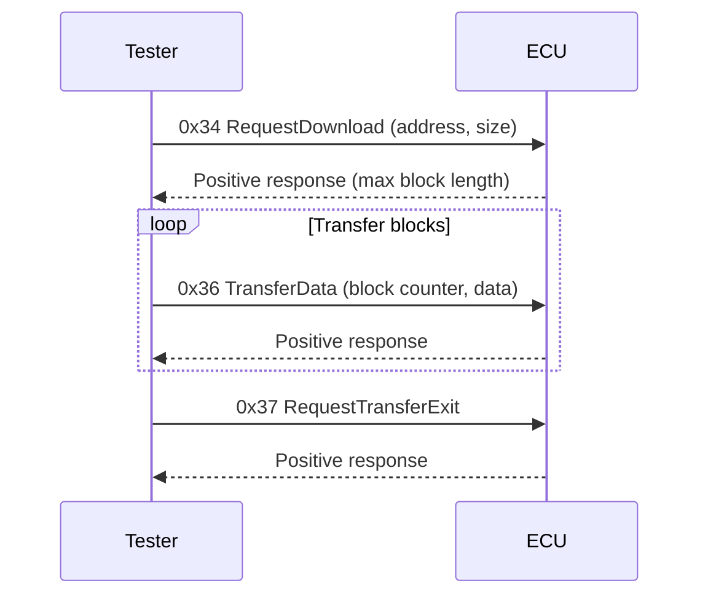

### 13.9 CommunicationControl (0x28) / ControlDTCSetting (0x85)

1. `0x28 CommunicationControl` – bật/tắt transmission và/hoặc reception trên bus.
2. `0x85 ControlDTCSetting` – bật/tắt DTC recording trong DEM. Thường dùng trước khi flash để tránh false DTC.

## 14. Kết luận

UDS là **ngôn ngữ chung** giữa diagnostic tester và ECU. Hiểu rõ UDS giúp hiểu được:

- Tại sao **DCM** cần kiểm tra session, security, addressing trước khi xử lý service
- Tại sao **DEM** phải cung cấp DTC data theo format chuẩn hóa
- Tại sao **CanTp** cần xử lý phân mảnh/gom frame cho request/response lớn
- Tại sao **PduR** cần routing giữa nhiều module
- Tại sao **COM** cần truyền signal ứng dụng song song với diagnostic traffic

Nắm vững UDS cũng giúp đọc hiểu log chẩn đoán, viết test script, review cấu hình DCM/DEM và debug các vấn đề giao tiếp tester-ECU hiệu quả hơn.

## 15. Ghi chú và nguồn tham khảo

Tài liệu này tổng hợp từ các nguồn công khai:

1. ISO 14229-1 UDS Application Layer overview (public summaries).
2. ISO 15765-2 ISO-TP overview.
3. AUTOSAR Classic Platform architecture documentation (public).
4. EmbeddedTutor, Vector Knowledge Base, DeepWiki openAUTOSAR – các bài viết public về UDS services, NRC, timing.
5. Automotive Diagnostic Standards overview materials.

Nội dung được viết lại theo cách giải thích thực dụng, không phải bản sao của tiêu chuẩn ISO gốc.
