---
layout: default
category: uds
title: "DEM - Event Memory Part 1: Event Status Management"
nav_exclude: true
module: true
tags: [autosar, dem, event-memory, status-bits, uds, diagnostics]
description: "DEM Event Memory phần 1 – Quản lý trạng thái event: status bit, monitor status, UDS update, transitions và notification."
permalink: /dem-event-memory-p1/
---

# DEM – Event Memory (Part 1): Event Status Management

> Tài liệu này mô tả chi tiết phần **7.7 Event Memory Description** và **7.7.1 Event Status Management** trong đặc tả AUTOSAR DEM. Đây là nền tảng của toàn bộ cơ chế chẩn đoán – mọi quyết định lưu trữ, báo cáo hay xử lý lỗi đều bắt đầu từ việc DEM quản lý trạng thái event như thế nào.

---

## 7.7 Event Memory Description

**Event Memory** là hệ thống lưu trữ trung tâm của DEM, nơi các fault records được tạo ra, duy trì và cuối cùng được xóa. Không giống với một RAM buffer đơn giản, event memory trong AUTOSAR DEM là một cơ chế có **cấu trúc rõ ràng, có chính sách, có trạng thái và có persistence** được tích hợp với NvM.

**Phân loại event memory theo origin**:

| Origin | Tên | Đặc điểm |
|---|---|---|
| `DEM_DTC_ORIGIN_PRIMARY_MEMORY` | Primary Memory | Bộ nhớ chính, fault records tiêu chuẩn |
| `DEM_DTC_ORIGIN_SECONDARY_MEMORY` | Secondary Memory | Bộ nhớ phụ, ít phổ biến hơn |
| `DEM_DTC_ORIGIN_MIRROR_MEMORY` | Mirror Memory | Bản sao read-only từ primary |
| `DEM_DTC_ORIGIN_PERMANENT_MEMORY` | Permanent Memory | OBD-specific, không thể clear thông thường |

**Cấu trúc một Event Memory Entry**:

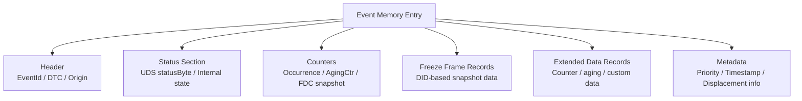

**Liên tưởng**:

> Event Memory Entry giống như một hồ sơ bệnh nhân trong bệnh viện: có thông tin định danh (EventId/DTC), tiểu sử bệnh (status/counters), kết quả xét nghiệm thời điểm nhập viện (freeze frame), theo dõi xuyên suốt (extended data) và ghi chú hành chính (metadata). Không phải mọi lỗi đều được lưu – chỉ những lỗi đủ tiêu chí mới có hồ sơ.

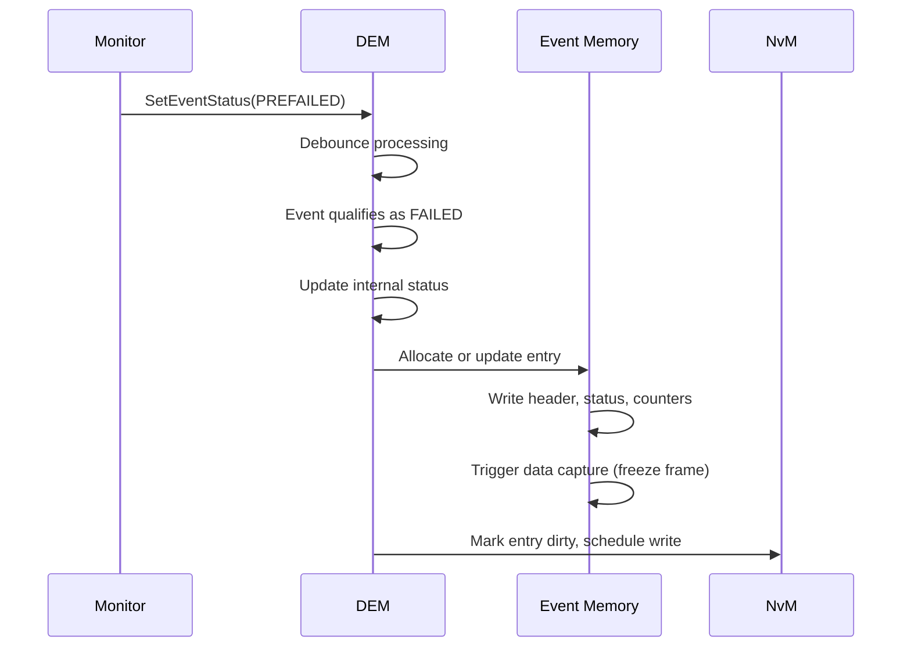

---

## 7.7.1 Event Status Management

Event status management là cơ chế DEM dùng để theo dõi và cập nhật toàn bộ trạng thái của một event theo thời gian. Đây là **trái tim logic** của DEM – mọi quyết định đều phụ thuộc vào trạng thái event được quản lý chính xác.

DEM duy trì ít nhất hai lớp trạng thái song song cho mỗi event:

1. **Internal Event Status**: trạng thái xử lý nội bộ DEM, bao gồm debounce state, monitor result, cycle tracking.
2. **UDS DTC Status Byte**: trạng thái 8-bit chuẩn hóa được tester đọc qua service `0x19`.

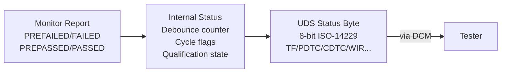

---

### 7.7.1.1 Status Bit Support

AUTOSAR DEM hỗ trợ 8 bit trạng thái chuẩn theo ISO-14229. Tuy nhiên, **không phải mọi implementation đều phải hỗ trợ tất cả 8 bit**. DEM cấu hình một `StatusAvailabilityMask` để khai báo với tester những bit nào đang được hỗ trợ.

**8 status bit và định nghĩa**:

```
Bit 7    Bit 6    Bit 5    Bit 4    Bit 3    Bit 2    Bit 1    Bit 0
 WIR     TNCSLC   TNCTOC   TFSLC    CDTC     PDTC    TFTOC     TF
```

| Bit | Ký hiệu | Tên đầy đủ | Khi nào set | Khi nào clear |
|---|---|---|---|---|
| 0 | TF | testFailed | Event qualified FAILED | Event qualified PASSED |
| 1 | TFTOC | testFailedThisOperationCycle | Event FAILED trong cycle hiện tại | Cycle mới bắt đầu |
| 2 | PDTC | pendingDTC | Event FAILED ít nhất một lần trong cycle | Cycle mới sạch / clear |
| 3 | CDTC | confirmedDTC | Tiêu chí confirmation đạt | Clear DTC / aging hoàn tất |
| 4 | TFSLC | testFailedSinceLastClear | Event FAILED sau lần clear cuối | Clear DTC |
| 5 | TNCTOC | testNotCompletedThisOperationCycle | Cycle bắt đầu, monitor chưa xong | Monitor hoàn thành test (PASSED hoặc FAILED) |
| 6 | TNCSLC | testNotCompletedSinceLastClear | Sau clear, monitor chưa hoàn thành | Monitor hoàn thành test sau clear |
| 7 | WIR | warningIndicatorRequested | DEM yêu cầu bật indicator | Healing logic thỏa mãn |

**StatusAvailabilityMask – khai báo bit nào được hỗ trợ**:

```c
/* Ví dụ: ECU chỉ hỗ trợ 6 bit */
#define DEM_STATUS_AVAILABILITY_MASK  0x6FU
/* 0x6F = 0b01101111 → hỗ trợ bit 0,1,2,3,5,6 (TNCSLC và WIR không hỗ trợ) */

/* Tester phải AND status byte với mask trước khi phân tích */
uint8 maskedStatus = rawStatusByte & DEM_STATUS_AVAILABILITY_MASK;
```

**Service `0x19 0x03` trả về StatusAvailabilityMask**:

```
Request:  19 03
Response: 59 03 [StatusAvailabilityMask]
          59 03 6F   → mask = 0x6F, 6 bit được hỗ trợ
```

**Liên tưởng**:

> StatusAvailabilityMask giống như danh sách thông số kỹ thuật của thiết bị đo. Tester cần biết thiết bị có thể đo những gì trước khi đọc số liệu – nếu không biết mask, có thể giải thích nhầm bit không được hỗ trợ (luôn = 0) là "không có lỗi".

---

### 7.7.1.2 Monitor Status and UDS Status Update

Khi monitor gửi báo cáo vào DEM, DEM thực hiện một chuỗi logic để chuyển **monitor report** thành **UDS status byte update**.

**Hai loại input từ monitor**:

| Monitor Report | Ý nghĩa |
|---|---|
| `DEM_EVENT_STATUS_PREFAILED` | Monitor thấy dấu hiệu lỗi, chưa đủ chắc chắn |
| `DEM_EVENT_STATUS_FAILED` | Monitor xác nhận lỗi – bypass debounce (hoặc debounce = INTERNAL) |
| `DEM_EVENT_STATUS_PREPASSED` | Monitor thấy dấu hiệu hồi phục, chưa chắc chắn |
| `DEM_EVENT_STATUS_PASSED` | Monitor xác nhận không còn lỗi |

**Luồng xử lý từ monitor report đến UDS status**:

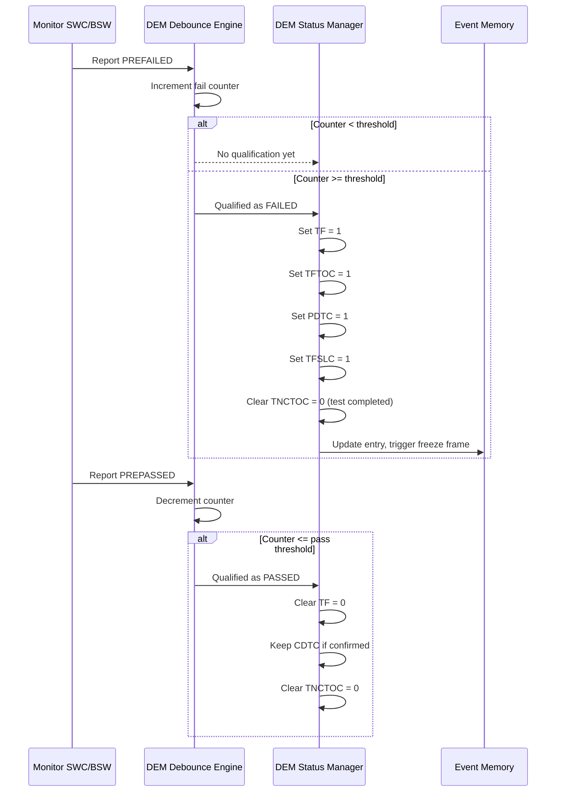

**Bảng mapping: Monitor Input → Status Bit Effect**:

| Monitor Input | TF | TFTOC | PDTC | CDTC | TFSLC | TNCTOC | WIR |
|---|---|---|---|---|---|---|---|
| FAILED (qualified) | Set 1 | Set 1 | Set 1 | Set if criteria met | Set 1 | Cleared 0 | Set if rule |
| PASSED (qualified) | Clear 0 | Unchanged | Unchanged* | Unchanged | Unchanged | Cleared 0 | Maybe clear |
| PREFAILED | No change | No change | No change | No change | No change | No change | No change |
| PREPASSED | No change | No change | No change | No change | No change | No change | No change |

> \*PDTC chỉ bị clear khi cycle mới bắt đầu hoặc clear DTC được gọi.

**Code minh họa – transition khi event qualified FAILED**:

```c
/* DEM internal: xử lý khi event đạt qualified FAILED */
static void Dem_ProcessEventFailed(Dem_EventIdType EventId)
{
    Dem_UdsStatusByteType* status = Dem_GetStatusByte(EventId);

    /* Set TF - fault is currently active */
    *status |= DEM_STATUS_BIT_TF;

    /* Set TFTOC - failed this operation cycle */
    *status |= DEM_STATUS_BIT_TFTOC;

    /* Set PDTC - pending confirmation */
    *status |= DEM_STATUS_BIT_PDTC;

    /* Set TFSLC - failed since last clear */
    *status |= DEM_STATUS_BIT_TFSLC;

    /* Clear TNCTOC - test completed this cycle */
    *status &= ~DEM_STATUS_BIT_TNCTOC;

    /* Check confirmation criteria */
    if (Dem_IsConfirmationCriteriaMet(EventId)) {
        *status |= DEM_STATUS_BIT_CDTC;
    }

    /* Check indicator request */
    if (Dem_IsIndicatorRequestNeeded(EventId)) {
        *status |= DEM_STATUS_BIT_WIR;
    }

    /* Trigger memory entry update */
    Dem_UpdateEventMemoryEntry(EventId);
}
```

---

### 7.7.1.3 Status Bit Transitions

Mỗi status bit có quy tắc transition riêng biệt. Hiểu đúng transition là điều kiện tiên quyết để debug hành vi chẩn đoán sai.

**State machine tổng hợp của status byte**:

```mermaid
stateDiagram-v2
    direction LR
    [*] --> InitState: ECU power on OR Clear DTC

    InitState: TF=0 TFTOC=0 PDTC=0 CDTC=0\nTFSLC=0 TNCTOC=1 TNCSLC=1 WIR=0

    InitState --> DebounceRunning: PREFAILED received
    DebounceRunning: TF=0 TNCTOC=1\nDebounce counter running

    DebounceRunning --> QualifiedFailed: Fail threshold reached
    QualifiedFailed: TF=1 TFTOC=1 PDTC=1\nTFSLC=1 TNCTOC=0

    QualifiedFailed --> ConfirmedFailed: Confirmation criteria met
    ConfirmedFailed: TF=1 TFTOC=1 PDTC=1\nCDTC=1 TFSLC=1 TNCTOC=0

    ConfirmedFailed --> ConfirmedPassed: PASSED qualified
    ConfirmedPassed: TF=0 TFTOC=1 PDTC=1\nCDTC=1 TFSLC=1 TNCTOC=0

    ConfirmedPassed --> NewCycleHealing: New operation cycle starts
    NewCycleHealing: TF=0 TFTOC=0 PDTC=0\nCDTC=1 TFSLC=1 TNCTOC=1

    NewCycleHealing --> InitState: Aging complete OR Clear DTC
```

**Transition của từng bit theo sự kiện hệ thống**:

#### Bit 0: testFailed (TF)

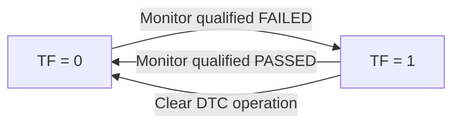

> **Quan trọng**: TF phản ánh trạng thái **hiện tại** của monitor, không phải lịch sử. TF = 0 không có nghĩa là không có lỗi – CDTC có thể vẫn = 1.

#### Bit 1: testFailedThisOperationCycle (TFTOC)

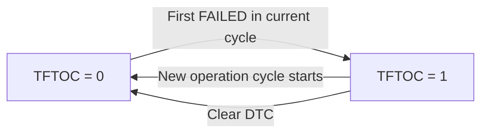

> TFTOC **không** bị clear khi event trở lại PASSED trong cùng cycle – nó là "lỗi đã xảy ra trong cycle này".

#### Bit 2: pendingDTC (PDTC)

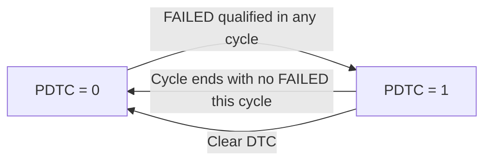

#### Bit 3: confirmedDTC (CDTC)

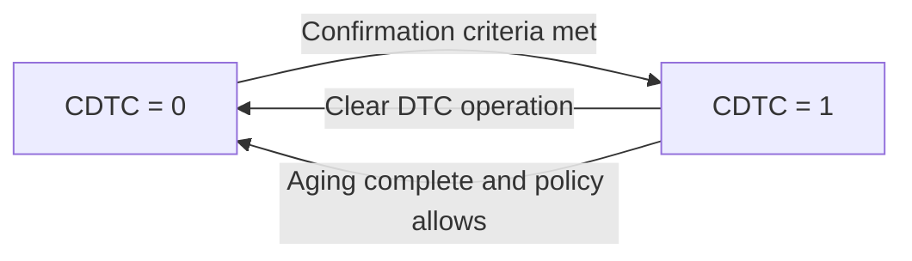

> CDTC **không** bị clear khi event trở lại PASSED. Clear DTC từ tester hoặc aging hoàn tất mới xóa CDTC.

#### Bit 5: testNotCompletedThisOperationCycle (TNCTOC)

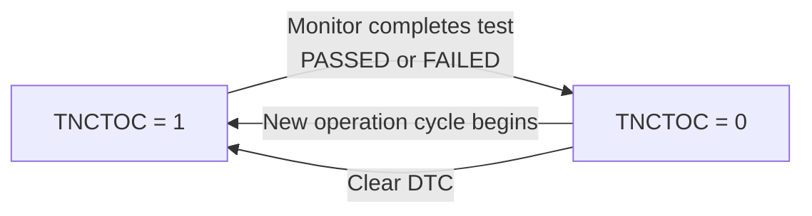

> TNCTOC = 1 nghĩa là monitor **chưa hoàn thành test** trong cycle này – không phải là lỗi. Tester dùng bit này để biết DTC absence có đáng tin không.

**Bảng tổng hợp trigger transition**:

| Sự kiện | TF | TFTOC | PDTC | CDTC | TFSLC | TNCTOC | TNCSLC | WIR |
|---|---|---|---|---|---|---|---|---|
| ECU power on | 0 | 0 | 0 | 0 | 0 | 1 | 1 | 0 |
| Clear DTC | 0 | 0 | 0 | 0 | 0 | 1 | 1 | 0 |
| Monitor: FAILED | 1 | 1 | 1 | (if confirmed) | 1 | 0 | 0 | (if rule) |
| Monitor: PASSED | 0 | – | – | – | – | 0 | 0 | (maybe) |
| New operation cycle | – | 0 | 0† | – | – | 1 | – | – |
| Confirmation criteria | – | – | – | 1 | – | – | – | – |
| Aging complete | 0 | 0 | 0 | 0 | 0 | – | – | 0 |

> †PDTC bị clear ở đầu cycle mới **chỉ nếu không có FAILED trong cycle vừa kết thúc**.

---

### 7.7.1.4 Active/Passive Status

AUTOSAR DEM phân biệt trạng thái **active** và **passive** của event trong event memory để hỗ trợ logic aging và healing.

**Active event**: event có `testFailed = 1` – lỗi đang xảy ra hiện tại.

**Passive event**: event đã từng lỗi (có entry trong memory) nhưng `testFailed = 0` – lỗi đã qua nhưng DTC vẫn tồn tại do `confirmedDTC = 1` hoặc aging chưa xong.

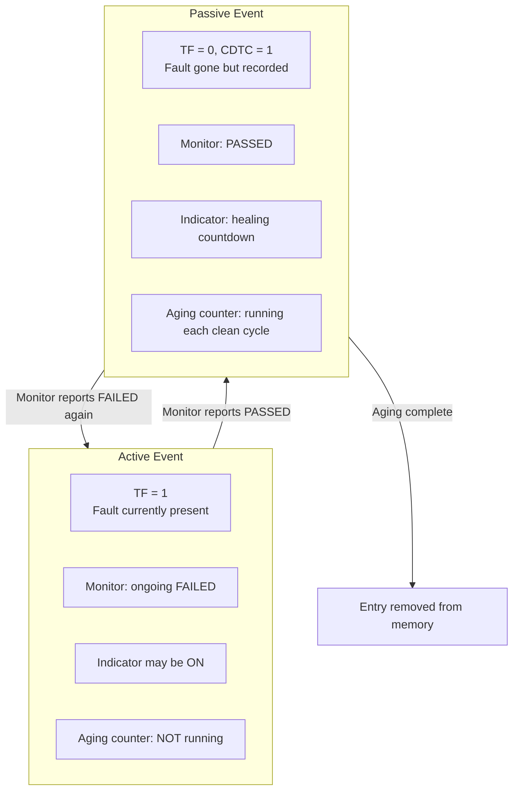

**Liên tưởng**:

> Active/Passive giống như trạng thái bệnh nhân: "đang bệnh" (active) vs "đã qua bệnh nhưng vẫn đang theo dõi" (passive). Hồ sơ bệnh án vẫn còn đó cho đến khi bác sĩ xác nhận bệnh nhân hoàn toàn hồi phục và không cần theo dõi nữa (aging complete).

**Tác động của active/passive trên displacement**:

```c
/* Khi memory đầy và cần chọn entry để displace */
/* DEM ưu tiên giữ ACTIVE entries hơn PASSIVE */
static boolean Dem_IsEligibleForDisplacement(Dem_EventIdType eventId)
{
    Dem_UdsStatusByteType status = Dem_GetStatusByte(eventId);

    /* Active events (TF=1) are generally NOT eligible for displacement */
    if (status & DEM_STATUS_BIT_TF) {
        return FALSE;  /* Do not displace active fault */
    }

    /* Passive events may be displaced depending on priority */
    return TRUE;
}
```

---

### 7.7.1.5 Notification of Status Bit Changes

Khi trạng thái event thay đổi, DEM có thể phát ra **notification** đến các module phụ thuộc. Đây là cơ chế kết nối DEM với phần còn lại của hệ thống.

**Các loại notification**:

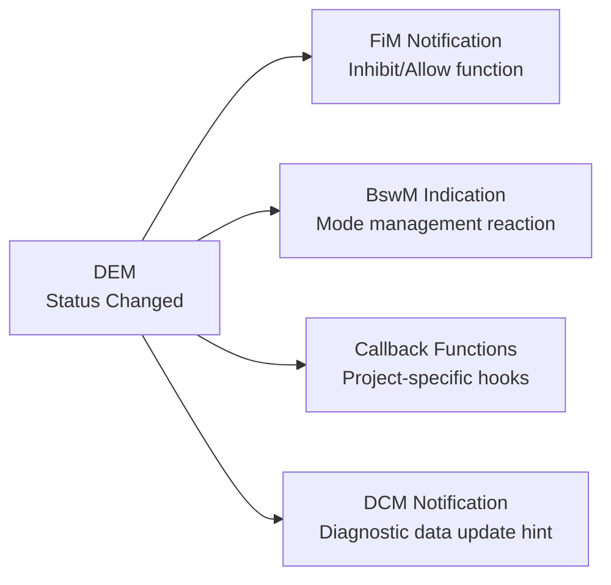

**FiM notification – quan trọng nhất**:

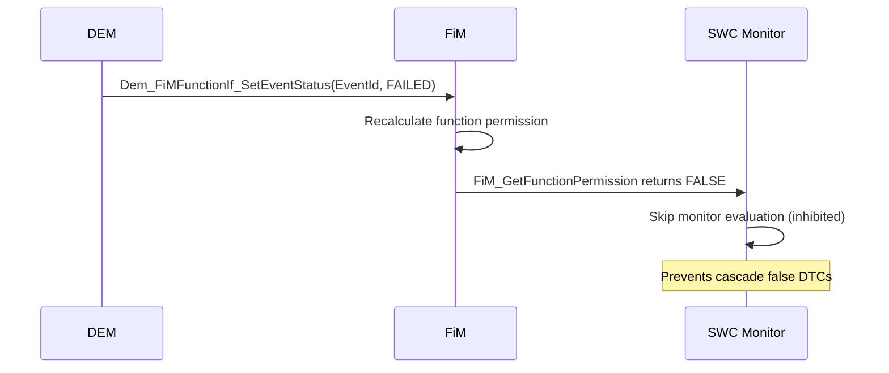

**Callback-based notification**:

```c
/* Cấu hình callback trong DEM */
/* Khi event E_CoolantTemp_High thay đổi status */
static void App_CoolantTempFaultNotification(
    Dem_EventIdType EventId,
    Dem_EventStatusExtendedType EventStatusOld,
    Dem_EventStatusExtendedType EventStatusNew)
{
    /* Bit 3 (CDTC) mới được set */
    if (!(EventStatusOld & DEM_STATUS_BIT_CDTC) &&
         (EventStatusNew & DEM_STATUS_BIT_CDTC))
    {
        /* DTC just became confirmed */
        /* Application can react: log timestamp, notify service tool, etc. */
        App_LogDTCConfirmed(EventId);
    }

    /* Bit 0 (TF) vừa được clear */
    if ( (EventStatusOld & DEM_STATUS_BIT_TF) &&
        !(EventStatusNew & DEM_STATUS_BIT_TF))
    {
        /* Fault just cleared – start healing logic if needed */
        App_StartHealingProcedure(EventId);
    }
}
```

**Cấu hình notification trong ARXML**:

```xml
<DEM-EVENT-PARAMETER>
  <SHORT-NAME>DemEvent_CoolantTempHigh</SHORT-NAME>
  <!-- Callback for status changes -->
  <DEM-CALLBACK-INIT-MONITOR-FOR-EVENT>
    <SYMBOL-PROPS>
      <SHORT-NAME>App_CoolantTempFaultNotification</SHORT-NAME>
    </SYMBOL-PROPS>
  </DEM-CALLBACK-INIT-MONITOR-FOR-EVENT>
</DEM-EVENT-PARAMETER>
```

**Notification timing – deferred vs immediate**:

| Loại notification | Timing | Lý do |
|---|---|---|
| FiM update | Ngay lập tức trong DEM main function | Cần inhibition effect nhanh |
| BswM indication | Ngay lập tức hoặc deferred | Phụ thuộc cấu hình |
| Callback functions | Trong DEM main processing context | Tránh gọi từ interrupt context |
| NvM dirty marking | Deferred, gom nhóm | Tối ưu write cycles |

**Liên tưởng notification**:

> Notification giống như hệ thống alert của bệnh viện: khi bệnh nhân chuyển sang ICU (status thay đổi), hệ thống tự động báo cho khoa điều dưỡng, bác sĩ trực, và family contact. Mỗi bên nhận thông báo và phản ứng theo vai trò của mình.

---

## Tổng kết Part 1

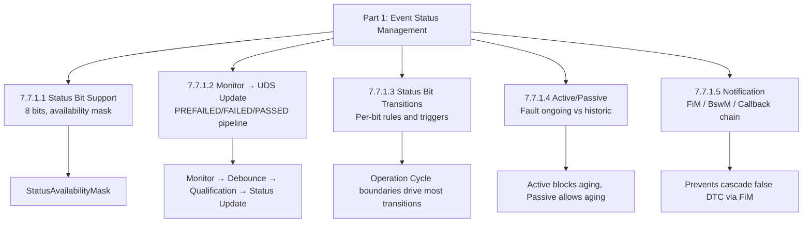

> Toàn bộ phần 7.7.1 là cơ sở để hiểu các phần tiếp theo: Event Memory Management (7.7.2) phụ thuộc hoàn toàn vào trạng thái event được mô tả ở đây để quyết định giữ, cập nhật hay displace entry.

---

## Ghi chú nguồn tham khảo

1. AUTOSAR Classic Platform SRS DEM – Section 7.7 Event Memory Description, 7.7.1 Event Status Management.
2. ISO 14229-1 – UDS DTC status byte definition và bit semantics.
3. AUTOSAR SWS FiM – Notification interface from DEM to FiM.
4. Nguồn public: EmbeddedTutor AUTOSAR DEM series, DeepWiki openAUTOSAR/classic-platform.
