---
layout: default
category: uds
title: "DEM - Event Memory Part 2: Event Memory Management"
nav_exclude: true
module: true
tags: [autosar, dem, event-memory, retention, overflow, displacement, reporting]
description: "DEM Event Memory phần 2 – Quản lý event memory: retention, clearing, overflow, displacement và reporting order."
permalink: /dem-event-memory-p2/
---

# DEM – Event Memory (Part 2): Event Memory Management

> Tài liệu này mô tả chi tiết phần **7.7.2 Event Memory Management** – cách DEM cấp phát, duy trì, xóa và quản lý khi bộ nhớ đầy. Đây là lớp chính sách quyết định **fault nào ở lại, fault nào bị đẩy ra** khi ECU hoạt động thực tế.

---

## 7.7.2 Event Memory Management

Event memory management là tập hợp các chính sách và cơ chế DEM dùng để kiểm soát **vòng đời của entry** trong bộ nhớ chẩn đoán – từ lúc tạo ra đến lúc xóa bỏ.

**Tổng quan lifecycle của một event memory entry**:

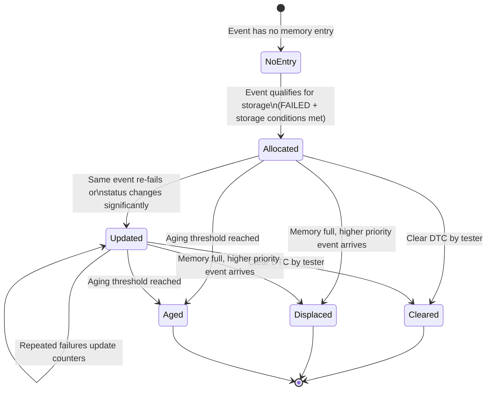

**Hoạt động chính của Event Memory Manager**:

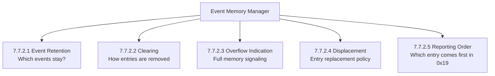

---

## 7.7.2.1 Event Retention

**Event retention** định nghĩa điều kiện để một event **được tạo entry trong event memory** và **giữ lại** trong bộ nhớ đó.

Không phải mọi event FAILED đều tự động có entry. DEM kiểm tra một chuỗi điều kiện:

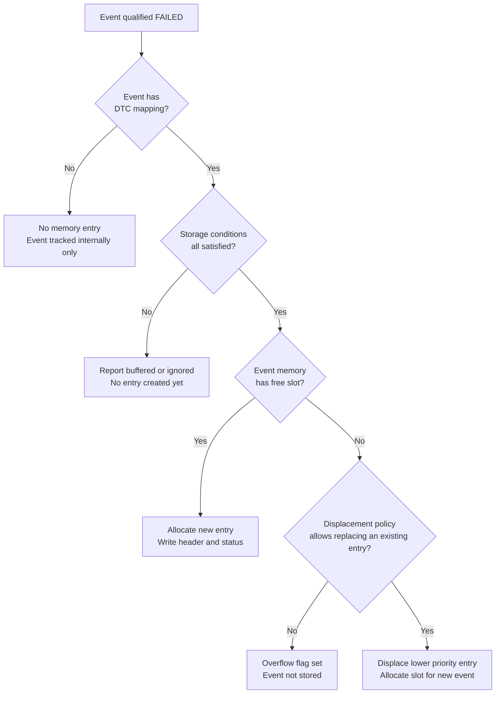

**Tiêu chí retention chi tiết**:

| Tiêu chí | Mô tả |
|---|---|
| Event có DTC mapping | Event không có DTC sẽ không tạo entry trong standard memory |
| DTC không bị suppressed | DTC suppress = TRUE → không tạo entry |
| Storage conditions thỏa mãn | Tất cả DemStorageCondition phải = TRUE |
| Event available | DEM_EVENT_STATUS_AVAILABLE = TRUE |
| Memory không locked | Memory không đang trong trạng thái bị khóa (ví dụ: trong clear operation) |

**Cấu hình storage conditions**:

```xml
<!-- Storage condition: chỉ lưu fault khi vehicle speed > 0 (xe đang di chuyển) -->
<DEM-STORAGE-CONDITION>
  <SHORT-NAME>DemStorageCond_VehicleMoving</SHORT-NAME>
</DEM-STORAGE-CONDITION>

<!-- Gán storage condition cho event -->
<DEM-EVENT-PARAMETER>
  <SHORT-NAME>DemEvent_ABSSensorFault</SHORT-NAME>
  <DEM-STORAGE-CONDITION-REFS>
    <DEM-STORAGE-CONDITION-REF>
      /DemStorageConditions/DemStorageCond_VehicleMoving
    </DEM-STORAGE-CONDITION-REF>
  </DEM-STORAGE-CONDITION-REFS>
</DEM-EVENT-PARAMETER>
```

```c
/* Runtime: set storage condition từ application */
Dem_SetStorageCondition(
    DemConf_DemStorageCondition_VehicleMoving, /* condition ID */
    TRUE   /* vehicle is moving */
);
```

**Liên tưởng retention**:

> Event retention giống như chính sách nhận hồ sơ bệnh viện: không phải ai đến cũng được mở hồ sơ mới. Phải đáp ứng điều kiện (có BHYT, đủ giấy tờ, đang trong giờ tiếp nhận). Nếu phòng chờ đầy, phải chờ hoặc ưu tiên ca cấp cứu hơn.

**Khi entry đã tồn tại – chính sách cập nhật**:

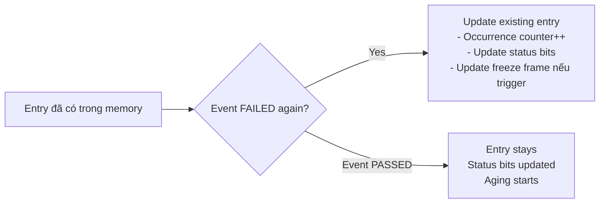

```c
/* AUTOSAR: khi event fail lần thứ N (entry đã tồn tại) */
void Dem_UpdateExistingEntry(Dem_EventIdType EventId)
{
    Dem_MemoryEntryType* entry = Dem_FindMemoryEntry(EventId);
    if (entry != NULL) {
        /* Tăng occurrence counter */
        if (entry->occurrenceCounter < 0xFFU) {
            entry->occurrenceCounter++;
        }
        /* Cập nhật status byte */
        entry->statusByte |= DEM_STATUS_BIT_TFTOC;
        entry->statusByte |= DEM_STATUS_BIT_TF;
        /* Trigger additional freeze frame capture nếu rule yêu cầu */
        Dem_TriggerFreezeFrameStorageOnOccurrence(EventId);
        /* Mark dirty for NvM */
        entry->nvmDirty = TRUE;
    }
}
```

---

## 7.7.2.2 Clearing Event Memory Entries

Clear là thao tác xóa entry khỏi event memory và reset trạng thái liên quan. Đây là một trong những thao tác phức tạp nhất trong DEM vì nó ảnh hưởng đến nhiều layer.

**Các nguồn kích hoạt clear**:

| Nguồn | Cơ chế | Phạm vi |
|---|---|---|
| Tester qua UDS 0x14 | `Dem_DcmClearDTC()` | Theo group hoặc DTC cụ thể |
| Aging hoàn tất | Internal aging logic | Một event cụ thể |
| Application | `Dem_ClearDTC()` (nếu supported) | Theo cấu hình |
| ECU reset sau clear request đang pending | Deferred clear completion | Pending clear từ trước reset |

**Luồng clear qua UDS 0x14**:

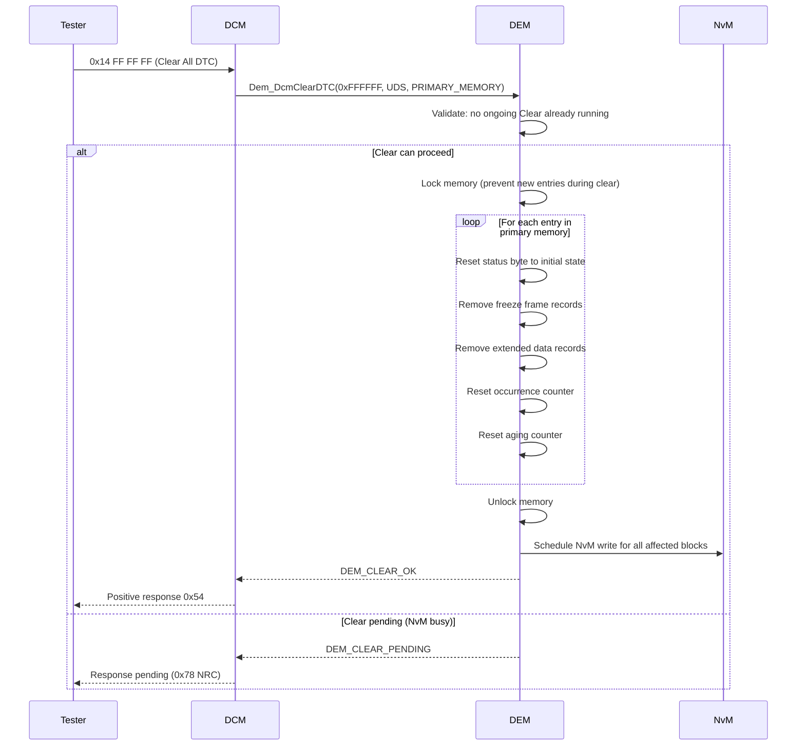

**Điều gì xảy ra khi clear một entry cụ thể**:

```
Trước clear:
  Status byte:  0x2F (TF=1, TFTOC=1, PDTC=1, CDTC=1, TNCTOC=0)
  Freeze frame: có dữ liệu
  OccCtr:       7
  AgingCtr:     3

Sau clear:
  Status byte:  0x50 (TNCTOC=1, TNCSLC=1 – as if new cycle)
  Freeze frame: removed
  OccCtr:       0
  AgingCtr:     0
  Entry:        freed from memory slot
```

**Nuances của clear operation**:

1. **Permanent Memory exception**: DTC trong Permanent Memory không bị xóa bởi 0x14 thông thường – chỉ bị xóa sau N clean driving cycles.

2. **Active fault during clear**: Nếu DTC đang có `TF = 1` khi clear được gọi, DEM vẫn xóa entry nhưng event có thể được re-created ngay lập tức nếu monitor tiếp tục báo FAILED.

3. **NvM latency**: Entry được xóa khỏi RAM ngay lập tức, nhưng NvM write có thể được ghi sau đó (asynchronous).

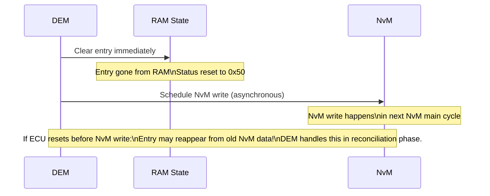

---

## 7.7.2.3 Event Memory Overflow Indication

Khi event memory đầy và không có entry nào có thể bị displaced, DEM set **overflow flag** để báo hiệu trạng thái này.

**Ý nghĩa overflow**:

1. Bộ nhớ đã đầy – một số event FAILED không được ghi lại.
2. Tester cần biết rằng diagnostic data có thể không đầy đủ.
3. Kỹ sư cần xem xét lại capacity planning của event memory.

**Service 0x19 sub 0x13 – trả về overflow status**:

```
Request:  19 13
Response: 59 13 [NumberOfDTCs MSB] [NumberOfDTCs LSB] [OverflowIndication]
          59 13 00 05 01
                         → 5 DTC confirmed
                            OverflowIndication = 0x01 → overflow đã xảy ra
```

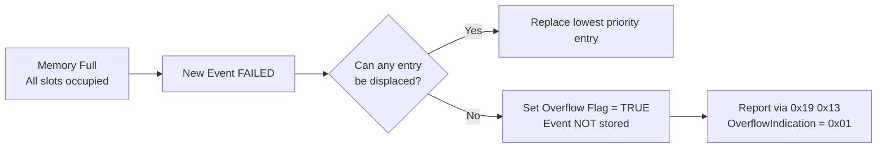

**Overflow flag persistence**:

```
Overflow flag = TRUE → tồn tại cho đến khi:
1. Clear DTC (0x14) được gọi → flag reset về FALSE
2. Memory có slot trống → flag KHÔNG tự động reset
   (overflow flag là "has been full", không phải "is currently full")
```

**Liên tưởng**:

> Overflow flag giống như cờ "Hết số thứ tự" tại phòng khám. Dù sau đó có người rời khỏi phòng chờ (giải phóng slot), cờ vẫn cho thấy có lúc không thể tiếp nhận thêm bệnh nhân nào. Chỉ khi ngày làm việc mới bắt đầu (clear DTC) thì cờ mới được reset.

**Code kiểm tra overflow**:

```c
boolean overflowOccurred;
Dem_ReturnType ret;

ret = Dem_GetNumberOfEventMemoryEntries(
    DEM_DTC_ORIGIN_PRIMARY_MEMORY,
    &numberOfEntries
);

/* Lấy overflow status */
ret = Dem_DcmGetNumberOfFilteredDTC(&numberOfFilteredDTC);
/* Overflow được báo cáo trong 0x19 0x13 response */
```

---

## 7.7.2.4 Event Displacement

**Event displacement** xảy ra khi memory đầy và một event mới cần được lưu. DEM phải chọn entry nào sẽ bị "đá ra" để nhường chỗ.

**Displacement strategy – các chính sách có thể**:

| Strategy | Mô tả | Ưu điểm | Nhược điểm |
|---|---|---|---|
| Priority-based | Entry có priority thấp nhất bị replace | Giữ lỗi quan trọng | Phức tạp khi nhiều entry cùng priority |
| FIFO (First In First Out) | Entry lâu nhất bị replace | Đơn giản, dễ đoán | Có thể xóa confirmed fault quan trọng cũ |
| LIFO (Last In First Out) | Entry mới nhất bị replace | Giữ lịch sử | Mất lỗi mới hơn |
| Oldest passive first | Entry passive (TF=0) lâu nhất bị replace | Giữ active fault | Cần tracking timestamp |

**AUTOSAR DEM – chính sách displacement mặc định**:

DEM theo chuẩn AUTOSAR sử dụng **priority-based displacement** với các quy tắc:

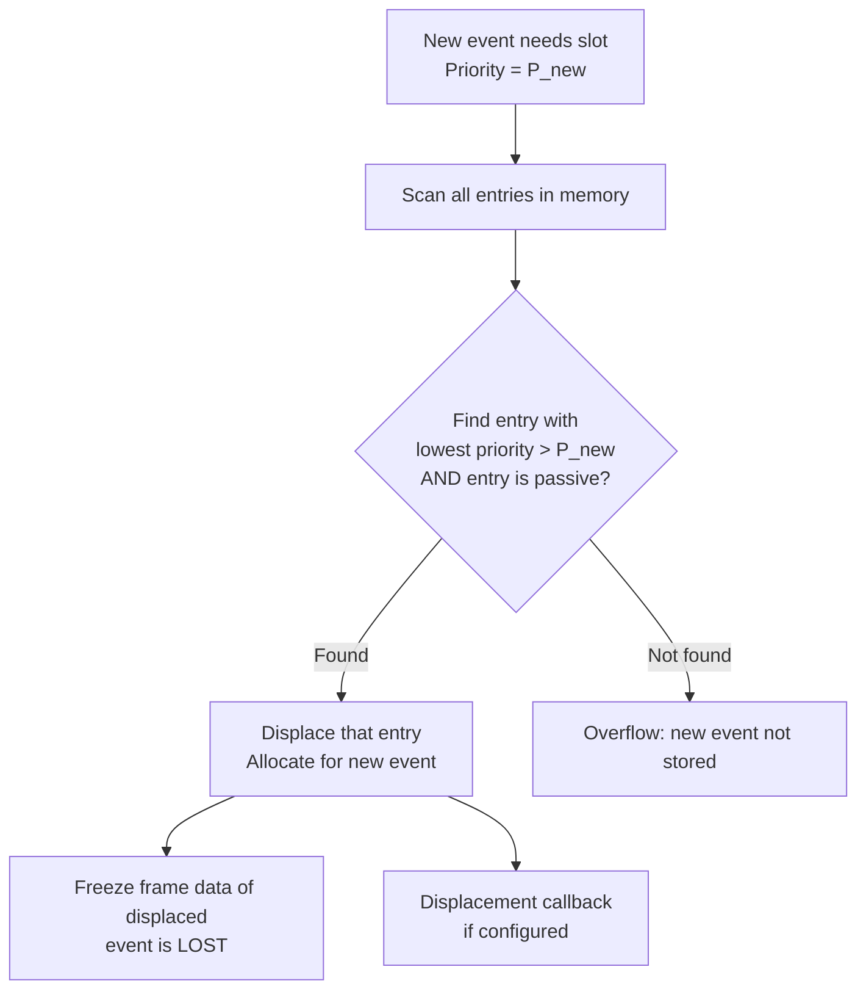

**Ví dụ displacement step-by-step**:

```
Memory state (3 slots):
Slot 1: Event_BrakeFault     Priority=1  TF=1 (ACTIVE)   CDTC=1
Slot 2: Event_CoolantTemp    Priority=3  TF=0 (PASSIVE)  CDTC=1
Slot 3: Event_FuelCapSensor  Priority=8  TF=0 (PASSIVE)  CDTC=1

New event: Event_AirbagCircuit  Priority=2  FAILED

Step 1: Memory full → need displacement
Step 2: Find eligible entries (passive only):
  - Slot 2: Priority 3, passive → eligible
  - Slot 3: Priority 8, passive → eligible
Step 3: Event_AirbagCircuit has Priority=2
  - Can displace Priority=3? Only if 2 < 3 → YES
  - Can displace Priority=8? YES
  - Choose highest priority among eligible victims = Priority=3 (Slot 2)? 
    Actually choose LOWEST priority victim = Priority=8 (Slot 3)
Step 4: Slot 3 freed, Event_AirbagCircuit placed in Slot 3

Result:
Slot 1: Event_BrakeFault     Priority=1  (unchanged)
Slot 2: Event_CoolantTemp    Priority=3  (unchanged)
Slot 3: Event_AirbagCircuit  Priority=2  (new entry)
```

**Code minh họa displacement logic**:

```c
static Dem_MemoryEntryType* Dem_FindDisplacementTarget(
    Dem_EventIdType newEventId)
{
    uint8 newPriority = Dem_GetEventPriority(newEventId);
    Dem_MemoryEntryType* bestTarget = NULL;
    uint8 worstPriority = newPriority; /* Only displace if victim has lower priority */

    for (uint8 i = 0; i < DEM_PRIMARY_MEMORY_SIZE; i++) {
        Dem_MemoryEntryType* entry = &Dem_PrimaryMemory[i];

        /* Skip active entries - do not displace TF=1 */
        if (entry->statusByte & DEM_STATUS_BIT_TF) {
            continue;
        }

        /* Find victim with LOWEST priority (highest number = lowest importance) */
        uint8 entryPriority = Dem_GetEventPriority(entry->eventId);
        if (entryPriority > worstPriority) {
            worstPriority = entryPriority;
            bestTarget = entry;
        }
    }

    return bestTarget; /* NULL if no suitable victim found */
}
```

**Điều không nên xảy ra với displacement**:

```
XẤU: Tất cả event có priority = 5
→ Không có discrimination
→ Displacement chọn ngẫu nhiên
→ Quan trọng bị mất, không quan trọng được giữ

TỐT: Safety events = Priority 1-2
     Functional events = Priority 3-5
     Statistical events = Priority 7-10
→ Memory luôn giữ những gì quan trọng nhất
```

**Liên tưởng displacement**:

> Displacement giống như bãi đỗ xe VIP có số chỗ giới hạn. Khi bãi đầy và xe VIP mới đến, bảo vệ chọn xe không quan trọng nhất để yêu cầu rời bãi. Xe đang bật đèn khẩn cấp (active fault) không bao giờ bị yêu cầu rời.

---

## 7.7.2.5 Reporting Order of Event Memory Entries

Khi tester gọi service `0x19` để đọc danh sách DTC, DEM phải quyết định thứ tự trả về các entry. Thứ tự này không phải tùy ý.

**Các tiêu chí ảnh hưởng đến reporting order**:

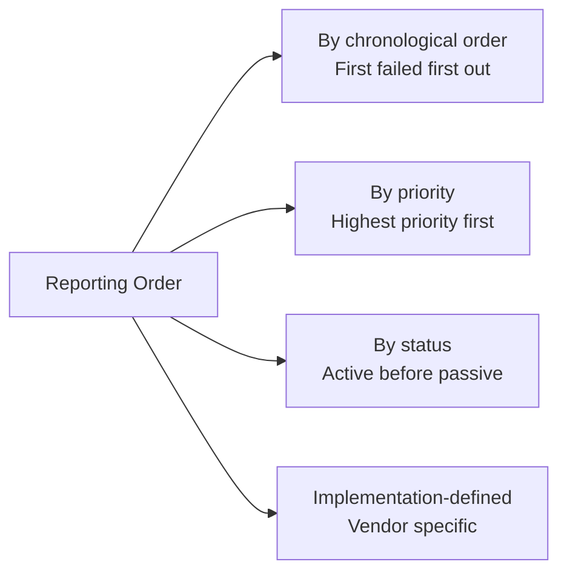

**AUTOSAR không mandates một thứ tự cố định** – reporting order là **implementation-defined**. Tuy nhiên, các nguyên tắc phổ biến:

1. Trong một memory origin (PRIMARY), entries thường được trả theo thứ tự **được cấp phát** (FIFO reporting).
2. DTC filter mask áp dụng trước khi lọc – chỉ entry thỏa mask mới được report.
3. Thứ tự nhất quán giữa các lần gọi liên tiếp (không thay đổi nếu memory không thay đổi).

**Filter pipeline trước khi report**:

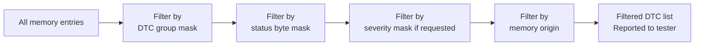

**Service flow 0x19 sub 0x02 – ReadDTCByStatusMask**:

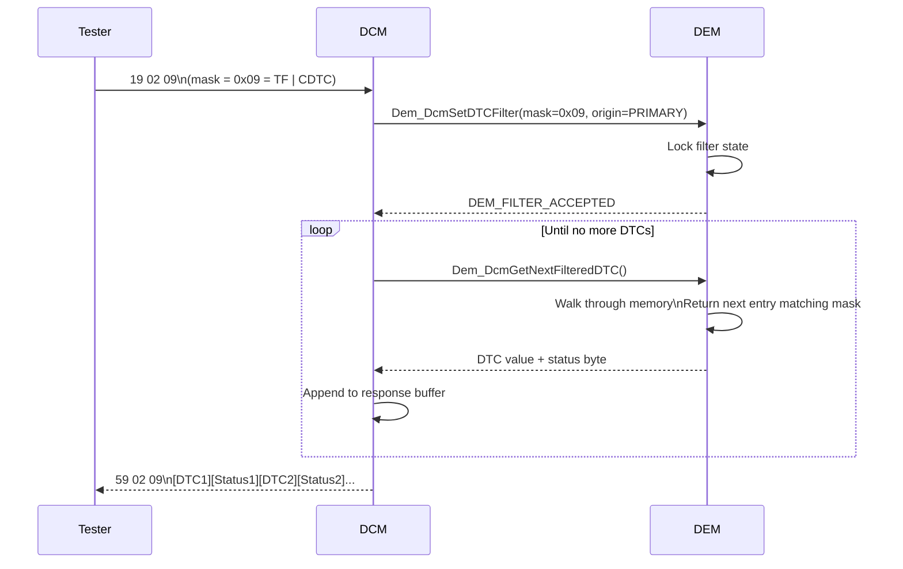

**Code minh họa iteration**:

```c
/* Tester filter setup */
Dem_ReturnType ret;

ret = Dem_DcmSetDTCFilter(
    0x09,                          /* statusMask: TF | CDTC */
    DEM_DTC_KIND_ALL_DTCS,
    DEM_DTC_FORMAT_UDS,
    DEM_DTC_ORIGIN_PRIMARY_MEMORY,
    DEM_FILTER_WITH_SEVERITY_NO,
    DEM_SEVERITY_NO_SEVERITY,
    DEM_FILTER_FOR_FDC_NO
);

/* Iterate all matching entries */
uint32 dtcNumber;
Dem_UdsStatusByteType statusByte;

while (DEM_FILTERED_OK ==
       Dem_DcmGetNextFilteredDTC(&dtcNumber, &statusByte))
{
    /* Process each DTC  */
    ResponseBuffer_AppendDTC(dtcNumber, statusByte);
}
```

**Liên tưởng reporting order**:

> Reporting order giống như lấy số thứ tự khám bệnh. Bệnh viện quyết định thứ tự theo chính sách của họ (ưu tiên cấp cứu, FIFO nhóm còn lại). Tester chỉ đọc theo thứ tự DEM cung cấp – không có API để chỉ định "cho tôi DTC thứ 3 trước".

---

## Tổng kết Part 2

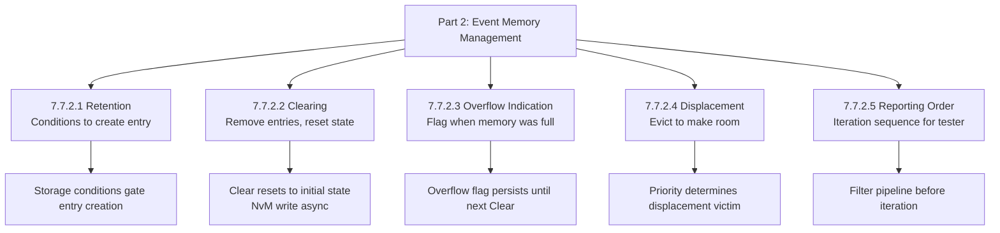

> Event Memory Management là lớp chính sách giữ cho event memory có **giá trị chẩn đoán thực sự**. Nếu thiết kế sai, memory có thể chứa đầy lỗi không quan trọng trong khi các fault an toàn bị overflow và mất dữ liệu.

---

## Ghi chú nguồn tham khảo

1. AUTOSAR Classic Platform SRS DEM – Section 7.7.2 Event Memory Management.
2. ISO 14229-1 – Service 0x19 ReadDTCInformation, 0x14 ClearDiagnosticInformation.
3. AUTOSAR SWS DEM – API `Dem_DcmClearDTC`, `Dem_DcmSetDTCFilter`, `Dem_DcmGetNextFilteredDTC`.
4. Nguồn public: EmbeddedTutor AUTOSAR DEM, DeepWiki openAUTOSAR/classic-platform.
