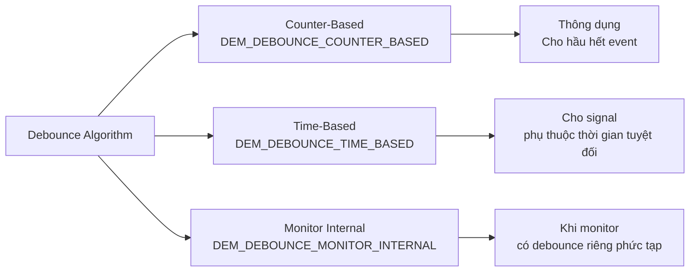
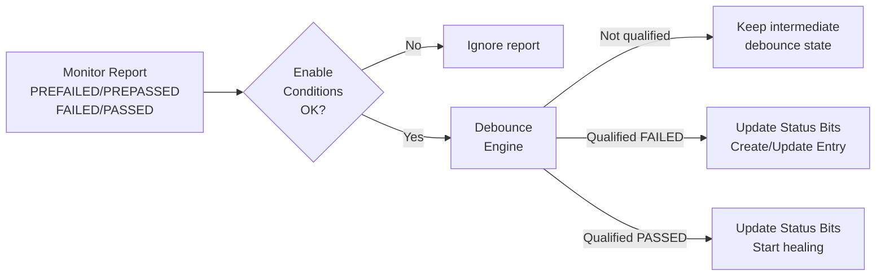
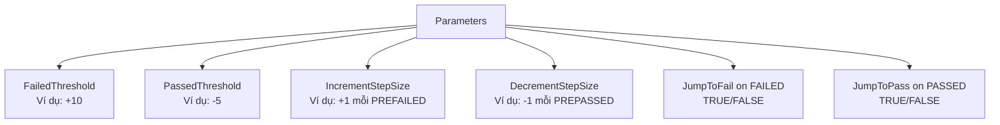
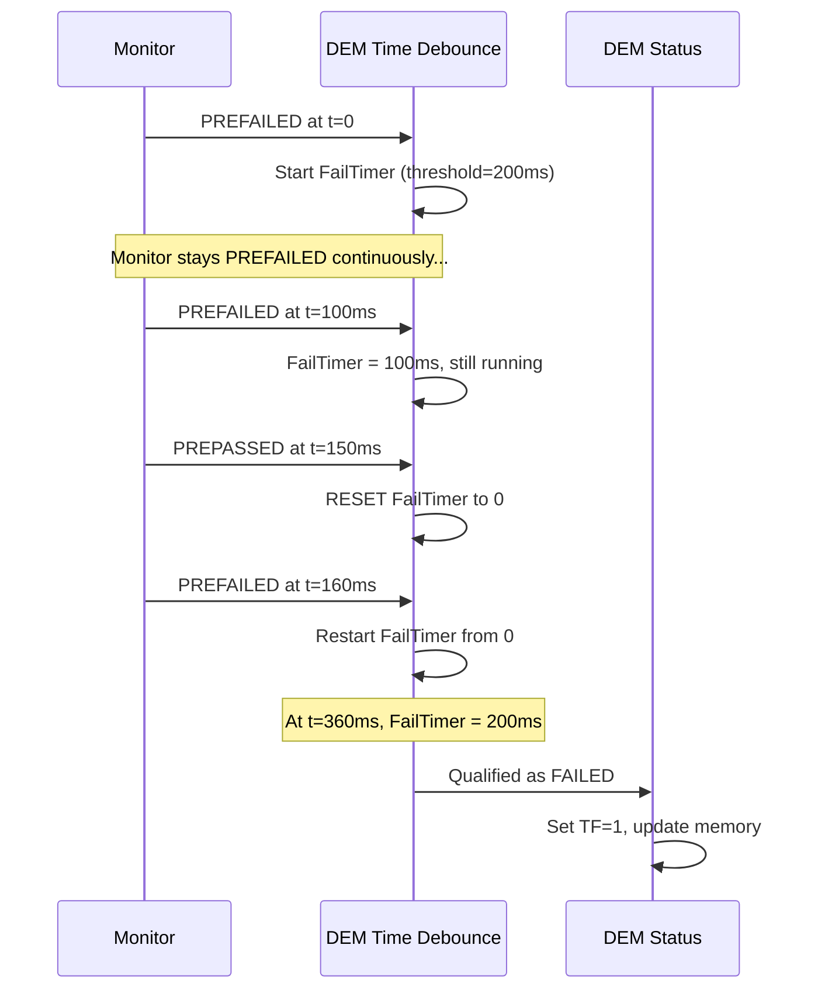
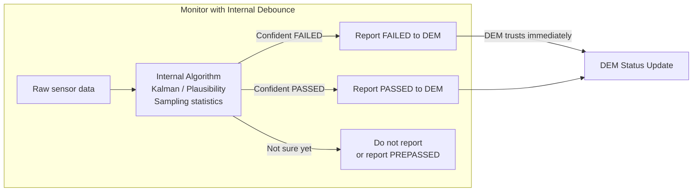
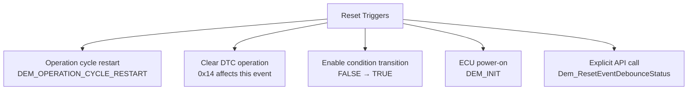
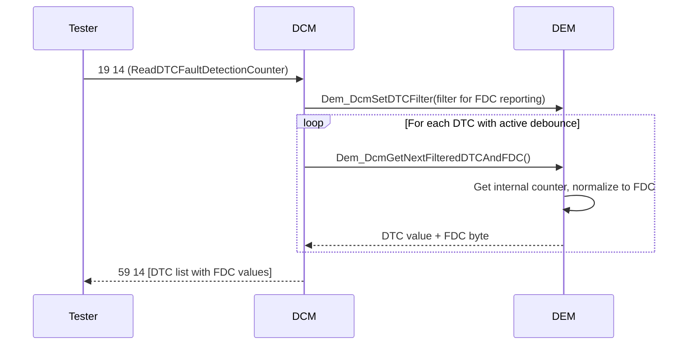
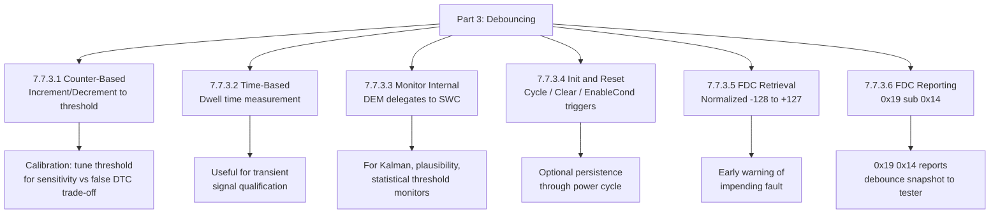

---
layout: default
category: uds
title: "DEM - Event Memory Part 3: Debouncing of Diagnostic Events"
nav_exclude: true
module: true
tags: [autosar, dem, debounce, counter, time-based, fault-detection, fdc]
description: "DEM Event Memory phần 3 – Debouncing: counter-based, time-based, monitor-internal, khởi tạo và Fault Detection Counter."
permalink: /dem-event-memory-p3/
---

# DEM – Event Memory (Part 3): Debouncing of Diagnostic Events

> Tài liệu này mô tả chi tiết phần **7.7.3 Debouncing of Diagnostic Events** – cơ chế lọc nhiễu để tránh DTC xuất hiện từ lỗi thoáng qua. Debouncing là ranh giới quan trọng giữa "monitor thấy dấu hiệu lỗi" và "DEM công nhận lỗi thực sự".

---

## 7.7.3 Debouncing of Diagnostic Events

**Debouncing** là cơ chế DEM dùng để **xác nhận** rằng một lỗi thực sự tồn tại trước khi cập nhật status bit và tạo event memory entry. Không có debouncing, một nhiễu ngắn hạn trong tín hiệu cảm biến có thể ngay lập tức tạo DTC, gây false alarm và làm suy giảm giá trị chẩn đoán.

**Ba loại debounce algorithm**:



**Vị trí debounce trong luồng DEM**:



---

## 7.7.3.1 Counter Based Debounce Algorithm

**Counter-based debounce** là thuật toán phổ biến nhất. DEM duy trì một counter số nguyên cho mỗi event, tăng khi nhận PREFAILED và giảm khi nhận PREPASSED. Event chỉ được qualify khi counter vượt threshold.

**Cấu trúc counter-based debounce**:



**Thuật toán chi tiết**:

```
Counter range: [PassThreshold ... FailThreshold]
                    -5    ...        +10

PREFAILED received:
  counter = min(counter + IncrStep, FailThreshold)
  If counter == FailThreshold:
    → Event QUALIFIED FAILED

PREPASSED received:
  counter = max(counter - DecrStep, PassThreshold)
  If counter == PassThreshold:
    → Event QUALIFIED PASSED

FAILED received (direct):
  If JumpToFail = TRUE: counter = FailThreshold immediately
    → Event QUALIFIED FAILED instantly

PASSED received (direct):
  If JumpToPass = TRUE: counter = PassThreshold immediately
    → Event QUALIFIED PASSED instantly
```

**Ví dụ với ngưỡng: Fail=10, Pass=-5**:

```
Timeline:
t=0:  counter=0, Monitor: PREFAILED → counter=1
t=1:  counter=1, Monitor: PREFAILED → counter=2
t=2:  counter=2, Monitor: PREFAILED → counter=3
...
t=9:  counter=9, Monitor: PREFAILED → counter=10 → QUALIFIED FAILED!
      DEM: Set TF=1, PDTC=1, TFTOC=1 → memory entry created

-- Lỗi tạm thời qua đi --
t=10: counter=10, Monitor: PREPASSED → counter=9
t=11: counter=9,  Monitor: PREPASSED → counter=8
...
t=14: counter=6,  Monitor: PREFAILED → counter=7 (vọng lại)
t=15: counter=7,  Monitor: PREPASSED → counter=6
...
t=18: counter=4,  Monitor: PREPASSED → counter=3
...
t=22: counter=-1, Monitor: PREPASSED → counter=-2
...
t=24: counter=-5  → QUALIFIED PASSED!
      DEM: Clear TF=0, healing logic starts
```

**Sơ đồ counter movement**:

```
 +10 ─────────────────────● FAIL threshold
      ↑ PREFAILED
  +5 ────────────────
  
   0 ──────────────── Start point
  
  -3 ────────────────
      ↓ PREPASSED
  -5 ─────────────────────● PASS threshold
```

**Code minh họa counter-based algorithm**:

```c
/* DEM Counter-based debounce state per event */
typedef struct {
    sint16 counter;           /* Current debounce counter */
    sint16 failThreshold;     /* e.g., +10               */
    sint16 passThreshold;     /* e.g., -5                */
    sint16 incrStep;          /* e.g., +1                */
    sint16 decrStep;          /* e.g., +1 (subtracted)   */
    boolean jumpToFail;       /* Jump on direct FAILED?  */
    boolean jumpToPass;       /* Jump on direct PASSED?  */
} Dem_DebounceCounterType;

Dem_EventStatusType Dem_ProcessCounterDebounce(
    Dem_DebounceCounterType* db,
    Dem_EventStatusType monitorStatus)
{
    switch (monitorStatus)
    {
        case DEM_EVENT_STATUS_PREFAILED:
            db->counter += db->incrStep;
            if (db->counter >= db->failThreshold) {
                db->counter = db->failThreshold;
                return DEM_EVENT_STATUS_FAILED; /* Qualified */
            }
            break;

        case DEM_EVENT_STATUS_FAILED:
            if (db->jumpToFail) {
                db->counter = db->failThreshold;
                return DEM_EVENT_STATUS_FAILED;
            }
            /* Treat as PREFAILED otherwise */
            db->counter += db->incrStep;
            break;

        case DEM_EVENT_STATUS_PREPASSED:
            db->counter -= db->decrStep;
            if (db->counter <= db->passThreshold) {
                db->counter = db->passThreshold;
                return DEM_EVENT_STATUS_PASSED; /* Qualified */
            }
            break;

        case DEM_EVENT_STATUS_PASSED:
            if (db->jumpToPass) {
                db->counter = db->passThreshold;
                return DEM_EVENT_STATUS_PASSED;
            }
            db->counter -= db->decrStep;
            break;
    }

    return DEM_EVENT_STATUS_PREPASSED; /* No qualification yet */
}
```

**Cấu hình counter debounce trong ARXML**:

```xml
<DEM-DEBOUNCE-COUNTER-BASED-CLASS>
  <SHORT-NAME>DemDebounceClass_CoolantTemp</SHORT-NAME>
  <DEM-DEBOUNCE-COUNTER-FAILED-THRESHOLD>10</DEM-DEBOUNCE-COUNTER-FAILED-THRESHOLD>
  <DEM-DEBOUNCE-COUNTER-PASSED-THRESHOLD>-5</DEM-DEBOUNCE-COUNTER-PASSED-THRESHOLD>
  <DEM-DEBOUNCE-COUNTER-INCREMENT-STEP-SIZE>1</DEM-DEBOUNCE-COUNTER-INCREMENT-STEP-SIZE>
  <DEM-DEBOUNCE-COUNTER-DECREMENT-STEP-SIZE>1</DEM-DEBOUNCE-COUNTER-DECREMENT-STEP-SIZE>
  <DEM-DEBOUNCE-COUNTER-JUMP-DOWN>false</DEM-DEBOUNCE-COUNTER-JUMP-DOWN>
  <DEM-DEBOUNCE-COUNTER-JUMP-UP>false</DEM-DEBOUNCE-COUNTER-JUMP-UP>
</DEM-DEBOUNCE-COUNTER-BASED-CLASS>
```

**Liên tưởng counter-based debounce**:

> Giống như hệ thống biểu quyết: cần 10 phiếu thuận để thông qua một nghị quyết (FAIL), và cần 5 phiếu phản đối để bác bỏ (PASS). Mỗi cuộc bỏ phiếu (monitor report) tăng hoặc giảm một phiếu. Chỉ khi đủ tổng số phiếu mới có quyết định.

---

## 7.7.3.2 Time Based Debounce Algorithm

**Time-based debounce** dùng **thời gian thực** thay vì đếm số lần báo cáo. DEM cần một timestamp source để đo thời gian mà monitor duy trì PREFAILED/PREPASSED liên tục.

**Nguyên lý hoạt động**:

```
FailTimer: chạy khi monitor trong trạng thái PREFAILED
→ Nếu PREFAILED liên tục trong FailTimeThreshold ms → QUALIFIED FAILED

PassTimer: chạy khi monitor trong trạng thái PREPASSED  
→ Nếu PREPASSED liên tục trong PassTimeThreshold ms → QUALIFIED PASSED

Nếu monitor thay đổi chiều (PREPASSED → PREFAILED), timer tương ứng bị reset
```

**Timeline minh họa time-based debounce**:

```
Timeline (ms):
  0ms: Monitor → PREFAILED, FailTimer starts
 50ms: Monitor → PREFAILED (still), FailTimer = 50ms
150ms: Monitor → PREPASSED, FailTimer RESET to 0
160ms: Monitor → PREFAILED, FailTimer starts again from 0
360ms: FailTimer = 200ms = FailTimeThreshold → QUALIFIED FAILED!

-- Fault clears --
361ms: Monitor → PREPASSED, PassTimer starts
461ms: PassTimer = 100ms = PassTimeThreshold → QUALIFIED PASSED!
```



**So sánh Counter-Based vs Time-Based**:

| Khía cạnh | Counter-Based | Time-Based |
|---|---|---|
| Đơn vị đo | Số lần báo cáo | Thời gian (ms) |
| Task rate dependency | Threshold phụ thuộc tần suất gọi | Độc lập với task rate |
| Intermittent fault | Counter tăng/giảm theo từng report | Timer reset khi đổi hướng |
| Typical use case | Event có task period cố định | Event cần dwell time chẩn đoán |
| Configuration | Integer threshold | ms threshold |

**Code minh họa time-based algorithm**:

```c
typedef struct {
    uint32 failTimerStart;         /* Timestamp khi PREFAILED bắt đầu */
    uint32 passTimerStart;         /* Timestamp khi PREPASSED bắt đầu */
    boolean failTimerRunning;
    boolean passTimerRunning;
    uint32 failTimeThreshold_ms;   /* Ví dụ: 200ms */
    uint32 passTimeThreshold_ms;   /* Ví dụ: 100ms */
} Dem_DebounceTimeType;

Dem_EventStatusType Dem_ProcessTimeDebounce(
    Dem_DebounceTimeType* db,
    Dem_EventStatusType monitorStatus,
    uint32 currentTime_ms)
{
    if (monitorStatus == DEM_EVENT_STATUS_PREFAILED ||
        monitorStatus == DEM_EVENT_STATUS_FAILED)
    {
        db->passTimerRunning = FALSE;  /* Reset pass timer */
        if (!db->failTimerRunning) {
            db->failTimerStart = currentTime_ms;
            db->failTimerRunning = TRUE;
        }
        uint32 elapsed = currentTime_ms - db->failTimerStart;
        if (elapsed >= db->failTimeThreshold_ms) {
            return DEM_EVENT_STATUS_FAILED;  /* Qualified! */
        }
    }
    else if (monitorStatus == DEM_EVENT_STATUS_PREPASSED ||
             monitorStatus == DEM_EVENT_STATUS_PASSED)
    {
        db->failTimerRunning = FALSE;  /* Reset fail timer */
        if (!db->passTimerRunning) {
            db->passTimerStart = currentTime_ms;
            db->passTimerRunning = TRUE;
        }
        uint32 elapsed = currentTime_ms - db->passTimerStart;
        if (elapsed >= db->passTimeThreshold_ms) {
            return DEM_EVENT_STATUS_PASSED;  /* Qualified! */
        }
    }
    return DEM_EVENT_STATUS_PREPASSED;  /* Still debouncing */
}
```

**Liên tưởng time-based debounce**:

> Như kiểm tra đèn tín hiệu giao thông: đèn xanh chỉ được cho phép khi đèn đỏ đối diện đã đỏ **liên tục** đủ thời gian an toàn. Nếu đèn đỏ chớp tắt giữa chừng, đồng hồ phải đếm lại từ đầu.

---

## 7.7.3.3 Monitor Internal Debounce Algorithm

**Monitor-internal debounce** là mode trong đó DEM **ủy quyền hoàn toàn** quyết định debounce cho monitor. DEM không duy trì bất kỳ counter hay timer nào – nó chỉ tin tưởng kết quả monitor trả về.

**Khi nào dùng Monitor Internal**:

1. Monitor đã có thuật toán đánh giá phức tạp riêng (Kalman filter, plausibility check, classification).
2. Monitor có thể gửi trực tiếp `FAILED` hoặc `PASSED` (không phải `PREFAILED`/`PREPASSED`).
3. Cần tối ưu performance – không tốn tài nguyên DEM cho debounce.



**DEM config cho monitor-internal debounce**:

```xml
<DEM-EVENT-PARAMETER>
  <SHORT-NAME>DemEvent_ComplexSensor</SHORT-NAME>
  <DEM-DEBOUNCE-ALGORITHM-CLASS>
    DEM_DEBOUNCE_MONITOR_INTERNAL
  </DEM-DEBOUNCE-ALGORITHM-CLASS>
  <!-- No counter or time thresholds needed -->
</DEM-EVENT-PARAMETER>
```

```c
/* Monitor với debounce nội bộ phức tạp */
void ComplexSensor_Monitor_Runnable(void)
{
    float32 sensorValue = ReadSensor();
    
    /* Internal debounce: sliding window of 50 samples */
    uint8 failCount = CountFailsInWindow(sensorValue, 50);
    
    if (failCount >= 45) {
        /* 90% of window = FAILED - high confidence */
        Rte_Call_DiagMonitor_SetEventStatus(DEM_EVENT_STATUS_FAILED);
    }
    else if (failCount <= 5) {
        /* Less than 10% fail in window = PASSED */
        Rte_Call_DiagMonitor_SetEventStatus(DEM_EVENT_STATUS_PASSED);
    }
    else {
        /* Ambiguous - do not report or report PREPASSED */
        Rte_Call_DiagMonitor_SetEventStatus(DEM_EVENT_STATUS_PREPASSED);
    }
}
```

**Fault Detection Counter (FDC) trong monitor-internal mode**:

```
Với monitor-internal debounce, DEM không có counter nội bộ để tính FDC.
Monitor có trách nhiệm báo cáo FDC value nếu tester yêu cầu.
API: Dem_GetFaultDetectionCounter() sẽ gọi callback của monitor để lấy giá trị.
```

---

## 7.7.3.4 Debounce Algorithm Initialization and Reset Conditions

Debounce state cần được khởi tạo đúng và biết khi nào reset để tránh carryover sai từ cycle này sang cycle khác.

**Khi nào debounce counter/timer được reset**:



**Hành vi reset tùy theo loại debounce**:

| Trigger | Counter-Based | Time-Based |
|---|---|---|
| New operation cycle | counter = 0 | Timer reset |
| Clear DTC | counter = 0 | Timer reset |
| Enable condition = FALSE | counter frozen (no change) | Timer paused |
| Enable condition = TRUE again | counter resumes from last value | Timer resumes |

```c
/* Reset debounce explicitly */
Dem_ReturnType ret = Dem_ResetEventDebounceStatus(
    DemConf_DemEventParameter_CoolantTempHigh,
    DEM_DEBOUNCE_STATUS_RESET  /* Reset to initial state */
);

/* DEM resets counter to 0 */
/* Useful after mode change, ignition cycle, etc. */
```

**Quan trọng – giữ hay reset debounce khi cycle restart**:

```
Scenario: Event đang ở counter=8 (gần FAIL threshold=10)
Key-off → Key-on (new operation cycle)

Behavior A (reset to 0):
  counter = 0 sau cycle mới
  Phải accumulate lại từ đầu
  → Tránh carryover bias từ cycle cũ

Behavior B (keep value):
  counter vẫn = 8
  Chỉ cần 2 PREFAILED thêm để FAIL
  → Có thể detect intermittent fault nhanh hơn

AUTOSAR default = RESET to 0 khi cycle restart
Nhưng một số DEM config cho phép giữ giá trị (DemDebounceCounterStorage)
```

**DemDebounceCounterStorage – persistent counter**:

```xml
<!-- Counter được lưu qua NvM, không reset khi power cycle -->
<DEM-DEBOUNCE-COUNTER-BASED-CLASS>
  <DEM-DEBOUNCE-COUNTER-STORAGE>true</DEM-DEBOUNCE-COUNTER-STORAGE>
  <!-- Counter value giữ qua ECU reset -->
</DEM-DEBOUNCE-COUNTER-BASED-CLASS>
```

> Dùng persistent counter cho những lỗi intermittent cần tích lũy qua nhiều key cycle để detect được.

---

## 7.7.3.5 Fault Detection Counter Retrieval

**Fault Detection Counter (FDC)** là giá trị normalized trong khoảng `-128 đến +127` thể hiện **mức độ tiến gần đến ngưỡng qualified FAILED hoặc PASSED** của debounce counter hiện tại.

**Mapping từ internal counter sang FDC**:

```
Internal counter range: [PassThreshold ... FailThreshold]
                             -5       ...      +10

FDC normalization:
  FDC = +127 ↔ counter = FailThreshold (qualified FAILED)
  FDC = -128 ↔ counter = PassThreshold (qualified PASSED)
  FDC = 0    ↔ counter = 0 (neutral point)
```

**Công thức normalization**:

$$
\text{FDC} = \begin{cases}
\left\lfloor \frac{\text{counter} \times 127}{\text{FailThreshold}} \right\rfloor & \text{if counter} \geq 0 \\
\left\lfloor \frac{\text{counter} \times 128}{|\text{PassThreshold}|} \right\rfloor & \text{if counter} < 0
\end{cases}
$$

**Ví dụ tính FDC**:

```
FailThreshold = 10, PassThreshold = -5
Current counter = 7

FDC = floor(7 * 127 / 10) = floor(88.9) = 88
→ FDC = 88, ~70% tiến đến FAIL threshold

Current counter = -3
FDC = floor(-3 * 128 / 5) = floor(-76.8) = -77
→ FDC = -77, ~60% tiến đến PASS threshold
```

**Tại sao FDC quan trọng**:

1. Cho phép tester đọc "mức độ sắp FAIL" của một event ngay cả khi chưa FAIL.
2. Hữu ích trong calibration – kiểm tra debounce behavior trước khi production.
3. Phát hiện "đang trong process of failing" – early warning tool.

---

## 7.7.3.6 Fault Detection Counter Reporting

FDC được tester truy cập qua **UDS service 0x19 sub 0x14 (ReadDTCFaultDetectionCounter)**.

**Service 0x19 sub 0x14**:

```
Request:  19 14
Response: 59 14
          [DTC1 HH][DTC1 MH][DTC1 ML][FDC1]
          [DTC2 HH][DTC2 MH][DTC2 ML][FDC2]
          ...

Ví dụ:
  59 14
  D0 01 15  58   → DTC 0xD00115, FDC = 0x58 = 88 decimal (+88, near FAIL)
  D0 03 08  B3   → DTC 0xD00308, FDC = 0xB3 = -77 signed (near PASS)
```

**Filter behavior của 0x19 sub 0x14**:

```
Chỉ trả về DTC có FDC ≠ +127 và FDC ≠ -128
(đã FAILED hoặc đã PASSED rồi thì không cần FDC nữa)
Trả về các DTC "trong quá trình debounce"
```

**Luồng API**:



**Code DEM trả FDC**:

```c
/* API: DEM tính và trả FDC của một event */
Dem_ReturnType Dem_GetFaultDetectionCounter(
    Dem_EventIdType EventId,
    sint8* FaultDetectionCounter)
{
    if (Dem_GetDebounceClass(EventId) == DEM_DEBOUNCE_COUNTER_BASED)
    {
        sint16 counter     = Dem_GetDebounceCounter(EventId);
        sint16 failThresh  = Dem_GetFailThreshold(EventId);
        sint16 passThresh  = Dem_GetPassThreshold(EventId);

        if (counter >= 0) {
            *FaultDetectionCounter = (sint8)((counter * 127) / failThresh);
        } else {
            *FaultDetectionCounter = (sint8)((counter * 128) / (-passThresh));
        }
        return DEM_OK;
    }
    else if (Dem_GetDebounceClass(EventId) == DEM_DEBOUNCE_MONITOR_INTERNAL)
    {
        /* Delegate to monitor callback */
        return Dem_CallFDCCallback(EventId, FaultDetectionCounter);
    }
    return DEM_NO_SUCH_ELEMENT;
}
```

**Liên tưởng FDC**:

> FDC giống như thanh tiến trình tải file: bạn thấy file đang tải 70% (FDC=+89) dù chưa xong. Một file khác đang "tải ngược" về 0 từ 60% (FDC=-77 = fault đang healing). Bạn biết chúng đang ở đâu trong tiến trình mà không cần chờ kết quả cuối cùng.

---

## Tổng kết Part 3



> Debouncing là cơ chế then chốt quyết định **chất lượng chẩn đoán**: threshold quá thấp → false DTC spam; threshold quá cao → missed fault. Calibration debounce là hoạt động kỹ thuật quan trọng trong quá trình phát triển ECU.

---

## Ghi chú nguồn tham khảo

1. AUTOSAR Classic Platform SRS DEM – Section 7.7.3 Debouncing of Diagnostic Events.
2. ISO 14229-1 – Service 0x19 sub 0x14 ReadDTCFaultDetectionCounter.
3. AUTOSAR SWS DEM – `Dem_GetFaultDetectionCounter`, `Dem_ResetEventDebounceStatus` API.
4. Nguồn public: EmbeddedTutor AUTOSAR DEM debounce series, DeepWiki openAUTOSAR.
