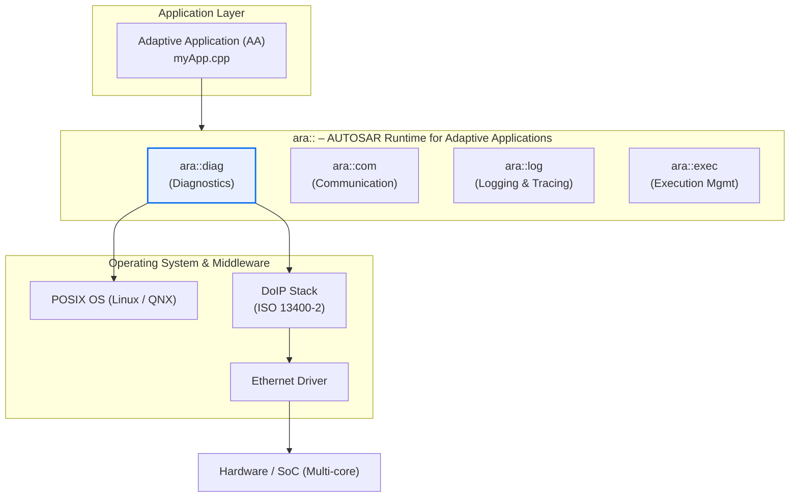
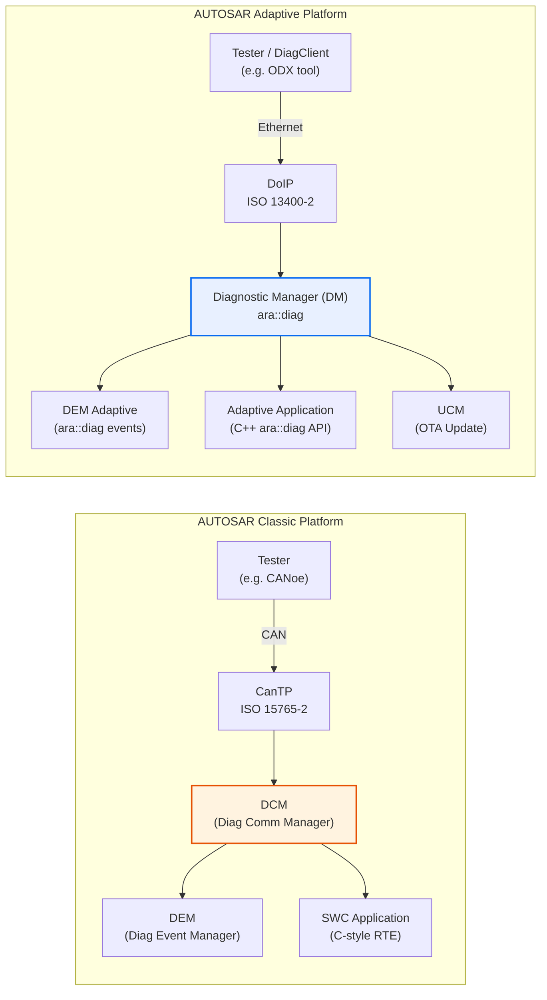
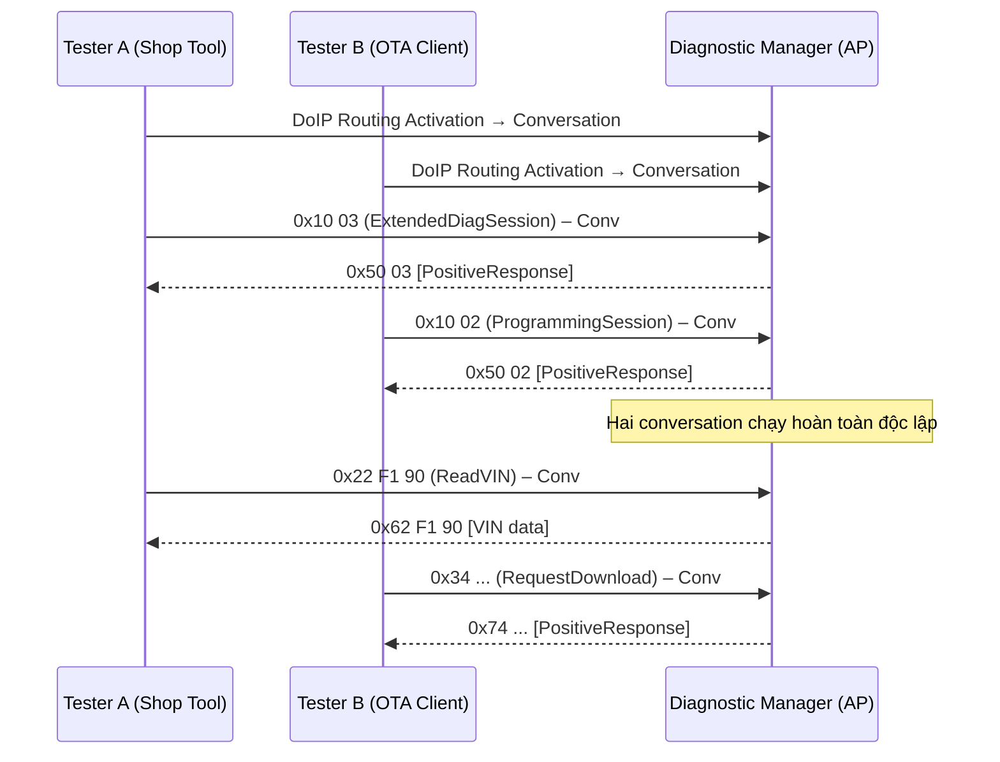

# UDS Adaptive – Phần 1: Tổng quan & So sánh với Classic

> **Nguồn tham chiếu chính:**
> - [AUTOSAR AP SWS Diagnostics R25-11](https://www.autosar.org/fileadmin/standards/R25-11/AP/AUTOSAR_AP_SWS_Diagnostics.pdf) – Specification of Adaptive Diagnostics
> - **ISO 14229-1:2020** – Unified Diagnostic Services, Application Layer
> - **ISO 14229-5:2022** – UDS on IP
> - **ISO 13400-2:2019** – DoIP (Diagnostics over IP)

---

## 1. Tại sao cần UDS Adaptive?

**AUTOSAR Classic Platform (CP)** được thiết kế từ những năm 2000 cho các ECU truyền thống:
vi xử lý nhỏ, bộ nhớ giới hạn, real-time deterministic, giao tiếp chủ yếu qua **CAN/LIN**.
UDS trên CP đi theo stack: `CanTP → DCM → DEM`, cấu hình hoàn toàn tại compile-time từ ARXML.

Ngành ô tô hiện đại đang trải qua sự chuyển đổi lớn:

| Xu hướng mới | Lý do CP không đáp ứng được |
|---|---|
| High-Performance Computing (HPC) – chip đa nhân, RAM GB | CP tĩnh, cấu hình compile-time, không hỗ trợ dynamic |
| Ethernet Backbone + SOME/IP | CP tập trung quanh CAN, thiếu native Ethernet stack |
| OTA Software Update | CP không có UCM, bootloader riêng lẻ khó tích hợp |
| Autonomous Driving, ADAS compute | CP thiếu POSIX OS, đa tiến trình, đa luồng linh hoạt |
| Cybersecurity nâng cao | CP chỉ có SecurityAccess cơ bản (SID 0x27) |
| Nhiều tester đồng thời (e.g. OTA + shop tool) | CP chỉ hỗ trợ một tester tại một thời điểm |

**AUTOSAR Adaptive Platform (AP)** ra đời từ **Release 17-03** để giải quyết các giới hạn này.
AP chạy trên **POSIX OS** (Linux/QNX), lập trình bằng **C++14/17**, kiến trúc
**Service-Oriented Architecture (SOA)** với giao tiếp qua Ethernet/SOME/IP.

**UDS Adaptive** là việc triển khai giao thức **UDS (ISO 14229-1)** trên AUTOSAR AP,
thông qua **Functional Cluster Diagnostics** và C++ API namespace **`ara::diag`**.

---

## 2. Vị trí trong AUTOSAR Adaptive Stack

`ara::diag` là một **Functional Cluster** của Foundation layer trong AP.
Nó được triển khai bởi một process nền gọi là **Diagnostic Manager (DM)**,
cung cấp C++ API cho Adaptive Applications để:
- Implement các diagnostic service handler (server-side)
- Đọc conversation/session state (client-side)
- Report diagnostic events (DTC management)

---

## 3. So sánh Classic vs Adaptive

### 3.1 Bảng tổng quan

| Tiêu chí | Classic Platform (CP) | Adaptive Platform (AP) |
|---|---|---|
| **OS** | OSEK/OS (proprietary RTOS) | POSIX (Linux, QNX) |
| **Ngôn ngữ** | C (MISRA-C) | C++14/17 |
| **Cấu hình** | Compile-time (ARXML codegen) | Runtime (manifest JSON/ARXML) |
| **Memory** | Static, không dùng heap | Dynamic, heap allocation |
| **Transport Layer** | CanTP (ISO 15765-2) | DoIP (ISO 13400-2) over Ethernet |
| **Diagnostic Module** | DCM (Diagnostic Communication Manager) | Diagnostic Manager (DM) |
| **Application API** | C-function calls qua RTE | `ara::diag` C++ API (Future-based) |
| **Session model** | **Single tester** – một session tại một lúc | **Multi-Conversation** – nhiều tester đồng thời |
| **DTC Management** | DEM (CP DEM) | DEM Adaptive (FC Diagnostics) |
| **Security** | SecurityAccess SID 0x27 | Authentication SID 0x29 (+ 0x27 tùy chọn) |
| **SW Update** | FBL tự custom | UCM (Update & Configuration Management) |
| **Async response** | Không | Có – `ara::core::Future<T>` |

### 3.2 Stack so sánh trực quan

### 3.3 Conversation Model – điểm khác biệt cốt lõi

Trong CP mỗi lúc chỉ tồn tại **một diagnostic session** (single tester).
Khi tester mới kết nối, session cũ bị xóa.

Trong AP, khái niệm **`ara::diag::Conversation`** cho phép:
- Nhiều tester kết nối **đồng thời** qua DoIP
- Mỗi Conversation có **session state** và **security level** riêng biệt
- Conversation được tạo tự động khi tester hoàn thành DoIP routing activation

---

## 4. Standards & Nguồn tham chiếu

| Tài liệu | Phạm vi | Ghi chú |
|---|---|---|
| **ISO 14229-1:2020** | UDS Application Layer – định nghĩa toàn bộ SID | Tiêu chuẩn gốc, áp dụng cả CP lẫn AP |
| **ISO 14229-5:2022** | UDS on Internet Protocol | Mở rộng 14229-1 cho môi trường IP |
| **ISO 13400-2:2019** | DoIP – Transport layer trên Ethernet | Thay thế CanTP trong AP |
| **AUTOSAR_AP_SWS_Diagnostics R25-11** | Specification of `ara::diag` API, DM architecture | Tài liệu triển khai chính thức của AUTOSAR AP |
| **AUTOSAR_AP_SWS_DiagnosticManager** | Chi tiết Diagnostic Manager process | Mô tả hành vi nội bộ của DM |

> **Lưu ý:** AUTOSAR_AP_SWS_Diagnostics (mục 7 trở đi) định nghĩa từng class trong
> `ara::diag`, bao gồm `Conversation`, `GenericUDSService`, `DiagnosticRoutine`, v.v.
> Đây là tài liệu chuẩn gốc mà bất kỳ vendor/OEM nào triển khai DM đều phải tuân thủ.

---

## Các phần tiếp theo

| Phần | Nội dung |
|---|---|
| **[Phần 2 – Kiến trúc & Thành phần]({{ '/uds-adaptive-p2/' | relative_url }})** | Diagnostic Manager (DM), ara::diag API, Conversation lifecycle, DoIP flow |
| **[Phần 3 – Dịch vụ UDS & Ví dụ Code]({{ '/uds-adaptive-p3/' | relative_url }})** | Service mapping CP→AP, ReadDataByIdentifier, RoutineControl, Authentication – ví dụ C++ |
