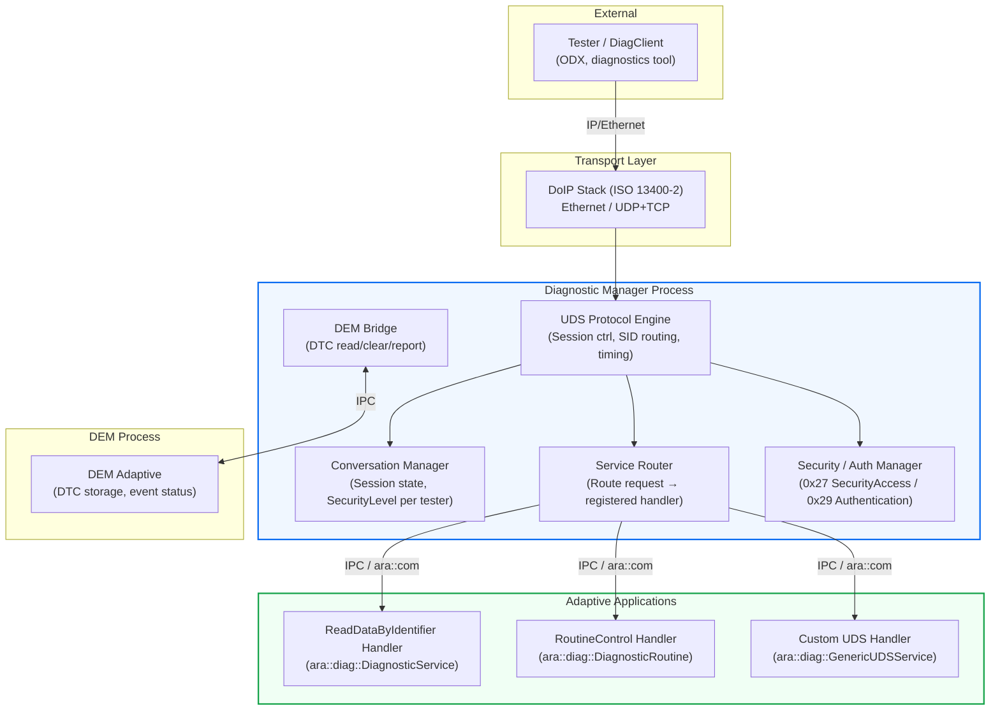
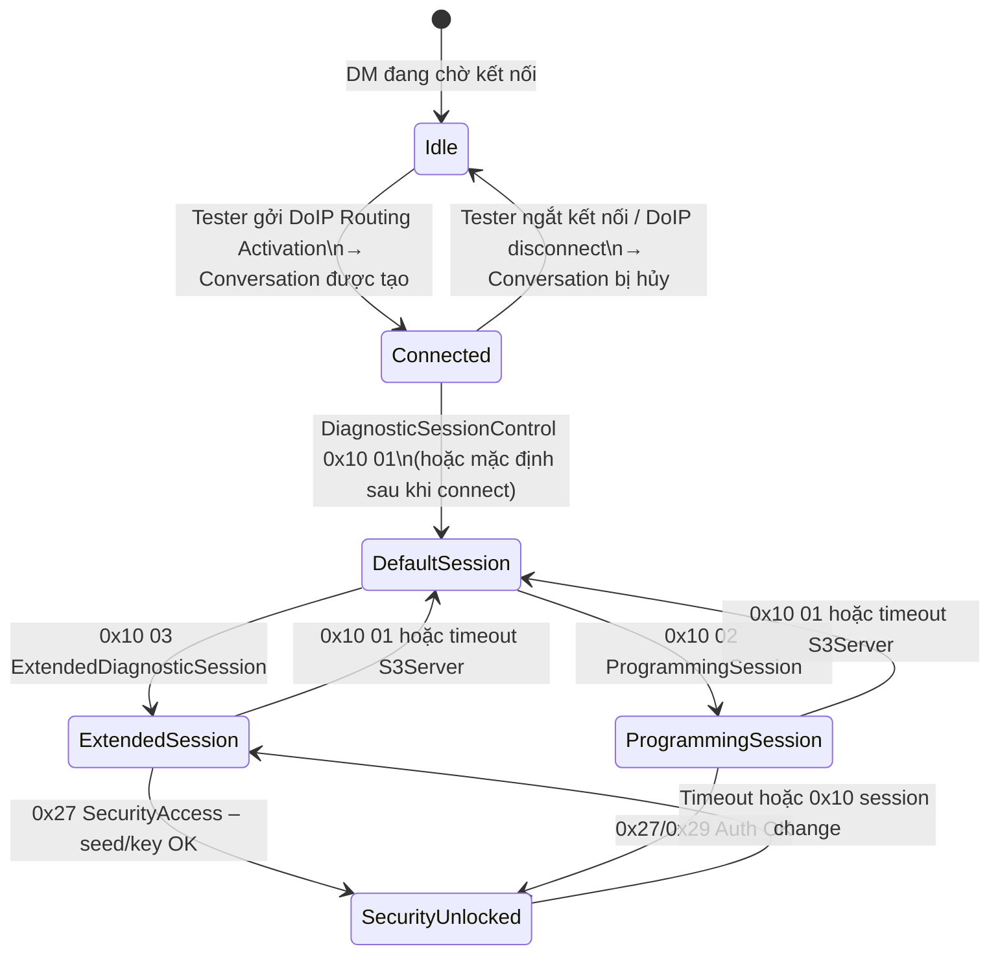
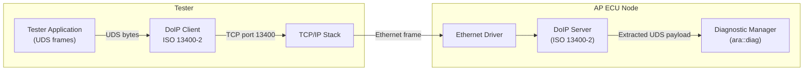
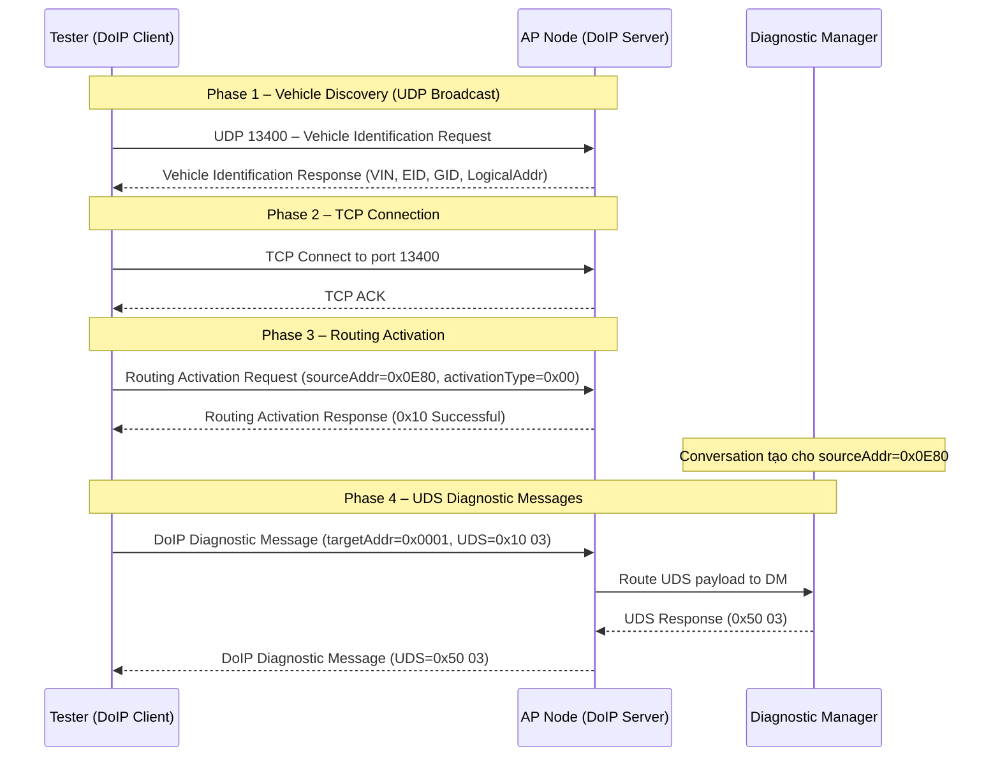
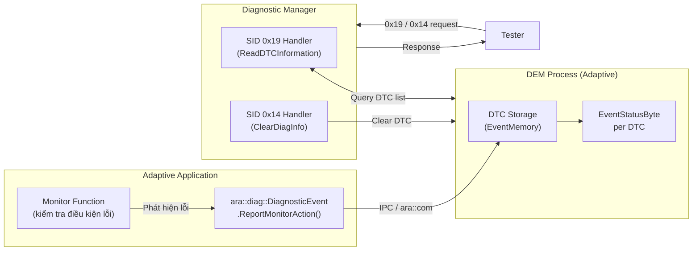
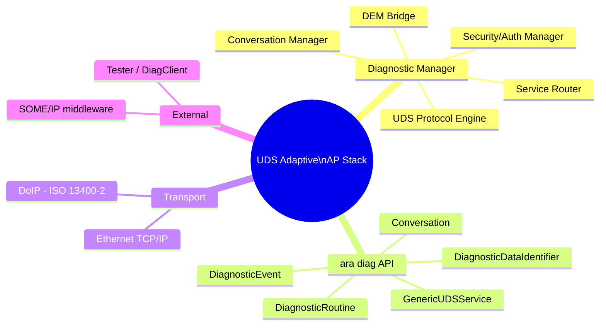

# UDS Adaptive – Phần 2: Kiến trúc & Thành phần

> **Nguồn tham chiếu:**
> - [AUTOSAR AP SWS Diagnostics R25-11](https://www.autosar.org/fileadmin/standards/R25-11/AP/AUTOSAR_AP_SWS_Diagnostics.pdf) – Section 7 (API), Section 8 (Behavior)
> - ISO 14229-1:2020, ISO 13400-2:2019

---

## 1. Diagnostic Manager (DM) – Trái tim của AP Diagnostics

**Diagnostic Manager (DM)** là một **Adaptive Application process** chạy nền trên AP node.
Nó triển khai toàn bộ logic UDS (ISO 14229-1) và expose C++ API `ara::diag` để các
Adaptive Applications (AA) tích hợp.

> Trong AUTOSAR Classic, vai trò này được đảm nhiệm bởi **DCM** (BSW module tĩnh).
> Trong AP, DM là một **process động** – thư viện `ara::diag` link vào AA để gọi DM qua IPC.

### 1.1 Chức năng chính của DM

| Chức năng | Mô tả |
|---|---|
| **UDS Protocol Engine** | Xử lý toàn bộ SID: decode request, validate, route đến handler |
| **Conversation Management** | Quản lý multi-tester session, security level per-connection |
| **DoIP Interface** | Nhận/gửi data qua DoIP (ISO 13400-2) qua Ethernet |
| **Service Routing** | Điều hướng request đến đúng AA handler đã đăng ký |
| **DEM Bridge** | Cầu nối với DEM để đọc/xóa DTC qua 0x14, 0x19 |
| **Timing Management** | Quản lý P2, P2* server timer (response timeout) |
| **Security / Authentication** | Xử lý SecurityAccess (0x27) hoặc Authentication (0x29) |

### 1.2 Kiến trúc nội bộ DM



---

## 2. `ara::diag` – C++ API Overview

`ara::diag` là C++ namespace chứa toàn bộ các class/interface mà AUTOSAR AP SWS Diagnostics
định nghĩa. AA link vào thư viện này để:
- **Đăng ký service handler** với DM
- **Nhận UDS request** và trả về response (sync hoặc async)
- **Lấy thông tin Conversation** (session, security level)
- **Report diagnostic events** (DTC)

### 2.1 Các class quan trọng nhất

| Class / Type | SID liên quan | Vai trò |
|---|---|---|
| `ara::diag::Conversation` | N/A | Đại diện một diagnostic session, có session state + security level |
| `ara::diag::GenericUDSService` | Bất kỳ SID | Base class cho handler tự do (custom SID hoặc standard SID) |
| `ara::diag::DiagnosticService` | Standard SIDs | Base class cho các standard service đã cấu hình qua manifest |
| `ara::diag::DiagnosticRoutine` | 0x31 RoutineControl | Handler tác vụ: Start/Stop/RequestResult |
| `ara::diag::DiagnosticSecurityAccess` | 0x27 SecurityAccess | Seed/Key challenge-response |
| `ara::diag::DiagnosticAuthentication` | 0x29 Authentication | PKI-based authentication (mới trong AP) |
| `ara::diag::DiagnosticDataIdentifier` | 0x22 / 0x2E | ReadDataByIdentifier / WriteDataByIdentifier |
| `ara::diag::DiagnosticEvent` | 0x14 / 0x19 | Report và query DTC/event status |
| `ara::core::Future<T>` | — | Async response mechanism |

### 2.2 Pattern tổng quát: OfferService

Tất cả handler trong AP theo pattern **offer/stop-offer** (giống `ara::com` service):

```cpp
// ===== Cấu trúc tổng quát một ara::diag handler =====

#include "ara/diag/generic_uds_service.h"
#include "ara/core/future.h"
#include "ara/core/promise.h"

class MyServiceHandler : public ara::diag::GenericUDSService {
public:
    // Cấu hình SID và sub-function mask qua constructor (từ manifest)
    MyServiceHandler(const ara::core::InstanceSpecifier& specifier)
        : ara::diag::GenericUDSService(specifier)
    {}

    // DM gọi hàm này khi nhận UDS request khớp với SID đã đăng ký
    ara::core::Future<ara::diag::OperationOutput> HandleMessage(
        const ara::diag::RequestData&       request,       // Raw UDS bytes
        ara::diag::MetaInfo&               metaInfo,      // Conversation, session...
        ara::diag::CancellationHandler&    cancelHandler  // Hủy nếu tester ngắt kết nối
    ) override;
};

// Trong main() hoặc Init():
MyServiceHandler handler(ara::core::InstanceSpecifier{"MyService"});
handler.Offer();    // Đăng ký với DM → DM bắt đầu routing request đến handler này
// ...
handler.StopOffer(); // Hủy đăng ký
```

---

## 3. Conversation – Quản lý Session đa tester

`ara::diag::Conversation` là object đại diện cho **một kết nối diagnostic** đang hoạt động.
DM tự động tạo/xóa Conversation khi tester connect/disconnect qua DoIP.

### 3.1 Thông tin có trong một Conversation

```cpp
// Lấy Conversation từ MetaInfo (trong handler callback)
ara::diag::Conversation& conv = metaInfo.GetConversation();

// Session state hiện tại (DefaultSession / ExtendedSession / ProgrammingSession...)
ara::diag::DiagnosticSessionType session = conv.GetDiagnosticSession();

// Security level (kLocked = chưa unlock, kUnlocked = đã pass SecurityAccess/Auth)
ara::diag::SecurityLevelType secLevel = conv.GetDiagnosticSecurityLevel();

// Địa chỉ nguồn (source address) của tester
uint16_t testerAddr = conv.GetSourceAddress();

// Target address của request
uint16_t targetAddr = conv.GetTargetAddress();
```

### 3.2 Conversation Lifecycle



> **Lưu ý:** Mỗi Conversation có trạng thái **độc lập**. Tester A ở ExtendedSession không
> ảnh hưởng tới Tester B ở DefaultSession. Đây là khác biệt lớn nhất so với CP.

---

## 4. DoIP – Transport Layer trong AP

**DoIP (Diagnostics over IP)** theo **ISO 13400-2** là transport protocol thay thế CanTP
trong môi trường Ethernet. DM sử dụng DoIP để nhận/gửi UDS messages.

### 4.1 DoIP Stack



### 4.2 DoIP Message Flow – kết nối từ đầu đến cuối



### 4.3 Cấu trúc DoIP frame

| Field | Size | Mô tả |
|---|---|---|
| Protocol Version | 1 byte | Phiên bản DoIP (0xFD = ISO 13400-2:2019) |
| Inverse Protocol Version | 1 byte | XOR của Protocol Version |
| Payload Type | 2 bytes | Loại message (0x8001 = Diagnostic Message) |
| Payload Length | 4 bytes | Độ dài phần payload |
| Source Address | 2 bytes | Địa chỉ tester |
| Target Address | 2 bytes | Địa chỉ ECU đích |
| **UDS Data** | N bytes | Toàn bộ UDS request/response frame |

---

## 5. DEM Adaptive – Quản lý DTC

Trong AP, quản lý DTC được thực hiện qua **DEM Adaptive** (Diagnostic Event Manager).
AA report sự kiện lỗi; DEM lưu trữ và làm sẵn sàng cho DM khi tester truy vấn 0x19.



```cpp
// Ví dụ: AA report một diagnostic event (lỗi cảm biến)
#include "ara/diag/diagnostic_event.h"

// Khởi tạo với InstanceSpecifier từ manifest (maps đến DTC cụ thể)
ara::diag::DiagnosticEvent voltageEvent(
    ara::core::InstanceSpecifier{"SensorVoltageEvent"}
);

// Report trạng thái: kPassed / kFailed / kPrepassed / kPrefailed
void CheckVoltageSensor(float voltage) {
    if (voltage < 4.5f || voltage > 5.5f) {
        voltageEvent.ReportMonitorAction(
            ara::diag::MonitorAction::kFailed
        );
    } else {
        voltageEvent.ReportMonitorAction(
            ara::diag::MonitorAction::kPassed
        );
    }
}
```

---

## Tóm tắt thành phần



---

**Xem tiếp:**
[Phần 3 – Dịch vụ UDS & Ví dụ Code]({{ '/uds-adaptive-p3/' | relative_url }}) –
mapping service CP→AP, ví dụ C++ ReadDataByIdentifier, RoutineControl, Authentication.
