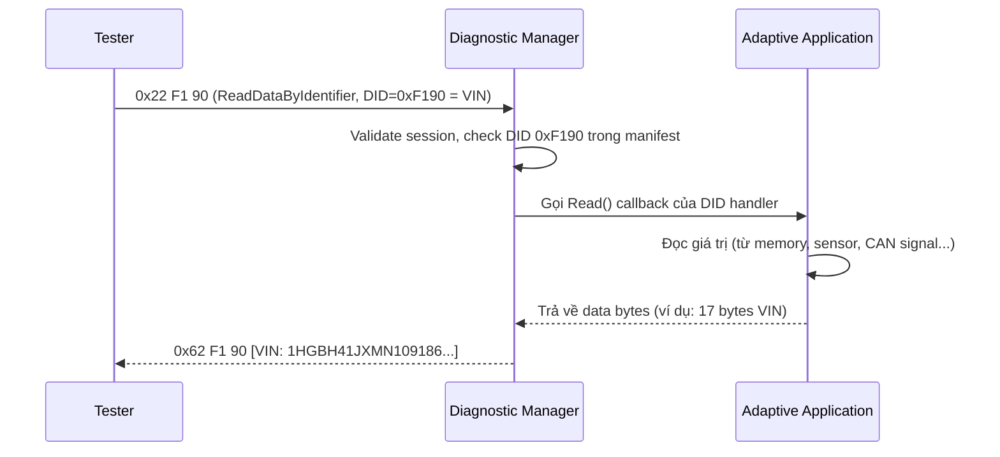
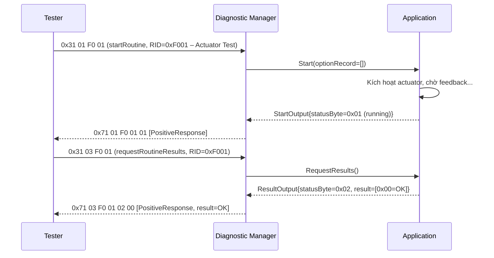
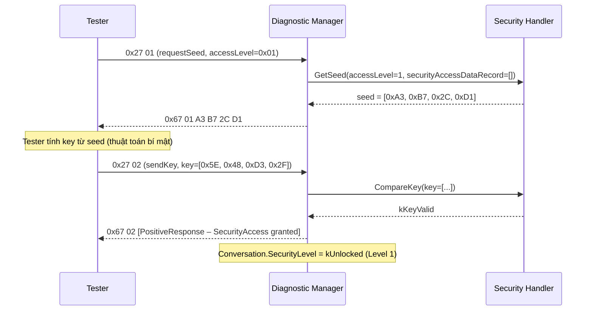
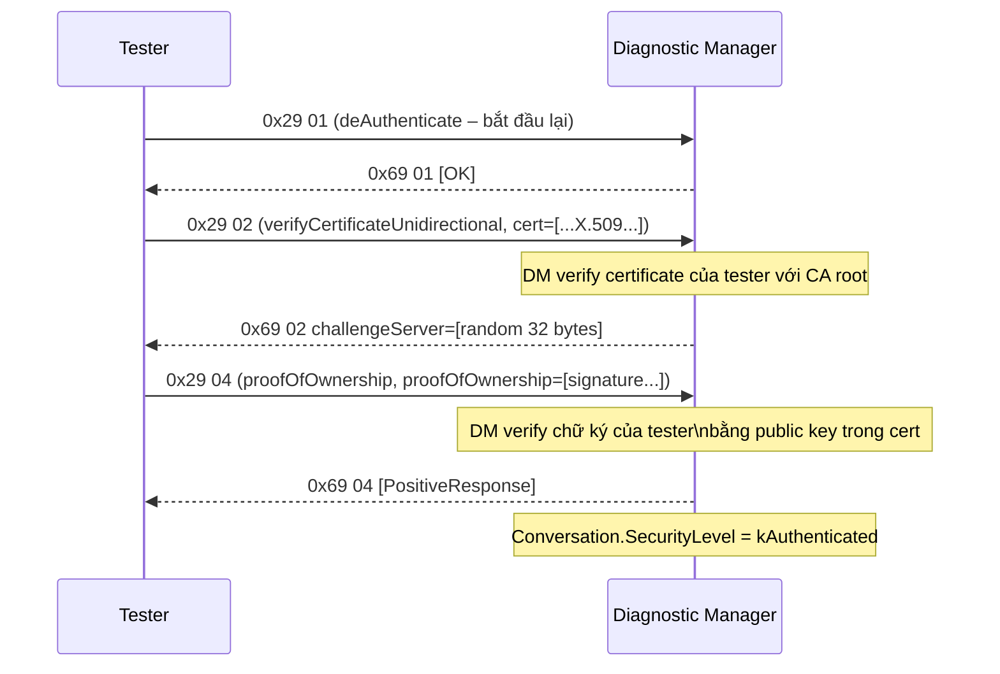
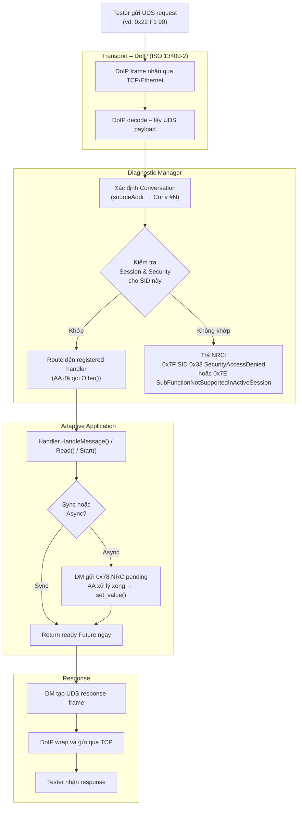

# UDS Adaptive – Phần 3: Dịch vụ UDS & Ví dụ Code

> **Nguồn tham chiếu:**
> - [AUTOSAR AP SWS Diagnostics R25-11](https://www.autosar.org/fileadmin/standards/R25-11/AP/AUTOSAR_AP_SWS_Diagnostics.pdf) – Section 7 (API Classes), Section 9 (Use Cases)
> - ISO 14229-1:2020 – Service definitions

---

## 1. Mapping UDS Services: Classic → Adaptive

Tất cả **Service IDentifiers (SID)** được định nghĩa trong **ISO 14229-1** đều giữ **nguyên SID byte** trong AP.
Sự thay đổi nằm ở cách implement handler và transport layer.

| SID | Service | Classic (CP) | Adaptive (AP) | Ghi chú |
|---|---|---|---|---|
| `0x10` | DiagnosticSessionControl | DCM config, RTE call | `ara::diag::Conversation` session change | DM tự xử lý, AA hook qua SessionNotification |
| `0x11` | ECUReset | DCM ResetHandler (Rte_Call) | `ara::diag::DiagnosticResetHandler` | C++ class, có thể soft/hard reset |
| `0x14` | ClearDiagnosticInformation | DEM API call từ DCM | DM → DEM Adaptive bridge | Không cần AA implement |
| `0x19` | ReadDTCInformation | DEM → DCM | DM → DEM Adaptive | Tương tự, DM tự handle |
| `0x22` | ReadDataByIdentifier | `Rte_Call_<port>_ReadData` | `ara::diag::DiagnosticDataIdentifier` | AA implement `Read()` callback |
| `0x2E` | WriteDataByIdentifier | `Rte_Call_<port>_WriteData` | `ara::diag::DiagnosticDataIdentifier` | AA implement `Write()` callback |
| `0x27` | SecurityAccess | DCM seed/key config + port | `ara::diag::DiagnosticSecurityAccess` | Vẫn hỗ trợ trong AP |
| `0x29` | Authentication | **Không có trong CP** | `ara::diag::DiagnosticAuthentication` | **Mới trong AP** – PKI-based |
| `0x31` | RoutineControl | DCM RoutineControl port | `ara::diag::DiagnosticRoutine` | Start/Stop/RequestResult |
| `0x34/36/37` | Programming | FBL (bootloader riêng) | Kết hợp DM + UCM | UCM quản lý OTA |
| `0x3E` | TesterPresent | DCM tự handle | DM tự handle | AA không cần implement |
| `0x85` | ControlDTCSetting | DEM API từ DCM | DM → DEM Adaptive | Không cần AA implement |
| `0x86` | ResponseOnEvent | DCM config | `ara::diag::DiagnosticEventData` | Periodic response |

---

## 2. ReadDataByIdentifier (SID 0x22)

### 2.1 Luồng xử lý



### 2.2 Ví dụ C++ – ReadDataByIdentifier handler

```cpp
#include "ara/diag/diagnostic_data_identifier.h"
#include "ara/core/future.h"
#include "ara/core/instance_specifier.h"
#include <array>
#include <cstdint>

// Handler cho DID 0xF190 (VIN) – implements DiagnosticDataIdentifier
class VinDataIdentifier : public ara::diag::DiagnosticDataIdentifier {
public:
    explicit VinDataIdentifier(const ara::core::InstanceSpecifier& specifier)
        : ara::diag::DiagnosticDataIdentifier(specifier)
    {}

    // Được gọi khi DM nhận 0x22 0xF1 0x90
    ara::core::Future<ara::diag::ByteData> Read(
        ara::diag::MetaInfo& metaInfo
    ) override
    {
        // Kiểm tra session state từ Conversation
        auto& conv = metaInfo.GetConversation();
        if (conv.GetDiagnosticSession() == ara::diag::DiagnosticSessionType::kProgrammingSession) {
            // VIN không cho đọc trong Programming Session
            return ara::core::MakeReadyFuture<ara::diag::ByteData>(
                ara::core::MakeErrorCode(
                    ara::diag::DiagErrc::kRequestOutOfRange
                )
            );
        }

        // Đọc VIN từ NvM hoặc configuration
        ara::diag::ByteData vin = ReadVinFromStorage(); // 17 bytes ASCII
        return ara::core::MakeReadyFuture(std::move(vin));
    }

    // Không implement Write (DID này chỉ đọc)
    // WriteDataByIdentifier (0x2E) sẽ gọi Write() nếu có
};

// === main / Init ===
void InitDiagHandlers() {
    static VinDataIdentifier vinHandler{
        ara::core::InstanceSpecifier{"VehicleIdentificationNumber/VinDataIdentifier"}
    };
    vinHandler.Offer(); // Đăng ký với DM
}
```

### 2.3 Async Response – trường hợp dữ liệu chậm

Nếu dữ liệu không có ngay (ví dụ phải đọc từ CAN), AA có thể trả về response **pending**:

```cpp
ara::core::Future<ara::diag::ByteData> Read(
    ara::diag::MetaInfo& metaInfo
) override
{
    ara::core::Promise<ara::diag::ByteData> promise;
    auto future = promise.get_future();

    // Gửi request lên CAN không đồng bộ
    RequestCanDataAsync([p = std::move(promise)](std::vector<uint8_t> data) mutable {
        p.set_value(ara::diag::ByteData{data.begin(), data.end()});
    });

    // DM tự động gửi 0x78 NRC (RequestCorrectlyReceivedResponsePending)
    // trong khi chờ Future hoàn thành
    return future;
}
```

---

## 3. RoutineControl (SID 0x31)

RoutineControl cho phép tester khởi động/dừng/kiểm tra kết quả của một tác vụ trên ECU
(ví dụ: kiểm tra cảm biến, xóa bộ nhớ, self-test).

### 3.1 Sub-function

| Sub-function | Byte | Mô tả |
|---|---|---|
| `startRoutine` | 0x01 | Bắt đầu routine |
| `stopRoutine` | 0x02 | Dừng routine đang chạy |
| `requestRoutineResults` | 0x03 | Lấy kết quả |

### 3.2 Ví dụ – Routine kiểm tra actuator



### 3.3 Ví dụ C++ – DiagnosticRoutine handler

```cpp
#include "ara/diag/diagnostic_routine.h"

class ActuatorTestRoutine : public ara::diag::DiagnosticRoutine {
public:
    explicit ActuatorTestRoutine(const ara::core::InstanceSpecifier& specifier)
        : ara::diag::DiagnosticRoutine(specifier)
    {}

    // Sub-function 0x01: startRoutine
    ara::core::Future<ara::diag::RoutineOutput::StartOutput> Start(
        ara::diag::ByteData            optionRecord,
        ara::diag::MetaInfo&           metaInfo,
        ara::diag::CancellationHandler& cancelHandler
    ) override
    {
        // Kiểm tra security level – chỉ cho phép khi đã unlock
        auto& conv = metaInfo.GetConversation();
        if (conv.GetDiagnosticSecurityLevel() == ara::diag::SecurityLevelType::kLocked) {
            return ara::core::MakeReadyFuture<ara::diag::RoutineOutput::StartOutput>(
                ara::core::MakeErrorCode(ara::diag::DiagErrc::kSecurityAccessDenied)
            );
        }

        // Kích hoạt actuator (non-blocking)
        ActivateActuator();

        ara::diag::RoutineOutput::StartOutput output;
        output.routineStatusRecord = {0x01}; // 0x01 = Running
        return ara::core::MakeReadyFuture(output);
    }

    // Sub-function 0x03: requestRoutineResults
    ara::core::Future<ara::diag::RoutineOutput::RequestResultOutput> RequestResults(
        ara::diag::MetaInfo&           metaInfo,
        ara::diag::CancellationHandler& cancelHandler
    ) override
    {
        ara::diag::RoutineOutput::RequestResultOutput output;
        bool actuatorOk = CheckActuatorStatus();
        output.routineStatusRecord = {0x02, actuatorOk ? uint8_t(0x00) : uint8_t(0xFF)};
        return ara::core::MakeReadyFuture(output);
    }
};
```

---

## 4. SecurityAccess vs Authentication

### 4.1 SecurityAccess (SID 0x27) – Classic và AP

`0x27` là cơ chế bảo mật truyền thống (từ ISO 14229-1): **seed-key challenge/response**.



### 4.2 Authentication (SID 0x29) – Mới trong AP

`0x29` là cơ chế bảo mật **PKI-based** (Public Key Infrastructure) được giới thiệu trong
**ISO 14229-1:2020** và **AUTOSAR AP**. Sử dụng certificate chain và digital signature
thay cho seed/key đơn giản.

| Đặc điểm | SecurityAccess (0x27) | Authentication (0x29) |
|---|---|---|
| **Cơ chế** | Seed-Key (symmetric, shared secret) | PKI / Certificate (asymmetric) |
| **Bảo mật** | Trung bình – dễ bị reverse engineer | Cao – dùng X.509 Certificate |
| **Phức tạp** | Đơn giản, ít bước | Nhiều bước (challenge + certificate verify) |
| **Áp dụng** | CP và AP | Chủ yếu AP |
| **Standard** | ISO 14229-1 (cũ) | ISO 14229-1:2020 §10.5.1 |



---

## 5. GenericUDSService – Custom / Vendor-Specific

Nếu cần implement SID không có class riêng (ví dụ SID 0x2C – DynamicallyDefineDataIdentifier,
hoặc vendor-specific SID 0xB0+), dùng `ara::diag::GenericUDSService`:

```cpp
#include "ara/diag/generic_uds_service.h"

// Ví dụ: Custom SID 0xB5 – đọc log nội bộ (vendor-specific)
class CustomLogService : public ara::diag::GenericUDSService {
public:
    explicit CustomLogService(const ara::core::InstanceSpecifier& s)
        : ara::diag::GenericUDSService(s)
    {}

    ara::core::Future<ara::diag::OperationOutput> HandleMessage(
        const ara::diag::RequestData&       request,
        ara::diag::MetaInfo&               metaInfo,
        ara::diag::CancellationHandler&    cancelHandler
    ) override
    {
        ara::diag::OperationOutput out;

        // request.data[0] là SID (0xB5), request.data[1] là sub-function
        if (request.data.size() < 2) {
            out.responseCode = ara::diag::NrcType::kIncorrectMessageLengthOrInvalidFormat;
            return ara::core::MakeReadyFuture(out);
        }

        uint8_t subFunc = request.data[1];

        if (subFunc == 0x01) {
            // Đọc 64 bytes log gần nhất
            auto logData = GetRecentLog(64);
            // Positive response: Service ID + 0x40 (positive offset) = 0xF5, rồi data
            out.data.push_back(0xF5); // 0xB5 + 0x40
            out.data.push_back(0x01); // echo sub-function
            out.data.insert(out.data.end(), logData.begin(), logData.end());
        } else {
            out.responseCode = ara::diag::NrcType::kSubFunctionNotSupported;
        }

        return ara::core::MakeReadyFuture(out);
    }
};
```

---

## 6. Tổng quan luồng xử lý một UDS request trong AP



---

## 7. Điểm cần lưu ý khi implement

| Điểm | Mô tả |
|---|---|
| **Thread-safety** | Handler callback có thể được gọi từ thread của DM – phải dùng mutex khi truy cập shared data |
| **Timeout P2/P2\*** | DM tự quản lý timer; nếu AA không trả về kịp trong P2Server, DM gửi 0x78 NRC pending tự động |
| **Manifest file** | Mỗi handler phải khai báo trong ARXML manifest: SID, DID, security level, session condition |
| **InstanceSpecifier** | Phải khớp chính xác với ID trong manifest – sai là DM không tìm thấy handler |
| **CancellationHandler** | Khi tester ngắt kết nối giữa chừng, DM gọi `cancelHandler.IsCancelled()` → AA nên kiểm tra để thoát sớm |
| **No direct socket** | AA không dùng socket trực tiếp – luôn đi qua `ara::diag` API và DM |

---

**Xem lại:**  
[Phần 1 – Tổng quan & So sánh]({{ '/uds-adaptive-p1/' | relative_url }}) |
[Phần 2 – Kiến trúc & Thành phần]({{ '/uds-adaptive-p2/' | relative_url }})
