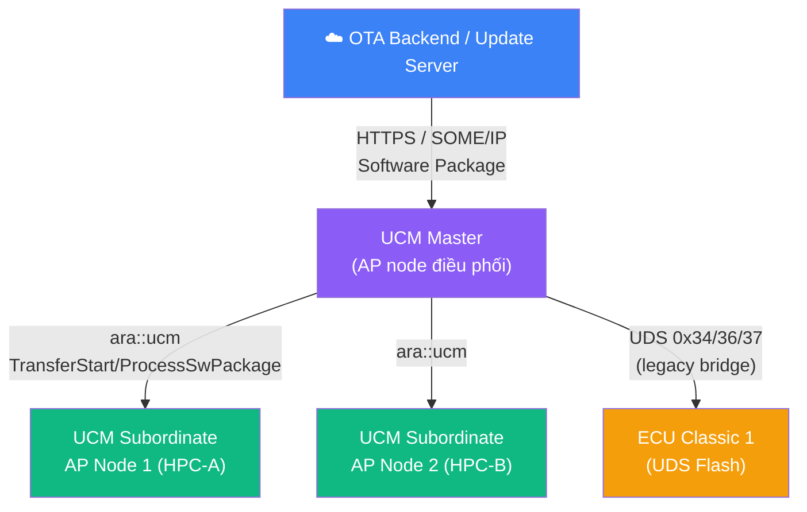
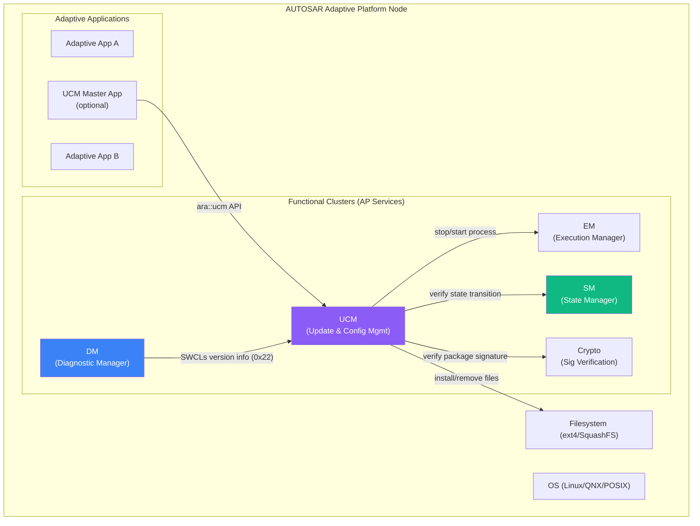

# OTA Adaptive – Phần 1: Tổng quan & Classic vs Adaptive

> **Nguồn tham chiếu chính (bám sát xuyên suốt series):**
> - [AUTOSAR AP SWS UpdateAndConfigurationManagement R25-11](https://www.autosar.org/fileadmin/standards/R25-11/AP/AUTOSAR_AP_SWS_UpdateAndConfigurationManagement.pdf) — *UCM specification*
> - [AUTOSAR AP EXP PlatformDesign R25-11](https://www.autosar.org/fileadmin/standards/R25-11/AP/AUTOSAR_AP_EXP_PlatformDesign.pdf) — Section 9: Software Update
> - **ISO 24089:2023** — Road vehicles – Software update engineering
> - **AUTOSAR_AP_RS_UCM** — Requirements on UCM

---

## 1. OTA là gì trong ngữ cảnh Automotive?

**OTA (Over-The-Air software update)** là khả năng cập nhật phần mềm ECU từ xa qua mạng — không cần xe vào xưởng, không cần cáp vật lý.

Điều này đặt ra yêu cầu mới hoàn toàn:

| Yêu cầu | Lý do |
|---|---|
| **Không gián đoạn xe** | Update chạy nền, không tắt xe |
| **Rollback an toàn** | Nếu update lỗi → phục hồi phiên bản cũ |
| **Xác thực toàn vẹn** | Chữ ký mật mã cho từng package |
| **Điều phối đa ECU** | Cập nhật đồng thời nhiều node, đảm bảo tính nhất quán |
| **Delta update** | Chỉ truyền phần thay đổi, tiết kiệm bandwidth |

---

## 2. Classic Platform làm OTA như thế nào?

Trên **AUTOSAR Classic Platform**, không có cơ chế OTA tích hợp. Quy trình update truyền thống dùng **UDS flash programming**:

```
External Tester
      │
      │ UDS 0x10 (ProgrammingSession)
      │ UDS 0x27 (SecurityAccess seed/key)
      │ UDS 0x34 (RequestDownload)
      │ UDS 0x36 × N (TransferData – từng chunk 4–8 KB)
      │ UDS 0x37 (RequestTransferExit)
      │ UDS 0x31 (RoutineControl – CheckMemory / Erase)
      │ UDS 0x11 (ECUReset)
      ▼
    ECU (CanTp → DCM → Flash Driver)
```

**Giới hạn của cách này:**

| Hạn chế | Hệ quả |
|---|---|
| Phải ở **Programming Session** | ECU dừng chức năng bình thường trong lúc flash |
| **Tester kết nối trực tiếp** | Không thể OTA từ cloud — cần cáp hoặc gateway đặc biệt |
| **Không có rollback tích hợp** | Nếu flash lỗi → ECU brick, phải dùng JTag/bootloader rescue |
| **Toàn bộ firmware** | Không hỗ trợ delta native — luôn ghi full image |
| **Không có metadata ứng dụng** | DCM không biết "ứng dụng nào" đang được nạp |
| **Single-ECU operation** | Không điều phối across ECU |

---

## 3. Tại sao Adaptive Platform cần kiến trúc khác?

AUTOSAR Adaptive Platform (AP) chạy trên **high-performance ECU** (HPC): bộ xử lý đa nhân, Linux/QNX/INTEGRITY OS, nhiều GB RAM/Flash, kết nối Ethernet Gigabit. Các ứng dụng (Adaptive Applications – AA) chạy như **Linux process**, có thể start/stop/restart độc lập tại runtime.

Điều này mở ra khả năng:
- Dừng **chỉ process cần update**, không dừng toàn bộ ECU
- Ghi file ứng dụng mới lên filesystem, swap sang version mới
- Rollback bằng cách giữ bản cũ song song
- Backend cloud gửi package qua HTTPS/SOME/IP, không cần tester cắm dây

Để chuẩn hóa cơ chế này, AUTOSAR AP định nghĩa **UCM – Update and Configuration Management**.

---

## 4. UCM là gì?

**UCM** (Update and Configuration Management) là một **Functional Cluster** trong AUTOSAR AP, đặc tả tại *AUTOSAR_AP_SWS_UCM R25-11*.

> **UCM chịu trách nhiệm quản lý toàn bộ vòng đời cập nhật phần mềm trên AP node:** nhận package, xác thực, cài đặt, kích hoạt, và rollback.

UCM không phải là UDS. UCM là **lớp phía trên** – nó có thể được kích hoạt từ:
- **OTA Backend** qua SOME/IP hoặc REST
- **UCM Master** (điều phối đa ECU)
- **Diagnostic tester** qua UDS `0x34/0x36/0x37` (khi backend dùng UDS làm transport)



---

## 5. So sánh chi tiết: Classic UDS Flash vs UCM OTA

| Tiêu chí | Classic (UDS Flash) | Adaptive (UCM OTA) |
|---|---|---|
| **Chuẩn** | ISO 14229-1 (0x34/36/37) | AUTOSAR_AP_SWS_UCM R25-11 |
| **Transport** | CanTp (CAN) | Ethernet, SOME/IP, DoIP |
| **Session** | Bắt buộc Programming Session | Chạy bình thường – background |
| **Trạng thái ECU** | Dừng toàn bộ ứng dụng | Chỉ dừng process cần cập nhật |
| **Đơn vị cập nhật** | Full firmware image | SoftwareCluster (app-level) |
| **Delta update** | Không (vendor-specific workaround) | Có (package manifest hỗ trợ) |
| **Rollback** | Không tích hợp | Có – UCM lưu bản trước, rollback tự động khi lỗi |
| **Xác thực** | CRC + custom | PKCS#7 / X.509 certificate chain |
| **Điều phối đa ECU** | Không | UCM Master điều phối đồng bộ |
| **Trigger** | Tester cắm dây | Backend cloud / scheduled |
| **API** | Không (BSW-level) | `ara::ucm` C++ |
| **Giám sát tiến độ** | Không | `GetSwProcessProgress()` |
| **Nguồn metadata** | Không có | ARXML manifest trong package |

---

## 6. Vị trí UCM trong Adaptive Platform



UCM tương tác với:
- **Execution Manager (EM)**: stop/start Adaptive Application processes cần restart
- **State Manager (SM)**: yêu cầu machine state transition (ký hiệu `kUpdating`, `kVerify`, …)
- **Crypto FC**: xác thực chữ ký PKCS#7 của package
- **Diagnostic Manager (DM)**: cung cấp thông tin phiên bản SWCL cho SID 0x22 (ReadDataByIdentifier)

---

## 7. Đơn vị cập nhật: SoftwareCluster

Khái niệm quan trọng nhất trong UCM là **SoftwareCluster (SWCL)**:

> *Theo AUTOSAR_AP_SWS_UCM §7.1: "A SoftwareCluster is the unit of deployment and update on an Adaptive Platform machine. It groups all software components, executables, and configuration that are updated together."*

```
SoftwarePackage (*.swpkg / ARXML manifest + binaries)
└── SoftwareCluster "VehicleControl_v2.1.0"
    ├── Executables/
    │   ├── adaptive_app_a    (ELF binary)
    │   └── adaptive_app_b
    ├── lib/
    │   └── libsomeip.so.2.1
    ├── etc/
    │   └── someip_config.json
    └── MANIFEST.arxml        (metadata: version, dependencies, activation type)
```

Một **SoftwarePackage** có thể chứa nhiều SoftwareCluster. Package được mã hoá và ký bằng certificate trước khi gửi từ backend.

---

## Tóm tắt

- **Classic Platform**: UDS Flash = tester điều khiển trực tiếp từng byte flash, ECU phải ở Programming Session, không có rollback, không OTA thật sự
- **Adaptive Platform**: UCM là FC chuyên biệt, chạy ngầm, quản lý SoftwareCluster-level update, hỗ trợ delta, rollback, xác thực cryptographic, và điều phối đa ECU qua UCM Master
- UCM expose API `ara::ucm` cho Adaptive Applications và nhận lệnh từ OTA Backend hoặc UCM Master

**Phần tiếp theo →** [OTA Adaptive Phần 2: UCM Components & ara::ucm API](/uds-adaptive/ota-adaptive-p2/)
