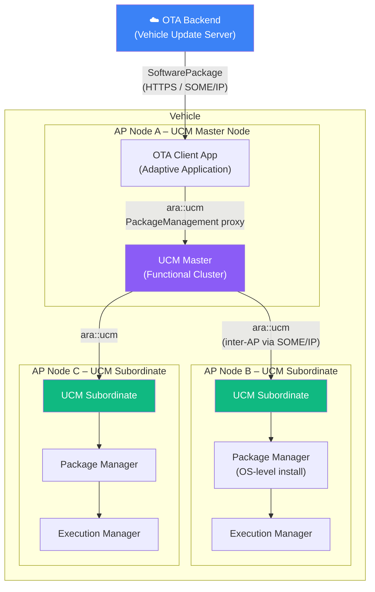
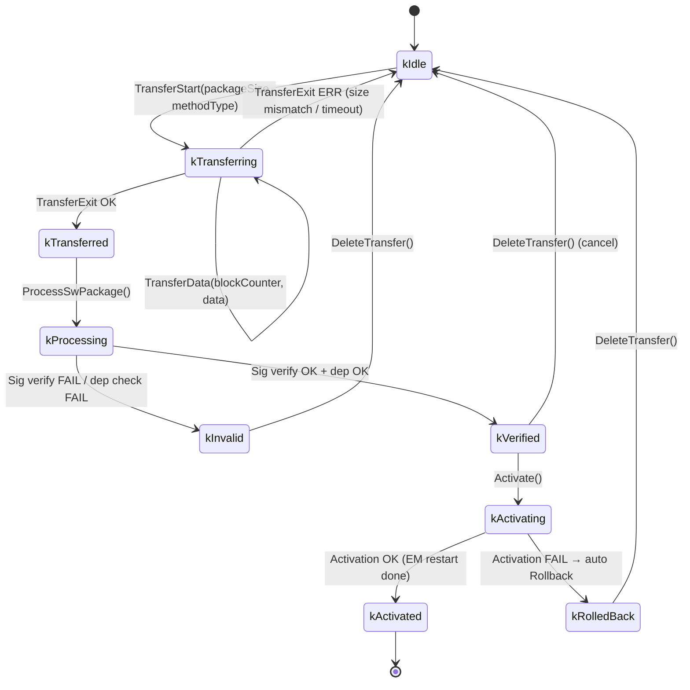

# OTA Adaptive – Phần 2: UCM Components & ara::ucm API

> **Nguồn tham chiếu:**
> - [AUTOSAR AP SWS UCM R25-11](https://www.autosar.org/fileadmin/standards/R25-11/AP/AUTOSAR_AP_SWS_UpdateAndConfigurationManagement.pdf) — §7 Architecture, §8 API Specification
> - **AUTOSAR_AP_RS_UCM** — Requirements on UCM R25-11

---

## 1. Kiến trúc UCM – Hai tầng chính

UCM trong AUTOSAR AP được chia thành hai vai trò độc lập:



### 1.1 UCM Subordinate

Chạy trên **mỗi AP node** cần được update. Đây là *core UCM* thực sự cài đặt phần mềm.

**Chức năng:**

| Chức năng | Đặc tả (AUTOSAR_AP_SWS_UCM) |
|---|---|
| Nhận Software Package | `TransferStart`, `TransferData`, `TransferExit` |
| Xác thực chữ ký | Gọi Crypto FC, kiểm tra PKCS#7 signature |
| Xử lý package | `ProcessSwPackage` – giải nén, kiểm tra dependency |
| Cài đặt / Gỡ cài | Gọi Package Manager để ghi file lên filesystem |
| Kích hoạt | `Activate` – yêu cầu SM chuyển state, EM restart process |
| Rollback | `Rollback` – khôi phục SWCL từ backup slot |
| Báo cáo tiến độ | `GetSwProcessProgress()` – 0–100% |

### 1.2 UCM Master

**Tuỳ chọn** – chỉ cần khi xe có nhiều AP node cần cập nhật phối hợp.

> *Theo AUTOSAR_AP_SWS_UCM §7.3.2: "The UCM Master orchestrates the update of one or multiple Adaptive Platform instances using Vehicle Package, ensuring dependencies and ordering between multiple UCM Subordinates."*

UCM Master nhận **Vehicle Package** từ backend (gói chứa nhiều Software Package cho nhiều node), phân tách và phân phối đến từng UCM Subordinate đúng thứ tự.

---

## 2. SoftwarePackage – Định dạng gói cập nhật

Mỗi **SoftwarePackage** là một archive tuân thủ định dạng AUTOSAR:

```
SoftwarePackage.swpkg
├── AUTOSAR_Manifest/
│   └── SoftwareClusterManifest.arxml    ← metadata bắt buộc
├── Executables/
│   ├── app_adaptive_control              ← ELF binary (target arch)
│   └── app_sensor_fusion
├── configs/
│   └── someip_config.json
├── lib/
│   └── libvehicle.so.3.0
└── SIGNATURE.p7s                        ← PKCS#7 detached signature
```

**SoftwareClusterManifest.arxml** chứa:

```xml
<!-- Ví dụ rút gọn, cấu trúc theo AUTOSAR ARXML schema -->
<AUTOSAR>
  <SOFTWARE-CLUSTER>
    <SHORT-NAME>VehicleControl</SHORT-NAME>
    <CATEGORY>APPLICATION_LAYER</CATEGORY>
    <SW-VERSION>2.1.0</SW-VERSION>
    <ACTIVATION-ACTION>
      <!-- kRestart = restart process; kMachineRestart = reboot node -->
      <VALUE>kRestart</VALUE>
    </ACTIVATION-ACTION>
    <DEPENDENCIES>
      <SOFTWARE-CLUSTER-DEPENDENCY>
        <SHORT-NAME>SensorFusion</SHORT-NAME>
        <MIN-VERSION>1.5.0</MIN-VERSION>
      </SOFTWARE-CLUSTER-DEPENDENCY>
    </DEPENDENCIES>
  </SOFTWARE-CLUSTER>
</AUTOSAR>
```

---

## 3. SoftwarePackage State Machine

Đây là state machine trung tâm của UCM, đặc tả trong **AUTOSAR_AP_SWS_UCM §8.3**:



**Giải thích các state:**

| State | Ý nghĩa |
|---|---|
| `kIdle` | Sẵn sàng nhận package mới |
| `kTransferring` | Đang nhận chunks dữ liệu từ backend/UCM Master |
| `kTransferred` | Toàn bộ bytes đã nhận, chờ xử lý |
| `kProcessing` | Đang giải nén, xác thực chữ ký, kiểm tra dependency |
| `kVerified` | Package hợp lệ, sẵn sàng activate |
| `kActivating` | Đang thực thi activation (restart process/node) |
| `kActivated` | Cài đặt thành công, SWCL mới đang chạy |
| `kRolledBack` | Activation thất bại, đã khôi phục version cũ |
| `kInvalid` | Package lỗi – chữ ký sai hoặc dependency không thoả |

---

## 4. ara::ucm – C++ API

UCM expose interface `PackageManagement` qua **ara::ucm** namespace. Adaptive Applications (thường là OTA Client App) dùng proxy này để điều khiển UCM.

> *Theo AUTOSAR_AP_SWS_UCM §8.1: "The UCM shall provide a Service Interface named `PackageManagement` that allows clients to transfer, process, activate, and rollback Software Packages."*

### 4.1 Khai báo cơ bản (ara::ucm proxy)

```cpp
#include "ara/ucm/packagemanagement_proxy.h"
#include "ara/ucm/impl_type_transferidtype.h"

namespace ucm = ara::ucm;

// Khởi tạo proxy kết nối đến UCM Subordinate
ucm::proxy::PackageManagementProxy pm_proxy(
    ara::com::InstanceIdentifier("UCM_Subordinate_0")
);
```

### 4.2 Transfer Phase – Gửi package theo chunks

```cpp
// Bước 1: Bắt đầu transfer, lấy TransferId
auto transfer_start_result = pm_proxy.TransferStart(
    package_size_bytes,
    ucm::TransferMethodType::kPush  // Backend đẩy lên UCM
).GetResult();

if (!transfer_start_result.HasValue()) {
    // Error: kInsufficientMemory, kUCMBusy, etc.
    return;
}
ucm::TransferIdType transfer_id = transfer_start_result.Value().id;

// Bước 2: Gửi từng block (mỗi block tối đa BlockSize bytes)
constexpr std::size_t kBlockSize = 65535;
std::uint8_t block_counter = 0;
for (std::size_t offset = 0; offset < total_size; offset += kBlockSize) {
    auto chunk = ReadFileChunk(offset, kBlockSize);  // đọc từ local cache
    ++block_counter;

    auto result = pm_proxy.TransferData(transfer_id, block_counter, chunk)
                          .GetResult();
    if (!result.HasValue()) {
        // Error: kBlockInconsistency, kTransferIDUnknown
        break;
    }
}

// Bước 3: Kết thúc transfer
auto exit_result = pm_proxy.TransferExit(transfer_id).GetResult();
// State → kTransferred
```

### 4.3 Process Phase – Xác thực & cài đặt

```cpp
// ProcessSwPackage là non-blocking – UCM xử lý bất đồng bộ
auto proc_result = pm_proxy.ProcessSwPackage(transfer_id).GetResult();
// State → kProcessing

// Poll tiến độ
while (true) {
    auto prog = pm_proxy.GetSwProcessProgress(transfer_id).GetResult();
    std::uint8_t percent = prog.Value().progress;  // 0–100
    std::cout << "Processing: " << (int)percent << "%\n";

    auto state = pm_proxy.GetSwPackages().GetResult();
    for (auto& pkg : state.Value()) {
        if (pkg.id == transfer_id) {
            if (pkg.state == ucm::SwPackageStateType::kVerified) break;
            if (pkg.state == ucm::SwPackageStateType::kInvalid) {
                // Thất bại – log error và dừng
                return;
            }
        }
    }
    std::this_thread::sleep_for(std::chrono::milliseconds(500));
}
// State → kVerified
```

### 4.4 Activate & Rollback

```cpp
// Activate: yêu cầu UCM kích hoạt SWCL mới
auto activate_result = pm_proxy.Activate(transfer_id).GetResult();
// State → kActivating → (async) kActivated HOẶC kRolledBack

// Subscribe event để nhận thông báo khi activation hoàn tất
pm_proxy.SwPackageActivationStatus.Subscribe(
    [](ucm::ActivationStatusType status) {
        if (status.state == ucm::SwPackageStateType::kActivated) {
            std::cout << "✓ Update activated\n";
        } else if (status.state == ucm::SwPackageStateType::kRolledBack) {
            std::cerr << "✗ Activation failed – rolled back\n";
        }
    }
);

// Manual rollback (nếu OTA Client muốn rollback thủ công)
auto rollback_result = pm_proxy.Rollback(transfer_id).GetResult();
```

### 4.5 GetSwClusterInfo – Kiểm tra phiên bản hiện tại

```cpp
// Lấy danh sách tất cả SWCL đang cài trên node
auto clusters = pm_proxy.GetSwClusterInfo().GetResult();
for (auto& cl : clusters.Value()) {
    std::cout << cl.name << " v" << cl.version
              << " [" << ToString(cl.state) << "]\n";
}
// Ví dụ output:
//   VehicleControl v2.0.1 [kPresent]
//   SensorFusion   v1.5.2 [kPresent]
```

---

## 5. Package Manager – Tầng OS

**Package Manager** là thành phần *phía dưới* UCM Subordinate, không expose qua `ara::ucm`. Đây là platform-specific layer:

```
UCM Subordinate
      │
      │ internal call (platform binding)
      ▼
Package Manager
      ├── cp / install: ghi binary/lib mới vào staging directory
      ├── symlink swap: atomic switch từ old → new filesystem path  
      ├── ldconfig: cập nhật shared library cache
      └── rollback slot: giữ bản cũ trong /opt/swcl/<name>/backup/
```

Trên Linux, activation thường dùng kỹ thuật **A/B partition** hoặc **atomic symlink swap**:

```
/opt/swcl/VehicleControl/
├── active -> v2.1.0/      ← symlink, swap atomic khi activate
├── v2.0.1/                ← backup (xoá sau khi activate thành công)
│   ├── app_adaptive_control
│   └── configs/
└── v2.1.0/                ← version mới vừa cài
    ├── app_adaptive_control
    └── configs/
```

Execution Manager restart process với path từ symlink `active/` → process mới dùng v2.1.0.

---

## Tóm tắt các thành phần

| Thành phần | Vai trò | Giao tiếp |
|---|---|---|
| **UCM Master** | Điều phối OTA campaign đa ECU | `ara::ucm` qua SOME/IP đến UCM Subordinate |
| **UCM Subordinate** | Core UCM – nhận, xác thực, cài, kích hoạt | `ara::ucm` nhận từ Master/OTA Client; gọi EM, SM, Crypto |
| **Package Manager** | OS-level file install / rollback slot | Internal (platform-specific) |
| **OTA Client App** | Adaptive App tải package từ backend xuống | `ara::ucm` gọi UCM Sub; HTTPS/SOME/IP với backend |
| **SoftwareCluster** | Đơn vị cập nhật (nhóm executables + config) | Mô tả trong ARXML manifest |
| **SoftwarePackage** | Archive gửi từ backend | `.swpkg` = ARXML + binaries + PKCS#7 sig |

**Phần trước ←** [OTA Adaptive Phần 1: Tổng quan](/ota-adaptive-p1/)  
**Phần tiếp theo →** [OTA Adaptive Phần 3: Workflow, Timing & Rollback](/ota-adaptive-p3/)
