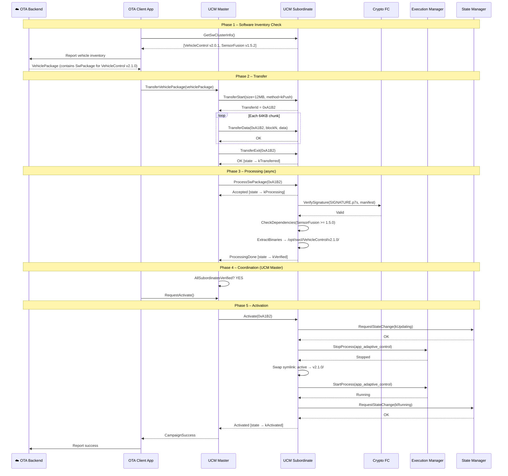
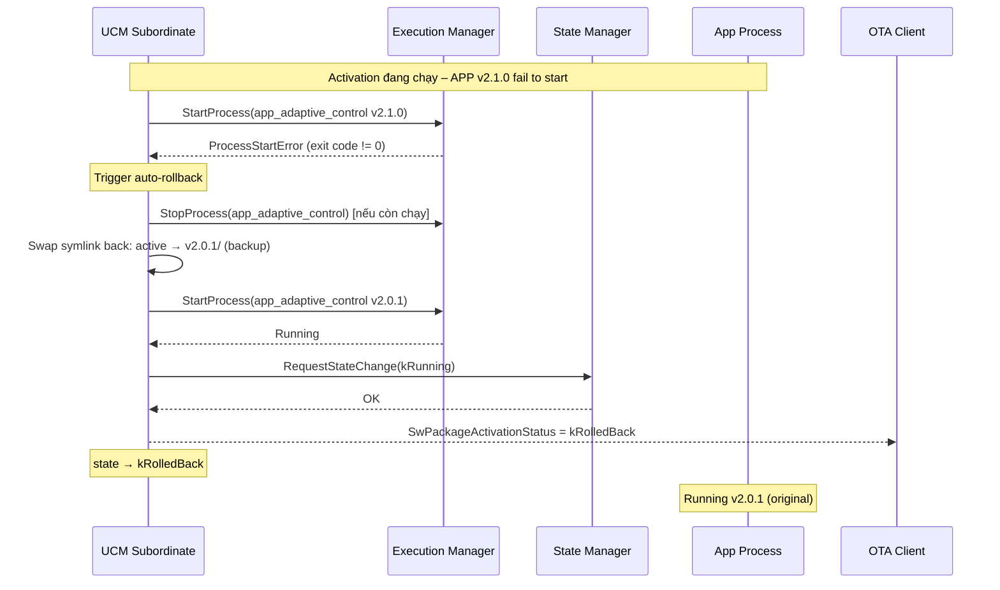
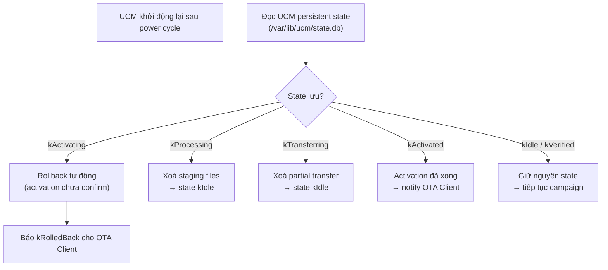
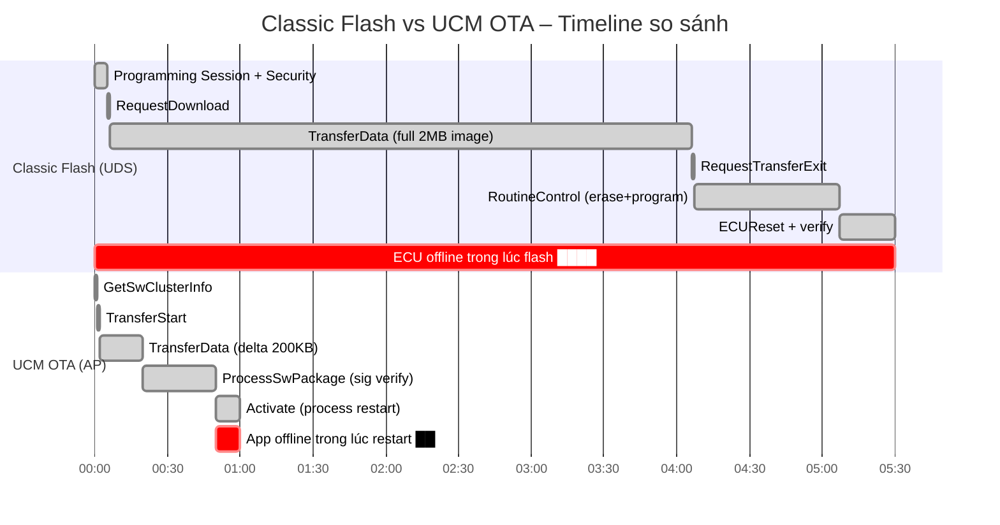

# OTA Adaptive – Phần 3: Workflow, Timing & Rollback

> **Nguồn tham chiếu:**
> - [AUTOSAR AP SWS UCM R25-11](https://www.autosar.org/fileadmin/standards/R25-11/AP/AUTOSAR_AP_SWS_UpdateAndConfigurationManagement.pdf) — §8 Behavioral Specification, §9 Error Handling
> - **ISO 24089:2023** — Road vehicles – Software update engineering, §6.3 Update Campaign

---

## 1. Tổng quan một OTA Campaign

Một **OTA Campaign** là quá trình hoàn chỉnh từ khi backend phát hiện xe cần update đến khi phần mềm mới chạy ổn định. Gồm 5 giai đoạn:

```
┌──────────┐   ┌──────────┐   ┌───────────┐   ┌──────────┐   ┌─────────┐
│  CHECK   │ → │ DOWNLOAD │ → │ TRANSFER  │ → │ PROCESS  │ → │ACTIVATE │
│(inventory│   │(backend  │   │ (UCM API) │   │(sig+dep) │   │(EM/SM)  │
│ query)   │   │→ local)  │   │           │   │          │   │         │
└──────────┘   └──────────┘   └───────────┘   └──────────┘   └─────────┘
```

---

## 2. Sequence Diagram – Full OTA Campaign



---

## 3. Timing Diagram – Chi tiết từng Phase

### 3.1 Transfer Phase Timing

```
OTA Client         UCM Subordinate
    │                    │
    │ TransferStart()    │
    │──────────────────►│ T0
    │◄─── TransferId ───│
    │                    │
    │ TransferData(1)    │
    │──────────────────►│ T0 + δ₁
    │◄──── ACK ─────────│
    │                    │
    │ TransferData(2)    │
    │──────────────────►│ T0 + δ₂
    │◄──── ACK ─────────│
    │  ... (N blocks)    │
    │                    │
    │ TransferExit()     │
    │──────────────────►│ T_end
    │◄──── OK ──────────│ state = kTransferred
    │                    │

Giới hạn timeout (theo AUTOSAR_AP_SWS_UCM §8.6):
  - TransferInterBlockTimeout  : khoảng cách tối đa giữa 2 block liên tiếp
  - TransferTimeout             : tổng thời gian cho toàn bộ transfer
  ➜ Nếu vượt quá → UCM tự chuyển state về kIdle, trả lỗi kTimeout
```

### 3.2 Processing Phase Timing

```
UCM Subordinate         Crypto FC            Package Manager
      │                     │                      │
      │── VerifySignature──►│                      │
      │                     │ (verify PKCS#7)      │
      │◄── SignatureOK ─────│ [~100ms–500ms]       │
      │                     │                      │
      │── CheckDependencies (internal) ────────────│
      │── ExtractBinaries ─────────────────────────►
      │                     │           write files │
      │◄──────────────────────────────── Done ──────
      │                     │                      │
      state → kVerified                            │

GetSwProcessProgress() trả về 0–100 trong suốt giai đoạn này.
UCM Master poll mỗi 500ms–1s cho đến khi kVerified.
```

### 3.3 Activation Phase Timing

```
UCM Subordinate    State Manager    Execution Manager    App Process
      │                 │                 │                   │
      │ RequestState    │                 │                   │
      │ (kUpdating)────►│                 │                   │
      │◄─── OK ─────────│                 │                   │
      │                 │                 │                   │
      │ StopProcess() ─────────────────►│                   │
      │                 │                 │──── SIGTERM ─────►│
      │                 │                 │◄─── Stopped ──────│
      │◄────────────────────────── Stopped│                   │
      │                 │                 │                   │
      │──── swap symlink (atomic) ──────────────────────────► filesystem
      │                 │                 │                   │
      │ StartProcess() ────────────────►│                   │
      │                 │                 │────── fork ──────►│
      │                 │                 │◄─── Running ──────│
      │◄─────────────────────────── Running                   │
      │                 │                 │                   │
      │ RequestState    │                 │                   │
      │ (kRunning) ────►│                 │                   │
      │◄─── OK ─────────│                 │                   │
      │                 │                 │                   │
      state → kActivated                                      │
                                                              │ Running v2.1.0

Thời gian điển hình:
  ▸ StopProcess đến Stopped   :  50–200 ms (graceful shutdown)
  ▸ symlink swap               :  < 1 ms (atomic rename)
  ▸ StartProcess đến Running   :  100–500 ms (app init)
  ▸ Tổng downtime của process  :  ~150–700 ms
```

---

## 4. Rollback – Cơ chế và Trigger

### 4.1 Khi nào Rollback xảy ra?

Theo AUTOSAR_AP_SWS_UCM §8.9, rollback xảy ra khi:

| Trigger | Mô tả |
|---|---|
| **Activation timeout** | EM không báo process Running trong `ActivationTimeout` |
| **Process crash on start** | App mới crash ngay sau khi start (EM báo lỗi) |
| **Health check fail** | SM health monitor phát hiện app không phản hồi sau restart |
| **Manual rollback** | OTA Client gọi `Rollback(transferId)` chủ động |
| **Power cycle during activation** | Khi restore, UCM phát hiện activation chưa hoàn thành |

### 4.2 Rollback Sequence



### 4.3 Cấu trúc Backup Slot

UCM yêu cầu Package Manager giữ **backup slot** trước khi ghi phiên bản mới:

```
/opt/swcl/VehicleControl/
├── active -> v2.1.0/          ← trỏ đến version đang chạy
├── v2.0.1/                    ← backup (xoá sau commit thành công)
│   └── app_adaptive_control
└── v2.1.0/                    ← version mới
    └── app_adaptive_control
```

Sau khi rollback thành công, `active` trỏ lại `v2.0.1/`.  
UCM chỉ xoá backup slot khi nhận lệnh `DeleteTransfer()` từ OTA Client (sau khi đã xác nhận health OK).

---

## 5. Error Cases & Xử lý

### 5.1 Bảng Error Code (ara::ucm)

| Error | Giai đoạn | Hành động khuyến nghị |
|---|---|---|
| `kInsufficientMemory` | TransferStart | Xoá package cũ, thử lại |
| `kUCMBusy` | TransferStart / Activate | Retry với backoff |
| `kBlockInconsistency` | TransferData | Restart transfer từ đầu |
| `kPackageInconsistent` | ProcessSwPackage | Package hỏng – tải lại từ backend |
| `kAuthenticationFailed` | ProcessSwPackage | Kiểm tra certificate chain |
| `kDependencyCheckFailed` | ProcessSwPackage | Cần update SWCL dependency trước |
| `kActivationFailed` | Activate | UCM tự rollback; báo lỗi lên backend |
| `kTimeout` | TransferData / Activate | Retry; nếu lặp lại → alert |

### 5.2 Power Loss Recovery

Khi mất điện giữa chừng, UCM phục hồi trạng thái từ persistent storage:



---

## 6. So sánh Workflow: Classic Flash vs UCM OTA



**Nhận xét:**
- Classic: ECU offline **toàn bộ** trong suốt quá trình (~5 phút cho 2MB)
- UCM OTA: Chỉ process cụ thể offline ~**10 giây** (delta 200KB)
- Classic: Cần tester cắm cáp; UCM: chạy hoàn toàn qua WiFi/4G

---

## 7. Checklist triển khai UCM

Theo ISO 24089:2023 và AUTOSAR_AP_SWS_UCM, một implementation đầy đủ cần:

- [ ] **Package signing**: Backend ký PKCS#7, UCM verify bằng root CA trên xe
- [ ] **Backup slot**: Giữ bản cũ trước khi ghi mới, xoá sau khi xác nhận
- [ ] **Persistent state**: UCM lưu state vào non-volatile storage để recover sau power loss
- [ ] **Health check**: Sau activation, SM monitor app trong `HealthCheckTimeout` trước khi commit
- [ ] **Dependency ordering**: UCM Master cài SWCL dependency theo đúng thứ tự
- [ ] **Partial update**: Nếu nhiều SWCL, rollback tất cả khi một cái fail (all-or-nothing)
- [ ] **OTA in motion policy**: Kiểm tra điều kiện xe (speed, ignition) trước khi activate

---

## Tóm tắt Series OTA Adaptive

| Phần | Nội dung |
|---|---|
| [Phần 1 – Tổng quan](/uds-adaptive/ota-adaptive-p1/) | Tại sao OTA khác, Classic vs Adaptive, UCM vị trí trong AP |
| [Phần 2 – Components & API](/uds-adaptive/ota-adaptive-p2/) | UCM Master/Subordinate, SoftwarePackage format, ara::ucm C++ API |
| **Phần 3 – Workflow & Rollback** | Full campaign sequence, timing diagram, rollback, error handling |

**Phần trước ←** [OTA Adaptive Phần 2: Components & API](/uds-adaptive/ota-adaptive-p2/)
