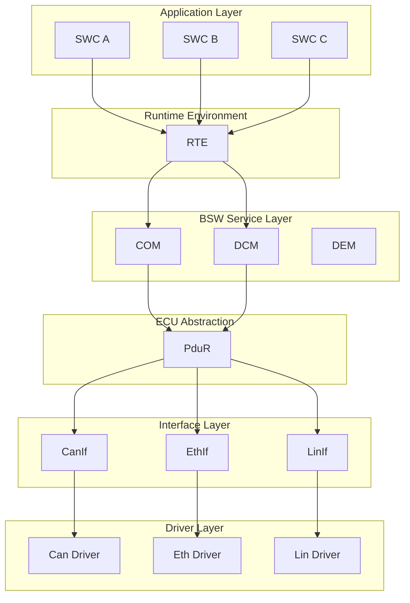
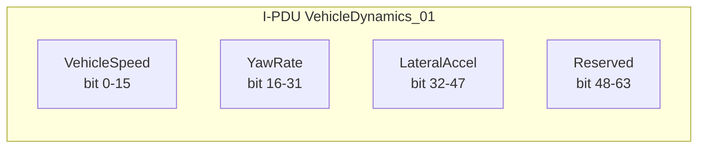
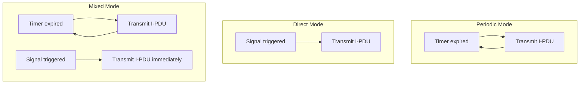
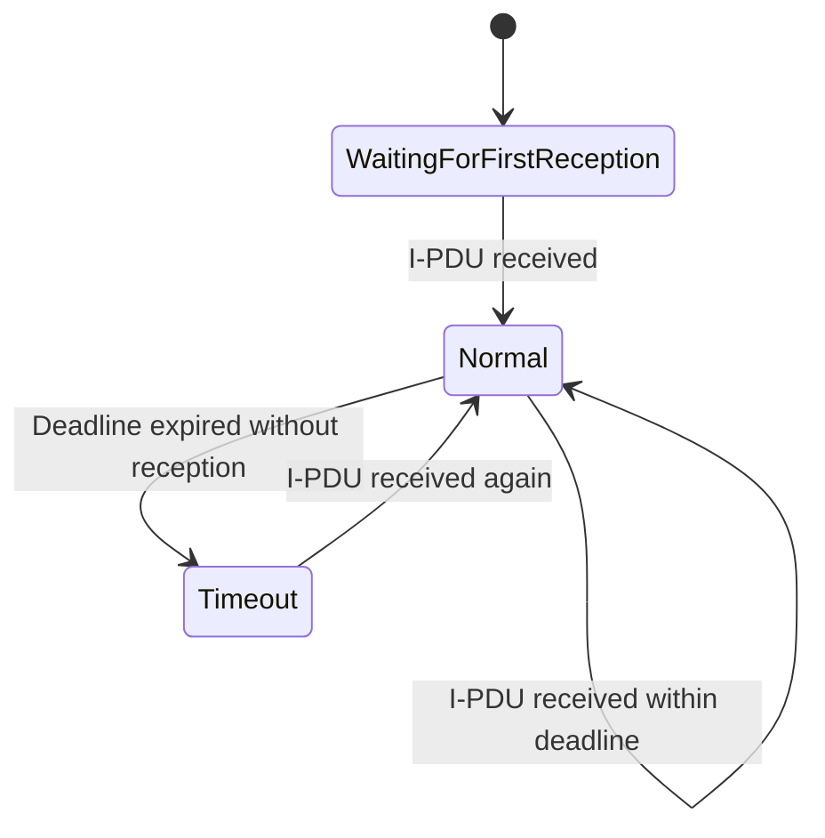
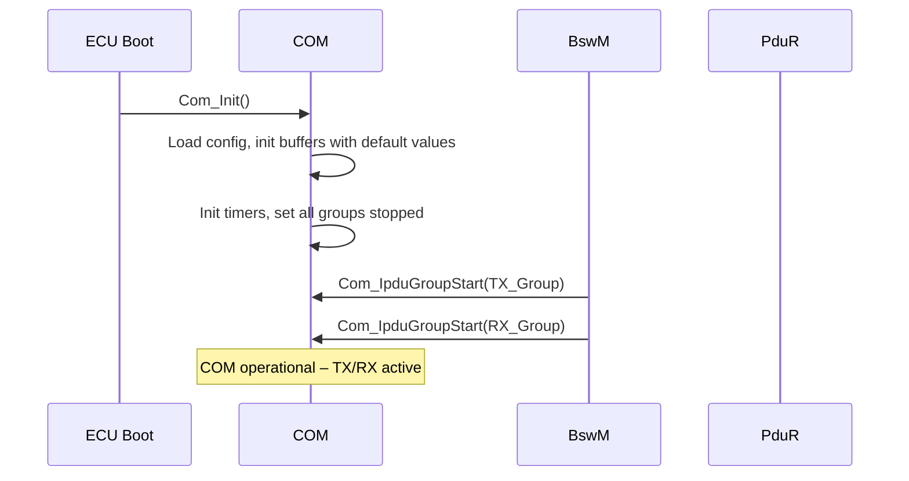
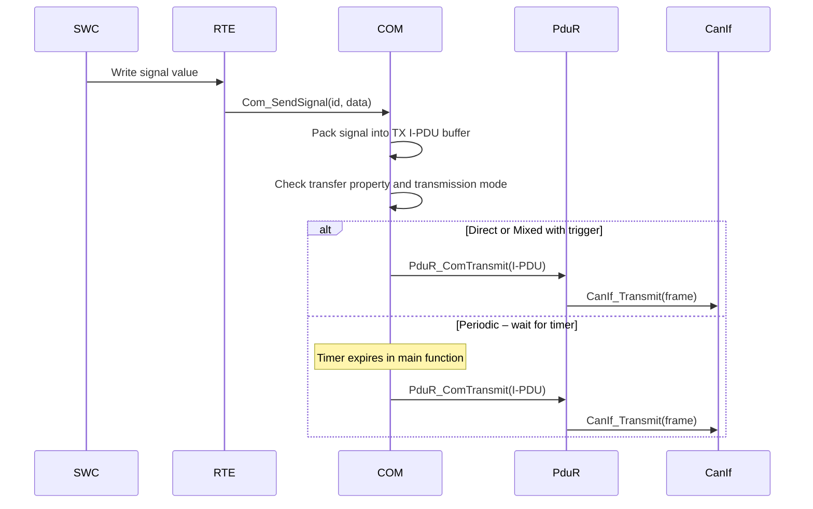
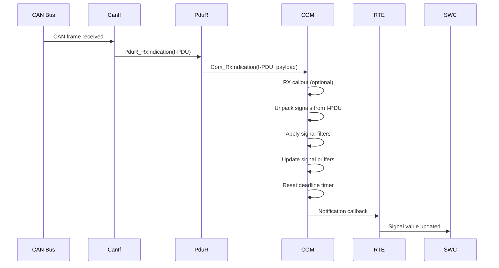
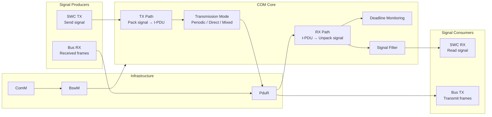

---
layout: default
category: uds
title: "COM - AUTOSAR Communication Module"
nav_exclude: true
module: true
tags: [autosar, com, communication, signal, pdu]
description: "Tài liệu kỹ thuật về COM – module truyền nhận signal ứng dụng trong AUTOSAR Classic."
permalink: /uds/com/
---

# COM - AUTOSAR Communication Module

> Tài liệu này trình bày chi tiết module **COM (Communication)** trong AUTOSAR Classic Platform. COM là module thuộc BSW Service Layer chịu trách nhiệm truyền nhận **signal** ứng dụng, đóng gói/tách signal vào/ra **I-PDU**, quản lý transmission mode và cung cấp notification cho SWC.

## 1. Tổng quan module

**COM** là module trung tâm của hệ thống truyền thông ứng dụng trong AUTOSAR Classic. Nó cung cấp cơ chế truyền nhận dữ liệu dạng **signal-based** giữa các SWC (Software Components) và xe bên ngoài thông qua bus communication.

Nếu DCM là cổng giao tiếp cho **diagnostic traffic**, thì COM là cổng giao tiếp cho **application traffic** – tín hiệu cảm biến, trạng thái actuator, lệnh điều khiển, dữ liệu hiển thị, tín hiệu gateway.

Vai trò cốt lõi của COM:

1. **Đóng gói signal** vào I-PDU (Interaction Layer PDU) để truyền đi.
2. **Tách signal** từ I-PDU nhận được để cung cấp cho SWC.
3. **Quản lý chế độ truyền** (periodic, direct, mixed, none).
4. **Lọc và xác nhận** dữ liệu nhận theo cấu hình.
5. **Thông báo** cho SWC khi có dữ liệu mới hoặc timeout.
6. **Đệm** signal giữa các chu kỳ task, đảm bảo SWC luôn có giá trị hợp lệ.

### 1.1 COM không làm gì

1. COM không truyền frame trực tiếp trên bus – việc đó thuộc CanIf, EthIf, LinIf.
2. COM không xử lý phân mảnh transport layer – việc đó thuộc CanTp hoặc DoIP.
3. COM không xử lý giao thức chẩn đoán UDS – việc đó thuộc DCM.
4. COM không routing PDU giữa các layer – việc đó thuộc PduR.

## 2. Vị trí của COM trong AUTOSAR Communication Stack

COM nằm ở **BSW Service Layer**, ngay dưới RTE và ngay trên PduR.

Vị trí kiến trúc:

| Thành phần | Vai trò |
|---|---|
| SWC | Sản xuất/tiêu thụ signal ứng dụng |
| RTE | Cầu nối giữa SWC và BSW, cung cấp port interface |
| COM | Đóng gói/tách signal ↔ I-PDU, quản lý transmission |
| PduR | Routing I-PDU giữa COM và interface layer |
| CanIf / EthIf | Giao tiếp bus vật lý |

## 3. Mục tiêu chức năng của COM

1. **Trừu tượng hóa bus** – SWC không cần biết signal nằm trên CAN, Ethernet hay LIN.
2. **Chuẩn hóa signal interface** – cung cấp API thống nhất đọc/ghi signal.
3. **Quản lý timing truyền** – periodic, on-change, mixed, none.
4. **Bảo vệ tính nhất quán** – signal group đảm bảo atomicity.
5. **Phát hiện timeout** – báo SWC khi signal không được cập nhật đúng hạn.
6. **Giảm bus load** – transmission filter giúp tránh truyền dữ liệu không thay đổi.

## 4. Các khái niệm cốt lõi trong COM

### 4.1 Signal

**Signal** là đơn vị dữ liệu nhỏ nhất mà SWC giao tiếp qua COM.

Ví dụ signal:

1. Tốc độ xe (VehicleSpeed) – 16 bit, unit km/h.
2. Trạng thái đèn pha (HeadlampState) – 2 bit, enum.
3. Nhiệt độ nước làm mát (CoolantTemp) – 8 bit, offset -40°C.
4. Yêu cầu mô-men (TorqueRequest) – 16 bit, signed.

Thuộc tính signal:

| Thuộc tính | Mô tả |
|---|---|
| Signal ID | Định danh nội bộ |
| Bit position | Vị trí bit trong I-PDU |
| Bit length | Số bit chiếm trong I-PDU |
| Byte order | Big-endian (Motorola) hoặc Little-endian (Intel) |
| Init value | Giá trị khởi tạo trước khi có dữ liệu thực |
| Transfer property | PENDING, TRIGGERED, TRIGGERED_ON_CHANGE, v.v. |

### 4.2 Signal Group

**Signal group** là tập hợp nhiều signal liên quan cần được đọc/ghi **nguyên tử** (atomically) để đảm bảo tính nhất quán.

Ví dụ: tọa độ GPS gồm signal latitude + longitude + altitude. Nếu SWC đọc latitude mới nhưng longitude cũ, dữ liệu mất ý nghĩa.

Cơ chế:

1. SWC ghi tất cả signal vào shadow buffer.
2. Gọi API `Com_SendSignalGroup` để commit nguyên khối vào I-PDU.
3. Khi nhận, SWC gọi `Com_ReceiveSignalGroup` để lấy snapshot nhất quán.

### 4.3 I-PDU (Interaction Layer PDU)

**I-PDU** là đơn vị dữ liệu mà COM trao đổi với PduR. Một I-PDU chứa một hoặc nhiều signal.

Ví dụ: I-PDU `VehicleDynamics_01` chứa signal VehicleSpeed, YawRate, LateralAccel.

Thuộc tính I-PDU:

| Thuộc tính | Mô tả |
|---|---|
| PDU ID | Định danh nội bộ |
| Direction | TX hoặc RX |
| Length | Chiều dài byte |
| Transmission mode | Periodic, direct, mixed, none |
| Timeout monitoring | Deadline cho RX I-PDU |

### 4.4 Transfer Property

Mỗi signal có **transfer property** quyết định khi nào I-PDU chứa nó được kích hoạt truyền:

| Property | Hành vi |
|---|---|
| `PENDING` | Signal được cập nhật vào I-PDU nhưng không trigger truyền |
| `TRIGGERED` | Mỗi lần SWC ghi giá trị → trigger truyền I-PDU |
| `TRIGGERED_ON_CHANGE` | Chỉ trigger khi giá trị khác giá trị trước đó |
| `TRIGGERED_ON_CHANGE_WITHOUT_REPETITION` | Như trên nhưng không lặp lại |
| `TRIGGERED_WITHOUT_REPETITION` | Trigger mỗi lần ghi, không repetition |

### 4.5 Transmission Mode

I-PDU TX có 4 chế độ truyền chính:

#### 4.5.1 Periodic (Cyclic)

I-PDU được truyền theo chu kỳ cố định, bất kể signal có thay đổi hay không.

Ví dụ: VehicleSpeed truyền mỗi 20ms.

#### 4.5.2 Direct (Event-driven)

I-PDU chỉ được truyền khi có signal trigger. Nếu không có trigger, không truyền.

Ví dụ: Gear shift request chỉ truyền khi người lái chuyển số.

#### 4.5.3 Mixed

Kết hợp periodic + direct. I-PDU truyền theo chu kỳ, VÀ truyền ngay khi có signal trigger.

Ví dụ: BrakeStatus truyền mỗi 50ms, nhưng cũng truyền ngay khi trạng thái phanh thay đổi.

#### 4.5.4 None

I-PDU không tự truyền. Chỉ truyền khi có trigger đặc biệt từ API.

### 4.6 Reception và Notification

Khi COM nhận I-PDU từ PduR:

1. COM tách signal từ I-PDU payload theo cấu hình bit position/length.
2. COM cập nhật giá trị signal vào buffer nội bộ.
3. COM kiểm tra notification filter (nếu có).
4. COM gọi notification callback cho SWC nếu được cấu hình.

### 4.7 Timeout Monitoring (Deadline Monitoring)

COM có thể giám sát **deadline** cho RX I-PDU:

1. Nếu I-PDU không được nhận trong thời gian cấu hình → COM phát **timeout notification**.
2. SWC có thể phản ứng: dùng giá trị thay thế, chuyển trạng thái fallback.
3. Khi I-PDU nhận lại → COM phát **reception notification** bình thường.

### 4.8 I-PDU Callout

COM hỗ trợ **callout function** được gọi tại các thời điểm:

1. **TX callout**: trước khi I-PDU được gửi xuống PduR. Cho phép application can thiệp hoặc block transmission.
2. **RX callout**: khi I-PDU nhận được, trước khi signal được unpack. Cho phép kiểm tra, lọc hoặc transform.

### 4.9 Signal Filtering

COM có thể áp dụng **filter** cho signal nhận:

| Filter | Hành vi |
|---|---|
| ALWAYS | Luôn cập nhật |
| NEVER | Không bao giờ cập nhật (block signal) |
| MASKED_NEW_DIFFERS_MASKED_OLD | Chỉ cập nhật nếu giá trị mới khác giá trị cũ (sau mask) |
| MASKED_NEW_EQUALS_X | Chỉ cập nhật nếu giá trị mới bằng X |
| MASKED_NEW_DIFFERS_X | Chỉ cập nhật nếu giá trị mới khác X |
| NEW_IS_WITHIN | Chỉ cập nhật nếu giá trị trong khoảng min-max |
| NEW_IS_OUTSIDE | Chỉ cập nhật nếu giá trị ngoài khoảng min-max |
| ONE_EVERY_N | Cập nhật 1 trong N lần nhận |

### 4.10 I-PDU Group

I-PDU có thể được gom thành **group** để bật/tắt đồng loạt:

1. `Com_IpduGroupStart` – bật group, cho phép TX/RX các I-PDU trong group.
2. `Com_IpduGroupStop` – tắt group, dừng TX/RX.

Ý nghĩa thực tế:

1. Khi communication bị tắt (ví dụ `0x28 CommunicationControl`), tắt I-PDU group tương ứng.
2. Khi ECU ở sleep mode, tắt toàn bộ TX group.
3. Khi bus mới active, bật group từng bước theo policy.

## 5. Functional Description của COM

### 5.1 Khởi tạo COM

Khi ECU khởi động:

1. COM nạp cấu hình signal, I-PDU, transmission mode, filter, deadline.
2. Khởi tạo tất cả signal buffer với init value.
3. Khởi tạo timer cho periodic transmission và deadline monitoring.
4. Đặt tất cả I-PDU group ở trạng thái stopped.
5. Chờ lệnh start từ EcuM hoặc BswM.

### 5.2 Luồng truyền signal (TX path)

Khi SWC muốn truyền signal ra bus:

1. SWC gọi `Com_SendSignal(SignalId, data)` qua RTE.
2. COM đặt giá trị signal vào TX I-PDU buffer tại đúng bit position.
3. COM kiểm tra transfer property:
   - Nếu `TRIGGERED` hoặc `TRIGGERED_ON_CHANGE` → đánh dấu I-PDU cần truyền.
   - Nếu `PENDING` → chỉ cập nhật buffer, không trigger.
4. Trong main function cycle (hoặc ngay lập tức tùy mode):
   - COM kiểm tra transmission mode.
   - Nếu periodic: gửi I-PDU khi timer hết.
   - Nếu direct: gửi ngay khi có trigger.
   - Nếu mixed: gửi ngay khi trigger, và gửi theo chu kỳ nếu không có trigger mới.
5. COM gọi PduR (`PduR_ComTransmit`) để gửi I-PDU.
6. PduR chuyển I-PDU xuống CanIf/EthIf.
7. Interface driver truyền frame lên bus.

### 5.3 Luồng nhận signal (RX path)

Khi có message đến từ bus:

1. CanIf/EthIf nhận frame từ bus.
2. PduR routing I-PDU lên COM (`Com_RxIndication`).
3. COM nhận I-PDU payload.
4. COM gọi RX callout nếu có.
5. COM tách signal từ payload theo bit position/length/byte order.
6. COM áp dụng filter cho từng signal.
7. COM cập nhật signal buffer nội bộ.
8. COM reset deadline timer cho I-PDU này.
9. COM gọi notification callback cho SWC nếu cấu hình.
10. SWC đọc giá trị signal qua RTE (`Com_ReceiveSignal`).

### 5.4 Repetition mechanism

Khi I-PDU được trigger truyền ở direct/mixed mode, COM có thể cấu hình **repetition**:

1. Truyền I-PDU lần đầu ngay khi trigger.
2. Repeat thêm N lần với khoảng cách `ComTxIPduRepetitionPeriod`.
3. Sau N lần repeat, quay về periodic cycle bình thường (mixed mode) hoặc dừng (direct mode).

Mục đích:

1. Tăng độ tin cậy cho message quan trọng.
2. Đảm bảo receiver nhận được khi bus có lỗi ngắn hạn.

### 5.5 Minimum Delay Timer (MDT)

COM có thể cấu hình **Minimum Delay Time** cho TX I-PDU:

1. Sau khi truyền một I-PDU, COM phải chờ ít nhất MDT trước khi truyền lại cùng I-PDU.
2. Tránh flood bus khi signal thay đổi nhanh.
3. Đặc biệt quan trọng với triggered signal có tần số thay đổi cao.

### 5.6 Main function và scheduling

COM có `Com_MainFunctionTx` và `Com_MainFunctionRx` được gọi theo chu kỳ:

1. **Com_MainFunctionTx**: kiểm tra timer periodic, xử lý pending transmissions, quản lý repetition.
2. **Com_MainFunctionRx**: kiểm tra deadline monitoring, phát timeout notification.

Chu kỳ gọi main function ảnh hưởng trực tiếp:

1. Độ phân giải timing của periodic transmission.
2. Độ chính xác của deadline monitoring.
3. Latency giữa signal trigger và actual transmission.

### 5.7 Update Bit

COM hỗ trợ **update bit** cho signal:

1. Khi COM nhận I-PDU mới, kiểm tra update bit tương ứng với mỗi signal.
2. Nếu update bit = 1: signal mới, cập nhật buffer.
3. Nếu update bit = 0: signal không mới, giữ giá trị cũ.

Mục đích: phân biệt signal được cập nhật thực sự với signal chỉ giữ giá trị cũ trong I-PDU.

## 6. Luồng hoạt động điển hình

### 6.1 Luồng truyền tốc độ xe (periodic)

1. Sensor SWC đọc tốc độ xe mỗi 10ms.
2. SWC ghi signal VehicleSpeed qua RTE → `Com_SendSignal`.
3. COM cập nhật VehicleSpeed trong TX I-PDU buffer.
4. VehicleSpeed có transfer property `PENDING` → không trigger truyền.
5. I-PDU `VehicleDynamics_01` có transmission mode periodic = 20ms.
6. Mỗi 20ms, `Com_MainFunctionTx` truyền I-PDU.
7. PduR → CanIf → CAN bus.

### 6.2 Luồng nhận yêu cầu đèn xi-nhan (direct, notification)

1. ECU A gửi turn signal request trên bus.
2. CanIf nhận frame → PduR → `Com_RxIndication`.
3. COM tách signal TurnSignalReq từ I-PDU.
4. COM gọi notification callback.
5. SWC nhận notification, đọc signal qua `Com_ReceiveSignal`.
6. SWC điều khiển relay xi-nhan.

### 6.3 Luồng timeout khi mất liên lạc

1. Signal EngineRPM từ ECU động cơ bình thường truyền mỗi 20ms.
2. COM cấu hình deadline = 100ms cho I-PDU chứa EngineRPM.
3. ECU động cơ mất kết nối (dây bus đứt, ECU tắt).
4. Sau 100ms không nhận, `Com_MainFunctionRx` phát hiện timeout.
5. COM gọi timeout notification callback.
6. SWC nhận timeout → chuyển sang fallback mode (dùng giá trị thay thế hoặc limp-home).

## 7. Module Dependencies của COM

### 7.1 Ma trận dependency

| Module | Mức độ | Hướng | Mô tả |
|---|---|---|---|
| RTE / SWC | Rất cao | SWC ↔ COM | SWC đọc/ghi signal, nhận notification |
| PduR | Rất cao | COM ↔ PduR | Routing I-PDU TX/RX |
| ComM | Cao | ComM → COM | Quản lý I-PDU group start/stop theo communication state |
| BswM | Cao | BswM → COM | Có thể điều khiển I-PDU group theo mode |
| DCM | Gián tiếp | DCM → COM | `CommunicationControl` (0x28) ảnh hưởng I-PDU group |
| SchM / OS | Cao | Hạ tầng | Scheduling main function, exclusive area |
| DET | Trung bình | COM → DET | Báo lỗi development |

### 7.2 Dependency với PduR

PduR là đối tác chính của COM ở tầng dưới:

1. COM gọi `PduR_ComTransmit` để gửi I-PDU.
2. PduR gọi `Com_RxIndication` khi nhận I-PDU cho COM.
3. PduR gọi `Com_TxConfirmation` khi truyền thành công.
4. PduR routing giúp COM không cần biết I-PDU đi qua CAN, Ethernet hay LIN.

### 7.3 Dependency với ComM

ComM (Communication Manager) quản lý trạng thái communication:

1. Khi ComM cho phép communication → BswM start I-PDU group tương ứng.
2. Khi ComM tắt communication → BswM stop I-PDU group.
3. COM phải tuân thủ – không truyền khi group đã stopped.

### 7.4 Dependency với DCM (gián tiếp)

Khi tester gửi `0x28 CommunicationControl`:

1. DCM xử lý service.
2. DCM thông báo BswM/ComM.
3. BswM/ComM stop/start I-PDU group tương ứng trong COM.
4. COM ngừng/tiếp tục truyền nhận signal ứng dụng.

## 8. Sơ đồ phụ thuộc chức năng

## 9. Các điểm cấu hình quan trọng

| Nhóm cấu hình | Ảnh hưởng |
|---|---|
| Signal mapping (bit pos, length, byte order) | Quyết định signal có pack/unpack đúng không |
| Transmission mode (periodic interval) | Quyết định tần suất signal xuất hiện trên bus |
| Transfer property | Quyết định khi nào I-PDU được trigger truyền |
| Deadline monitoring timer | Quyết định bao lâu phát timeout cho RX signal |
| Signal filter config | Quyết định signal nào được cập nhật, điều kiện gì |
| I-PDU group assignment | Quyết định communication nào bật/tắt cùng nhau |
| Repetition count và period | Quyết định mức độ tin cậy cho direct message |
| Init value | Giá trị signal trước khi có dữ liệu thực |
| MDT (Minimum Delay Timer) | Giới hạn tần suất truyền tối đa cho một I-PDU |
| Update bit config | Phân biệt signal mới cập nhật và signal giữ cũ |

Sai sót phổ biến:

1. Signal byte order sai dẫn đến giá trị bị hoán đổi byte.
2. Bit position sai làm signal chồng lấn.
3. Deadline quá ngắn gây false timeout trên bus load cao.
4. Transfer property sai: TRIGGERED_ON_CHANGE cho signal thay đổi liên tục → tốn bus.
5. I-PDU group không đúng → signal vẫn truyền khi communication đã bị tắt.

## 10. COM làm gì và không làm gì

### 10.1 COM làm gì

1. Đóng gói signal vào I-PDU và tách signal từ I-PDU.
2. Quản lý chế độ truyền (periodic, direct, mixed).
3. Giám sát deadline và phát timeout notification.
4. Cung cấp signal buffer và notification cho SWC.
5. Áp dụng filter cho signal nhận.
6. Quản lý I-PDU group start/stop.

### 10.2 COM không làm gì

1. Không truyền frame trực tiếp trên bus.
2. Không routing PDU giữa các layer (PduR làm việc này).
3. Không xử lý phân mảnh transport (CanTp / DoIP).
4. Không xử lý giao thức chẩn đoán (DCM).
5. Không quyết định khi nào bật/tắt communication (ComM/BswM quyết định).

## 11. Góc nhìn tích hợp hệ thống

Khi tích hợp COM:

1. **Đảm bảo database nhất quán** – signal mapping trong COM phải khớp với CAN database (DBC/ARXML).
2. **Tune transmission mode** – periodic quá nhanh gây bus load cao, quá chậm gây latency.
3. **Cấu hình deadline hợp lý** – tính cả bus load, jitter và worst-case delay.
4. **Kiểm tra signal group** – signal liên quan cần được group để đảm bảo consistency.
5. **Validate với I-PDU group** – đảm bảo communication control từ tester tắt đúng group.
6. **Test timeout handling** – SWC phải có fallback strategy khi signal bị timeout.

## 12. Kết luận

COM là **cầu nối signal** giữa thế giới ứng dụng (SWC) và thế giới bus (CAN/Ethernet/LIN). Giá trị của COM nằm ở:

1. **Trừu tượng hóa bus** – SWC không cần biết bus vật lý.
2. **Chuẩn hóa timing** – periodic/direct/mixed transmission mode.
3. **Signal safety** – deadline monitoring, filter, signal group, init value.
4. **Điều phối communication** – I-PDU group start/stop theo mode hệ thống.

Nếu DCM là cửa cho diagnostic traffic, thì **COM là cửa cho application traffic** – hàng trăm signal cảm biến, actuator, trạng thái được đóng gói, truyền nhận và giám sát mỗi giây.

## 13. Ghi chú và nguồn tham khảo

Tài liệu này tổng hợp từ các nguồn công khai:

1. AUTOSAR Classic Platform COM SWS overview (public).
2. Vector Knowledge Base – COM module fundamentals.
3. DeepWiki openAUTOSAR – Communication module.
4. Các tài liệu public về AUTOSAR communication stack architecture.

Nội dung được viết lại theo cách giải thích thực dụng, phù hợp mục đích học tập.
