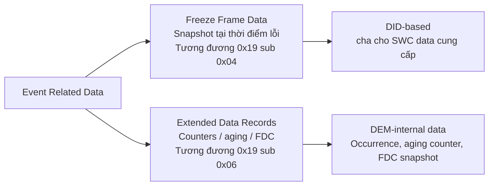
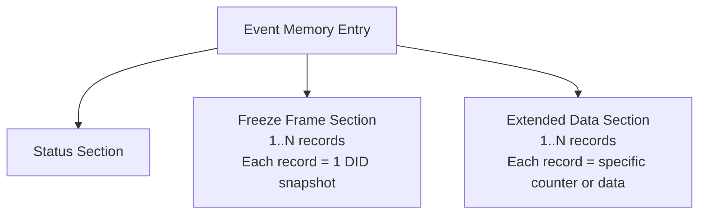
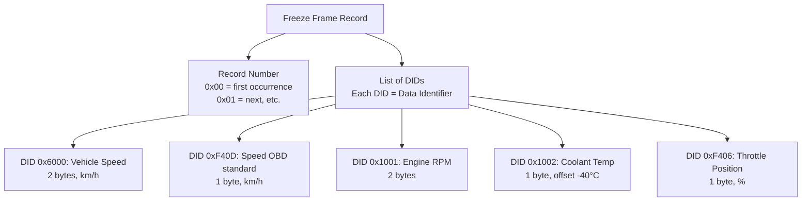
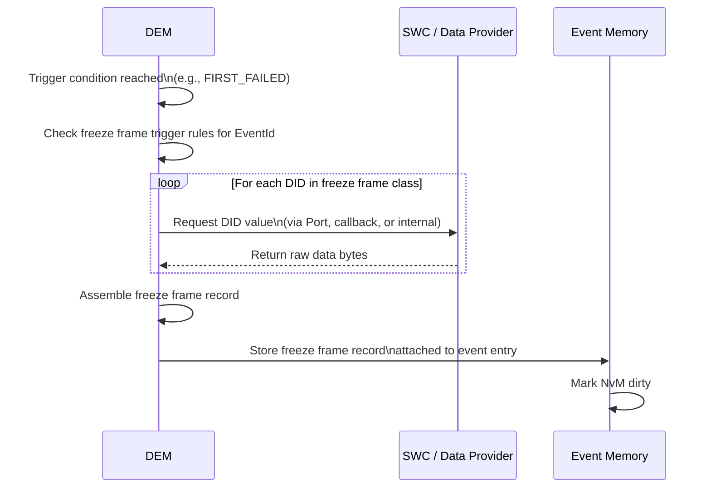
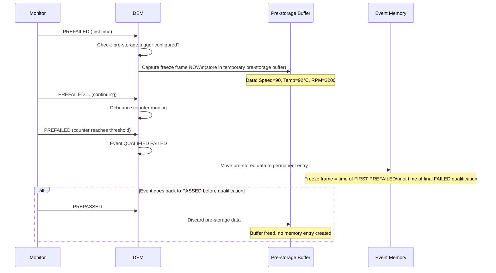
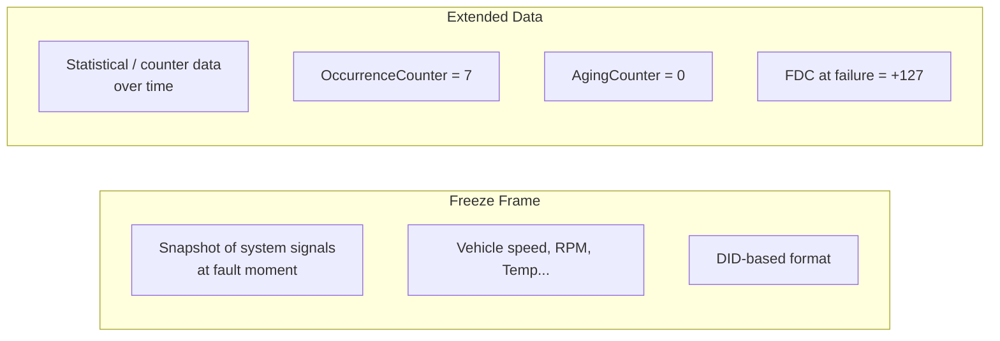
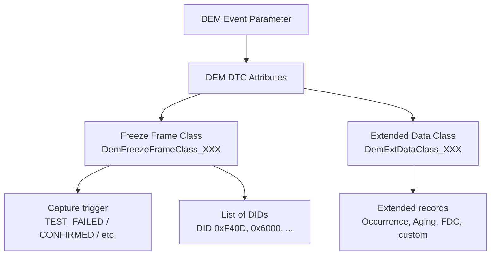
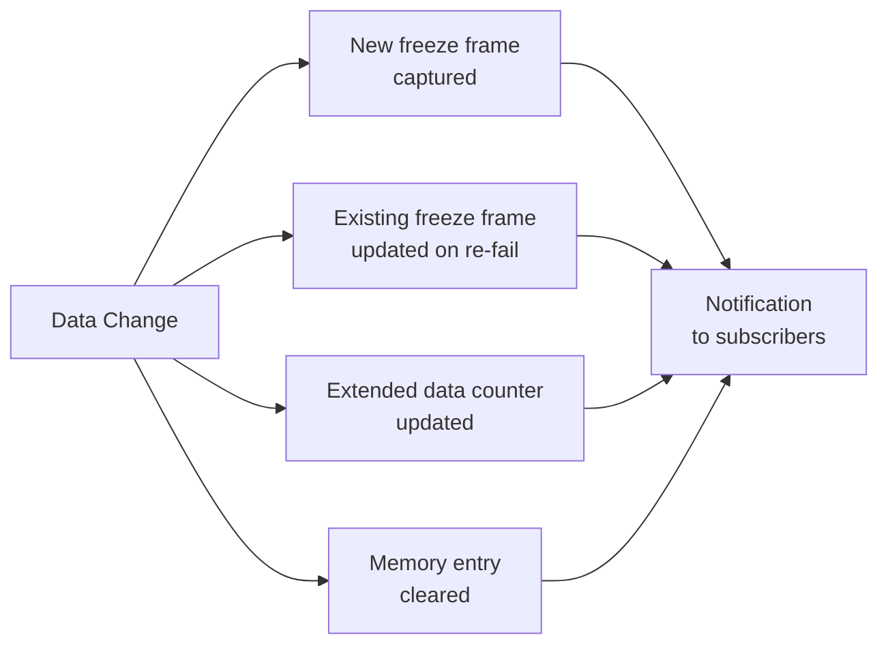
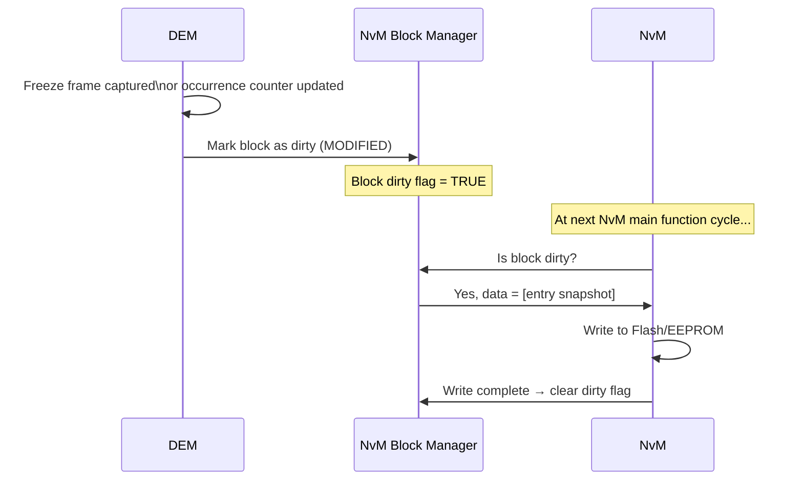
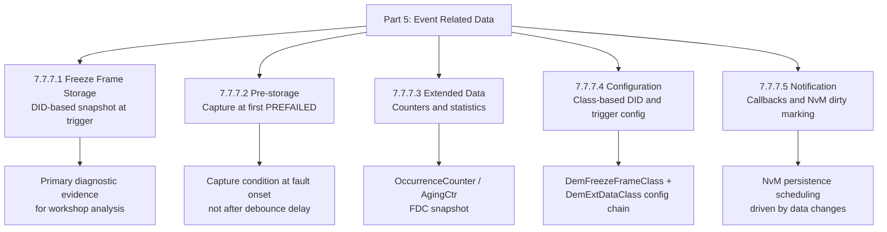

---
layout: default
category: uds
title: "DEM - Event Memory Part 5: Event Related Data"
nav_exclude: true
module: true
tags: [autosar, dem, freeze-frame, extended-data, snapshot, data-capture, did]
description: "DEM Event Memory phần 5 – Dữ liệu liên quan event: Freeze Frame, Pre-storage, Extended Data và notification khi dữ liệu thay đổi."
permalink: /uds/dem-event-memory-p5/
---

# DEM – Event Memory (Part 5): Event Related Data

> Tài liệu này mô tả chi tiết phần **7.7.7 Event Related Data** – cơ chế DEM chụp, lưu và cung cấp dữ liệu liên quan đến thời điểm lỗi xảy ra. Đây là lớp "bằng chứng chẩn đoán" quan trọng nhất giúp kỹ sư workshop tái hiện điều kiện xảy ra lỗi.

---

## 7.7.7 Event Related Data

Khi một event đạt trigger condition, DEM không chỉ ghi mã lỗi. DEM còn có thể **chụp bức ảnh môi trường hệ thống** tại thời điểm đó – bao gồm tốc độ xe, nhiệt độ, điện áp, và hàng chục thông số khác – và lưu chúng cùng với event memory entry.

**Hai loại event related data chính**:



**Vị trí dữ liệu trong event memory entry**:



**Liên tưởng**:

> Freeze Frame giống như ảnh chụp màn hình dashboard xe lúc lỗi xảy ra: tốc độ 90km/h, nhiệt độ 105°C, RPM 3200, điện áp 13.8V. Extended Data giống như số liệu thống kê lịch sử: lỗi xuất hiện 7 lần, aging counter = 3, FDC khi lỗi = +127.

---

## 7.7.7.1 Storage of Freeze Frame Data

**Freeze Frame** (hay OBD snapshot) là tập hợp dữ liệu hệ thống được chụp tại một thời điểm cụ thể khi event đạt trigger condition.

**Cấu trúc Freeze Frame**:



**Trigger conditions cho freeze frame capture**:

| Trigger | Khi nào chụp | Ví dụ use case |
|---|---|---|
| `DEM_TRIGGER_ON_TEST_FAILED` | Ngay khi event lần đầu FAILED | Chụp điều kiện first occurrence |
| `DEM_TRIGGER_ON_PENDING` | Khi PDTC được set | OBD: chụp khi pending |
| `DEM_TRIGGER_ON_CONFIRMED` | Khi CDTC được set | Chụp lúc DTC confirmed |
| `DEM_TRIGGER_ON_PASSED` | Khi event PASSED | Capture healing context |
| `DEM_TRIGGER_ON_MIRROR` | Khi mirror memory được cập nhật | Mirror memory scenarios |

**Luồng capture freeze frame**:



**Cách data provider cung cấp dữ liệu**:

```c
/* Ví dụ: SWC cung cấp vehicle speed cho DEM freeze frame */
/* DEM gọi callback khi cần snap dữ liệu */

Std_ReturnType App_ReadVehicleSpeedForFF(
    uint8 *Data,         /* Buffer DEM cung cấp */
    uint16 *BufSize)     /* Size của buffer */
{
    uint16 speedKmH = App_GetVehicleSpeed();  /* ví dụ: 90 km/h */
    Data[0] = (uint8)(speedKmH >> 8);         /* High byte */
    Data[1] = (uint8)(speedKmH & 0xFF);       /* Low byte  */
    *BufSize = 2;
    return E_OK;
}

/* Trong ARXML, DID 0x6000 linked to this callback */
```

**Đọc freeze frame qua UDS 0x19 sub 0x04**:

```
Request:  19 04 D0 01 15 00
          SID | sub | DTC (3 bytes) | RecordNumber (0xFF = all)

Response: 59 04 D0 01 15 08 00
          SID | sub | DTC           | Status | RecNum |
          F4 0D 5A         → DID 0xF40D (Speed OBD) = 0x5A = 90 km/h
          10 01 0C 80      → DID 0x1001 (RPM) = 0x0C80 = 3200 RPM
          10 02 5C         → DID 0x1002 (CoolTemp) = 0x5C = 92-40 = 52°C
          F4 06 4D         → DID 0xF406 (Throttle) = 0x4D = 30%
```

**Multiple Freeze Frames – chụp nhiều lần**:

```
Một số DEM implementation hỗ trợ lưu nhiều freeze frame record
cho một DTC (mỗi lần fail = một snapshot)

Record 0x00: First occurrence snapshot
Record 0x01: Most recent occurrence snapshot
Record 0xFF: All records (tester request)

Ví dụ use case: P0115 (CoolantTemp)
  Record 0x00: Speed=90, Temp=102°C, RPM=3200 (first fail, highway)
  Record 0x01: Speed=0, Temp=108°C, RPM=800 (last fail, idling)
  → Kỹ sư biết lỗi xảy ra cả khi đang chạy lẫn khi đứng yên
```

---

## 7.7.7.2 Pre-storage of Freeze Frame Data

**Pre-storage** là cơ chế DEM chụp dữ liệu freeze frame **trước khi** event đạt qualified FAILED – tức là khi event còn đang trong trạng thái `PREFAILED` hoặc đang debounce.

**Tại sao cần pre-storage**:

```
Vấn đề:
  Debounce counter cần 10 PREFAILED để qualify FAILED.
  Trong 10 lần PREFAILED đó, hệ thống có thể đã thay đổi.
  Khi FAILED cuối cùng được set, dữ liệu môi trường có thể
  không còn phản ánh thời điểm lỗi bắt đầu.

Giải pháp:
  Pre-storage: chụp freeze frame ngay khi event bắt đầu PREFAILED.
  Nếu event eventually FAILED, pre-stored data đã sẵn sàng.
  Nếu event chuyển về PASSED, pre-stored data bị discard.
```

**Luồng pre-storage**:



**So sánh Standard vs Pre-storage**:

| Khía cạnh | Standard Capture | Pre-storage |
|---|---|---|
| Chụp khi nào | Khi event QUALIFIED FAILED | Khi PREFAILED bắt đầu |
| Data quality | Có thể là đã trễ | Phản ánh điều kiện lỗi gốc |
| Memory usage | Chỉ khi FAILED | Tạm thời từ PREFAILED |
| Useful for | Intermittent faults | Transient, debounce heavy faults |

---

## 7.7.7.3 Storage of Extended Data

**Extended Data Records (EDR)** là dữ liệu bổ sung gắn với event memory entry, thường chứa các thông tin **counter và thống kê** thay vì thông tin môi trường như freeze frame.

**Nội dung phổ biến của Extended Data**:

| Record | Nội dung điển hình | Loại |
|---|---|---|
| Record 0x10 | Occurrence counter (số lần fail) | DEM internal |
| Record 0x11 | Aging counter (số cycle sạch) | DEM internal |
| Record 0x12 | FDC snapshot tại thời điểm fail | DEM internal |
| Record 0x13 | Time since last clear (optional) | DEM internal |
| Record 0x20–0xFF | Custom project-defined data | SWC-provided |

**Extended Data vs Freeze Frame**:



**Đọc Extended Data qua 0x19 sub 0x06**:

```
Request:  19 06 D0 01 15 10
          SID | sub | DTC (3 bytes) | RecordNumber (0x10)

Response: 59 06 D0 01 15 08
          10 07        → Record 0x10 (Occurrence Counter) = 7
          11 03        → Record 0x11 (Aging Counter) = 3
          12 7F        → Record 0x12 (FDC snapshot) = +127 (was at FAIL threshold)

Tất cả records: RecordNumber = 0xFF
```

**Cấu hình Extended Data Record**:

```xml
<DEM-EXTENDED-DATA-CLASS>
  <SHORT-NAME>DemExtDataClass_Standard</SHORT-NAME>

  <!-- DEM-internal occurrence counter -->
  <DEM-EXTENDED-DATA-RECORD>
    <DEM-EXTENDED-DATA-NUMBER>0x10</DEM-EXTENDED-DATA-NUMBER>
    <DEM-DATA-ELEMENT-CLASS-REF>
      /DemDataElementClasses/DemDataElementClass_OccurrenceCounter
    </DEM-DATA-ELEMENT-CLASS-REF>
  </DEM-EXTENDED-DATA-RECORD>

  <!-- DEM-internal aging counter -->
  <DEM-EXTENDED-DATA-RECORD>
    <DEM-EXTENDED-DATA-NUMBER>0x11</DEM-EXTENDED-DATA-NUMBER>
    <DEM-DATA-ELEMENT-CLASS-REF>
      /DemDataElementClasses/DemDataElementClass_AgingCounter
    </DEM-DATA-ELEMENT-CLASS-REF>
  </DEM-EXTENDED-DATA-RECORD>

  <!-- Project-specific: time since last occurrence -->
  <DEM-EXTENDED-DATA-RECORD>
    <DEM-EXTENDED-DATA-NUMBER>0x20</DEM-EXTENDED-DATA-NUMBER>
    <DEM-DATA-ELEMENT-CLASS-REF>
      /DemDataElementClasses/DemDataElementClass_TimeSinceFail
    </DEM-DATA-ELEMENT-CLASS-REF>
  </DEM-EXTENDED-DATA-RECORD>
</DEM-EXTENDED-DATA-CLASS>
```

**Thực tế sử dụng Extended Data tại workshop**:

```
Kỹ sư đọc Extended Data của DTC P0115:
  OccurrenceCounter = 12   → Lỗi rất thường xuyên, không phải fluke
  AgingCounter = 0         → Lỗi đang active (chưa aging)
  FDC snapshot = +127      → Counter đã đạt max khi fail

So sánh với:
  OccurrenceCounter = 1    → Có thể là lỗi thoáng qua
  AgingCounter = 8         → Lỗi cũ, đang aging (không còn active gần đây)
  FDC snapshot = +89       → Đang gần fail threshold nhưng chưa chắc ổn định
```

---

## 7.7.7.4 Configuration of Event Related Data

Configuration xác định **cấu trúc dữ liệu của từng event** – DEM cần biết:
- Event này dùng freeze frame class nào?
- Gồm DID nào?
- Trigger khi nào?
- Extended data class nào?

**Hierarchy cấu hình trong ARXML**:



**Ví dụ cấu hình đầy đủ**:

```xml
<!-- Freeze Frame Class definition -->
<DEM-FREEZE-FRAME-CLASS>
  <SHORT-NAME>DemFFClass_Standard</SHORT-NAME>
  <DEM-FREEZE-FRAME-TRIGGER>DEM_TRIGGER_ON_TEST_FAILED</DEM-FREEZE-FRAME-TRIGGER>
  <DEM-DATA-PROPERTIES>
    <DEM-DATA-ELEMENT-CLASS-REF>DemDID_VehicleSpeed</DEM-DATA-ELEMENT-CLASS-REF>
    <DEM-DATA-ELEMENT-CLASS-REF>DemDID_EngineRPM</DEM-DATA-ELEMENT-CLASS-REF>
    <DEM-DATA-ELEMENT-CLASS-REF>DemDID_CoolantTemp</DEM-DATA-ELEMENT-CLASS-REF>
    <DEM-DATA-ELEMENT-CLASS-REF>DemDID_BatteryVoltage</DEM-DATA-ELEMENT-CLASS-REF>
  </DEM-DATA-PROPERTIES>
</DEM-FREEZE-FRAME-CLASS>

<!-- DTC Attributes linking event to data classes -->
<DEM-DTC-ATTRIBUTES>
  <SHORT-NAME>DemDTCAttr_CoolantTempSensor</SHORT-NAME>
  <DEM-FREEZE-FRAME-CLASS-REF>DemFFClass_Standard</DEM-FREEZE-FRAME-CLASS-REF>
  <DEM-EXTENDED-DATA-CLASS-REF>DemExtDataClass_Standard</DEM-EXTENDED-DATA-CLASS-REF>
  <DEM-MAX-NUMBER-OF-RECORDS-SUPPORTED>3</DEM-MAX-NUMBER-OF-RECORDS-SUPPORTED>
</DEM-DTC-ATTRIBUTES>
```

**Data Element Classes – nguồn cung cấp dữ liệu**:

| Source | Cơ chế | Ví dụ |
|---|---|---|
| SWC via RTE port | `Rte_Read_XXX` trong DEM callback | Current vehicle speed |
| Internal DEM data | Trực tiếp từ DEM counters | Occurrence counter |
| BSW module data | Direct API call (no RTE) | NvM status |
| Static values | Constant trong config | ECU variant code |

```c
/* Data Element Class: cung cấp Engine RPM cho freeze frame */
Std_ReturnType Dem_ReadEngineRpmForFF(uint8* Buffer, uint16* BufferSize)
{
    uint16 rpm;
    Rte_Read_EngineSpeed_RPM(&rpm);   /* Read from RTE */

    Buffer[0] = (uint8)(rpm >> 8);    /* Big-endian */
    Buffer[1] = (uint8)(rpm & 0xFF);
    *BufferSize = 2;
    return E_OK;
}
```

---

## 7.7.7.5 Notification of Data Changes

Khi dữ liệu liên quan event (freeze frame, extended data) thay đổi, DEM có thể notify các module quan tâm.

**Khi nào data notification xảy ra**:



**Notification callbacks**:

```c
/* Callback: được gọi khi DCM cần biết dữ liệu đã thay đổi */
/* Ví dụ: DCM có internal cache, cần invalidate khi DEM data thay đổi */
void Dcm_DemDataNotification(
    Dem_EventIdType EventId,
    Dem_InitMonitorReasonType InitMonitorReason)
{
    /* DCM invalidates its internal freeze-frame cache for this event */
    Dcm_InvalidateFreezeFrameCache(EventId);
}

/* Notification khi clear DTC */
void App_NotifyDTCCleared(
    Dem_EventIdType EventId)
{
    /* Application can react to DTC being cleared */
    /* e.g., reset counters, update dashboard state */
}
```

**NvM dirty marking – notification ẩn nhưng quan trọng**:



---

## Tổng kết Part 5



> Event Related Data là lý do khiến DEM không chỉ là "bộ nhớ mã lỗi" mà là **hệ thống ghi chép bằng chứng chẩn đoán**. Một freeze frame tốt với đúng DIDs có thể giúp kỹ sư workshop tái hiện và giải quyết lỗi mà không cần xe phải lỗi lại tại garage.

---

## Ghi chú nguồn tham khảo

1. AUTOSAR Classic Platform SRS DEM – Section 7.7.7 Event Related Data.
2. ISO 14229-1 – Service 0x19 sub 0x04 ReadDTCSnapshotRecordByDTCNumber, sub 0x06 ReadDTCExtDataRecordByDTCNumber.
3. AUTOSAR SWS DEM – `Dem_DcmGetSnapshotRecord`, `Dem_DcmGetExtDataRecord` API.
4. Nguồn public: EmbeddedTutor AUTOSAR DEM freeze frame guide, DeepWiki openAUTOSAR.
