---
layout: default
category: uds
title: "DEM - Event Memory Part 6: Aging, Healing và Warning Indicator"
nav_exclude: true
module: true
tags: [autosar, dem, aging, healing, warning-indicator, MIL, WIR, OBD]
description: "DEM Event Memory phần 6 – Aging và Healing: cơ chế tự động xóa lỗi cũ, quá trình phục hồi event, và quản lý Warning Indicator (MIL)."
permalink: /uds/dem-event-memory-p6/
---

# DEM – Event Memory (Part 6): Aging, Healing và Warning Indicator

> Tài liệu này mô tả **7.7.8 Aging** và **7.7.9 Healing** – hai cơ chế quan trọng nhất để DEM tự động làm sạch event memory sau khi lỗi đã được khắc phục, kèm theo quản lý đèn cảnh báo MIL/WIL theo tiêu chuẩn OBD và AUTOSAR.

---

## 7.7.8 Aging of Diagnostic Events

**Aging** là cơ chế DEM tự động **đưa event memory entry vào trạng thái lỗi thời (aged)** và cuối cùng **xóa khỏi memory** sau một số chu kỳ hoạt động mà không có lỗi.

**Liên tưởng**:

> Aging giống như hệ thống ghi điểm tín dụng. Bạn từng vỡ nợ (DTC), nhưng nếu bạn trả đúng hạn nhiều tháng liên tục (vượt qua N driving cycles sạch), hệ thống tự động xóa hồ sơ lỗi tín dụng cũ của bạn.

---

**Điều kiện để Aging bắt đầu**:

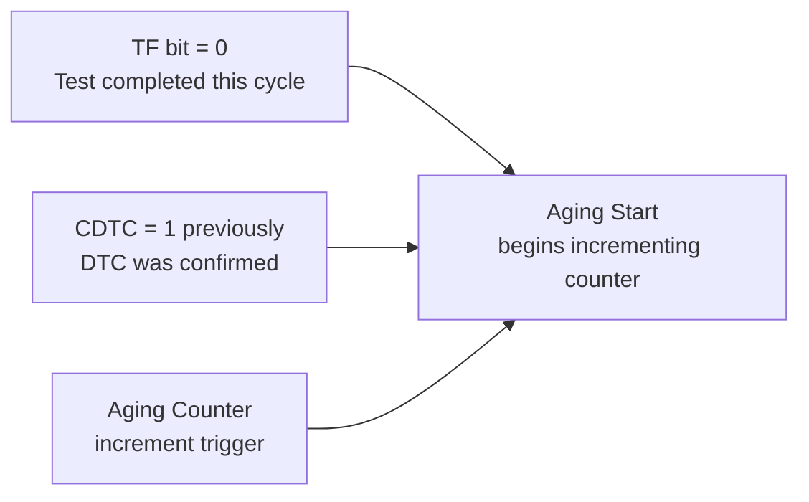

**Cấu trúc Aging Counter**:

| Counter value | Ý nghĩa |
|---|---|
| 0 | Lỗi còn active, chưa aging |
| 1..N-1 | Đang aging (N-1 cycles sạch đã qua) |
| N (threshold) | Aged – entry có thể bị xóa hoặc chuyển trạng thái |
| 0xFF | Aging disabled (entry không bao giờ aged) |

**Luồng aging qua các driving cycles**:

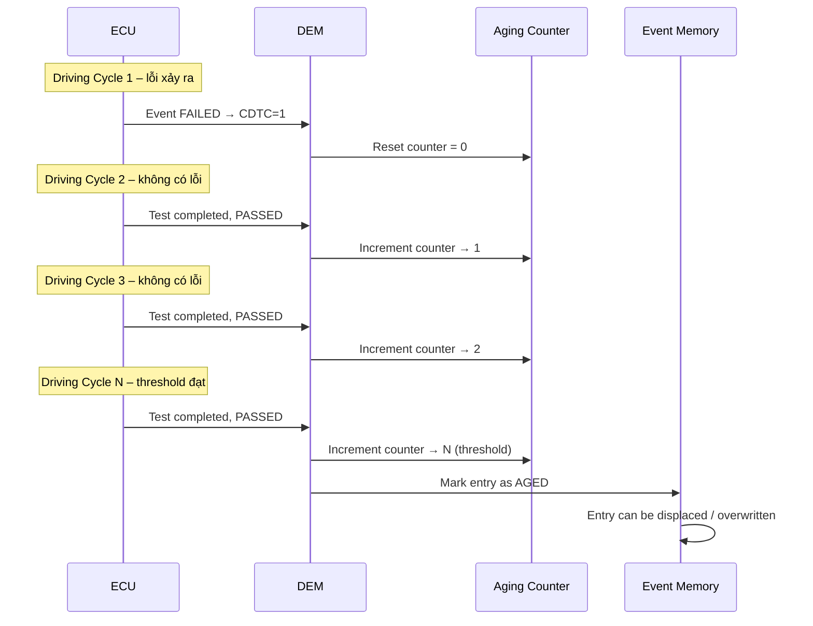

**Các trạng thái của event sau aging**:

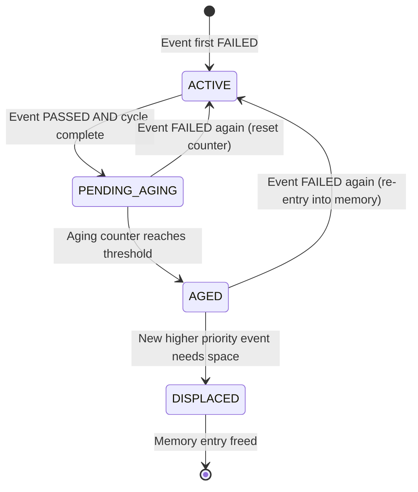

**Cấu hình aging trong ARXML**:

```xml
<DEM-DTC-ATTRIBUTES>
  <SHORT-NAME>DemDTCAttr_CoolantTemp</SHORT-NAME>

  <!-- Aging counter threshold: phải có N sạch liên tiếp -->
  <DEM-AGING-ALLOWED>true</DEM-AGING-ALLOWED>
  <DEM-AGING-CYCLE-COUNTER-THRESHOLD>40</DEM-AGING-CYCLE-COUNTER-THRESHOLD>

  <!-- Cycle dùng để tính aging -->
  <DEM-AGING-CYCLE-REF>DemOperationCycle_DrivingCycle</DEM-AGING-CYCLE-REF>

  <!-- Sau khi aged, có xóa entry không? -->
  <DEM-AGED-MEM-ENTRY-REMOVAL>true</DEM-AGED-MEM-ENTRY-REMOVAL>
</DEM-DTC-ATTRIBUTES>
```

**Behavior của Status Bits trong quá trình aging**:

| Thời điểm | TF | TFTOC | PDTC | CDTC | TNCSLC | TFSLC | Ghi chú |
|---|---|---|---|---|---|---|---|
| Event FAILED, cycle 1 | 1 | 1 | 1 | 1 | 0 | 1 | Active |
| Cycle 2 clean (aging=1) | 0 | 0 | 0 | 1 | 1 | 0 | CDTC giữ, aging bắt đầu |
| Cycle 30 (aging=30) | 0 | 0 | 0 | 1 | 1 | 0 | Vẫn CDTC in memory |
| Cycle 40 (aged threshold) | 0 | 0 | 0 | 0 | 1 | 0 | CDTC cleared, entry aged |

**Code: Aging counter increment**:

```c
/* Simplified aging counter update */
/* Called at end of each driving cycle */
void Dem_UpdateAgingCounter(Dem_EventIdType EventId)
{
    Dem_EventMemoryEntryType *entry = Dem_GetMemoryEntry(EventId);
    if (entry == NULL) return;  /* No memory entry for this event */

    /* Aging requires: test was completed this cycle AND event passed */
    if (entry->TestCompletedThisCycle &&
        entry->Status.TestFailed == 0 &&
        entry->Status.ConfirmedDTC == 1 &&
        entry->AgingCounter != DEM_AGING_DISABLED)
    {
        entry->AgingCounter++;

        if (entry->AgingCounter >= DEM_AGING_THRESHOLD)
        {
            /* Event has aged */
            entry->Status.ConfirmedDTC = 0;  /* Clear CDTC */
            entry->Aged = TRUE;

            if (DEM_AGED_REMOVAL_ENABLED)
            {
                Dem_RemoveMemoryEntry(EventId);  /* Free slot */
            }
        }
        Dem_MarkNvmDirty(EventId);  /* Persist updated counter */
    }
}
```

**Aging và OBD**:

```
OBD DTC aging theo tiêu chuẩn EPA/CARB:
  - MIL-related DTC: cần 3 driving cycles liên tiếp WITHOUT fault
    để MIL tắt (healing), nhưng DTC vẫn tồn tại trong memory
  - CDTC aging: thường cần 40 warm-up cycles sạch
  - Permanent memory DTC: không aging, chỉ xóa được bằng
    pass readiness test (ISO 15031-6)
```

---

## 7.7.9 Healing of Diagnostic Events

**Healing** là quá trình event **phục hồi** – khi lỗi không còn active, event trải qua một số điều kiện để được coi là đã "lành".

**Khác biệt Aging vs Healing**:

| Khía cạnh | Aging | Healing |
|---|---|---|
| Mục tiêu | Xóa memory entry cũ | Xóa active fault indicator |
| Tác động | Entry removed from memory | Warning indicator turned off |
| Trigger | N cycles không có lỗi | Predefined healing conditions met |
| OBD standard | 40 warm-up cycles | 3 consecutive driving cycles |
| Status bit chính | CDTC cleared | WIR bit cleared |

**Healing process flowchart**:

```mermaid
flowchart LR
    FAILED[Event FAILED\nWIR=1, MIL=ON] --> PASSED[Event PASSED\n(monitor says PASSED)]
    PASSED --> HEALING_START[Healing starts:\nHealing counter = 0]
    HEALING_START --> CYCLE_OK[Driving cycle ends\nwithout re-fail]
    CYCLE_OK --> HEAL_INC[Healing counter++]
    HEAL_INC --> CHECK{Counter ≥ threshold?}
    CHECK -->|No| NEXT_CYCLE[Next driving cycle]
    NEXT_CYCLE --> CYCLE_OK
    CHECK -->|Yes| HEALED[HEALED\nWIR=0, MIL=OFF]
    HEAL_INC -->|Re-fail occurs| FAILED
```

---

## 7.7.9.1 Warning Indicator Handling

**Warning Indicator** là bất kỳ đèn hoặc tín hiệu cảnh báo nào trên dashboard được điều khiển bởi DEM – phổ biến nhất là **MIL (Malfunction Indicator Lamp)**, còn gọi là "Check Engine light".

**Các loại Warning Indicator trong DEM**:

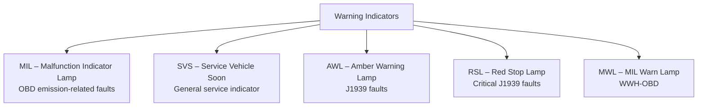

**Warning Indicator Request (WIR) bit – bit 7 của status byte**:

```
UDS Status Byte:
  Bit 7: WarningIndicatorRequested (WIR)
         = 1: DTC is requesting a warning indicator to be active
         = 0: DTC is NOT requesting a warning indicator

WIR = 1 không có nghĩa là đèn đang sáng ngay!
WIR chỉ là "vote" từ DTC – Warning Indicator Manager tổng hợp
tất cả các WIR votes và quyết định đèn có sáng hay không.
```

**WIR state machine**:

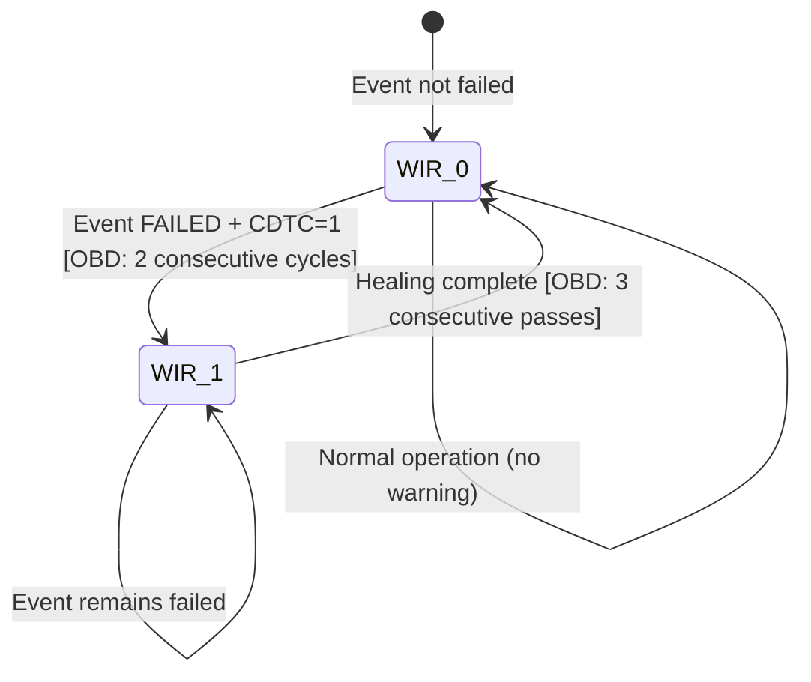

---

## 7.7.9.2 User Controlled WarningIndicatorRequested-bit

Trong một số trường hợp đặc biệt, application hoặc tester có thể **kiểm soát trực tiếp WIR bit**, thay vì để DEM tự quản lý theo quy trình thông thường.

**Khi nào dùng user-controlled WIR**:

```
1. Diagnostics test scenarios:
   Tester muốn test MIL behavior mà không cần fault condition thật
   DEM cung cấp API để set/clear WIR bit thủ công

2. System integration validation:
   Xác nhận MIL đèn sáng đúng cách trên instrument cluster
   mà không cần tạo real fault

3. Manufacturing end-of-line test:
   Test đèn dashboard bằng cách control WIR bit directly
```

**API kiểm soát WIR bit**:

```c
/* Set WIR bit cho một event (người dùng kiểm soát) */
Std_ReturnType Dem_SetWIRStatus(
    Dem_EventIdType EventId,
    boolean WIRStatus)
{
    /* WIRStatus = TRUE: set WIR bit */
    /* WIRStatus = FALSE: clear WIR bit */

    Dem_EventMemoryEntryType *entry = Dem_GetMemoryEntry(EventId);
    if (entry == NULL) return E_NOT_OK;

    entry->Status.WarningIndicatorRequested = (WIRStatus ? 1 : 0);
    Dem_MarkNvmDirty(EventId);

    /* Notify warning indicator manager để cập nhật đèn */
    Dem_UpdateWarningIndicator();

    return E_OK;
}
```

**Điều kiện cho phép user control**:

```xml
<!-- Cấu hình: cho phép user controlled WIR -->
<DEM-GENERAL-PARAMETER>
  <DEM-USER-CONTROLLED-WIR>true</DEM-USER-CONTROLLED-WIR>
</DEM-GENERAL-PARAMETER>

<!-- Per-event level: event phải có DEM-INDICATOR-ATTRIBUTE -->
<DEM-INDICATOR-ATTRIBUTE>
  <DEM-INDICATOR-REF>DemWarningIndicator_MIL</DEM-INDICATOR-REF>
  <DEM-INDICATOR-FAILURE-CYCLE-COUNTER-THRESHOLD>1</DEM-INDICATOR-FAILURE-CYCLE-COUNTER-THRESHOLD>
  <DEM-INDICATOR-HEALING-CYCLE-COUNTER-THRESHOLD>3</DEM-INDICATOR-HEALING-CYCLE-COUNTER-THRESHOLD>
</DEM-INDICATOR-ATTRIBUTE>
```

---

## 7.7.9.3 Handling of the Warning Indicator Lamp (MIL)

**MIL (Malfunction Indicator Lamp)** là đèn "Check Engine" – tín hiệu quan trọng nhất đối với người dùng và OBD emission compliance.

**MIL ON/OFF decision process**:

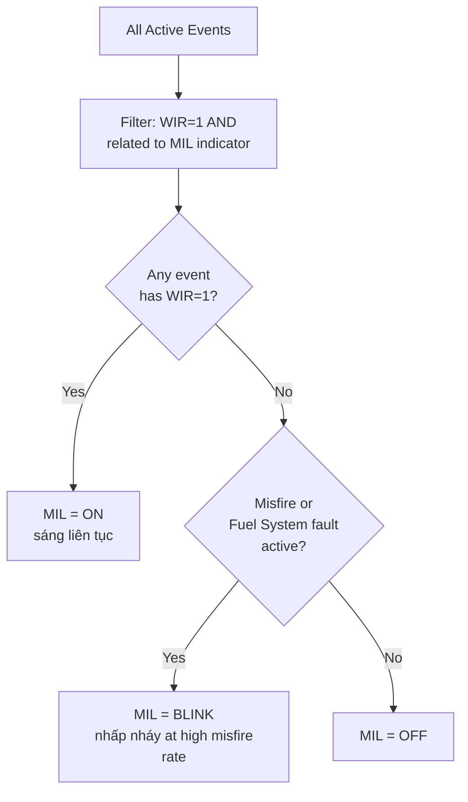

**OBD MIL activation rules (EPA/CARB)**:

```
Tiêu chuẩn OBD-II (SAE J1979 / ISO 15031):

1. MIL ON conditions:
   - DTC xảy ra ít nhất 2 consecutive driving cycles liên tiếp
   - Confirmed DTC = 1
   - DTC liên quan đến emission (emission-related events)

2. MIL OFF conditions (Healing):
   - 3 consecutive driving cycles WITHOUT the fault
   - Hoặc: DTC cleared bằng UDS 0x14 (clear all DTCs)
   - Hoặc: Permanent DTC test passed (ISO 15031-6)

3. MIL BLINK conditions:
   - High-rate misfire detected (catalyst damage risk)
   - MIL nhấp nháy 1 Hz khi đang lái xe

4. MIL OFF sau ignition cycle check:
   - Sau khi ignition ON, MIL sáng 3 giây (bulb check)
   - Sau đó tắt nếu không có active fault
```

**DEM API điều khiển MIL**:

```c
/* DEM cung cấp hàm để đọc trạng thái Warning Indicator */
Std_ReturnType Dem_GetIndicatorStatus(
    uint8 IndicatorId,
    Dem_IndicatorStatusType *IndicatorStatus)
{
    /* IndicatorStatus values:
       DEM_INDICATOR_OFF      = 0x00
       DEM_INDICATOR_CONTINUOUS = 0x01 (MIL ON)
       DEM_INDICATOR_BLINKING = 0x02
       DEM_INDICATOR_BLINK_CONT = 0x03 (blink takes priority)
    */
    *IndicatorStatus = Dem_Internal_CalcIndicatorStatus(IndicatorId);
    return E_OK;
}

/* BswM (Basic Software Mode Manager) sử dụng API này để điều khiển đèn */
void BswM_DemRuleMIL_EvaluateModeCondition(void)
{
    Dem_IndicatorStatusType milStatus;
    Dem_GetIndicatorStatus(DEM_INDICATOR_MIL, &milStatus);

    /* Truyền trạng thái sang OutputControl để điều khiển đèn vật lý */
    BswM_SetMilOutput(milStatus);
}
```

**OBD Permanent Memory và MIL**:

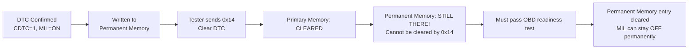

**Đọc Permanent Memory qua 0x19 sub 0x55**:

```
Request:  19 55 08 (StatusMask 0x08 = PDTC)
          Đọc tất cả DTC trong permanent memory

Response: 59 55 08
          D0 01 15 08   → DTC P0115 với status 0x08 (chỉ PDTC set)
          
Permanent memory DTC cần dùng sub 0x55 hoặc 0x56 (theo ISO 15031-6)
KHÔNG xuất hiện trong 0x19 sub 0x02 thông thường
```

---

## 7.7.9.4 Notification and Set of the Warning Indicator Status

Khi MIL hoặc bất kỳ warning indicator nào thay đổi trạng thái, DEM tích hợp với hệ thống thông báo để đảm bảo tất cả subscriber được cập nhật.

**Chuỗi notification khi MIL thay đổi**:

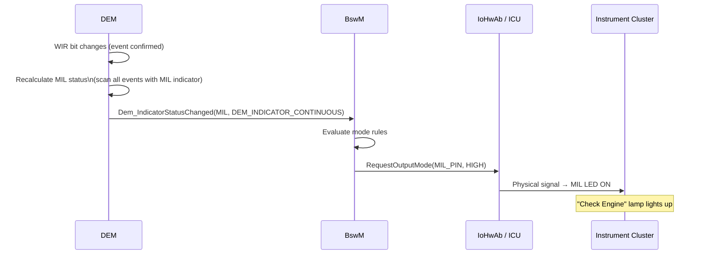

**Notification khi MIL tắt (healing)**:

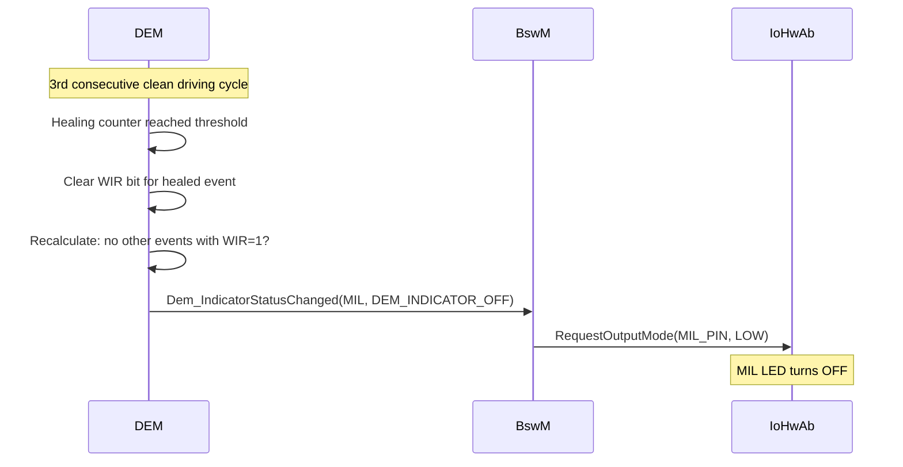

**AUTOSAR BswM Actions cho Warning Indicator**:

```c
/* BswM Rule: DEM-driven MIL control */

/* Condition: check current MIL status from DEM */
BswMCondition_DemMILStatus:
    API: Dem_GetIndicatorStatus(DEM_INDICATOR_MIL)
    → Status: DEM_INDICATOR_CONTINUOUS | DEM_INDICATOR_OFF |
               DEM_INDICATOR_BLINKING

/* Action: control physical MIL output */
BswMAction_MIL_ON:
    → Rte_Call_MIL_SetOutput(STD_HIGH)   /* MIL ON */

BswMAction_MIL_OFF:
    → Rte_Call_MIL_SetOutput(STD_LOW)    /* MIL OFF */

BswMAction_MIL_BLINK:
    → Rte_Call_MIL_EnablePwm(1Hz_50pct)  /* MIL blinking */
```

**NvM persistence cho WIR status**:

```c
/* WIR bit được persist trong NvM cùng với event status */
/* Sau power cycle, WIR bit được restore từ NvM */

/* Khi DEM khởi động lại: */
void Dem_RestoreFromNvM(Dem_EventIdType EventId)
{
    Dem_EventMemoryEntryType *entry = Dem_GetMemoryEntry(EventId);

    /* WIR bit trong NvM-backed status byte */
    uint8 savedStatus = NvM_ReadByte(DEM_NVM_BLOCK_EVENT_STATUS(EventId));
    entry->Status.WarningIndicatorRequested =
        (savedStatus >> DEM_STATUSBIT_WIR_POS) & 0x01;

    /* DEM recalculates MIL state after all events restored */
}

/* Sau khi Dem_Init() hoàn thành: */
/* Dem tính lại OK trạng thái MIL dựa trên tất cả WIR bits đã restore */
/* BswM sẽ được notify với trạng thái MIL ban đầu chính xác */
```

**Commission Handling – MIL khi mất liên lạc ECU**:

```
Trường hợp đặc biệt: Communications-based DTC
  Nếu ECU không nhận được message trong thời gian nhất định
  → J1939 FMI 9 (Abnormal Update Rate) hoặc FMI 19 (Received Network Data in Error)
  → DEM tạo event cho communication loss
  → WIR set → MIL ON

Sau khi liên lạc phục hồi:
  → Monitor passes → healing bắt đầu
  → Sau N cycles clean → MIL OFF
  
Đây là communication-based healing, logic tương tự như sensor fault healing
```

---

## Tổng kết Part 6

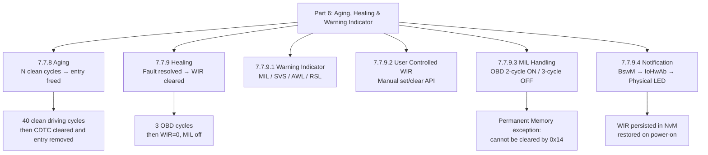

> Aging và Healing cùng nhau tạo nên vòng đời hoàn chỉnh của một DTC: từ khi xuất hiện lần đầu, qua giai đoạn active với MIL sáng, đến khi lỗi được sửa và tự động biến mất sau đủ số cycle chạy sạch. Đây là lý do xe OBD-compliant có thể "tự xóa" Check Engine light mà không cần workshop.

---

## Tổng kết toàn bộ Series Event Memory (Part 1–6)

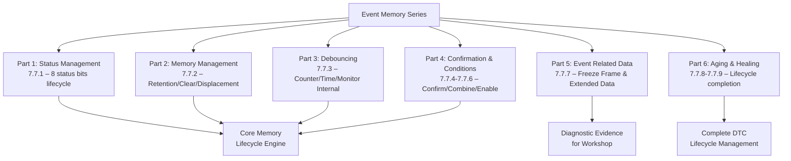

---

## Ghi chú nguồn tham khảo

1. AUTOSAR Classic Platform SRS DEM – Section 7.7.8 Aging, 7.7.9 Healing.
2. ISO 14229-1 – Service 0x19 sub 0x55/0x56 ReadDTCInformation (Permanent Memory).
3. SAE J1979 / ISO 15031-5 – OBD Service $01–$09, MIL activation rules.
4. EPA OBD Technical Guidance – 3-cycle healing, 40-cycle aging requirements.
5. AUTOSAR SWS DEM – `Dem_GetIndicatorStatus`, `Dem_SetWIRStatus` API.
6. Nguồn public: EmbeddedTutor AUTOSAR DEM, DeepWiki openAUTOSAR aging documentation.
