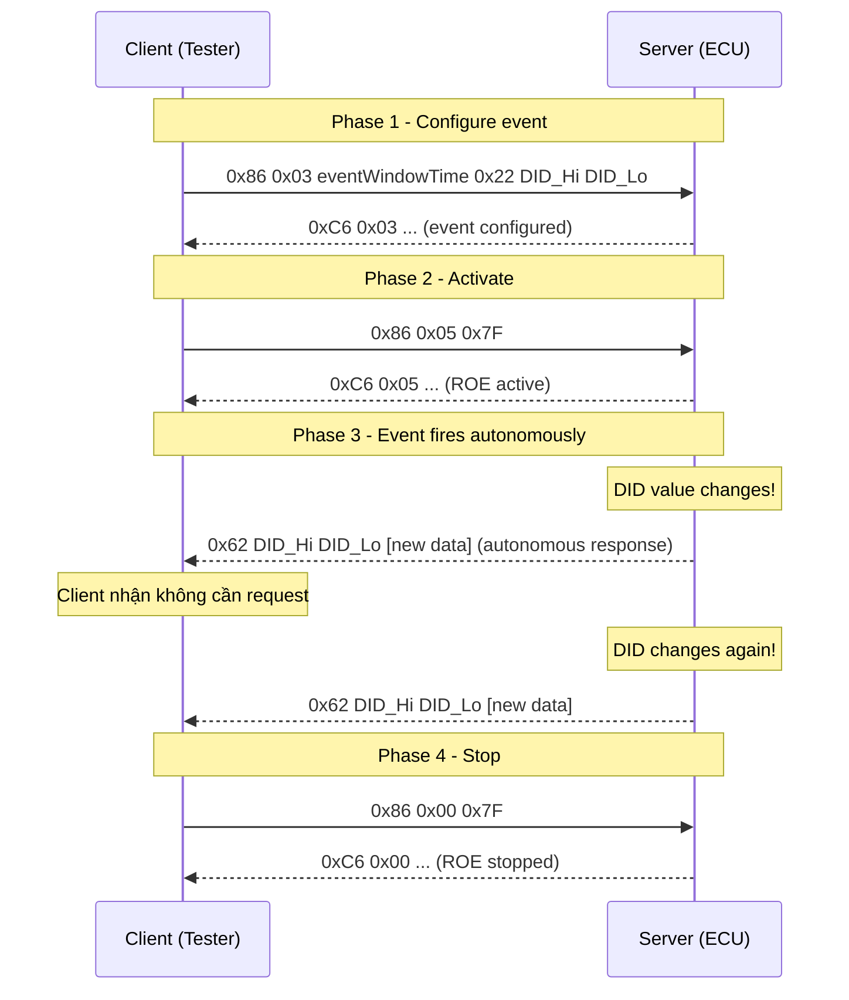
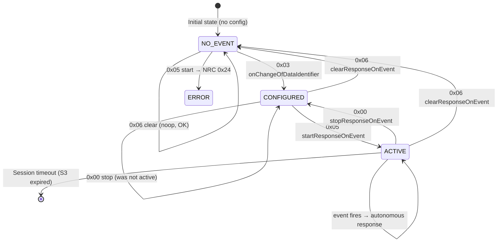
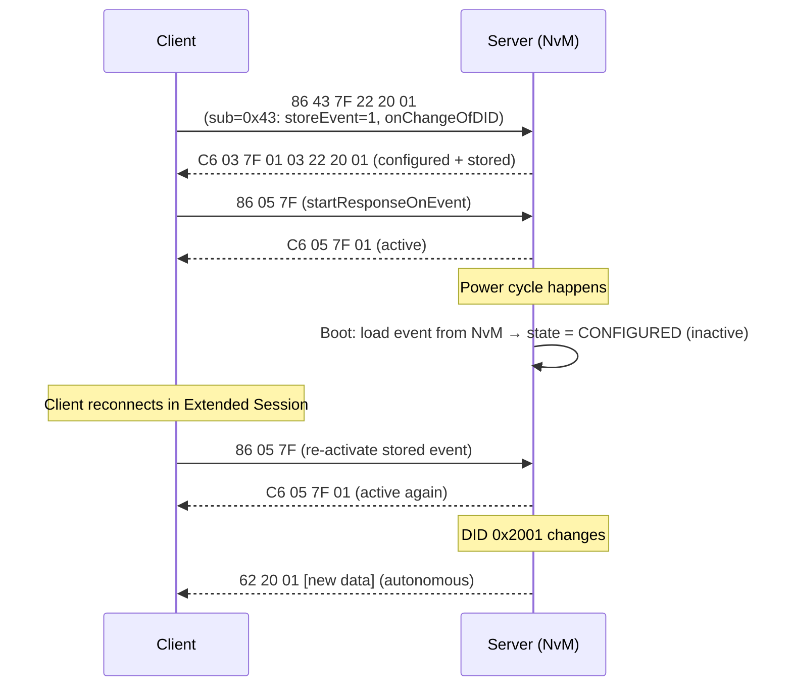

---
layout: default
category: uds_sid
title: "UDS - Service ID 0x86 ResponseOnEvent (Part 1)"
nav_exclude: true
module: true
tags: [autosar, uds, diagnostics, iso-14229, protocol, roe, event]
description: "Chi tiết sub-function 0x00, 0x03, 0x05, 0x06 của SID 0x86 ResponseOnEvent theo ISO 14229-1:2020."
permalink: /uds/uds-sid-0x86-p1/
---

# UDS - SID 0x86: ResponseOnEvent

> Tài liệu mô tả chi tiết **SID 0x86 ResponseOnEvent (ROE)** theo **ISO 14229-1:2020**, bao gồm các sub-function **0x00, 0x03, 0x05, 0x06**. Mỗi sub-function trình bày: định nghĩa, format request/response, điều kiện Positive/Negative Response, trường hợp đặc biệt và ví dụ cụ thể.

## 1. Tổng quan SID 0x86

**ResponseOnEvent (0x86)** cho phép client yêu cầu server **tự động gửi response** khi một sự kiện cụ thể xảy ra - mà không cần client poll liên tục. Đây là cơ chế **event-driven** (hướng sự kiện) trong UDS.

| Thuộc tính | Giá trị |
|---|---|
| Service ID (SID) | `0x86` |
| Response SID (RSID) | `0xC6` |
| Negative Response SID | `0x7F` |
| Sub-function | Có (1 byte, bao gồm storeEvent bit và suppressPosRsp bit) |
| Supported sessions | Extended Diagnostic Session (chủ yếu) |
| Security access | Không (thường) |

### 1.1 Nguyên lý hoạt động



### 1.2 Sub-function byte - encoding

Sub-function byte trong SID 0x86 mang **3 thành phần**:

```
 Bit 7          Bit 6        Bits 5–0
 suppressPosRsp storeEvent   sub-function value
```

| Bit | Tên | Giá trị | Ý nghĩa |
|---|---|---|---|
| 7 | suppressPosRspMsgIndicationBit | 0/1 | 1 = server không gửi positive response |
| 6 | storeEvent | 0/1 | 1 = event config được lưu qua power cycle |
| 5–0 | sub-function value | 0x00–0x3F | Sub-function cụ thể |

Ví dụ: Sub-function byte `0x43` = `0b01000011`:
- bit 7 = 0: gửi positive response
- bit 6 = 1: **storeEvent = 1** (lưu event qua power cycle)
- bits 5-0 = `0x03`: sub-function onChangeOfDataIdentifier

### 1.3 eventWindowTime - thời gian hiệu lực

Tham số xuất hiện trong tất cả sub-function để xác định khoảng thời gian ROE mechanism có hiệu lực.

| Value | Ý nghĩa |
|---|---|
| `0x00` | Reserved |
| `0x01`–`0x7E` | Thời gian giới hạn, tính theo **giây** (1–126 giây) |
| `0x7F` | **Infinite** - không giới hạn thời gian |
| `0x80`–`0xFE` | OEM-specific / vendor-defined |
| `0xFF` | Reserved |

**Thực tế**: `0x7F` (infinite) là giá trị được dùng phổ biến nhất trong các ECU diagnostic. Server duy trì event mechanism cho đến khi client gửi `stopResponseOnEvent` (0x00) hoặc session kết thúc.

### 1.4 Autonomous response

Khi event xảy ra, server gửi **autonomous response** (không có request trước):
- Địa chỉ gửi: cùng địa chỉ client đã cấu hình event.
- Format: positive response của `serviceToRespondTo`.
- Ví dụ với `serviceToRespondTo = 0x22 (ReadDataByIdentifier)`: server gửi `62 DID_Hi DID_Lo [data]`.

**Lưu ý**: Autonomous response *không* reset S3Server timer của diagnostic session. Server vẫn cần nhận request từ client để duy trì session.

### 1.5 NRC phổ biến của SID 0x86

| NRC Hex | Tên | Điều kiện |
|---|---|---|
| `0x12` | subFunctionNotSupported | Sub-function không hỗ trợ |
| `0x13` | incorrectMessageLengthOrInvalidFormat | Sai số byte |
| `0x22` | conditionsNotCorrect | Sai session, hoặc điều kiện runtime không thỏa |
| `0x24` | requestSequenceError | Gọi `startResponseOnEvent` khi chưa có event configured |
| `0x31` | requestOutOfRange | eventWindowTime không hợp lệ, DID không tồn tại |
| `0x35` | invalidKey | (if storeEvent requires authentication) |

---

## 2. Sub-function 0x00 - stopResponseOnEvent

### 2.1 Định nghĩa

**stopResponseOnEvent** dừng tất cả event response mechanism đang active trên server. Sau khi nhận lệnh này, server **ngừng gửi autonomous response** - cho dù event có xảy ra - cho đến khi được kích hoạt lại bằng `startResponseOnEvent` (0x05).

> `stopResponseOnEvent` = **dừng tạm thời** (pause). Event configuration vẫn còn, có thể resume bằng 0x05.
> Khác với `clearResponseOnEvent` (0x06) = xóa toàn bộ configuration.

### 2.2 Format Request

| Byte | Field | Giá trị | Mô tả |
|---|---|---|---|
| 1 | SID | `0x86` | ResponseOnEvent |
| 2 | Sub-function | `0x00` | stopResponseOnEvent |
| 3 | eventWindowTime | `0x01`–`0xFF` | Thường truyền `0x7F`; giá trị thường bị server ignore khi stop |

Độ dài: **3 byte** (fixed).

**Ghi chú**: Khi stop, `eventWindowTime` trong request thường không có ý nghĩa thực tế - server dừng tất cả event bất kể giá trị này. Tuy nhiên phải truyền đúng 3 byte để không bị NRC 0x13.

### 2.3 Format Positive Response

| Byte | Field | Mô tả |
|---|---|---|
| 1 | RSID | `0xC6` |
| 2 | Sub-function | `0x00` |
| 3 | eventWindowTime | Echo từ request |
| 4 | numberOfActivatedEvents | Số lượng event **đã dừng** (trạng thái trước stop) |

`numberOfActivatedEvents` = 0x00 nếu không có event nào đang active khi nhận stop.

### 2.4 Điều kiện Positive Response

1. Sub-function 0x00 được hỗ trợ.
2. Session hợp lệ (thường extended diagnostic session; một số ECU cho phép default session).
3. Message length = 3 byte.
4. Positive response được gửi **trước** khi dừng event mechanism.

### 2.5 Điều kiện Negative Response

| Điều kiện | NRC |
|---|---|
| Sub-function 0x00 không hỗ trợ | `0x12` |
| Request != 3 byte | `0x13` |
| Sai session (ví dụ default session nếu không được phép) | `0x22` |

**Không phải NRC**: Gửi `stopResponseOnEvent` khi không có event đang active → **Positive response** với `numberOfActivatedEvents = 0x00`. Không phải lỗi.

### 2.6 Trường hợp đặc biệt

1. **Stop khi không có event active**: Positive response với `numberOfActivatedEvents = 0x00`.
2. **Sau stop, event config vẫn còn**: Có thể resume bằng sub 0x05 `startResponseOnEvent` mà không cần cấu hình lại.
3. **storeEvent = 1 kết hợp với stop**: Nếu event được lưu (persist), sau power cycle event ở trạng thái "stored but inactive" cho đến khi `startResponseOnEvent` được gửi lại.
4. **suppressPosRsp (bit 7 = 1)**: Server dừng event và không gửi positive response.

### 2.7 Ví dụ

**Positive - Dừng 1 event đang active:**

```
REQUEST:
  86 00 7F
  ^^       SID: 0x86
     ^^    Sub-function: 0x00 (stopResponseOnEvent)
        ^^ eventWindowTime: 0x7F

POSITIVE RESPONSE:
  C6 00 7F 01
  ^^          RSID: 0xC6
     ^^       Sub-function: 0x00
        ^^    eventWindowTime: 0x7F (echo)
           ^^ numberOfActivatedEvents: 0x01 (1 event đã dừng)
```

**Positive - Không có event nào đang active:**

```
REQUEST:  86 00 7F
RESPONSE: C6 00 7F 00
                  ^^ numberOfActivatedEvents: 0x00 (không có gì để dừng)
```

**Negative - Sai session:**

```
REQUEST:  86 00 7F (gửi trong Programming session)
RESPONSE: 7F 86 22  (conditionsNotCorrect)
```

---

## 3. Sub-function 0x03 - onChangeOfDataIdentifier

### 3.1 Định nghĩa

**onChangeOfDataIdentifier** yêu cầu server **tự động gửi response** mỗi khi giá trị của một DID (Data Identifier) thay đổi. Server liên tục so sánh giá trị DID hiện tại với giá trị lần đọc trước - khi phát hiện thay đổi, gửi response không cần request.

Đây là sub-function phổ biến nhất của ROE - dùng để:
- Monitor giá trị sensor real-time mà không cần poll liên tục.
- Phát hiện thay đổi trạng thái (mode, flag, configuration).
- Giảm bus load so với poll định kỳ.

### 3.2 serviceToRespondTo

Trong SID 0x86 sub 0x03, client chỉ định service nào server sẽ dùng để gửi autonomous response. Với `onChangeOfDataIdentifier`, `serviceToRespondTo` **phải là `0x22`** (ReadDataByIdentifier).

Khi event fires: server gửi response tương đương `0x22 DID` response:
```
Autonomous response: C2 [DID Hi] [DID Lo] [data...]
                     ^^
                     RSID của 0x22 = 0x62? Không...
```

**Correct**: Response SID của ReadDataByIdentifier là `0x62` (không phải `0xC2`):
```
Autonomous response: 62 [DID Hi] [DID Lo] [data bytes...]
```

### 3.3 Format Request

| Byte | Field | Giá trị | Mô tả |
|---|---|---|---|
| 1 | SID | `0x86` | ResponseOnEvent |
| 2 | Sub-function | `0x03` (hoặc `0x43` nếu storeEvent=1) | onChangeOfDataIdentifier |
| 3 | eventWindowTime | `0x01`–`0x7F` | Thời gian hiệu lực ROE |
| 4 | serviceToRespondTo | `0x22` | ReadDataByIdentifier |
| 5 | dataIdentifierHighByte | `0x00`–`0xFF` | High byte của DID cần monitor |
| 6 | dataIdentifierLowByte | `0x00`–`0xFF` | Low byte của DID cần monitor |

Độ dài: **6 byte** (fixed cho DID monitoring).

### 3.4 Format Positive Response

| Byte | Field | Mô tả |
|---|---|---|
| 1 | RSID | `0xC6` |
| 2 | Sub-function | `0x03` |
| 3 | eventWindowTime | Echo |
| 4 | numberOfActivatedEvents | Tổng số event active (kể cả event vừa cấu hình) |
| 5 | retryEventMaxAllowed | Số lần retry tối đa nếu event response bị lỗi |
| 6 | serviceToRespondTo | Echo: `0x22` |
| 7 | dataIdentifierHighByte | Echo |
| 8 | dataIdentifierLowByte | Echo |

### 3.5 Format Autonomous Response (khi event fires)

Khi giá trị DID thay đổi, server gửi:

```
62 [DID Hi] [DID Lo] [data bytes...]
^^                   ^^^^^^^^^^^^^^^
RSID của 0x22        Giá trị DID tại thời điểm thay đổi
```

### 3.6 Điều kiện Positive Response

1. Sub-function 0x03 hỗ trợ.
2. Session: Extended Diagnostic Session.
3. `serviceToRespondTo = 0x22` và DID được hỗ trợ trên server.
4. `eventWindowTime` thuộc range hợp lệ (0x01–0x7F hoặc OEM range).
5. Message length = 6 byte.
6. Chưa đạt giới hạn số lượng event tối đa của server.

### 3.7 Điều kiện Negative Response

| Điều kiện | NRC |
|---|---|
| Sub-function 0x03 không hỗ trợ | `0x12` |
| Request != 6 byte | `0x13` |
| Không phải Extended session | `0x22` |
| `serviceToRespondTo != 0x22` hoặc không hỗ trợ | `0x22` hoặc `0x12` |
| DID không tồn tại trên server | `0x31` |
| `eventWindowTime = 0x00` hoặc `= 0xFF` | `0x31` |
| Đã đạt max số event (server overload) | `0x22` |
| storeEvent=1 nhưng storage không hỗ trợ | `0x22` |

### 3.8 Trường hợp đặc biệt

1. **storeEvent = 1 (sub-fn byte = 0x43)**: Event config được lưu vào NvM. Sau power cycle, event ở trạng thái "stored but stopped". Client cần gửi `startResponseOnEvent` (0x05) để kích hoạt lại.

2. **Một server chỉ hỗ trợ 1 event**: Nhiều ECU chỉ tài nguyên cho 1 ROE event tại một thời điểm. Cấu hình event thứ 2 → NRC 0x22.

3. **DID không thay đổi**: Server chỉ gửi autonomous response khi **có thay đổi** - không gửi nếu value giống cũ. Thứ tự so sánh theo DID byte-by-byte.

4. **Session timeout**: Nếu S3Server timer hết mà không có request → session trở về default → ROE bị dừng (trừ khi `storeEvent=1`).

5. **Giá trị khởi đầu**: Sau khi configure, server thường gửi **1 response ngay lập tức** với giá trị DID hiện tại (initial snapshot), sau đó chỉ gửi khi có thay đổi. Hành vi này phụ thuộc ECU implementation.

### 3.9 Ví dụ

**Positive - Monitor DID 0x2001 (ECU temperature flag), eventWindow = infinite:**

```
REQUEST:
  86 03 7F 22 20 01
  ^^          SID: 0x86
     ^^       Sub-function: 0x03 (storeEvent=0)
        ^^    eventWindowTime: 0x7F (infinite)
           ^^ serviceToRespondTo: 0x22 (RDBI)
              ^^^^^ dataIdentifier: 0x2001

POSITIVE RESPONSE:
  C6 03 7F 01 03 22 20 01
  ^^          RSID: 0xC6
     ^^       Sub-function: 0x03
        ^^    eventWindowTime: 0x7F
           ^^ numberOfActivatedEvents: 0x01 (1 event active)
              ^^ retryEventMaxAllowed: 0x03 (retry 3 lần)
                 ^^ serviceToRespondTo: 0x22
                    ^^^^^ dataIdentifier: 0x2001 (echo)
```

**Autonomous response khi DID thay đổi:**

```
  62 20 01  1E
  ^^        RSID của ReadDataByIdentifier
     ^^^^^  DID: 0x2001
            ^^ Data: 0x1E = 30°C (ví dụ nhiệt độ ECU)

  (Lần sau khi nhiệt độ thay đổi)
  62 20 01  1F   → Nhiệt độ 31°C
  62 20 01  20   → Nhiệt độ 32°C
```

**Request với storeEvent = 1:**

```
REQUEST:
  86 43 7F 22 20 01
     ^^
     Sub-function: 0x43 = 0b01000011
                   bit6=1 (storeEvent=1), bits5-0=0x03
```

**Negative - DID không tồn tại:**

```
REQUEST:  86 03 7F 22 FF FF
RESPONSE: 7F 86 31   (requestOutOfRange - DID 0xFFFF không hỗ trợ)
```

---

## 4. Sub-function 0x05 - startResponseOnEvent

### 4.1 Định nghĩa

**startResponseOnEvent** **kích hoạt (bắt đầu hoặc resume)** event response mechanism đã được cấu hình trước đó. Sub-function này không định nghĩa event mới - chỉ bật event đã cấu hình (hoặc đã lưu từ power cycle trước).

**Typical workflow**: Cấu hình event (0x03) → Kích hoạt (0x05) → Monitor → Dừng (0x00).

Trong trường hợp `storeEvent=1`:
- Power cycle → Event config tồn tại nhưng inactive.
- Client gửi 0x05 → Event active lại.

### 4.2 Format Request

| Byte | Field | Giá trị | Mô tả |
|---|---|---|---|
| 1 | SID | `0x86` | |
| 2 | Sub-function | `0x05` | startResponseOnEvent |
| 3 | eventWindowTime | `0x01`–`0x7F` | Thời gian hiệu lực kể từ khi start |

Độ dài: **3 byte** (fixed).

### 4.3 Format Positive Response

| Byte | Field | Mô tả |
|---|---|---|
| 1 | RSID | `0xC6` |
| 2 | Sub-function | `0x05` |
| 3 | eventWindowTime | Echo |
| 4 | numberOfActivatedEvents | Số event đang active sau khi start |

### 4.4 Điều kiện Positive Response

1. Sub-function 0x05 hỗ trợ.
2. Session hợp lệ (Extended session).
3. **Phải có ít nhất 1 event đã được cấu hình** (bằng 0x01, 0x02, 0x03, hoặc stored từ trước).
4. `eventWindowTime` hợp lệ.
5. Message length = 3 byte.

### 4.5 Điều kiện Negative Response

| Điều kiện | NRC |
|---|---|
| Sub-function 0x05 không hỗ trợ | `0x12` |
| Request != 3 byte | `0x13` |
| Sai session | `0x22` |
| **Không có event nào đã cấu hình** | `0x24` (requestSequenceError) |
| `eventWindowTime` không hợp lệ | `0x31` |

**NRC 0x24 (requestSequenceError)** là lỗi điển hình: client gọi `startResponseOnEvent` mà chưa cấu hình event nào và không có stored event.

### 4.6 Trường hợp đặc biệt

1. **Resume sau stop**: Sau `stopResponseOnEvent` (0x00), event config còn nguyên. Gửi 0x05 → event active lại ngay với `eventWindowTime` mới.
2. **Activate stored event sau power cycle**: ECU khởi động, stored event ở trạng thái "configured but inactive". Client gửi 0x05 trong extended session → event aktiviert. ⚠️ Phải vào đúng session trước.
3. **eventWindowTime reset**: Mỗi lần gửi 0x05, timer `eventWindowTime` được reset theo giá trị mới.

### 4.7 Ví dụ

**Positive - Kích hoạt event đã cấu hình:**

```
REQUEST:
  86 05 7F
  ^^       SID: 0x86
     ^^    Sub-function: 0x05 (startResponseOnEvent)
        ^^ eventWindowTime: 0x7F (infinite)

POSITIVE RESPONSE:
  C6 05 7F 01
  ^^          RSID: 0xC6
     ^^       Sub-function: 0x05
        ^^    eventWindowTime: 0x7F
           ^^ numberOfActivatedEvents: 0x01 (1 event đang active)
```

**Negative - Chưa cấu hình event:**

```
REQUEST:  86 05 7F
RESPONSE: 7F 86 24
               ^^ NRC: 0x24 requestSequenceError
                  (Không có event nào được configured trước đó)
```

**Positive - Resume sau stop (sequential workflow):**

```
Step 1:  86 03 7F 22 20 01   → configure event
         C6 03 7F 01 03 22 20 01  → OK

Step 2:  86 05 7F             → start (optional nếu auto-started sau configure)
         C6 05 7F 01           → OK, 1 event active

Step 3:  [autonomous responses: 62 20 01 xx ...]

Step 4:  86 00 7F             → stop
         C6 00 7F 01           → OK, stopped

Step 5:  86 05 7F             → resume
         C6 05 7F 01           → OK, event active lại
```

---

## 5. Sub-function 0x06 - clearResponseOnEvent

### 5.1 Định nghĩa

**clearResponseOnEvent** **xóa toàn bộ** event configuration trên server - bao gồm:
- Event definitions đang active.
- Event definitions đã dừng (stopped).
- Event definitions đã lưu vào NvM (stored events).

> `clearResponseOnEvent` = **xóa hoàn toàn** (delete). Sau này muốn dùng ROE phải cấu hình lại từ đầu.
> Khác với `stopResponseOnEvent` (0x00) = **dừng tạm thời** (event config còn).

### 5.2 Format Request

| Byte | Field | Giá trị | Mô tả |
|---|---|---|---|
| 1 | SID | `0x86` | |
| 2 | Sub-function | `0x06` | clearResponseOnEvent |
| 3 | eventWindowTime | `0x01`–`0xFF` | Thường `0x7F`; ignored sau clear |

Độ dài: **3 byte** (fixed).

### 5.3 Format Positive Response

| Byte | Field | Mô tả |
|---|---|---|
| 1 | RSID | `0xC6` |
| 2 | Sub-function | `0x06` |
| 3 | eventWindowTime | Echo |
| 4 | numberOfActivatedEvents | Luôn = `0x00` sau khi clear thành công |

`numberOfActivatedEvents = 0x00` trong response xác nhận tất cả events đã bị xóa.

### 5.4 Điều kiện Positive Response

1. Sub-function 0x06 hỗ trợ.
2. Session hợp lệ (Extended session).
3. Message length = 3 byte.
4. → Tất cả event definitions bị xóa, response với `numberOfActivatedEvents = 0x00`.

### 5.5 Điều kiện Negative Response

| Điều kiện | NRC |
|---|---|
| Sub-function 0x06 không hỗ trợ | `0x12` |
| Request != 3 byte | `0x13` |
| Sai session | `0x22` |

**Không phải NRC**: Clear khi không có event nào → Positive response với `numberOfActivatedEvents = 0x00`.

### 5.6 Trường hợp đặc biệt

1. **Xóa stored events**: Nếu event được cấu hình với `storeEvent=1` và lưu vào NvM, sub 0x06 cũng xóa entries này trong NvM - không còn sau power cycle.
2. **Clear khi event đang active**: Server tự dừng event trước, rồi xóa config, rồi gửi response. Client sẽ không nhận thêm autonomous response.
3. **Fallback về clean state**: Sau `clearResponseOnEvent`, server về trạng thái không có event nào - như lúc ECU mới xuất xưởng.

### 5.7 Ví dụ

**Positive - Xóa 1 event đang active:**

```
REQUEST:
  86 06 7F
  ^^       SID: 0x86
     ^^    Sub-function: 0x06 (clearResponseOnEvent)
        ^^ eventWindowTime: 0x7F

POSITIVE RESPONSE:
  C6 06 7F 00
  ^^          RSID: 0xC6
     ^^       Sub-function: 0x06
        ^^    eventWindowTime: 0x7F (echo)
           ^^ numberOfActivatedEvents: 0x00 (tất cả đã xóa)
```

**Positive - Không có event nào:**

```
REQUEST:  86 06 7F
RESPONSE: C6 06 7F 00   (vẫn positive, numberOfActivatedEvents=0)
```

---

## 6. Tóm tắt so sánh sub-function

| Sub-fn | Tên | Params | Chức năng | Điều kiện tiên quyết |
|---|---|---|---|---|
| `0x00` | stopResponseOnEvent | eventWindowTime | Dừng (pause) tất cả event | Không bắt buộc |
| `0x03` | onChangeOfDataIdentifier | eventWindowTime + serviceToRespondTo + DID | Cấu hình monitor DID change | Extended session |
| `0x05` | startResponseOnEvent | eventWindowTime | Kích hoạt event đã cấu hình | Phải có event configured |
| `0x06` | clearResponseOnEvent | eventWindowTime | Xóa toàn bộ event config | Không bắt buộc |

### 6.1 State machine ROE



### 6.2 storeEvent workflow



---

## 7. Workflow tích hợp điển hình

### 7.1 Monitor DID liên tục từ tester

```
1. Client vào Extended Diagnostic Session:
   10 03 → 50 03 ...

2. Cấu hình ROE monitor DID 0x2001:
   86 03 7F 22 20 01 → C6 03 7F 01 03 22 20 01

3. Kích hoạt:
   86 05 7F → C6 05 7F 01

4. Server gửi autonomous response mỗi khi DID thay đổi:
   62 20 01 1E  (value = 0x1E)
   62 20 01 1F
   62 20 01 20
   ...

5. Dừng monitor:
   86 00 7F → C6 00 7F 01

6. Xóa config:
   86 06 7F → C6 06 7F 00
```

### 7.2 ROE với storeEvent cho ECU field monitoring

```
ECU lắp trên xe, cần log khi DID 0x3001 thay đổi dù không có tester:

1. Tester cắm vào, vào Extended Session.
2. Cấu hình + store event:
   86 43 7F 22 30 01  (storeEvent=1)
3. Activate:
   86 05 7F
4. Tester rút ra (session timeout → S3 expires).
5. ECU vẫn hoạt động, nhưng ROE inactive (session gone).
6. Event config tồn tại trong NvM.
7. Tester cắm lại, vào Extended Session.
8. Re-activate: 86 05 7F → event bật lại ngay.
9. ECU gửi autonomous response khi DID 0x3001 thay đổi.
```

---

## 8. Ghi chú và nguồn tham khảo

1. ISO 14229-1:2020 - Unified Diagnostic Services, Service 0x86.
2. AUTOSAR DCM SWS - ResponseOnEvent handling (DcmRoe configuration).
3. Vector CANoe/CANalyzer - ROE configuration trong CDD file.

### Một số điểm cần lưu ý khi triển khai

1. **Session constraint**: ROE thường chỉ hoạt động trong Extended session. Khi session timeout, ROE bị stop (trừ `storeEvent=1`).
2. **Bus load**: ROE gửi autonomous response mỗi khi event fires → nếu DID thay đổi liên tục, bus load tăng đáng kể. Cần đánh giá tần suất thay đổi.
3. **Max events**: Nhiều ECU giới hạn 1 ROE event tại một thời điểm. Cần check trước khi cấu hình lần 2.
4. **retryEventMaxAllowed**: Nếu autonomous response không được acknowledge (CanTp TX error), server retry theo giá trị này trước khi abort event.
5. **AUTOSAR Dcm**: ROE được cấu hình qua `DcmRoe` container trong AUTOSAR, với `DcmRoeEventWindowTime`, `DcmRoeMaxEventWindowTime`, `DcmRoeInitialEventStatus`.
